# AI 测试与评估平台 — AI Agent 行为规范与工程指南 (AGENTS.md)

> **最高指示**：本文件是面向所有参与本项目的 **AI Agent（以及人类开发者）** 的最高行动指南与行为规范。  
> 在阅读、分析、编写或修改本仓库的任何代码与文档前，**必须严格遵守本文档所规定的架构边界、开发契约与行为红线**。

---

## 1. 项目简介 (Project Overview)

### 1.1 业务背景与核心定位
- **项目名称**：AI 测试与评估平台 (`ai-eval-platform`)
- **核心定位**：面向**单一研发/评测团队**的内部平台，利用 **AI Agent（WebSocket + 内部 MCP Host）** 自动化完成大语言模型（LLM）**基准评测（Benchmark）** 与 **知识库检索增强生成评测（RAG）**。
- **核心特色**：
  - **对话驱动**：通过 WebSocket Agent 交互，自动化解析自然语言意图并生成结构化「确认卡」；
  - **先评后压**：压测作为质量评测的共享下游环节，仅在质量评测成功 (`succeeded`) 且勾选压测后自动派生执行，继承同一被测端点；
  - **三协议适配**：统一适配 OpenAI Chat Completions、Anthropic Messages、Dify Completion 协议；
  - **单团队全员同权**：单一 `member` 角色，操作留痕审计，敏感 Key 采用 Fernet 强加密且只写不回显。

### 1.2 服务拓扑与网络端点 (Topology & Endpoints)

| 服务名称 | 容器标识 | 宿主机端口 | 访问方式 / 协议 | 说明 |
| :--- | :--- | :--- | :--- | :--- |
| **Web 前端** | `web` | `80` | `http://47.119.132.83/` | 平台主入口（Nginx 反代 `/api` 与 `/ws`） |
| **API 服务** | `api` | `8000` | `http://47.119.132.83:8000/docs` | FastAPI 接口文档与短 MCP Host（Swagger） |
| **Worker 引擎** | `worker` | - | 容器内部网络通信 | 轮询 PG 任务队列，驱动异步长任务评测 |
| **数据库** | `postgres` | `5432` | 容器内部网络通信 | PostgreSQL 16 关系数据库（持久卷 `pgdata`） |
| **RAG 引擎** | `lightrag` | `9621` | 内部端口 `9621` | LightRAG 混合检索与图谱评测服务骨架 |
| **压测引擎** | `stress` | `19090` | `/metrics` | go-stress-testing 发压引擎，暴露监控指标 |

> 初始管理员账号：`admin / admin123`（由 `.env` 中 `BOOTSTRAP_ADMIN_PASSWORD` 注入，登录后建议立即修改）。

### 1.3 核心架构模型
```
浏览器 Vue 3 (Naive UI)
  │── WS: /ws/agent?ticket= ──► FastAPI Agent Host (短 MCP + 意图拆解 + 任务入队)
  │── REST: /api/* ───────────► FastAPI REST API (认证 / 协议档 / 数据集 / 报告 / 审计)
                                        │
                                        ▼
                                  PostgreSQL 16 (tasks 状态机 / task_events / 数据集 / 审计)
                                        │
                                        ▼
                                  Python Worker (长任务调度：Benchmark / RAG / 用例生成)
                                   ├── 三协议统一调用 + 规则评分 / LLM Judge
                                   ├── LightRAG 原生检索 / 外部 Chat RAG (Hit Rate@K / 黄金QA)
                                   └── 派生压测 ──► stress 容器 (go-stress-testing) ──► /metrics
```

### 1.4 文档权威与冲突裁决
本仓库 `docs/` 目录下存放了完整的规格说明书，效力层级如下：
1. **L0 产品权威**：[`docs/AI测试与评估平台-PRD.md`](docs/AI测试与评估平台-PRD.md)（功能范围、状态机、确认卡字段、错误码名单唯一真理）。
2. **L1 接口契约**：[`docs/AI测试与评估平台-API.md`](docs/AI测试与评估平台-API.md)（REST/WS 路径、JSON Payload 唯一真理）。
3. **L1 视觉规范**：[`docs/AI测试与评估平台-设计规范.md`](docs/AI测试与评估平台-设计规范.md)（Naive UI 主题覆盖、色彩令牌、排版与微交互规范）。
4. **L2 计划文档**：[`docs/AI测试与评估平台-开发计划.md`](docs/AI测试与评估平台-开发计划.md)、[`docs/AI测试与评估平台-后端开发计划.md`](docs/AI测试与评估平台-后端开发计划.md)、[`docs/AI测试与评估平台-前端开发计划.md`](docs/AI测试与评估平台-前端开发计划.md)。

> ⚠️ **冲突裁决铁律**：
> - 若代码/计划与 PRD 冲突，**以 PRD 为准**；
> - 若接口字段与 API.md 冲突，**以 API.md 为准**；
> - 禁止任何 AI Agent 私自扩大产品范围或变更核心字段命名。

---

## 2. 项目结构 (Project Structure)

```
ai-eval-platform/
├── .github/
│   └── workflows/
│       ├── ci.yml               # GitHub Actions CI（Python 3.12 + ruff lint + pytest）
│       └── deploy.yml           # GitHub Actions CD（push main 触发 SSH 自动部署）
├── backend/
│   ├── api/                     # FastAPI 主服务（API & Agent Host）
│   │   ├── app/
│   │   │   ├── routers/         # API 路由模块（auth, tasks, profiles, datasets, admin, ws）
│   │   │   ├── config.py        # Pydantic 环境变量配置
│   │   │   ├── db.py            # SQLAlchemy 引擎与 Session 依赖
│   │   │   ├── deps.py          # 鉴权依赖注入（当前登录用户、WS ticket 校验）
│   │   │   ├── errors.py        # 统一 10 大错误码枚举与 AppError 异常处理器
│   │   │   ├── main.py          # FastAPI 应用入口与中间件配置
│   │   │   ├── models.py        # SQLAlchemy 数据库 ORM 模型
│   │   │   ├── schemas.py       # Pydantic 请求/响应 DTO 定义
│   │   │   └── security.py      # JWT、密码 bcrypt 散列、Fernet Key 加解密工具
│   │   ├── migrations/          # Alembic 数据库迁移版本脚本
│   │   ├── tests/               # Pytest 单元测试与契约测试
│   │   ├── alembic.ini          # Alembic 配置文件
│   │   ├── Dockerfile           # API 容器构建配置
│   │   ├── entrypoint.sh        # 容器启动脚本（自动执行 alembic upgrade head）
│   │   ├── pyproject.toml       # Ruff 与 Pytest 工具链配置
│   │   ├── requirements.txt     # 运行时依赖
│   │   └── requirements-dev.txt # 开发与测试依赖
│   ├── worker/                  # 异步任务 Worker 服务
│   │   ├── app/                 # Worker 执行引擎（任务状态机轮询、评测驱动）
│   │   ├── Dockerfile           # Worker 容器构建配置
│   │   └── requirements.txt     # Worker 依赖
│   ├── lightrag/                # LightRAG 服务组件
│   │   └── Dockerfile           # LightRAG 容器构建配置
│   └── stress/                  # go-stress-testing 压测服务组件
│       └── Dockerfile           # 压测容器构建配置
├── frontend/                    # Vue 3 前端工程
│   ├── src/
│   │   ├── api/                 # Axios 请求封装与 REST 接口模块
│   │   ├── layouts/             # 全局布局组件（侧边栏、主工作区）
│   │   ├── router/              # Vue Router 路由配置与守卫
│   │   ├── stores/              # Pinia 状态管理（user, agent, tasks 等）
│   │   ├── styles/              # 全局样式与 CSS 变量令牌
│   │   ├── views/               # 页面视图（/agent, /tasks, /datasets, /kb, /admin/* 等）
│   │   ├── App.vue              # 根组件（Naive UI ConfigProvider 注入）
│   │   ├── main.ts              # 前端入口文件
│   │   └── naive-theme.ts       # Naive UI 主题色与组件定制令牌（薄荷绿/深空蓝）
│   ├── nginx.conf               # 生产环境 Nginx 配置文件（反代 /api 与 /ws）
│   ├── package.json             # 前端依赖配置
│   ├── tsconfig.json            # TypeScript 编译配置
│   └── vite.config.js           # Vite 构建与开发代理配置
├── deploy/
│   ├── server-setup.sh          # 生产服务器一键初始化脚本（安装 Docker, 配置用户, 生成 SSH 密钥）
│   └── deploy.sh                # 生产环境自动化构建部署脚本（拉取代码, 注入构建版本, 重建容器）
├── docs/                        # 官方设计文档、PRD、API 契约与开发计划
├── Web-Prototype/               # 静态 HTML 原型参考（仅供视觉与交互参考）
├── docker-compose.yml           # 全栈六件套本地与生产编排文件
├── .env.example                 # 环境变量模板与配置说明
├── AGENTS.md                    # AI Agent 行为准则与项目工程规范（本文件）
└── README.md                    # 项目快速上手指南
```

---

## 3. Git 提交规范 (Git Commit Conventions)

本项目严格采用 **[Conventional Commits](https://www.conventionalcommits.org/)** 规范。提交身份默认为 `cweaty <2270040284@qq.com>`。

### 3.1 提交格式
```
<type>(<scope>): <subject>

[optional body]

[optional footer(s)]
```

### 3.2 允许的 Type 类型
| Type | 说明 | 示例 |
| :--- | :--- | :--- |
| `feat` | 新增功能 | `feat(api): add ws-ticket authentication endpoint` |
| `fix` | 修复缺陷 | `fix(worker): handle connection timeout on LLM judge call` |
| `docs` | 仅文档变更 | `docs: update deployment secret configuration guide` |
| `style` | 不影响代码含义的格式调整（空格、分号、lint等） | `style(frontend): format vue components with prettier` |
| `refactor` | 代码重构（既非新增功能也非修复 bug） | `refactor(backend): extract Fernet cipher helper to security module` |
| `perf` | 提高性能的代码更改 | `perf(worker): optimize dataset batch stream processing` |
| `test` | 增加或修正现有测试 | `test(api): add contract tests for profile CRUD` |
| `build` | 影响构建系统或外部依赖的更改（Vite, Docker, pip 等） | `build(docker): optimize api multi-stage build cache` |
| `ci` | CI/CD 配置文件与脚本变更（GitHub Actions, deploy.sh 等） | `ci(github): add default fallbacks for deploy workflow` |
| `chore` | 其他不修改 src 或测试文件的琐碎变更 | `chore: update .gitignore rules` |
| `revert` | 撤销此前的某次提交 | `revert: feat(api): revert experimental streaming parser` |

### 3.3 业务 Scope 作用域
- `api`：FastAPI 后端业务逻辑
- `worker`：异步评测/压测 Worker 调度引擎
- `web` 或 `frontend`：Vue 3 前端界面
- `mcp`：Agent MCP 工具与协议
- `rag`：LightRAG 或外部 RAG 适配器
- `stress`：go-stress-testing 压测模块
- `auth`：认证、会话与短票鉴权
- `dataset`：数据集管理与解析
- `profile`：模型协议档配置
- `task`：任务状态机与任务管理
- `report`：报告生成与对比基线
- `deploy`：部署脚本、Docker 编排或 Nginx 配置

---

## 4. 自动部署服务与 CI/CD (CI/CD & DevOps)

本项目基于 **GitHub Actions + Docker Compose** 实现了完整的自动化 CI/CD 流水线。

```mermaid
flowchart LR
    A[Git Commit Push] --> B[GitHub Actions CI: Ruff Lint + Pytest]
    B -->|全绿通过| C[GitHub Actions CD: SSH Action]
    C --> D[服务器 /opt/ai-eval-platform]
    D --> E[deploy.sh: git reset --hard]
    E --> F[docker compose build]
    F --> G[docker compose up -d 自愈拉起]
    G --> H[api 容器 entrypoint: alembic upgrade head]
    H --> I[Nginx 80 端口提供服务]
```



### 4.1 CI 持续集成工作流 (`.github/workflows/ci.yml`)
- **触发条件**：向 `main` 分支 push 或发起针对 `main` 分支的 PR；
- **检查内容**：
  1. Python 3.12 环境初始化；
  2. 静态检查：`ruff check .`（必须 0 错误）；
  3. 自动化测试：`pytest`（必须全部通过）。

### 4.2 CD 自动部署工作流 (`.github/workflows/deploy.yml`)
- **触发条件**：代码合入或直接 push 到 `main` 分支（或手动 `workflow_dispatch` 触发）；
- **Secrets 配置清单**：
  | Secret 变量名 | 正确值说明 | 常见错误警示 |
  | :--- | :--- | :--- |
  | `SSH_HOST` | `47.119.132.83` | 纯 IP，严禁带 `http://` 或端口后缀 |
  | `SSH_PORT` | `22` | **必须填 22**（绝对不可误填 Web 端口 80 或 8000） |
  | `SSH_USER` | `deploy` | 部署专用低特权用户（属于 docker 组） |
  | `SSH_PRIVATE_KEY` | 服务器生成的 ed25519 私钥整段内容 | 必须完整包含 `BEGIN/END OPENSSH PRIVATE KEY` 首尾标记 |

### 4.3 部署脚本核心流程 (`deploy/deploy.sh`)
1. **代码同步**：执行 `git fetch origin && git reset --hard origin/main`；
2. **元数据注入**：注入当前 Commit Hash 到 `BUILD_VERSION`，注入当前时间到 `BUILD_TIME`；
3. **镜像构建**：执行 `docker compose build`；
4. **自愈拉起**：执行 `docker compose up -d --remove-orphans`；若遇到容器元数据残留（`No such container`），自动执行 `docker rm -f $(docker ps -a -q --filter "name=ai-eval-platform")` 强力清理并无损拉起（`pgdata` 持久卷数据不受影响）；
5. **数据库迁移**：`api` 容器在 `entrypoint.sh` 中自动执行 `alembic upgrade head`；
6. **孤儿镜像清理**：执行 `docker image prune -f`。

### 4.4 提交后 GitHub 构建与部署失败排查 SOP (Troubleshooting & Recovery)

```
构建/部署失败排查树
├── 1. CI 流程失败
│   ├── Ruff 报错 ──► 本地执行 ruff check --fix . 修复
│   ├── Pytest 报错 ──► 本地执行 pytest -v 定位断言
│   └── 前端编译报错 ──► 本地执行 npm run build / npm run typecheck
├── 2. CD SSH 握手失败 (connection reset by peer)
│   ├── 检查 SSH_PORT 是否误填为 80/8000 (必须为 22)
│   ├── 检查云控制台安全组入方向 22 端口是否放行 (0.0.0.0/0)
│   └── 检查 SSH_PRIVATE_KEY 是否包含完整首尾行
├── 3. Docker 容器残留 (No such container)
│   └── deploy.sh 会自动自愈；若手动执行:
│       docker rm -f $(docker ps -a -q --filter "name=ai-eval-platform")
│       sudo -u deploy bash /opt/ai-eval-platform/deploy/deploy.sh
├── 4. 容器 Unhealthy 或端口占用
│   ├── 宿主机执行 netstat -tlpn | grep -E '80|8000|5432'
│   └── 查看日志 docker compose logs -n 100 api / worker
└── 5. 紧急回滚
    ├── git revert HEAD && git push origin main
    └── 服务器直切: cd /opt/ai-eval-platform && git reset --hard <commit> && bash deploy/deploy.sh
```

---

## 5. 开发规范 (Development Standards)

### 5.1 通用编码与全中文注释规范（核心准则）
1. **全中文注释要求**：所有新增及修改的代码（后端 Python、前端 Vue/TypeScript、配置脚本等），其类说明、方法/函数 docstring、关键业务逻辑分支、复杂算法及类型定义**必须提供清晰、准确的中文注释**。
2. **专有名词对齐**：注释与文档统一使用规范术语（如：“确认卡”、“协议档”、“先评后压”、“短票 ws-ticket”等）。

#### Python 中文注释范例：
```python
@router.post("/tasks", response_model=TaskOut, summary="创建并提交评测任务")
async def create_task(
    payload: TaskCreateIn,
    db: Session = Depends(get_db),
    current_user: User = Depends(get_current_user),
) -> Task:
    """创建评测任务并入队。

    - 业务逻辑：校验协议档可用性 -> 校验数据集存在性 -> 写入 tasks 表 (queued)
    - 先评后压：若 payload.with_stress=True，由 Worker 在质量评测成功后自动派生压测任务。

    :param payload: 任务创建参数（含模型协议档 ID、数据集 ID 及运行配置）
    :param db: 数据库会话
    :param current_user: 当前登录用户
    :return: 创建成功的任务实体
    :raises AppError: 当数据集不存在 (NOT_FOUND) 或预算超限 (BUDGET_EXCEEDED) 时抛出
    """
```

#### Vue 3 / TypeScript 中文注释范例：
```typescript
/**
 * WebSocket Agent 会话状态管理 Store
 */
export const useAgentStore = defineStore('agent', () => {
  // 当前连接状态机：connecting | connected | reconnecting | disconnected
  const status = ref<'connecting' | 'connected' | 'reconnecting' | 'disconnected'>('disconnected')
  
  // 消息事件流列表（包含 thought 思考气泡、confirm 确认卡、tool_call 工具卡）
  const events = ref<AgentEvent[]>([])

  /**
   * 建立与后端的 WebSocket 连接（自动获取 5 分钟有效期的单次短票 ws-ticket）
   */
  async function connect() {
    // 业务实现...
  }

  return { status, events, connect }
})
```

### 5.2 后端开发规范 (Python 3.12 / FastAPI)
1. **统一错误码机制（10 大标准错误码）**：
   - 严禁直接 `raise HTTPException` 或返回未定义的自定义错误 JSON；
   - 必须统一抛出 `AppError(code=ErrorCode.XXX, message="说明", fields={...})`。

| 错误码枚举 (`ErrorCode`) | 默认 HTTP 状态码 | 典型业务触发场景 |
| :--- | :--- | :--- |
| `UNAUTHORIZED` | 401 / 403 | 未登录或登录凭据失效、短票过期 |
| `VALIDATION` | 400 | 表单或请求字段校验失败、标红提示 |
| `NOT_FOUND` | 404 | 任务、协议档、数据集或报告记录不存在 |
| `BUDGET_EXCEEDED` | 409 | 预计 Token 消耗或压测并发超出团队配额 |
| `CONCURRENCY` | 409 | 压测并发连接数超限或存在排队互斥 |
| `WHITELIST` | 403 | 压测目标域名/IP 不在配置白名单中 |
| `NEED_APPROVAL` | 403 | `prod` 生产级环境压测未经二人会签批准 |
| `UPSTREAM` | 502 | 被测模型 API 或 LightRAG 服务网络异常/超时 |
| `TIMEOUT` | 504 | 评测单样本执行耗时超过预设 Timeout 阈值 |
| `INTERNAL` | 500 | 平台系统未捕获的运行时内部异常 |

2. **数据库与 ORM 规范**：
   - 遵循 SQLAlchemy 2.0 声明式模型；
   - **禁止直接修改数据库表结构**，所有 `models.py` 变更必须通过 Alembic 生成迁移文件：`alembic revision --autogenerate -m "..."`。
3. **安全与密钥防护**：
   - 模型协议档 API Key 必须使用 Fernet 进行双向加密存储；
   - 接口返回协议档数据时，**严禁回显明文 Key**（仅返回 `has_key: true` 掩码标志）；
   - 用户鉴权采用 `HttpOnly` Cookie（`aieval_session`），有效期 12h；
   - WebSocket 连接鉴权禁止传递长期 JWT，必须先调用 `POST /api/auth/ws-ticket` 获取 5 分钟有效期的单次短票。

### 5.3 前端开发规范 (Vue 3 / TypeScript / Naive UI)
1. **组件规范**：统一采用 `<script setup lang="ts">` 语法，严格基于 `naive-ui` 开发；
2. **色彩与令牌**：遵从 `naive-theme.ts` 与 `styles/` 中的薄荷绿毛玻璃 / 深空蓝暗色设计系统；
3. **API 请求**：统一封装在 `src/api/` 目录下，使用相对路径 `/api/*`，严禁硬编码后端地址；
4. **WebSocket 会话**：连接相对路径 `/ws/agent?ticket=${ticket}`，维护 `connecting` / `connected` / `reconnecting` / `disconnected` 状态机，支持断线按 `last_event_id` 自动补发。

### 5.4 异步调度与 Worker 规范
1. **职责分离**：`api` 进程仅处理快速交互与任务入队（`queued`）；`worker` 进程负责长轮询执行评测；
2. **先评后压隔离**：质量评测成功 (`succeeded`) 且 `with_stress=true` 时，由 Worker 派生创建压测子任务，并下发至独立 `stress` 容器执行，禁止 Worker 本身打满连接发压。

---

## 6. AI Agent 行为规范与铁律 (AI Agent Guardrails)

所有协助开发本项目的 AI Agent 必须严格恪守以下行为准则：

### 🔴 核心禁忌（绝对禁止）
1. **禁止私自扩充产品范围**：禁止引入 PRD V1.6.3 明确声明不做的特性（如外部 MCP、用户自定义系统提示词、多租户隔离、TMS 外部同步、沙箱代码执行等）。
2. **禁止破坏统一错误契约**：禁止直接返回原生 422/500 JSON 或私自造错误码，所有错误必须归一化为 `ErrorCode` 的 10 种枚举。
3. **禁止明文暴露敏感凭据**：禁止在日志、控制台、代码、Git 提交或 API 响应中打印/回显用户 API Key、数据库明文密码或 JWT Secret。
4. **禁止跳过 Alembic 手动改库**：修改 `models.py` 后，必须配套更新/生成 Alembic 迁移脚本，严禁直接手写原生 ALTER TABLE 绕过版本追踪。
5. **禁止全量无意义重写**：修改现有代码时，必须使用局部替换，保留既有注释、docstring 与既定架构，严禁随意删除已有类型定义或业务分支。

### 🟢 推荐操作五步法 (Standard Operating Workflow)
1. **第一步：先查后改 (Read-Before-Write)**  
   - 修改业务逻辑前，必须查阅 [`docs/AI测试与评估平台-PRD.md`](docs/AI测试与评估平台-PRD.md) 与 [`docs/AI测试与评估平台-API.md`](docs/AI测试与评估平台-API.md)；
   - 修改前端界面前，必须查阅 [`Web-Prototype/`](Web-Prototype/) 中的静态原型结构。
2. **第二步：中文注释完备 (Chinese Documentation)**  
   - 所有编写、重构或新增的代码必须配齐规范的**中文注释与 docstring**。
3. **第三步：本地合规自检 (Local Verification)**  
   - 后端变更：提交前确保 `ruff check .` 与 `pytest` 100% 通过；
   - 前端变更：提交前确保 `npm run build` 打包与 TypeScript 校验 0 错误。
4. **第四步：原子化规范提交 (Atomic Commits)**  
   - 遵循 Conventional Commits 格式规范拆分提交，作者身份统一为 `cweaty <2270040284@qq.com>`。
5. **第五步：推送并监控 CI/CD 流水线**  
   - 推送至 `main` 分支后，密切关注 GitHub Actions CI 检查与 CD 自动部署状态，若遇异常严格按 §4.4 SOP 进行自愈排查。

---

> **本指南自发布之日起对本项目所有代码生成、工程协作与自动化运维行为具有最高约束力。**
