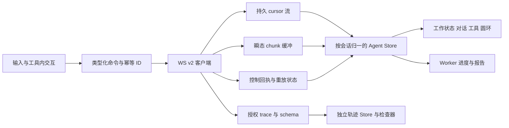

# AI 测试与评估平台 — AgentLoop 前端重写与联调计划

> 版本：V0.16 ｜ 审查日期：2026-09-12 ｜ 状态：已实现输入框上方的工具权限与 ask_user_question 抽屉、三题型问答、自定义答案及 task 任务清单默认收起，并通过本地门禁；合入与部署状态以关联 PR/Actions 为准。
>
> 基线：`deepseek-harness-py/static/index.html` 当前页面 + `ai-eval-platform/frontend/src/views/Agent.vue` 当前实现 + 已落地后端 WS v2。后端设计见 [架构设计](AI测试与评估平台-AgentLoop后端架构设计.md)，已验证范围见 [实施记录](AI测试与评估平台-AgentLoop后端实施记录.md)。
>
> V0.1 为计划基线；V0.2 的首次实现记录见 §11，V0.3 的单入口与输入栏增量见 §12，V0.4–V0.8 的页面细节修订见 §13–§17，HTTP 兼容与协议收敛见 §18–§19。下文原阶段退出条件继续有效，不能把本次实现认定为 F0–F7 全部完成。

## 1. 用户要求与实施口径

| 要求 | 本计划决策 | 完成标准 |
| :--- | :--- | :--- |
| Agent 工作状态保留 | 保留平台会话状态点、状态筛选、当前 Agent 状态入口；接入 v2 真实状态 | 模型、工具、等待交互、取消、离线及 Worker 状态不混淆 |
| 模型选择保留 | 保留输入栏模型下拉、ProviderLogo、协议档管理入口 | 展示实际生效模型；切换失败/协议不兼容明确提示 |
| 上下文窗口圆环保留 | 保留 ContextMeter 的圆环、比例、展开明细；替换旧引擎统计来源 | 数值来自 v2 实际请求上下文，未知显示未知 |
| 删除附件功能保留 | 保留待发送附件的移除、上传状态、拖拽和预览 | 上传中移除不会被迟到响应加回来；不发送已移除引用 |
| 确认卡删除 | 新页面移除旧独立 ConfirmCard，以及分散在聊天流中的旧审批/澄清卡形态 | 三种交互归入对应工具展开区，聊天流不再插入独立确认卡 |
| 工具卡使用源页面并优化 | 迁入源 details/summary 折叠结构、参数/结果分区；增加平台工具视图与六态 | 同名不同调用独立；参数、结果、权限、终态可准确对应 |
| 输入框优化并增加思考滑块 | 平台附件/模型/圆环 + 源 Thinking 弹层滑块、档位说明与动效 | 档位由后端能力约束，随下一次 turn.submit 显式提交 |
| 源前端全部功能 | 覆盖 §3 全量矩阵，迁移行为并适配平台身份/存储/协议 | 所有条目有验收证据；不能只迁移外观和聊天主链 |

“确认卡删除”在本计划中指**删除旧卡片 UI，不删除后端审批与业务确认流程**。源页面本身也有允许一次/拒绝/持续允许。若把这些交互一并删除，write/edit/bash 或 task.create 可能一直等待或超时。新页面采用工具内交互区，不另造同类确认卡组件，也不自动代替用户同意。

“全部功能”以源页面实际实现为准，不要求复制全部源工具、JSONL 部署、匿名 `/ws` 或单文件 DOM 架构。未注册的工具不会因新增图标就获得调用能力。平台的认证、共享会话、工作区绑定、任务报告和附件能力仍须保留。

## 2. 已核对现状与差异

### 2.1 页面基线

| 位置 | 当前事实 | 迁移影响 |
| :--- | :--- | :--- |
| 源 `static/index.html` | 1967 行，HTML/CSS/原生 JS；会话栏、对话/轨迹 Tab、输入栏、运行侧栏 | 提取行为与视觉规则，重写为 Vue 组件；不嵌 iframe 或直接复制脚本 |
| 源 `addToolCard/finishToolCard` | 参数/结果折叠；用 is_error 归成完成/失败，长成功输出可收起 | 必须扩为平台六态，不能延续二态归并 |
| 源 `reasoningFor/settleReasoning` | 思考增量展开，结束自动折叠，失败/中断不同标签 | 按 attempt 管理；保留用户手动展开选择 |
| 源 `loadUiConfig/renderEffortSlider` | 从 `/api/ui-config` 读取档位，支持滑动、滚轮、键盘和本地偏好 | 已由脱敏的 agent-ui profiles 逐档返回能力；前端按所选协议档收敛可用档位 |
| 源 `phaseMeta` | 68%、48%、92% 等执行能量为固定展示值 | 保留状态表达，移除假进度数值；Worker 的真实百分比继续显示 |
| 平台 `Agent.vue` | 已有状态点/筛选、模型下拉、附件、圆环、内联旧工具栈、三类旧卡 | 按职责拆出 v2 页面，旧 reducer 不扩成两套协议混杂的分支 |
| 平台 `api/ws.ts` | legacy event_id、2 秒重排窗口和旧命令 | v2 新客户端使用严格 cursor；不能继承旧超时跳号策略 |
| 平台模型选择 | 输入栏选择 agent-ui 返回的协议档 | 每次提交显式携带 profile_id，服务端重新校验用途、凭据、模型和思考档位；不写全局 agent_profile_id |
| 平台圆环 | REST 历史的旧 `context_meter`，基于旧窗口/摘要/skills 口径 | 保留组件形态，不直接把旧统计当作新循环实际上下文 |
| 平台附件移除 | 移除草稿引用并释放 object URL | 这不等于物理删除上传文件，也不删除已经提交的历史附件 |

源页面核对 SHA-256：`A413AFC61C44C4C01221C3F95DADCA2A370089F3077D8DADF6E3373D89B182B9`。本次运行源 `node --test tests/trace_frontend.test.cjs`：**4 项通过**，覆盖长输出、450 条历史、时间线拖选、四步模型与三个同名工具调用。该结果只是源行为基线，不是平台前端迁移验收。

### 2.2 必须先补齐的展示契约

以下都是对当前代码的核对结果；F0 阶段先修订 API.md，再实现及测试。本文中的新字段/接口仅为建议契约，不能据此让前端直接调用不存在的接口。

| 编号 | 当前缺口 | 建议的最小后端增量 | 不补齐的后果 |
| :--- | :--- | :--- | :--- |
| B-FE01 | capabilities 目前只有 commands 与 stream_schema_version | 增加经过授权的会话 UI 元信息，候选 `GET /api/sessions/{id}/agent-ui`；提供实际 profile/model/version、默认与可选 effort、附件支持范围、tool manifest、权限、controller 状态；草稿复用相同能力解析逻辑 | 滑块只能猜档位；观察者可能看到无效控制按钮 |
| B-FE02 | 圆环仍读 legacy 历史估算 | v2 专用 context_meter，使用 request_factory 同样的历史选择/系统/工具/图文估算；包含 basis、estimated、profile_version、input_fingerprint、history_upto_seq、容量及输出预留 | UI “空间足够”而实际请求超窗；切档后数字错配 |
| B-FE03 | `tool.call` 只投影 name；`tool.result` 的 display 可为空，原始参数/结果不向普通前端开放 | 增加版本化 ToolDisplay 安全投影；至少在 call 阶段有目标摘要、参数预览，result 阶段有真实输出预览、truncated、结构化结果；关联 registry_name/wire_name；允许字段按工具白名单生成 | 源工具卡参数区为空、bash/read 结果不可见，无法声称完整迁入 |
| B-FE04 | reasoning 有授权瞬态，但普通持久 assistant.message 不携带 reasoning；现有快照也无已授权思考正文 | 提供按 reasoning ACL 裁剪的持久思考投影/历史读取；最终片段校正、失败/中断标记及撤权规则一致 | 刷新后思考消失，源思考回放功能不完整 |
| B-FE05 | semantic assistant.start 不给模型/思考配置；trace 剥离 header、system、provider_options 等 | 增加安全 request summary：模型、协议档版本、有效 effort、max_tokens、工具 schema 引用、配置指纹、usage、已知 timing；不能开放原始提示词/opaque 状态 | 模型头、当前配置、轨迹“选项/Schema/计时”页缺数据 |
| B-FE06 | 快照按组归并 messages/tools/assistants，缺统一首出现位置和完整历史交互摘要；不能只用末次 cursor 排列 | 统一模型中提供 first_cursor/source_seq、消息与 turn/attempt 的关联、三类交互历史摘要及当前控制权限；与 H 同事务授权读取 | resync 后工具跑到最终答案之后、助手消息重复、已决定交互记录丢失 |
| B-FE07 | 附件、provider 元信息在 user.message/消息快照中不完全同形；旧附件上传白名单比模型实际内联支持更宽 | 冻结 AttachmentView DTO；元信息/安全下载地址由有权限的文件接口补全；区分“可上传/可预览/可供当前模型读取” | 提交 PDF/音频后误以为模型已解析，历史附件不能预览 |

B-FE01 的模型能力必须复用 `llm/resolver.py` 与 `providers/options.py` 的真实解析，不在前端重写模型名单。DeepSeek 当前允许 off/low/medium/high/max，拒绝 xhigh；其他模型是否允许某档以实际服务端能力为准。当前后端接口枚举接受 xhigh，不意味着每个模型都支持它。

API.md §4A.4 仍有“本批不修改 main.py”的阶段性描述，与主服务已接线的现状不一致；F0 同步修正，避免前端按未接线状态设计。未经以上补齐，可以做 UI 原型和 WS 核心接线，但不能宣布“源前端全部功能完成”。

## 3. 源页面全部功能迁入矩阵

| 编号 | 源行为/定位 | 平台落点与适配要求 |
| :--- | :--- | :--- |
| S01 | 新建/列出/恢复会话、当前会话标记、时间/事件数 | 复用平台 REST、标题/删除/共享/工作区能力；事件数无契约则不编造；创建显式 v2 |
| S02 | 空白欢迎页、三张快捷提示 | 保留快捷填入并聚焦，换为平台工作区/评测任务示例；点击不自动提交 |
| S03 | WebSocket 连接指示、重试、离线错误 | 短票、退避、v2 重放；离线不是 turn 已取消或完成 |
| S04 | 文本输入自动高度、Enter/Shift+Enter、发送/停止同位置 | 平台输入框保留附件；保留 IME `isComposing`，避免中文选词误发 |
| S05 | Thinking 弹层、说明、粒子/能量轨道、离散 range | Vue ThinkingControl；支持 allowed efforts、滚轮、键盘、Escape、点外关闭 |
| S06 | 本地保存 effort，重载恢复 | 按登录成员+profile/version 存偏好；过期档位按后端默认回退并提示；不跨用户串偏好 |
| S07 | user/assistant、流式文本、最终消息校正、中断标识 | 统一时间线按 turn/attempt 排列；保留平台 Markdown/图文/复制能力；不复制源纯 textContent 降级 |
| S08 | reasoning 单独流、摘要、直播态、结束折叠、失败/中断 | ReasoningBlock；历史也可重建（B-FE04），无权限不显示内容 |
| S09 | 多 step、多 attempt、重试等待和具体失败原因 | 不把 retry 当 turn 结束；错误来自安全 code/message，不能展示 SDK 原始异常 |
| S10 | 工具折叠头、参数区、输出区、长结果收起 | ToolRunCard，以源结构为基线，完善六态与 ToolDisplay（§6） |
| S11 | 允许一次/拒绝/持续允许、提交中、超时/取消等 | 工具内交互区，按现有 nonce/身份/TTL 提交；源缺的安全字段必须补齐 |
| S12 | 当前运行状态、活动事件、provider/model/effort/session | 复用平台工作状态入口；增加运行侧栏信息，最多展示最近活动并可进入完整轨迹 |
| S13 | 对话/轨迹 Tab 切换、事件数、分类搜索 | TraceWorkspace；all/lifecycle/model/tool/approval + 平台 question/task 分类 |
| S14 | 语义行与原始记录关联、调用链导航 | 同一语义行可以关联多个 transport/source 层；不重复显示 call/result 为两个独立调用 |
| S15 | 概览、预览、原始内容、参数、结果、选项、用量、来源 | 保留检查器入口；只展示授权数据；原始内容更名“已授权内容”，空值解释缺失原因 |
| S16 | 事件 Schema、工具 Schema、引用/必填/敏感路径、未知 schema | 使用 schema.catalog、缓存 ETag、完整引用解析；未知字段保留但不执行；不从单个样本猜必填 |
| S17 | JSON 树展开、数据包查看、复制脱敏包 | 只复制后端允许且前端再次脱敏的包，不复制 nonce/token/完整请求头 |
| S18 | 时间线/瀑布、点击定位、拖选范围、双击/右键/Escape 清选择 | 迁入选区行为；增加键盘等价操作；排序轴与真实耗时轴标注清楚 |
| S19 | TTFT、持续时长、usage、关联请求头 | 有证据才展示；首 chunk 丢失标为“首次观测”，不当真实 TTFT；无服务端时间不推算历史耗时 |
| S20 | 历史与实时去重、长诊断流有界但业务事实不丢 | 迁移源测试四类不变量；持久行分页/虚拟化，瞬态缓冲独立，不能把 320 当业务历史上限 |
| S21 | 窄屏会话/运行侧栏、遮罩关闭、Escape、轨迹详情 | 平台响应式壳复用，移动端详情变单层抽屉，输入栏不被键盘遮挡 |
| S22 | max_tokens/max_steps/cancelled/interrupted/error 提示 | 区分输出上限、步数上限、取消与失败；`turn.end` 才释放本轮忙碌状态 |

S01–S22 全部为本次前端目标。权限导致的内容不可见属于有提示的授权行为；不能把未实现功能仅隐藏按钮后记作迁移完成。

## 4. 页面结构与组件取舍

```text
平台主导航（保留）
└─ AgentWorkspace
   ├─ 会话栏：新建 / 状态筛选 / 共享标识 / 工作区 / 删除
   ├─ 顶部：会话标题 / 工作区 / Agent 工作状态 / 连接状态
   ├─ 对话 | 轨迹
   │  ├─ 对话：用户消息 → 思考块 → 工具折叠行（含交互）→ 后续模型输出
   │  └─ 轨迹：筛选搜索 → 时间线 → 语义事件列表 + 详情检查器
   ├─ 输入区
   │  ├─ 待发送附件与移除
   │  ├─ 附件按钮 + 自动高度文本框
   │  └─ 模型选择 | Thinking 滑块入口 | 上下文圆环        发送/停止
   └─ 运行侧栏：当前阶段 / step / 最近活动 / 有效模型配置 / Worker 任务
```

| 现有组件/区域 | 处置 |
| :--- | :--- |
| 平台主导航、会话列表/管理、工作区绑定 | 保留样式与业务行为，提取必要组件，不改其他业务页 |
| 工作状态点、筛选、当前状态、连接提示 | 保留；状态计算替换为新 store selector，不与旧 isGenerating 混用 |
| ProviderLogo 与模型下拉 | 保留；抽出 ModelSelector，明确“平台默认模型”的现有全局语义 |
| ContextMeter.vue | 保留圆环和展开体验；更新 DTO，系统/工具/附件等明细按实有展示；不显示虚构 Skills 消耗 |
| AttachmentPreview.vue、附件预览弹层 | 保留；移除按钮换同套 Close 线性图标，补上传竞争与权限处理 |
| MarkdownView.vue、StructuredDataView.vue、MediaPreview.vue | 保留渲染与安全边界，用于助手和适配后的工具结果 |
| ProgressDock.vue、ReportCard.vue | 保留 Worker 业务能力；Agent turn 结束不影响后台评测展示 |
| ConfirmCard.vue 与旧 confirm 表单/乐观盖章逻辑 | 新路径删除依赖和独立渲染；task.create 在工具内显示冻结摘要并确认/拒绝 |
| ApprovalCard.vue、ClarifyCard.vue | 复用必要的纯问答校验思路，替换独立卡片 UI 为工具内交互区 |
| Agent.vue 内旧 toolItems / done-error 卡栈 | 替换为源风格 ToolRunCard 与按身份归一的数据模型 |
| 源独立运行“能量百分比” | 不复制假百分比；可保留装饰性呼吸光，但需 `aria-hidden` |
| 源 HTML 脚本与匿名 WS 客户端 | 不迁入生产目录；行为拆分为 Vue + TypeScript + v2 客户端 |

模型选择改为每次 AgentLoop turn.submit 的受控 profile_id：agent-ui 只下发可供 Agent 使用的协议档安全投影，前端仅把选项保存为当前用户的本地预选。服务端在每轮调用前重新解析 profile_id，并校验用途、连接凭据、模型和 reasoning_effort；前端不得写全局 agent_profile_id，也不得发送端点、密钥或供应商参数。活动回合使用持久 request_summary，切换只影响下一轮。

历史 legacy 会话仍保留在服务端，供审计与显式旧路径回放；唯一 AgentLoop 工作台不再列出或创建 legacy 会话。旧 WS 缺失 session_id 时关闭 4400，不会暗中生成 legacy 数据。旧卡文件及既有业务页暂不删除，真实历史和待处理交互的兼容验收完成后再清理。

## 5. 状态、输入框与思考滑块

### 5.1 状态必须分四层

| 层 | 建议状态 | 权威与展示 |
| :--- | :--- | :--- |
| 连接 | connecting/online/reconnecting/offline/revoked | WS 生命周期；不决定业务是否成功 |
| Agent turn | idle/submitting/running/waiting_interaction/cancelling/completed/failed/interrupted | 提交回执、持久事件、授权快照；运行子阶段为 model/thinking/answering/tools/retry_wait |
| 工具 | pending/waiting_approval/running + 六种终态 | call、交互、dispatch、result；见 §6 |
| Worker | queued/running/awaiting_case_confirm/succeeded/failed/cancelled | task.* 与任务接口；不由 Agent 发送按钮直接取消 |

`assistant.end` 只结束一次 attempt，不关闭整个回合；`command.accepted` 只代表受理。无终态而断线时显示“连接中断，状态待同步”，重连后取事实，不能写本地 cancelled。工具 outcome_unknown 即使 turn 已结束仍保留“结果未知/范围受限”。

平台原有切换会话后继续后台生成的体验应保留：每个仍由本页控制且运行中的会话保有自己的连接；切页仅切视图，不能顺手 unsubscribe 控制连接，因为当前后端 detach 会取消控制者回合。闲置连接可释放。观察会话一条连接即可；页面关闭导致实际控制连接断开时遵守现有取消语义，不承诺浏览器关闭后仍继续。

### 5.2 输入框约束

- 保留附件位于文本上方、底栏模型与圆环；Thinking 置于模型与圆环之间。窄屏允许底栏折行，发送按钮始终可达。
- 文本自动增高至约 168–200px 后内部滚动；中文输入法确认不发送，Enter 发送，Shift+Enter 换行。
- 发送时冻结正文、附件 IDs、effort、client_message_id、request_id；迟到上传不能改动已提交负载。
- 受理前保留可恢复草稿；accepted 后转为已提交，user.message 用 client_message_id 合并乐观条目。连接断开不换 ID 盲重发。
- 回合运行中可以编辑下一轮草稿和附件，发送位置显示停止；不暗中实现源尚无的 steer/inject 或自动队列。
- 移除上传中附件先标记 tombstone，并取消请求（可用时）；迟到成功只做资源清理，不重新加入草稿。释放 object URL；不自动调用不存在的文件删除接口。
- 上传支持列表与模型可消费列表分开。仅附件提交是否允许以 B-FE07 定稿为准；后端要求 content 时提供明确交互，不能前端伪造用户指令。

### 5.3 ThinkingControl

1. 迁入源按钮→弹层→档位标题/模型/说明→离散滑块；off 为关闭，low/medium/high/max 保留中文说明；xhigh 仅在后端声明时增加。
2. 按 allowed efforts 构建刻度，禁止固定 5 格；0 档显示不可用说明，1 档显示固定值。指针拖动、键盘箭头/Home/End、焦点内滚轮具有一致结果。
3. 滚轮仅在控件有焦点或弹层打开时改变档位，避免用户滚动页面意外改配置；Escape 关闭并返回触发器，点外关闭。
4. 保留最大档视觉强调；`prefers-reduced-motion` 关闭粒子/循环光效，不影响功能。提供 `aria-valuetext`，不能只依赖颜色。
5. 更换模型后重新读取能力；不支持当前档时回到服务端默认并显示一次明确提示。活跃 attempt 的实际 effort 不随滑块移动改变。
6. slider 控制思考强度；reasoning 展开控制展示，两者独立。关闭展示不等于不请求思考。

## 6. 工具卡、兼容与线性图标

### 6.1 ToolRunCard 结构与交互

```text
[工具线性图标] 读取文件       src/app.py:1–80      [已完成]  120ms   [展开]
  参数摘要       文件、起始行、范围（来自安全展示 DTO）
  交互区         仅有待处理授权/问题/任务确认时显示
  执行结果       文本 / 表格 / diff / 链接 / 任务收据
  展示说明       已截断、未提供、受限、来自恢复补偿
```

- 基于源 `<details>/<summary>` 折叠语义实现键盘可操作控件；小结果完成后保持摘要，大结果默认折叠，用户手动展开不被后续 chunk 强制关闭。
- 正文、思考、工具按首次事实顺序排在同一回合中，不能把所有工具集中放在最终回答之后。
- 同一个工具调用只建一张卡；身份至少为 session_id+turn_id+attempt_id+call_id。不可仅用 name/call_id 全局去重。
- pending 表示模型已声明、未派发；审批时显示等待授权，dispatch 后才显示运行。普通失败继续兄弟调用，前端不能把工具组全染为失败。
- 六态中文：succeeded=已完成，failed=失败，denied=已拒绝，cancelled=已取消，not_started=未启动，outcome_unknown=结果未知。synthetic 另标“恢复补偿”，不改变原终态。
- 结果先到或快照缺 call 时建立占位卡并补齐，不丢弃结果。通用 runtime.error 不伪造每个调用的 failed 结果；等待权威结算或恢复。
- duration/exit_code 仅有后端证据才显示。HTTP 超时不是进程已停止；未知执行不得给“重试同一调用/强制解锁”按钮。

### 6.2 ToolDisplay 建议契约（待 B-FE03 落地）

建议 `display.version=1`，字段为 `title,target,summary,arguments_preview,result_preview,format,truncated,unavailable_reason,links`，并按工具提供受控 `structured`。所有字段均可缺省；明确区分未提供、权限受限、空输出和已截断。服务端生成展示参数，前端不从模型正文反向解析 JSON，也不把 trace 的授权权限作为普通工具卡必备条件。

`format` 仅选择 text/json/table/diff/links/task 等本地 renderer；链接只接受通过校验的 http(s) 或平台相对路由，禁止 javascript/file URL。HTML 作为文本或经过既有安全渲染；SVG 不作为外部可执行工具结果内嵌。原始大结果若没有授权详情接口，则只显示截断状态，不能提供失效的“查看完整内容”。

### 6.3 当前工具与图标映射

图标均为本地 24×24 SVG，`fill=none`、`stroke=currentColor`、线宽 1.75、圆角端点。工具图标表达类型，另一个状态标记表达六态，不用同一图标同时表示成功/失败。附图 SVG 内提供可复用 symbol ID；实施时提取到 `ToolIcon.vue` 静态路径表，不加载任意外部图标 URL，也不增加图标库依赖。

| 平台工具 / wire name | 图标 symbol | 工具结果优化与字段兼容 |
| :--- | :--- | :--- |
| read | file-read | 相对路径、行范围、文本/Markdown/结构化预览；源 file_path/offset 与平台字段按后端 codec，前端不自行做 0/1-based 换算 |
| write | file-write | 文件路径、创建/覆盖语义、真实写入摘要；没有原始文本不伪造 diff |
| edit | file-edit | 目标、替换摘要；仅后端提供有效前后片段时展示 diff；空替换是删除，不能显示参数缺失 |
| bash | terminal | 安全命令预览、输出、退出码、取消/未知状态；不显示宿主绝对路径和 cgroup 内部细节 |
| web_search | search-web | 搜索词、来源标题/域名、摘要与结果链接；无真实结果不填演示数据 |
| web_fetch | globe | URL/站点标题、正文摘要、截断和类型；保留 StructuredDataView/MarkdownView 的可用渲染 |
| ask_user_question | message-question | 单选/多选/文本问题嵌于展开区；答案提交后只读回显，不变成普通助手正文 |
| task.create / platform_task_create | task-add | 冻结 spec 摘要→工具内确认→真实 queued/task_id 收据；工具完成不等于评测完成 |
| task.status / platform_task_status | list-check | 真实任务状态、阶段、报告入口；引用 Task DTO，不另造成功状态 |
| task.cancel / platform_task_cancel | circle-stop | 区分取消请求与持久 task.end(cancelled)；与 Agent turn.cancel 分离 |

精确映射已登记的 wire 名称，禁止对任意 `platform_` 字符串盲目反推权限或调用工具。

### 6.4 源工具/历史/扩展兼容

| 名称 | 图标 | 范围 |
| :--- | :--- | :--- |
| list_dir | folder-tree | 源历史展示目录列表；当前新桥未装配，不能出现在可调用工具清单 |
| glob | files-search | 源历史展示匹配文件列表；不能误映射成互联网 web_search |
| grep | text-search | 源历史展示路径/行号/匹配文本；同上，未注册就不执行 |
| str_replace_editor | code-edit | 按 command 展示 view/create/replace 等摘要；不把复合编辑器直接当平台 edit 执行 |
| pwsh | terminal | 源 Windows 历史可识别；不将 PowerShell 命令默默改成 Linux bash |
| 已授权 MCP 工具 | plug | 只按服务端 manifest 展示；无专用 renderer 用通用 JSON/文本 |
| 未知工具 | wrench | 原名、安全参数/结果、真实状态完整保留，不能渲染失败或白屏 |

这些兼容是**前端展示兼容**。不要求后端额外迁入源全部工具，不允许前端越过后端白名单补执行。

### 6.5 删除独立确认卡后的完整交互

| 交互 | 展开区内容 | 提交与最终状态 |
| :--- | :--- | :--- |
| approval.requested | 操作对象与安全参数、允许一次/拒绝/本连接持续允许 | `approval.respond` 携带完整身份和 nonce；accepted 后仍等待 approval.resolved/tool.result |
| question.requested | 问题、选项、多选/文本输入 | `question.respond` 的 answers 严格用 question_id/answer；UI 的选项 ID/多选值与后端 validate_answers 做 fixture 往返，不凭逗号文本猜格式 |
| task_confirmation.requested | 只读冻结任务摘要、确认执行/拒绝 | `task_confirmation.respond` 携带 spec_hash；不提供旧卡直接改 TaskSpec 表单，规格改变须重新请求并重新确认 |

点击后置 submitting，失败恢复到仍可操作的权威状态；TTL 到期、本轮取消、resolved 或被撤权后按钮失效。nonce/spec_hash 只在内存命令上下文使用，不进调试复制/持久本地缓存。restricted 占位仍消费 cursor；观察者只能看允许的摘要。一次业务操作若后端同时发工具许可与任务规格确认，按各自身份顺序呈现，不能一键替两个决定；是否减少重复询问由后端契约审查决定。

## 7. WS v2、Store 与轨迹数据流

### 7.1 传输层与归一模型

建议新增 `api/agentLoopWs.ts` 和 `api/agentLoopTypes.ts`；保留现有 `api/ws.ts` 供 legacy。类型以已落地 `routers/ws_v2.py`、`agent/events.py` 与 API.md 为准。



Store 至少分为 session、turn、attempt、toolCalls、interactions、tasks、executions、drafts。UI 展开/选区状态与业务事实分离；稳定身份键保存，不能每个 chunk 重建全部组件。持久 cursor、trace seq、chunk_index 是三套游标，不得共用。

### 7.2 建连、重放与快照

1. 认证换短票，按 session.engine_version 选择协议。hello/capabilities 验证版本；未知版本明确失败，不试发 legacy 帧碰运气。
2. 首次无本地状态时 `subscribe(after_cursor=0)` 重放现有持久记录。正常 subscribed 只有 H，**当前并不总是返回 snapshot**；不能等待一个不存在的快照字段。
3. 有内存状态且对应 cursor 时，重放 `(lastAppliedCursor,H]`；只在 reducer 成功后推进 lastAppliedCursor，不在收到帧时抢先推进。
4. 缺口停止推进并重新同步；不能用旧重排超时跳过丢失 cursor。重复 cursor 丢弃但不丢关联 trace。
5. `resync.required` 带 H 对应 snapshot，原子替换会话读模型，再 subscribe(H)。严禁同时从 REST messages 和 snapshot/replay 重复追加用户/助手消息。
6. 若刷新只保存了 cursor 却没有对应 UI 快照，必须从 0 或服务端授权快照重建，不能拿空 store 订阅“最新游标”。
7. 瞬态按 session/turn/attempt/channel/chunk_index 去重；assistant.message 最终校正正文；持久结束之后到达的旧 chunk 不再追加。快照不保留未提交前缀时如实重置。
8. request_id 重发使用同一冻结负载；同一内容换 ID 视为新请求，不能擅自重复。审批重发仍由服务器校验 nonce，不可因客户端 timeout 判断操作未执行。
9. 4401 重新领票，4404 清除该会话敏感缓存并返回列表，4408 退避重连/按游标恢复，1013 显示服务未就绪。错误信息脱敏。
10. 浏览器重连不自动取得控制权；使用 B-FE01 权限/控制信息。切换会话与 detach 策略按 §5.1，不因 UI 隐藏取消后台回合。

### 7.3 事件到视图的责任

| v2 类型 | reducer 行为 |
| :--- | :--- |
| user.message / turn.start | 合并乐观输入；开始有身份的回合 |
| step.start/end | 维护步骤和用量；不是整个回合完成 |
| assistant.start/text.delta/reasoning.delta/message/end/retry | 按 attempt 流式合并、最终校正、重试/失败标记 |
| tool.call/dispatch/result | 建卡、标记派发、六态结算；不从 finish_reason 猜工具结果 |
| approval/question/task_confirmation requested/resolved | 更新目标工具内交互，按授权和终态启停动作 |
| execution.quarantined/reconciled | 展示范围受限/已对账状态，不改写历史 outcome_unknown |
| task.queued/progress/report/end | 更新 Worker 任务字典和报告/进度组件；100% progress 或 report 单独到达不擅自判成功 |
| context.trimmed / session.updated | 提示上下文变化并刷新对应统计；更新标题/元信息 |
| runtime.error / turn.end | 安全提示错误；仅权威回合终态统一收尾 |
| command.accepted/rejected | 命令状态，不作为模型/工具终态 |

### 7.4 轨迹检查器

- 显式 trace.subscribe，允许被拒绝；普通对话和工具卡不依赖 trace 权限。trace.event 按 source seq 从 0 起处理，after_seq 初值 -1。
- 源下划线 transport 名通过独立适配映射到点号 v2，保留真实 source type（如 tool/call）；不把 source seq 解释成 semantic cursor。
- 业务行、transport 层、原始授权事件分开索引。关联链包含 turn→step→attempt→tool→interaction/result；首次记录和选择状态不会被 1000 个 chunk 冲掉。
- Schema 页面读取 catalog 中的 dialect/ref/version/required/sensitive_paths；无 catalog 显示未提供，未知 schema 显示未知。工具 schema 只能来自后端批准的 manifest/request summary。
- 对话和轨迹各自做虚拟滚动/分页；瞬态诊断环形缓冲可取源约 320 条起点，必须另保留首个观测时点与聚合量；持久业务记录不按此阈值删除。
- 时间线点击、拖选、清选以及键盘等价操作均保留；计算耗时优先服务端单一时基。浏览器接收时间与持久 ts 不相减冒充 TTFT。
- “参数/结果/选项/数据包”只显示授权字段。源直接展示完整 request/header 的方式不迁入；B-FE05 提供安全摘要，system/opaque/provider 原始状态明确显示不可公开。

## 8. 文件拆分与实施阶段

### 8.1 目标文件（计划新增，不代表当前存在）

```text
frontend/src/
  views/Agent.vue                       # 路由壳与引擎分流，逐步剥离旧巨型逻辑
  agent/loop/
    store.ts                           # 会话归一状态与选择器
    reducer.ts                         # 持久事实、快照、瞬态归并的纯函数
    trace.ts                           # 轨迹语义行、关联索引、时间线
    toolPresentation.ts                # 工具展示 DTO/已登记别名映射
  api/agentLoopWs.ts                    # v2、重连、命令、cursor
  api/agentLoopTypes.ts                 # 与定稿契约一致的联合类型
  components/agent/loop/
    AgentWorkspace.vue                 # 对话/轨迹与运行侧栏装配
    AgentStatus.vue                     # 复用平台工作状态视觉
    AgentComposer.vue                  # 附件、模型、思考、圆环、发送
    ModelSelector.vue / ThinkingControl.vue
    ConversationTimeline.vue / ReasoningBlock.vue
    ToolRunCard.vue / ToolInteraction.vue / ToolIcon.vue
    TraceWorkspace.vue / TraceInspector.vue / TraceTimeline.vue
    RuntimeInspector.vue
```

仅在职责独立时拆分；文字预览、表格、媒体继续用已有组件，不为每个工具建一套重复卡片。建议补前端单测与浏览器 E2E 工具（在 F0 选择并锁定兼容版本），当前 package.json 只有 typecheck/build，不能假设测试框架已安装。

### 8.2 阶段、依赖与退出条件

| 阶段 | 交付 | 验证/退出条件 |
| :--- | :--- | :--- |
| F0 契约与基线 | S01–S22 编号、B-FE01–07 定稿/API 修订、测试夹具与工具展示 schema | 每个可见功能均有真实数据来源；无“前端暂时猜字段” |
| F1 v2 数据层 | types、transport、纯 reducer、快照、去重、会话连接生命周期 | 重复/缺口/断线/重放/错版本/受限占位测试通过 |
| F2 页面骨架与保留组件 | 平台壳、工作状态、模型、圆环、附件、Thinking | 桌面/窄屏与键盘完整可用；有效模型与 effort 对应 |
| F3 对话与工具闭环 | 思考/正文/多步时间线、源风格工具卡、线性图标、工具内三类交互 | 真实临时文件 read→edit→read→答复 + 第二轮 + 拒绝/取消通过 |
| F4 平台业务兼容 | task.create/status/cancel、web 工具、报告/进度、legacy 展示转换 | 任务只入队一次，报告与取消如实；旧独立确认卡不再出现 |
| F5 完整轨迹工作台 | 所有筛选/检查器/Schema/JSON 树/复制/拖选/timing/关联 | 源四组回归迁移并通过，长流不丢业务行，未授权字段不泄漏 |
| F6 联合验收 | 真实 SDK/PG/WS 浏览器联调、真实供应商、Linux Runner、权限/故障 | §9 矩阵全项有证据；条件未满足的不得记通过 |
| F7 切换与清理 | 新会话固定 AgentLoop、旧会话可读/可结算、旧引用与文件清理 | 无旧卡引用与死代码、回滚保留历史 reader；禁止恢复隐式创建 legacy 会话 |

关键路径：F0→F1→F2/F3→F4/F5→F6→F7。组件原型可与契约讨论并行，但数据层和后端展示缺口未闭环前不能提前扩大灰度。

## 9. 联调验收矩阵

| 编号 | 用例 | 必须观察到的结果 |
| :--- | :--- | :--- |
| V01 | v2 创建、打开历史 legacy、旧 endpoint 缺 session_id、错误 endpoint | 引擎固定、正确 transport；不自动创建或迁写 legacy 历史 |
| V02 | 同一 submit 重发、掉线未收到 accepted、负载改变复用 ID | 一条用户事实/一轮执行；不同摘要拒绝，草稿可恢复 |
| V03 | 四步模型、三个同名工具、第二轮历史 | 顺序正确且各调用独立；工具结果真实回填再调用模型 |
| V04 | read/edit/read + 参数别名、行范围、空替换 | 文件实际变化与卡片一致，不做错误的行号/命令转换 |
| V05 | allow/deny/always/超时/双击/断连/换成员 | 工具内交互、幂等回执、不重复执行；always 不越身份或连接生命周期 |
| V06 | 单选、多选、文本与非法答案、迟到响应 | 问答 DTO 往返正确，已失效问题不可再次提交 |
| V07 | task.create 确认/拒绝/规格变化/恢复 | 没有独立确认卡；绑定真实 spec_hash，只产生一项任务 |
| V08 | 六态 + synthetic + 同组普通失败 | 各态独立，兄弟结果保留；unknown 不伪装取消，不出现强制重试 |
| V09 | 模型流/审批中/bash 中停止，取消回执迟到 | 显示取消中直至 turn.end；Worker 不受 Agent 停止误伤 |
| V10 | Worker 进度 100%、报告先到、失败、取消与重开 | 以 task.end/任务事实为终态；报告可打开且不重复 |
| V11 | reasoning 交错、结束折叠、失败/截断/刷新 | attempt 隔离、最终内容校正、历史思考按授权恢复 |
| V12 | effort off/各档、仅一档/未知模型、切模型、热键/滚轮 | 提交值是合法档位；实际请求与 UI 一致，偏好不会跨账号串用 |
| V13 | 圆环近阈值、裁剪、换模型、图片输入、未知 usage | 与同一请求统计一致，估算有标记；未知不显示 0 或假精度 |
| V14 | 上传失败/上传中移除/迟到上传/重连重发/附件独立草稿 | 删除引用不复活、资源释放，历史预览有效；权限拒绝清缓存 |
| V15 | cursor 重复、缺口、过期、超水位、resync | 快照在 H 原子替换，>H 正确续接；消息和工具不重复/不乱序 |
| V16 | semantic 与 trace 同一事实、seq=0、不同会话并发 | 双游标分离，不能只按 call_id 或工具名合并 |
| V17 | 1000 chunks、450+ 历史、四个 attempt、缓冲裁剪 | 源回归不变量保持；选中行/关联链/首次观测不丢 |
| V18 | trace 分类/搜索/12 类详情/JSON 树/复制/时间线拖选 | 每个入口可用；无资料显示原因；复制内容安全；触屏/键盘可达 |
| V19 | trace 被拒、reasoning 撤权、交互 restricted、成员禁用 | 对话独立工作或按权限关闭；隐藏内容不残留在缓存/复制 |
| V20 | 切去别的会话再回来、关闭观察连接、关闭控制连接 | 后台运行与控制权行为符合 §5.1，不因普通切页误取消 |
| V21 | 375/768/1440px、200% 缩放、中文输入法、减少动效 | 没有横向页面溢出；滑块/附件/发送可操作、焦点可返回 |
| V22 | DeepSeek/OpenAI Chat/Responses/Anthropic 实际协议档 | 真实多步工具闭环；图文、思考、usage 和必要协议续接无退化 |
| V23 | Linux Runner 失联后仍在运行、重启、另一会话同 scope | unknown 与隔离持续显示；无误放行；可信对账后才解除提示 |
| V24 | legacy 历史和待处理三类交互、单入口回滚 | 旧卡 UI 消失但历史/必要操作仍可用；新会话事实与 reader 不丢 |

测试分层：纯 reducer/展示 codec 单测→真实 SDK 响应夹具→真实 PG+WS+临时文件→浏览器 E2E→真实供应商/Linux 验收。mock 工具返回、静态截图、typecheck 或构建成功均不能独立证明整轮闭环。

建议性能验收数据集固定为 450 条持久事件、1000 个瞬态 chunk、4 个模型 step、3 个同名工具调用。记录浏览器/机器/耗时与内存，不预先编造毫秒性能承诺；只渲染可视行，增量批次合并，Markdown 不逐字符重解析，追踪侧栏按需装载。

## 10. 发布条件与本次文件清单

- 上线前同时满足：B-FE01–07 完成，S01–S22/V01–V24 有证据，关键浏览器 E2E 通过，后端真实服务验收完成。未满足时不合入 main 或触发生产 CD；不能以已完成本地视觉/契约验证替代服务器验收。
- 回滚先停止新 v2 会话放行；现有 v2 仍保留阅读、取消/结算和必要交互入口。不能回退到不识别 engine_version、绕过 guard 的旧组合。
- 前端仅持有展示与临时草稿；不在 localStorage 保存原始 trace/nonce/请求头/模型历史；退出登录清理该用户的敏感缓存与连接。

### 本次修改代码文件与作用清单

V0.1 计划稿未修改代码；当时仅新增以下文档与资产，V0.2 实现清单见 §11：

| 文件 | 作用 |
| :--- | :--- |
| `docs/AI测试与评估平台-AgentLoop前端重写与联调计划.md` | 组件取舍、源功能矩阵、后端前置、工具/图标、WS/store、阶段和验收 |
| `docs/assets/AI测试与评估平台-AgentLoop工具线性图标.svg` | 16 种本地线性图标 symbol 和预览；是设计资产，不代表工具已注册 |

### 主要源码依据

- [源页面](../../deepseek-harness-py/static/index.html)：`addToolCard`、`reasoningFor`、`loadUiConfig`、`renderTraceInspector`、`renderTraceWaterfall`、`renderSessions`。
- [源轨迹回归](../../deepseek-harness-py/tests/trace_frontend.test.cjs)：本次执行 4 项通过。
- [平台 Agent 页面](../frontend/src/views/Agent.vue)、[ContextMeter](../frontend/src/components/agent/ContextMeter.vue)、[附件预览](../frontend/src/components/agent/AttachmentPreview.vue)、[旧 WS](../frontend/src/api/ws.ts)。
- [v2 WS](../backend/api/app/routers/ws_v2.py)、[事件投影](../backend/api/app/agent/events.py)、[会话接线](../backend/api/app/agent/loop_service.py)、[事实快照](../backend/api/app/harness/memory/agent_events.py)。
- [工具桥](../backend/api/app/harness/execution/loop_bridge.py)、[模型选项](../backend/api/app/llm/providers/options.py)、[API 契约 §4A](AI测试与评估平台-API.md#4a-agent-loop-websocket-v2v1772026-09-09)。


## 11. V0.2 首批实现与联调记录（历史快照，2026-09-09）

本节记录 V0.2 当时的试验状态：已新增独立 v2 transport/store/页面并接入平台会话列表，当时默认新会话仍为 legacy，草稿顶部显式选择「AgentLoop · 试验」，并使用 AGENT_LOOP_ENABLED 灰度。该开关、双引擎新建入口和页面选择器已由 V0.3 移除；当前状态以 §12 与 API V1.80 为准。

### 11.1 数据来源及完成边界

| 前置 | 本批实现 | 尚需补齐 |
| :--- | :--- | :--- |
| B-FE01 | 草稿/会话 agent-ui；resolver 逐档验证、profile/version、权限、控制者成员摘要 | 草稿工具 manifest 与实际 Runner 可用性联动；模型视觉能力的精细约束 |
| B-FE02 | 每个实际 attempt 的 request_summary.context_meter，调用同一个 _prompt_tokens 估算；圆环明确最近实际请求、不含草稿 | 细分系统/工具/图片 token 统计，供应商实际 tokenizer 校准 |
| B-FE03 | ToolDisplay v1；登记工具参数白名单、成功结果预览、JSON 脱敏、12000 字符截断、六态 | 专门的表格/diff/链接 renderer，历史旧事实展示回填 |
| B-FE04 | assistant.message 持久 reasoning_preview、replay/snapshot/发送前 ACL 裁剪 | 只有思考前缀而无正式消息的失败/取消历史仍需持久终态投影 |
| B-FE05 | 实际模型/协议/版本/effort/max_tokens/工具 schema/输入摘要 | 服务端 TTFT 与完整 timing；当前无证据项明确显示未知 |
| B-FE06 | 同一事务 H + timeline；首出现 cursor，完整语义回放，不重复叠加 REST messages | 超大快照的服务端分页/保留窗口压力验收 |
| B-FE07 | 复用元数据/内容接口；上传者或可见会话引用授权；附件草稿 tombstone、迟到不复活 | 全供应商图文与各种文档真实联调 |

### 11.2 S01–S22 证据登记

| 编号 | 当前证据 / 状态 |
| :--- | :--- |
| S01 | 会话列表、共享/工作区保留；按 engine_version 分流；新会话灰度服务端控制，服务器创建待验收 |
| S02 | 三个快捷提示填入聚焦，浏览器截图验证 |
| S03 | v2 短票、退避重连、连续 cursor 与快照；transport 单测通过 |
| S04 | 自动高度、发送/停止、IME；375/768/1440px 浏览器用例通过 |
| S05 | 后端档位驱动 range，键盘/滚轮/Escape；浏览器键盘用例通过；源装饰性粒子未迁入 |
| S06 | 成员+profile/version 本地 effort 偏好；失效回退提示，跨用户清缓存 |
| S07 | 统一时间线、Markdown、最终正文校正、复制与附件；450 历史单测通过 |
| S08 | attempt 隔离思考块、正式消息刷新可恢复；仅思考失败前缀待补 |
| S09 | retry_wait 不结束回合，错误使用服务端安全摘要；故障真实模型待验收 |
| S10 | details 工具卡、参数/结果、长输出与六态；同名三工具及六态单测通过 |
| S11 | 工具内 allow/deny/always/TTL/nonce，浏览器 allow 通过；全部断线/超时真实组合待验收 |
| S12 | 工作状态、实际请求配置、最近活动、独立 Worker 状态；不使用固定能量百分比 |
| S13 | 轨迹分类和搜索，浏览器入口验证 |
| S14 | 工具 call/dispatch/result 聚合语义行，保留 layers/source seq 与完整身份 |
| S15 | 12 项检查器入口、缺失原因和授权内容；真实供应商数据待验收 |
| S16 | 独立 schema.catalog、版本目录、JSON 树及本地 JSON Pointer helper；完整跨引用展示仍待完善 |
| S17 | 递归 JSON 树、复制二次脱敏；敏感字段/危险 URL 单测通过 |
| S18 | cursor 排序轴、拖选、清选和方向键/Home/End/Shift；真实耗时瀑布未实现 |
| S19 | 无服务端计时明确提示未知，不以接收时间捏造 TTFT；timing 增量待补 |
| S20 | 450 历史、1000 chunk、4 attempt 与3同名调用单测；对话增量分页、轨迹80行分页；瞬态渲染节流待完善 |
| S21 | 375/768/1440px 通过，无横向溢出；200%缩放/软键盘/触屏详情需补验收 |
| S22 | turn.end 决定终态；区分 max_tokens/max_steps/取消/失败；attempt.end 不解锁发送，浏览器验证 |

### 11.3 测试结果及发布限制

- Windows 本地 API 全量：同步主干后 1248 passed / 68 skipped；Worker：50 passed。
- 前端 Node reducer/transport：10 passed；vue-tsc 与 Vite 生产构建通过；构建仍有既有大型 vendor chunk 提示。
- Chrome 浏览器契约用例：工具交互/跨会话连接 1 项 + 375/768/1440px 各 1 项通过；是协议夹具测试，不代表真实供应商或 Linux Runner 验收。
- CI 增加独立 pgvector/PG16 数据库、Alembic 迁移、真实 PG 集成测试、Node 单测和 Chromium 浏览器回归。首轮发现 Alembic 缺少共享模型搜索路径，已显式补齐 PYTHONPATH。
- F4 的 legacy 三类历史/未完成卡仍使用独立 legacy 页面和命令；旧卡未删除，避免破坏未完成交互。F7 清理和默认 v2 切换尚未进行。
- F6/V01–V24 **未全部验收**。真实供应商、Linux Runner、权限撤回、取消/隔离、报告与任务确认仍需服务器证据。当前仅允许试验部署，不宣布源前端全部迁移完成。

### 11.4 本次修改代码文件与作用清单

| 文件 | 作用 |
| :--- | :--- |
| `backend/api/app/agent/loop_presentation.py` | 真实模型能力、安全展示、请求摘要、问答 codec |
| `backend/api/app/agent/{events,loop,loop_service,loop_wiring}.py` | 持久思考、请求估算、授权快照接线、数组问答 |
| `backend/api/app/harness/{contracts/loop_events,memory/agent_events}.py` | 目录 v4、同事务 H/timeline 与首出现顺序 |
| `backend/api/app/routers/{sessions,files,ws_v2}.py` | UI 能力、附件可见性、同连接 resubscribe 保留控制权 |
| `frontend/src/api/{agentLoopTypes,agentLoopWs,types,http}.ts` | v2 DTO/transport、会话创建引擎分流 |
| `frontend/src/agent/loop/{reducer,store,trace,toolPresentation}.ts` | 归一状态、会话连接池、草稿、轨迹、安全链接 |
| `frontend/src/components/agent/loop/*.vue` | v2 工作台、输入、工具内三类交互、思考、圆环、JSON/轨迹与本地图标 |
| `frontend/src/views/Agent.vue` | 保留平台会话/工作区壳，按引擎接入新视图，防止异步初始化覆盖选择 |
| `frontend/tests/`, `frontend/playwright.config.ts`, `frontend/package*.json`, `frontend/tsconfig.json` | 单测/浏览器夹具与固定 Playwright 1.58.2 |
| `backend/api/tests/test_loop_{presentation,frontend_resync,ws_protocol}.py` | 新展示/问答/ACL/重同步与目录兼容回归 |
| `.github/workflows/ci.yml` | 加入隔离 PG、前端单测和浏览器门禁 |
| `.gitignore` | 排除本地依赖、临时测试目录与浏览器产物 |
| `docs/AI测试与评估平台-API.md` | V1.79 首批公开增量；当前 V1.80 单入口契约见 §12 |

## 12. V0.3 单入口、协议档与输入栏增量（2026-09-09）

本批按用户要求收敛为唯一 AgentLoop 工作台。新会话固定创建为 agent_loop_v2，前端不再提供引擎选择，也不向旧 WebSocket 隐式创建会话；历史 legacy 数据不删除，但不出现在日常会话列表中。数据库迁移 8f9a2c4d6e01 只调整 sessions.engine_version 的服务端默认值，不回填或改写历史行。

输入栏按参考图一重构为紧凑的两行结构：首行是单行提示输入，底栏包含添加附件、模型选择、DeepSeek Harness 风格的思考控制、上下文圆环和圆形发送按钮。模型菜单只列出 agent-ui 返回的可用协议档；切换协议档后，思考档位按该档允许的集合动态收敛。滑块支持点击、键盘 Home/End、滚轮和 Escape 返回触发器，选择随下一次提交一起发送。

### 12.1 安全与状态边界

- agent-ui 的 profile 与 profiles 只返回 id、name、version、model、protocol、allowed_efforts 和 default_effort，不返回模型地址、API Key 或供应商参数。
- 每个 turn.submit 同时带 profile_id 与 reasoning_effort；服务端在真实请求前重查 Agent 用途、连接凭据、模型配置和档位兼容性。前端的本地偏好只用于预选，不构成授权或配置事实。
- AGENT_LOOP_ENABLED 已从 Settings、环境示例和 Compose 注入移除。旧 /ws/agent 必须有既有 session_id，缺失时关闭 4400。
- 真实供应商、Linux Runner、隔离 PostgreSQL 与服务器端到端验证仍属于 F6 未完成项；本地浏览器 Mock 仅用于输入栏、模型菜单和思考控制交互验证。

### 12.2 本次修改代码文件与作用清单

| 文件 | 作用 |
| :--- | :--- |
| backend/shared/models.py、backend/api/migrations/versions/8f9a2c4d6e01_新会话默认使用agentloop.py | 新会话默认 AgentLoop，历史 legacy 行保持不变 |
| backend/api/app/schemas.py、routers/sessions.py、routers/ws.py、routers/ws_v2.py | 固定新会话引擎、收紧旧 WS、发布脱敏 profiles 与接受 profile_id |
| backend/api/app/agent/loop_service.py、loop_wiring.py | 删除开关守卫，并逐回合解析/校验协议档和思考档位 |
| frontend/src/views/Agent.vue、api/http.ts、api/agentLoopTypes.ts | 去除引擎选择和 legacy 列表入口，固定创建 AgentLoop 会话 |
| frontend/src/components/agent/loop/AgentComposer.vue、AgentWorkspace.vue、ThinkingControl.vue | 实现参考图输入栏、协议档菜单和 DeepSeek Harness 风格的思考强度控制 |
| frontend/tests/e2e/agentLoop.spec.ts、backend/api/tests/test_loop_profile_selection.py | 覆盖单入口创建、模型选择和不兼容思考档位 |
| docs/AI测试与评估平台-API.md、AI测试与评估平台-Agent开发文档.md、本文件 | 升级至 API V1.80 / Agent 文档 V1.7.2 / 本计划 V0.3 |

### 12.3 本轮验证登记

- 前端：npm run typecheck 与 npm run build 通过；Vite 仅报告既有 vendor chunk 体积提示。
- 后端：ruff check . ../shared 通过；API pytest 使用工作区 basetemp 为 1247 passed / 72 skipped；Worker 为 50 passed。
- 迁移：alembic heads 指向 8f9a2c4d6e01；离线 SQL 校验只生成 sessions.engine_version 的默认值调整，不改写历史 legacy 行。
- 视觉：参考图一和 DeepSeek Harness 的浅色思考控制已在 876 × 720 CSS px 的 In-app Browser 中核对；详细结果见根目录 design-qa.md。

## 13. V0.4 LLM/WS 排查与参考页补齐（2026-09-09）

对照用户提供的 `deepseek-harness-py/static/index.html`，保留平台薄荷绿令牌和权限契约，补齐分类按钮、会话/模型/工具三条泳道、紧凑语义行、右侧详情及移动端覆盖详情。模型每个 attempt 合并为一行，工具仍按完整身份合并；所有传输层和源 seq 保留可查。横轴明确表示事件顺序，未伪造 TTFT 或真实耗时。拖选支持空白区域、指针捕获、键盘扩选与 Escape 清除。

思考控制本来已接入 `turn.submit.reasoning_effort`，本次修正 Naive UI 外层弹层与源卡片叠加、滑块刻度间距和覆盖层次；保留动态可用档位、滚轮/键盘操作、渐变和最高档动效。能力失效时关闭弹层。档位只作用于下一轮，实际请求继续以持久 request_summary 为准。

### 13.1 已修复的问题

- `approval.requested`、`question.requested` 与 `task_confirmation.requested` 被宽泛的 `request` 正则错误分类为模型事件，改为按事件命名空间判断。
- 模型文本/思考增量先于持久 assistant.start 到达时，前端状态会倒退到“模型处理中”；现在保留已观测的回答/思考状态。
- 切换会话、关闭轨迹或卸载视图未可靠停止原诊断订阅；现在按视图生命周期清理，保持活动控制连接。退订后丢弃在途轨迹和目录帧；清理权限时同时重置源 seq，后续授权恢复可完整重放。
- 轨迹订阅被拒绝后，在语义流同步完成时会自动再次订阅；现在停止该订阅意图。
- 审批/问答/任务确认的持久终态已到达，但命令回执迟到或丢失时，草稿仍显示“提交结果待同步”；现在按 interaction_id 和完整执行身份确认结算。

### 13.2 验证范围与限制

- LLM 适配器、真实 SDK 配合本地 HTTP 替身、WS v2 协议/处理与 Loop 服务装配：172 passed。使用当前本机 Python 3.14 和项目内 pytest basetemp；未据此替代项目 Python 3.12 的完整 CI。
- 前端 reducer/transport：14 passed；浏览器协议夹具：6 passed，覆盖建会话、模型切换、工具审批、轨迹分类/拖选/详情/退订及 375/768/1440 三种宽度的滑块点击、滚轮、键盘和提交档位。最终类型检查和生产构建均通过，构建仅有既有 vendor chunk 体积提示。
- 本轮未连接真实供应商或运行实际 PostgreSQL/Runner 服务，未部署生产；上述浏览器结果属于协议夹具联调，不代表生产模型调用与数据库端到端验收。
- 截图保存在 `frontend/test-results/agentloop-trace.png` 和 `agentloop-slider-{375,768,1440}.png`，均使用协议夹具，不包含真实会话内容。
- 稳定复核副本：`artifacts/agentloop-trace-review.png`、`artifacts/agentloop-slider-review.png`。

### 13.3 本次修改代码文件与作用清单

| 文件 | 作用 |
| :--- | :--- |
| frontend/src/components/agent/loop/TraceWorkspace.vue | 分类栏、三泳道、紧凑行、详情、选区与响应式布局 |
| frontend/src/components/agent/loop/ThinkingControl.vue | 原始弹层、刻度位置与层次、能力失效处理 |
| frontend/src/components/agent/loop/AgentWorkspace.vue | 诊断订阅生命周期与授权清理 |
| frontend/src/agent/loop/trace.ts | 精确分类、模型请求合并、拒绝迟到授权数据 |
| frontend/src/agent/loop/reducer.ts | 开始事件迟到时保留已观测流式状态 |
| frontend/src/agent/loop/store.ts | 持久交互终态确认冻结请求已处理 |
| frontend/src/api/agentLoopWs.ts | 退订后过滤在途帧、订阅被拒后停止自动恢复 |
| frontend/tests/agentLoop.test.mjs、agentLoopWs.test.mjs、e2e/agentLoop.spec.ts | 事件乱序、分类、合并、退订、交互终态和滑块回归 |

## 14. V0.5 原始样式复刻纠正（2026-09-09）

用户复核指出 V0.4 的卡片与轨迹仍未复刻到位。本轮直接采用参考 HTML 中对应 CSS，替换自行重画的绿色状态、额外说明行和不同尺寸；保留会话权限、数据来源和动态档位契约。

- 思考卡片：272px 宽，16px 圆角，14/14/13px 内边距，216px 轨道；恢复两组共 22 个流动粒子及原始刻度层次。Naive UI raw 弹层仍带默认方形阴影，显式清除该阴影；range 不再继承平台全局焦点方框。移除参考页不存在的底部说明行。
- 轨迹：原页紫色选中态、44px 工具栏、50px 三泳道、30px 记录行、56px 序号列、360–430px 桌面详情栏；采用原始键值表、预览卡片、关联标签与 JSON 容器样式。对话/轨迹 Tab 改为原页下划线。窄屏详情放在列表下方，沿用源响应式结构。
- 仅保留必要平台差异：输入栏已有独立布局，不重复添加原页 102px 悬浮输入栏占位；平台额外事件分类、授权提示、分页和关闭详情继续保留。

### 14.1 核对证据

In-app Browser 在 1440×900 下读取计算样式：卡片 272×121.5px、外层 shadow=none、粒子数 22；轨迹详情 430px、记录行 30px、首列 56px、工具栏 44px；选中分类色 `rgb(69,70,170)`、背景 `rgb(240,241,255)` 与源 CSS 相同。375×812 下 document scrollWidth=375，详情和滑块交互可操作。

本轮前端单元回归 14 passed，最终 typecheck 和 build 通过；构建仅保留既有 vendor chunk 体积提示。核对页浏览器控制台未记录 error。

独立样式核对页为 `/tests/agent-loop-style-preview.html`，挂载真实生产组件与静态内存事实，不连接模型、数据库或 WebSocket，不加入产品路由和生产构建入口。截图保存在 `artifacts/agentloop-{trace,effort}-reference-styles.png`、`artifacts/agentloop-reference-styles-mobile.png`。

浏览器策略禁止打开参考 HTML 的 `file://` URL，本轮未绕过限制。原始 CSS 可通过文件工具读取，但没有原页面截图，故只报告计算样式及实现交互核对，不将其等同于源截图逐像素比对通过。相关范围和限制登记在根目录 design-qa.md。

### 14.2 本次修改代码文件与作用清单

| 文件 | 作用 |
| :--- | :--- |
| frontend/src/components/agent/loop/ThinkingControl.vue | 原始卡片/滑块 CSS、粒子、移除外层阴影与额外说明 |
| frontend/src/components/agent/loop/TraceWorkspace.vue | 原始轨迹 CSS、详情结构、窄屏布局与安全 JSON 外观 |
| frontend/src/components/agent/loop/AgentWorkspace.vue | 源对话/轨迹下划线 Tab 与计数徽标 |
| frontend/tests/agent-loop-style-preview.html | 无外部副作用的真实组件核对入口 |
| design-qa.md、本文件 | 本轮视觉核对证据与边界 |

## 15. V0.6 输入焦点与会话内容宽度（2026-09-09）

根据输入栏与欢迎态截图，移除文本域自身获得焦点时的蓝色边框、outline 与 box-shadow；外层输入卡片仍保留轻量焦点反馈，避免键盘焦点丢失。AgentLoop 的会话内容列新增桌面端横向调整：默认宽度为 860px，并随可用空间收缩；最小宽度 460px，右缘拖拽把手支持鼠标拖动及左右方向键，每次键盘调整 24px。用户设置保存在浏览器本地存储。

会话内容列默认完全透明，无卡片边界；鼠标进入、键盘聚焦或正在拖拽时才展示全列固定高度的半透明玻璃边界及右侧拖拽把手。窄屏（≤768px）固定全宽并隐藏把手，避免占用触控内容区。

### 15.1 本次修改代码文件与作用清单

| 文件 | 作用 |
| :--- | :--- |
| frontend/src/components/agent/loop/AgentComposer.vue | 隐藏输入文本域的蓝色焦点轮廓与阴影 |
| frontend/src/components/agent/loop/AgentWorkspace.vue | 会话内容列玻璃悬停态、固定高度边界、桌面拖拽/键盘调宽与本地偏好 |
| 本文件、design-qa.md | 更新本轮截图核对、交互验证及已知边界 |

## 16. V0.7 共享对话壳层调宽纠正（2026-09-09）

参考图中的控制点位于内容列左缘，而非右缘或整个内容区的外框。消息列表与输入框必须由同一壳层承载，宽度变化时右缘保持对齐、左缘随拖拽移动。默认不显示卡片轮廓；鼠标靠近内容列、键盘聚焦或拖拽中时，才在左缘展示高度固定为 104px 的半透明玻璃拖拽线。拖拽线保留 28px 命中区，但可见部分只有细竖线，避免形成与参考图不符的大型胶囊按钮。

桌面端初始壳层宽度为 900px（受可用空间限制），最小宽度 520px；拖拽左移扩大，右移缩小。键盘左方向键扩大、右方向键缩小，每次 24px。本地偏好改用 `agent-loop:chat-shell-width:v2`，不读取此前错误实现保存的右缘宽度。窄屏继续固定全宽并隐藏拖拽线。

### 16.1 本次修改代码文件与作用清单

| 文件 | 作用 |
| :--- | :--- |
| frontend/src/components/agent/loop/AgentWorkspace.vue | 将消息和输入框移入同一个调宽壳层，改为左缘细玻璃拖拽线与正确的拖拽方向。 |
| 本文件、design-qa.md | 记录截图核对结果、键盘验证和样式边界。 |

## 17. V0.8 居中双边悬停拖拽（2026-09-09）

按用户澄清，共享壳层必须始终在页面内容区居中，消息区与输入框以同一宽度共同缩放。左、右边缘各有 28px 的透明命中区；鼠标仅在其中一侧边缘时才显示对应的可见细玻璃阴影线，移动鼠标时该线随纵向位置移动。可见线固定 96px 高，默认和鼠标离开边缘后均隐藏，中心内容区悬停不会触发。

两侧均可横向拖拽：左侧向左、右侧向右会放大宽度，反向会缩小；宽度更新后壳层继续以 `margin: 0 auto` 保持居中。键盘方向键遵循同一侧的向外/向内规则。本地偏好升级为 `agent-loop:chat-shell-width:v3`，避免旧版单侧停靠设置影响居中行为。

### 17.1 本次修改代码文件与作用清单

| 文件 | 作用 |
| :--- | :--- |
| frontend/src/components/agent/loop/AgentWorkspace.vue | 增加左右透明边缘命中区、随鼠标定位的固定高度细玻璃线，并让壳层居中双边调宽。 |
| 本文件、design-qa.md | 记录用户确认的交互定义及浏览器布局测量。 |

## 18. V0.9 HTTP WebSocket 请求标识兼容修复（2026-09-09）

服务器以 HTTP 提供页面时，浏览器不保证存在 `crypto.randomUUID()`。传输层现优先使用原生 UUID；缺失或拒绝调用时用 `crypto.getRandomValues()` 生成 RFC 4122 v4 UUID，继续满足 v2 的 `request_id` 契约；没有安全随机源时明确失败，不使用可预测随机数。

| 文件 | 作用 |
| :--- | :--- |
| `frontend/src/utils/requestId.ts`、`api/agentLoopWs.ts` | 为 HTTP 与 HTTPS 环境统一生成安全 UUID 请求标识，并保留既有传输层导出路径。 |
| `frontend/tests/agentLoopWs.test.mjs`、`tests/requestId.test.mjs` | 覆盖 `randomUUID` 缺失时的 RFC 4122 v4 回退格式与 HTTP 发送。 |

## 19. V0.10 协议收敛（2026-09-09）

AgentLoop 与协议档管理只保留 `openai_chat` 和 `anthropic_messages`。模型菜单删除 OpenAI Responses；后端、Worker 和异步调用层删除该适配器。数据库迁移会删除已有 Responses 档及其受控环境文件变量、历史密文，并清理失效的 Agent 默认档位引用。

| 文件 | 作用 |
| :--- | :--- |
| `frontend/src/api/types.ts`、`components/modals/ProfileModal.vue`、`api/mockData.ts` | 收紧协议类型、表单选项和 Mock 协议档。 |
| `backend/api/app/{adapters,schemas,seed}.py`、`llm/` | 删除 Responses HTTP/SDK 适配与协议校验分支。 |
| `backend/worker/app/{protocol,stress}.py` | 删除评测与压测的 Responses 请求形状。 |
| `backend/api/migrations/versions/01b89a06eb4b_删除_responses_协议.py` | 清除协议档、环境凭据、默认引用并收紧数据库约束。 |

## 20. V0.11 轨迹业务记录检查器修复（2026-09-09）

对照 `deepseek-harness-py/static/index.html` 与实际 WS v2 事件后确认，原轨迹页只复用了参考页的布局和颜色，业务语义仍是平台简化版本：筛选栏多出“问答/任务”，`assistant.start/message/end` 被合并为同一行，详情页签固定展示，记录标题、状态、关联链和概览字段也没有按事件类型变化。后端已有请求安全摘要、工具 Schema、模型用量、耗时及授权结果，本轮不新增接口，也不把未公开的系统提示词、请求头或协议内部状态送入浏览器。

- 筛选项统一为“全部、生命周期、模型、工具、授权”；问答与任务确认归入授权，任务与执行事件归入工具。
- `assistant.start` 独立投影为“模型请求快照”，`assistant.message/end` 聚合为“助手消息已提交”，避免请求配置与模型输出互相覆盖。
- 详情检查器按生命周期、用户消息、模型请求、助手消息、工具和授权记录动态提供概览、预览、原始内容、参数、结果、Schema、来源、计时和数据包页签。
- Token、耗时、工具参数与来源只展示事件实际提供的授权字段；缺失时给出原因，不估算或伪造数据。
- 关联链只保留同一次模型请求及同一工具调用的直接业务关系，减少同轮无关事件干扰。

### 20.1 本次修改代码文件与作用清单

| 文件 | 作用 |
| :--- | :--- |
| `frontend/src/agent/loop/trace.ts` | 将事件投影为参考页四类筛选，并拆分模型请求快照与助手提交记录。 |
| `frontend/src/components/agent/loop/TraceWorkspace.vue` | 补齐三泳道、业务标题、动态详情页签、状态、字段、来源与关联链。 |
| `frontend/tests/agentLoop.test.mjs` | 覆盖四类映射、模型请求/回复拆分及来源保留。 |
| `frontend/tests/e2e/agentLoop.spec.ts` | 更新轨迹筛选、记录数量和动态详情字段的浏览器断言。 |
| `frontend/tests/agent-loop-style-preview.html` | 增加请求摘要、用量、耗时、工具 Schema 和授权状态的隔离预览数据。 |
| 本文件、`design-qa.md` | 登记问题定位、修复范围与浏览器视觉复核证据。 |

## 21. V0.12 任务规划工具与回合结束显示修复（2026-09-12）

截图中第 16 步完成任务清单更新后，出现“达到步骤上限，本轮已结束”，同时残留“正在响应…”。原因是 `task` 工具被普通工具卡分支排除后落入助手消息的兜底分支；工具记录没有助手的 `ended` 字段，因此生成错误占位。这与后端是否仍在运行无关，正常结束回合也能复现。

助手分支现在排除所有工具记录，任务规划仍由 `task_plan.updated` 驱动看板，工具原始事件继续保留于状态和轨迹中。`turn.end` 继续作为回合唯一终态；步骤上限提示增加可发送“继续”的操作说明，不自动发送、不额外调用模型、不增加默认 16 步预算，也不把任务清单 5/5 当作完整交付证明。

验证：新增正常结束与步数耗尽两项页面用例先在旧代码复现错误占位，修复后通过；完整页面协议夹具回归 **19 passed**、前端单测 **77 passed**，ESLint、typecheck/build 与差异检查通过。构建仍有原有 vendor 大包提示。本次仅修改前端，合入与部署状态以关联 PR/Actions 为准。

### 21.1 修改代码文件与作用清单

| 文件 | 作用 |
| :--- | :--- |
| `frontend/src/components/agent/loop/AgentWorkspace.vue` | 阻止隐藏的任务规划工具生成助手消息及响应占位。 |
| `frontend/src/agent/loop/workspaceDerived.ts` | 步数耗尽提示说明如何继续处理。 |
| `frontend/tests/e2e/agentLoop.spec.ts` | 正常结束与 max_steps 两种协议夹具先复现失败，修复后验证 5/5 看板、无伪助手占位和终态后发送可用。 |
| 本文件 | 登记根因、修复边界与验证结果。 |

## 22. V0.13 原生 task 适配审查修复（2026-09-12）

原生 `task` 是会话规划工具。此前成功与失败结果都被聊天工具卡分支隐藏，失败时用户只能看到上一次成功计划；同时 v2 桥直接按注册表校验参数，未接入已有 `prompt` / `goal` 兼容规则，旧调用会因缺少 `description` 被拒绝。

- 成功规划继续由看板展示；`failed`、`denied`、`cancelled`、`not_started`、`outcome_unknown` 终态使用已有工具结果卡显示状态与安全结果预览。失败记录不生成助手响应占位，也不覆盖最后成功的计划。
- v2 原生 `task` 在 Schema 校验前复用已有归一逻辑：`goal` 转为 `prompt`，缺少概括时取目标前 24 个字符并按需加省略号；显式 `description` 优先。模型原始参数保留于 `tool/call`，实际参数保留于 `tool/dispatch.normalized_args`，不改模型可见的注册表 Schema。
- `build_task_plan` 共用这份归一逻辑，使执行结果、调度器规划快照及持久化写入校验一致。类型校验拒绝把数字、容器、null 转成文本；长度、未知字段、步骤合法性和禁止后台执行的门禁继续有效。
- 不增加 HTTP 轮询、数据库查询、模型调用或默认步数预算；Worker 的创建、查询与取消工具行为不变。

验证：先用旧代码复现旧字段调用失败与页面缺少失败卡，修复后后端相关回归 **108 passed / 6 skipped**，前端单测 **77 passed**、页面协议夹具 **24 passed**，Ruff、ESLint、typecheck/build 通过。6 项跳过均需要显式独立 PostgreSQL 测试连接；已扩展真实 PG 用例覆盖三种目标字段，但本地未验证真实 PG 事务与生产会话。构建仍有既有 vendor 大包提示。

提交前全量门禁：API **1437 passed / 75 skipped**，Worker **50 passed**；前端沿用同一代码版本上述已通过结果。真实 PostgreSQL 用例由 PR 的独立数据库 CI 继续验证，发布状态以 Actions 为准。

### 22.1 修改代码文件与作用清单

| 文件 | 作用 |
| :--- | :--- |
| `frontend/src/components/agent/loop/AgentWorkspace.vue` | 显示规划非成功终态的工具结果卡，继续阻止工具误入助手分支。 |
| `backend/api/app/harness/execution/loop_bridge.py` | 为原生 task 接入既有参数归一，再执行策略与 Schema 校验。 |
| `backend/api/app/harness/execution/aliases.py` | 阻止规划目标字段类型在归一时被强制转换，保持验证约束。 |
| `backend/api/app/harness/execution/dispatch.py` | 让执行与持久化校验从原始或已归一参数构造一致计划。 |
| `backend/api/tests/test_loop_tools.py` | 覆盖三种目标字段、长目标摘要一致性、失败更新不覆盖及输入门禁。 |
| `backend/api/tests/test_loop_tools_pg.py` | 扩展成功计划事务写入和失败更新隔离用例，覆盖旧字段。 |
| `frontend/tests/e2e/agentLoop.spec.ts` | 覆盖五类非成功终态可见、计划保留、无伪占位及终态后可发送。 |
| 本文件 | 登记审查修复、资源影响与验证边界。 |

## 23. V0.14 草稿工作区浮层空白修复（2026-09-12）

草稿会话打开“绑定工作区”时，页面使用固定 `356px` 底部边距为浮层预留空间。实际面板通常不足该高度，空状态的居中布局会把剩余差值显示为输入框前的大块空白；已绑定会话也依赖另一组固定 `118px` 规则。此前为追踪该边距动画，每次打开还会连续约 380ms 调用 `requestAnimationFrame` 刷新浮层位置。

- 改为读取已渲染面板的实际高度，仅额外预留 12px；工作区列表从加载态变为列表态时会重新测量，不再依赖草稿或已绑定会话的固定像素值。
- 移除边距动画和连续逐帧重定位；高度写入后仅进行一次定位同步，减少打开浮层时的布局计算。
- 工作区选择、默认沙箱、已选工作区的本地偏好和会话创建绑定参数均保持原行为；没有新增接口、请求或存储字段。

验证：浏览器用例先在旧样式复现输入区额外下移 **175px**，修复后验证面板与输入框间距为 `-2px` 至 `24px`，完整 AgentLoop 页面夹具 **24 passed**、前端单测 **77 passed**，ESLint、typecheck/build 与差异检查通过。构建仍有既有 vendor 大包提示。本次进入 PR 发布流程，合入与部署状态以关联 PR/Actions 为准。

### 23.1 修改代码文件与作用清单

| 文件 | 作用 |
| :--- | :--- |
| `frontend/src/components/agent/loop/AgentWorkspace.vue` | 按工作区浮层实际高度预留输入区间距，并删除固定空白和连续逐帧定位。 |
| `frontend/tests/e2e/agentLoop.spec.ts` | 覆盖草稿会话打开面板后不重现多余空白，同时保持面板不遮挡输入框。 |
| 本文件 | 登记根因、性能调整、验证证据与发布边界。 |

## 24. V0.15 交互抽屉与问题工具优化（2026-09-12）

工具权限请求与 `ask_user_question` 原先嵌在工具详情卡中，会拉长对话时间线，也让用户在输入区与待处理交互之间来回定位。本次将两种未结算交互移动到输入框正上方的统一抽屉；持久事件、重连回放、交互身份、nonce、TTL 与服务端结算流程保持原有 V2 语义，抽屉不自行乐观关闭，必须等 `approval.resolved` 或 `question.resolved` 事实到达后收起。

- 工具详情只保留业务任务确认，工具权限和问题表单不再占用历史工具卡；当前会话按持久 cursor 只展示最早的一张未结算审批或问题抽屉。
- `ask_user_question` 按 Codex 式逐题流程展示：抽屉一次只显示一题并标注“问题 n / 总题数”，可用“上一题 / 下一题”往返检查，切题不丢弃已填写答案；下一题从右侧、上一题从左侧淡入，双页网格叠层防止抽屉高度闪动，系统开启减少动态效果时关闭过渡；最后一题才提交，若遗漏必答题会自动跳回首道缺答题。题型支持单择题、多选题、简答题。单选和多选题均提供“其他，请填写”：单选选择其他时清空既有标签；多选可同时保留已选标签和自定义文本；简答题直接填写回答。
- V2 `question.respond.answers[]` 新增可选 `custom` 字段，防止把自定义内容伪造成服务端未登记的 option label。服务端继续复用现有题目、选项、必填、身份与 nonce 校验，旧客户端只传 `answer` 时保持兼容。
- 抽屉锚定 Composer 上沿并以浮层展示，不参与页面正常文档流，长题目不会再把输入框推离可视区域；最大高度为视口的 54%，消息区保留最小可滚动高度；移动端同步校验抽屉宽度、输入框相邻间距与横向溢出。

验证：API 全量门禁按三批文件执行合计 **1438 passed / 75 skipped**，Ruff 通过；前端单测 **77 passed**，浏览器协议夹具 **26 passed**（含桌面、390px 窄屏与既有 375/768/1440px 视口），ESLint 无 error（仓库既有 211 条 warning），typecheck 与 production build 通过。构建仍提示既有 vendor 大包超过 500kB，本次未改变拆包策略。

### 24.1 修改代码文件与作用清单

| 文件 | 作用 |
| :--- | :--- |
| `frontend/src/components/agent/loop/InteractionDrawer.vue` | 提供工具授权与三题型问答的输入框上方抽屉，并输出结构化自定义答案。 |
| `frontend/src/components/agent/loop/AgentWorkspace.vue` | 选择会话当前未结算交互、调整输入区和消息区的垂直布局，并在对话/轨迹页挂载抽屉。 |
| `frontend/src/components/agent/loop/{ToolRunCard,TaskRunCard}.vue` | 不再在时间线工具详情内渲染工具授权或问答表单。 |
| `backend/api/app/{routers/ws_v2.py,agent/loop_presentation.py}` | 接受并校验 V2 自定义答案字段，保留 checkbox 标签和 custom 文本。 |
| `backend/api/tests/{test_loop_ws_protocol,test_loop_presentation}.py` | 覆盖严格命令解析及多选标签与自定义文本共同回传。 |
| `frontend/tests/e2e/agentLoop.spec.ts` | 覆盖抽屉定位、逐题前后导航、答案保留、三题型、自定义回答和 V2 回执。 |
| `docs/AI测试与评估平台-API.md`、本文件 | 更新 V1.96 回执契约、交互布局与实现边界。 |

## 25. V0.16 task 任务清单默认收起（2026-09-12）

`task_plan.updated` 到达后，任务规划卡原本以展开状态渲染，并会在计划快照变化时再次强制展开。task 调用及后续进度刷新会因此展开完整步骤列表，挤占对话区域并打断用户阅读。

- 任务规划卡初始状态改为收起；计划的新增和进度更新均不会改变用户手动选择的展开状态。
- 收起态继续展示任务目标、完成进度和进行中步骤摘要；用户点击标题后才显示完整任务列表。

验证：浏览器夹具断言 task 计划到达后 `aria-expanded=false`、步骤列表不可见，点击标题后完整步骤可见；其余回归门禁沿用 V0.15。

### 25.1 修改代码文件与作用清单

| 文件 | 作用 |
| :--- | :--- |
| `frontend/src/components/agent/loop/TaskStateDrawer.vue` | 取消 task 计划到达或更新时的自动展开，仅保留用户点击展开。 |
| `frontend/tests/e2e/agentLoop.spec.ts` | 覆盖默认收起和手动展开完整步骤列表。 |
| 本文件 | 登记触发原因、交互边界和验证方式。 |
