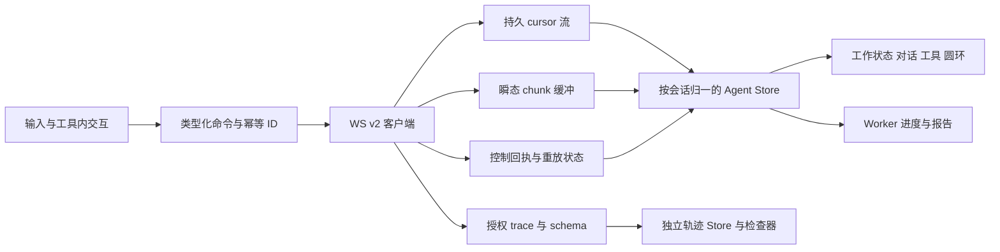

# AI 测试与评估平台 — AgentLoop 前端重写与联调计划

> 版本：V0.1 ｜ 审查日期：2026-09-09 ｜ 状态：待实施计划，尚未重写前端或新增公开接口。
>
> 基线：`deepseek-harness-py/static/index.html` 当前页面 + `ai-eval-platform/frontend/src/views/Agent.vue` 当前实现 + 已落地后端 WS v2。后端设计见 [架构设计](AI测试与评估平台-AgentLoop后端架构设计.md)，已验证范围见 [实施记录](AI测试与评估平台-AgentLoop后端实施记录.md)。
>
> 本次交付为本文与 [工具线性图标稿](assets/AI测试与评估平台-AgentLoop工具线性图标.svg)。下文“新增、删除、改造”均为后续任务；已存在的后端改动不计为本次前端交付。

## 1. 用户要求与实施口径

| 要求 | 本计划决策 | 完成标准 |
| :--- | :--- | :--- |
| Agent 工作状态保留 | 保留平台会话状态点、状态筛选、当前 Agent 状态入口；接入 v2 真实状态 | 模型、工具、等待交互、取消、离线及 Worker 状态不混淆 |
| 模型选择保留 | 保留输入栏模型下拉、ProviderLogo、协议档管理入口 | 展示实际生效模型；切换失败/协议不兼容明确提示 |
| 上下文窗口圆环保留 | 保留 ContextMeter 的圆环、比例、展开明细；替换旧引擎统计来源 | 数值来自 v2 实际请求上下文，未知显示未知 |
| 删除附件功能保留 | 保留待发送附件的移除、上传状态、拖拽和预览 | 上传中移除不会被迟到响应加回来；不发送已移除引用 |
| 确认卡删除 | 新页面移除旧独立 ConfirmCard，以及分散在聊天流中的旧审批/澄清卡形态 | 三种交互归入对应工具展开区，聊天流不再插入独立确认卡 |
| 工具卡使用源页面并优化 | 迁入源 details/summary 折叠结构、参数/结果分区；增加平台工具视图与六态 | 同名不同调用独立；参数、结果、权限、终态可准确对应 |
| 输入框优化并增加思考滑块 | 平台附件/模型/圆环 + 源 Thinking 弹层滑块、档位说明与动效 | 档位由后端能力约束，随下一次 turn.submit 显式提交 |
| 源前端全部功能 | 覆盖 §3 全量矩阵，迁移行为并适配平台身份/存储/协议 | 所有条目有验收证据；不能只迁移外观和聊天主链 |

“确认卡删除”在本计划中指**删除旧卡片 UI，不删除后端审批与业务确认流程**。源页面本身也有允许一次/拒绝/持续允许。若把这些交互一并删除，write/edit/bash 或 task.create 可能一直等待或超时。新页面采用工具内交互区，不另造同类确认卡组件，也不自动代替用户同意。

“全部功能”以源页面实际实现为准，不要求复制全部源工具、JSONL 部署、匿名 `/ws` 或单文件 DOM 架构。未注册的工具不会因新增图标就获得调用能力。平台的认证、共享会话、工作区绑定、任务报告和附件能力仍须保留。

## 2. 已核对现状与差异

### 2.1 页面基线

| 位置 | 当前事实 | 迁移影响 |
| :--- | :--- | :--- |
| 源 `static/index.html` | 1967 行，HTML/CSS/原生 JS；会话栏、对话/轨迹 Tab、输入栏、运行侧栏 | 提取行为与视觉规则，重写为 Vue 组件；不嵌 iframe 或直接复制脚本 |
| 源 `addToolCard/finishToolCard` | 参数/结果折叠；用 is_error 归成完成/失败，长成功输出可收起 | 必须扩为平台六态，不能延续二态归并 |
| 源 `reasoningFor/settleReasoning` | 思考增量展开，结束自动折叠，失败/中断不同标签 | 按 attempt 管理；保留用户手动展开选择 |
| 源 `loadUiConfig/renderEffortSlider` | 从 `/api/ui-config` 读取档位，支持滑动、滚轮、键盘和本地偏好 | 平台暂无同等模型能力响应；列为前置后端任务 |
| 源 `phaseMeta` | 68%、48%、92% 等执行能量为固定展示值 | 保留状态表达，移除假进度数值；Worker 的真实百分比继续显示 |
| 平台 `Agent.vue` | 已有状态点/筛选、模型下拉、附件、圆环、内联旧工具栈、三类旧卡 | 按职责拆出 v2 页面，旧 reducer 不扩成两套协议混杂的分支 |
| 平台 `api/ws.ts` | legacy event_id、2 秒重排窗口和旧命令 | v2 新客户端使用严格 cursor；不能继承旧超时跳号策略 |
| 平台模型选择 | `handleSelectAgentModel` 写全局 `agent_profile_id` | 当前不是会话独立模型；保留时须明确作用域，不伪装成只影响当前会话 |
| 平台圆环 | REST 历史的旧 `context_meter`，基于旧窗口/摘要/skills 口径 | 保留组件形态，不直接把旧统计当作新循环实际上下文 |
| 平台附件移除 | 移除草稿引用并释放 object URL | 这不等于物理删除上传文件，也不删除已经提交的历史附件 |

源页面核对 SHA-256：`A413AFC61C44C4C01221C3F95DADCA2A370089F3077D8DADF6E3373D89B182B9`。本次运行源 `node --test tests/trace_frontend.test.cjs`：**4 项通过**，覆盖长输出、450 条历史、时间线拖选、四步模型与三个同名工具调用。该结果只是源行为基线，不是平台前端迁移验收。

### 2.2 必须先补齐的展示契约

以下都是对当前代码的核对结果；F0 阶段先修订 API.md，再实现及测试。本文中的新字段/接口仅为建议契约，不能据此让前端直接调用不存在的接口。

| 编号 | 当前缺口 | 建议的最小后端增量 | 不补齐的后果 |
| :--- | :--- | :--- | :--- |
| B-FE01 | capabilities 目前只有 commands 与 stream_schema_version | 增加经过授权的会话 UI 元信息，候选 `GET /api/sessions/{id}/agent-ui`；提供实际 profile/model/version、默认与可选 effort、附件支持范围、tool manifest、权限、controller 状态；草稿复用相同能力解析逻辑 | 滑块只能猜档位；观察者可能看到无效控制按钮 |
| B-FE02 | 圆环仍读 legacy 历史估算 | v2 专用 context_meter，使用 request_factory 同样的历史选择/系统/工具/图文估算；包含 basis、estimated、profile_version、input_fingerprint、history_upto_seq、容量及输出预留 | UI “空间足够”而实际请求超窗；切档后数字错配 |
| B-FE03 | `tool.call` 只投影 name；`tool.result` 的 display 可为空，原始参数/结果不向普通前端开放 | 增加版本化 ToolDisplay 安全投影；至少在 call 阶段有目标摘要、参数预览，result 阶段有真实输出预览、truncated、结构化结果；关联 registry_name/wire_name；允许字段按工具白名单生成 | 源工具卡参数区为空、bash/read 结果不可见，无法声称完整迁入 |
| B-FE04 | reasoning 有授权瞬态，但普通持久 assistant.message 不携带 reasoning；现有快照也无已授权思考正文 | 提供按 reasoning ACL 裁剪的持久思考投影/历史读取；最终片段校正、失败/中断标记及撤权规则一致 | 刷新后思考消失，源思考回放功能不完整 |
| B-FE05 | semantic assistant.start 不给模型/思考配置；trace 剥离 header、system、provider_options 等 | 增加安全 request summary：模型、协议档版本、有效 effort、max_tokens、工具 schema 引用、配置指纹、usage、已知 timing；不能开放原始提示词/opaque 状态 | 模型头、当前配置、轨迹“选项/Schema/计时”页缺数据 |
| B-FE06 | 快照按组归并 messages/tools/assistants，缺统一首出现位置和完整历史交互摘要；不能只用末次 cursor 排列 | 统一模型中提供 first_cursor/source_seq、消息与 turn/attempt 的关联、三类交互历史摘要及当前控制权限；与 H 同事务授权读取 | resync 后工具跑到最终答案之后、助手消息重复、已决定交互记录丢失 |
| B-FE07 | 附件、provider 元信息在 user.message/消息快照中不完全同形；旧附件上传白名单比模型实际内联支持更宽 | 冻结 AttachmentView DTO；元信息/安全下载地址由有权限的文件接口补全；区分“可上传/可预览/可供当前模型读取” | 提交 PDF/音频后误以为模型已解析，历史附件不能预览 |

B-FE01 的模型能力必须复用 `llm/resolver.py` 与 `providers/options.py` 的真实解析，不在前端重写模型名单。DeepSeek 当前允许 off/low/medium/high/max，拒绝 xhigh；其他模型是否允许某档以实际服务端能力为准。当前后端接口枚举接受 xhigh，不意味着每个模型都支持它。

API.md §4A.4 仍有“本批不修改 main.py”的阶段性描述，与主服务已接线的现状不一致；F0 同步修正，避免前端按未接线状态设计。未经以上补齐，可以做 UI 原型和 WS 核心接线，但不能宣布“源前端全部功能完成”。

## 3. 源页面全部功能迁入矩阵

| 编号 | 源行为/定位 | 平台落点与适配要求 |
| :--- | :--- | :--- |
| S01 | 新建/列出/恢复会话、当前会话标记、时间/事件数 | 复用平台 REST、标题/删除/共享/工作区能力；事件数无契约则不编造；创建显式 v2 |
| S02 | 空白欢迎页、三张快捷提示 | 保留快捷填入并聚焦，换为平台工作区/评测任务示例；点击不自动提交 |
| S03 | WebSocket 连接指示、重试、离线错误 | 短票、退避、v2 重放；离线不是 turn 已取消或完成 |
| S04 | 文本输入自动高度、Enter/Shift+Enter、发送/停止同位置 | 平台输入框保留附件；保留 IME `isComposing`，避免中文选词误发 |
| S05 | Thinking 弹层、说明、粒子/能量轨道、离散 range | Vue ThinkingControl；支持 allowed efforts、滚轮、键盘、Escape、点外关闭 |
| S06 | 本地保存 effort，重载恢复 | 按登录成员+profile/version 存偏好；过期档位按后端默认回退并提示；不跨用户串偏好 |
| S07 | user/assistant、流式文本、最终消息校正、中断标识 | 统一时间线按 turn/attempt 排列；保留平台 Markdown/图文/复制能力；不复制源纯 textContent 降级 |
| S08 | reasoning 单独流、摘要、直播态、结束折叠、失败/中断 | ReasoningBlock；历史也可重建（B-FE04），无权限不显示内容 |
| S09 | 多 step、多 attempt、重试等待和具体失败原因 | 不把 retry 当 turn 结束；错误来自安全 code/message，不能展示 SDK 原始异常 |
| S10 | 工具折叠头、参数区、输出区、长结果收起 | ToolRunCard，以源结构为基线，完善六态与 ToolDisplay（§6） |
| S11 | 允许一次/拒绝/持续允许、提交中、超时/取消等 | 工具内交互区，按现有 nonce/身份/TTL 提交；源缺的安全字段必须补齐 |
| S12 | 当前运行状态、活动事件、provider/model/effort/session | 复用平台工作状态入口；增加运行侧栏信息，最多展示最近活动并可进入完整轨迹 |
| S13 | 对话/轨迹 Tab 切换、事件数、分类搜索 | TraceWorkspace；all/lifecycle/model/tool/approval + 平台 question/task 分类 |
| S14 | 语义行与原始记录关联、调用链导航 | 同一语义行可以关联多个 transport/source 层；不重复显示 call/result 为两个独立调用 |
| S15 | 概览、预览、原始内容、参数、结果、选项、用量、来源 | 保留检查器入口；只展示授权数据；原始内容更名“已授权内容”，空值解释缺失原因 |
| S16 | 事件 Schema、工具 Schema、引用/必填/敏感路径、未知 schema | 使用 schema.catalog、缓存 ETag、完整引用解析；未知字段保留但不执行；不从单个样本猜必填 |
| S17 | JSON 树展开、数据包查看、复制脱敏包 | 只复制后端允许且前端再次脱敏的包，不复制 nonce/token/完整请求头 |
| S18 | 时间线/瀑布、点击定位、拖选范围、双击/右键/Escape 清选择 | 迁入选区行为；增加键盘等价操作；排序轴与真实耗时轴标注清楚 |
| S19 | TTFT、持续时长、usage、关联请求头 | 有证据才展示；首 chunk 丢失标为“首次观测”，不当真实 TTFT；无服务端时间不推算历史耗时 |
| S20 | 历史与实时去重、长诊断流有界但业务事实不丢 | 迁移源测试四类不变量；持久行分页/虚拟化，瞬态缓冲独立，不能把 320 当业务历史上限 |
| S21 | 窄屏会话/运行侧栏、遮罩关闭、Escape、轨迹详情 | 平台响应式壳复用，移动端详情变单层抽屉，输入栏不被键盘遮挡 |
| S22 | max_tokens/max_steps/cancelled/interrupted/error 提示 | 区分输出上限、步数上限、取消与失败；`turn.end` 才释放本轮忙碌状态 |

S01–S22 全部为本次前端目标。权限导致的内容不可见属于有提示的授权行为；不能把未实现功能仅隐藏按钮后记作迁移完成。

## 4. 页面结构与组件取舍

```text
平台主导航（保留）
└─ AgentWorkspace
   ├─ 会话栏：新建 / 状态筛选 / 共享标识 / 工作区 / 删除
   ├─ 顶部：会话标题 / 工作区 / Agent 工作状态 / 连接状态
   ├─ 对话 | 轨迹
   │  ├─ 对话：用户消息 → 思考块 → 工具折叠行（含交互）→ 后续模型输出
   │  └─ 轨迹：筛选搜索 → 时间线 → 语义事件列表 + 详情检查器
   ├─ 输入区
   │  ├─ 待发送附件与移除
   │  ├─ 附件按钮 + 自动高度文本框
   │  └─ 模型选择 | Thinking 滑块入口 | 上下文圆环        发送/停止
   └─ 运行侧栏：当前阶段 / step / 最近活动 / 有效模型配置 / Worker 任务
```

| 现有组件/区域 | 处置 |
| :--- | :--- |
| 平台主导航、会话列表/管理、工作区绑定 | 保留样式与业务行为，提取必要组件，不改其他业务页 |
| 工作状态点、筛选、当前状态、连接提示 | 保留；状态计算替换为新 store selector，不与旧 isGenerating 混用 |
| ProviderLogo 与模型下拉 | 保留；抽出 ModelSelector，明确“平台默认模型”的现有全局语义 |
| ContextMeter.vue | 保留圆环和展开体验；更新 DTO，系统/工具/附件等明细按实有展示；不显示虚构 Skills 消耗 |
| AttachmentPreview.vue、附件预览弹层 | 保留；移除按钮换同套 Close 线性图标，补上传竞争与权限处理 |
| MarkdownView.vue、StructuredDataView.vue、MediaPreview.vue | 保留渲染与安全边界，用于助手和适配后的工具结果 |
| ProgressDock.vue、ReportCard.vue | 保留 Worker 业务能力；Agent turn 结束不影响后台评测展示 |
| ConfirmCard.vue 与旧 confirm 表单/乐观盖章逻辑 | 新路径删除依赖和独立渲染；task.create 在工具内显示冻结摘要并确认/拒绝 |
| ApprovalCard.vue、ClarifyCard.vue | 复用必要的纯问答校验思路，替换独立卡片 UI 为工具内交互区 |
| Agent.vue 内旧 toolItems / done-error 卡栈 | 替换为源风格 ToolRunCard 与按身份归一的数据模型 |
| 源独立运行“能量百分比” | 不复制假百分比；可保留装饰性呼吸光，但需 `aria-hidden` |
| 源 HTML 脚本与匿名 WS 客户端 | 不迁入生产目录；行为拆分为 Vue + TypeScript + v2 客户端 |

模型选择先保留当前全局设置机制：仅有设置权限者可修改，活动回合配置冻结，切换显示“下一轮生效”；其他成员/页面造成的全局修改必须重新读取实际配置。前端单独禁用按钮不能消除多用户竞争，B-FE01/B-FE05 需返回有效配置版本。若以后要改为会话独立选模，应另行增加服务端选择/授权契约，本计划不偷偷往 turn.submit 塞未经登记的 profile_id。

legacy 会话仍使用独立 legacy transport。新视图不再呈现旧 ConfirmCard；旧历史确认转换为只读工具/交互摘要，未完成旧交互仍通过对应旧命令适配，不能发 v2 nonce 命令。旧卡文件仅在全部引用替换、历史和待处理交互回归通过后删除；不删除仍被其他业务页使用的共享组件。

## 5. 状态、输入框与思考滑块

### 5.1 状态必须分四层

| 层 | 建议状态 | 权威与展示 |
| :--- | :--- | :--- |
| 连接 | connecting/online/reconnecting/offline/revoked | WS 生命周期；不决定业务是否成功 |
| Agent turn | idle/submitting/running/waiting_interaction/cancelling/completed/failed/interrupted | 提交回执、持久事件、授权快照；运行子阶段为 model/thinking/answering/tools/retry_wait |
| 工具 | pending/waiting_approval/running + 六种终态 | call、交互、dispatch、result；见 §6 |
| Worker | queued/running/awaiting_case_confirm/succeeded/failed/cancelled | task.* 与任务接口；不由 Agent 发送按钮直接取消 |

`assistant.end` 只结束一次 attempt，不关闭整个回合；`command.accepted` 只代表受理。无终态而断线时显示“连接中断，状态待同步”，重连后取事实，不能写本地 cancelled。工具 outcome_unknown 即使 turn 已结束仍保留“结果未知/范围受限”。

平台原有切换会话后继续后台生成的体验应保留：每个仍由本页控制且运行中的会话保有自己的连接；切页仅切视图，不能顺手 unsubscribe 控制连接，因为当前后端 detach 会取消控制者回合。闲置连接可释放。观察会话一条连接即可；页面关闭导致实际控制连接断开时遵守现有取消语义，不承诺浏览器关闭后仍继续。

### 5.2 输入框约束

- 保留附件位于文本上方、底栏模型与圆环；Thinking 置于模型与圆环之间。窄屏允许底栏折行，发送按钮始终可达。
- 文本自动增高至约 168–200px 后内部滚动；中文输入法确认不发送，Enter 发送，Shift+Enter 换行。
- 发送时冻结正文、附件 IDs、effort、client_message_id、request_id；迟到上传不能改动已提交负载。
- 受理前保留可恢复草稿；accepted 后转为已提交，user.message 用 client_message_id 合并乐观条目。连接断开不换 ID 盲重发。
- 回合运行中可以编辑下一轮草稿和附件，发送位置显示停止；不暗中实现源尚无的 steer/inject 或自动队列。
- 移除上传中附件先标记 tombstone，并取消请求（可用时）；迟到成功只做资源清理，不重新加入草稿。释放 object URL；不自动调用不存在的文件删除接口。
- 上传支持列表与模型可消费列表分开。仅附件提交是否允许以 B-FE07 定稿为准；后端要求 content 时提供明确交互，不能前端伪造用户指令。

### 5.3 ThinkingControl

1. 迁入源按钮→弹层→档位标题/模型/说明→离散滑块；off 为关闭，low/medium/high/max 保留中文说明；xhigh 仅在后端声明时增加。
2. 按 allowed efforts 构建刻度，禁止固定 5 格；0 档显示不可用说明，1 档显示固定值。指针拖动、键盘箭头/Home/End、焦点内滚轮具有一致结果。
3. 滚轮仅在控件有焦点或弹层打开时改变档位，避免用户滚动页面意外改配置；Escape 关闭并返回触发器，点外关闭。
4. 保留最大档视觉强调；`prefers-reduced-motion` 关闭粒子/循环光效，不影响功能。提供 `aria-valuetext`，不能只依赖颜色。
5. 更换模型后重新读取能力；不支持当前档时回到服务端默认并显示一次明确提示。活跃 attempt 的实际 effort 不随滑块移动改变。
6. slider 控制思考强度；reasoning 展开控制展示，两者独立。关闭展示不等于不请求思考。

## 6. 工具卡、兼容与线性图标

### 6.1 ToolRunCard 结构与交互

```text
[工具线性图标] 读取文件       src/app.py:1–80      [已完成]  120ms   [展开]
  参数摘要       文件、起始行、范围（来自安全展示 DTO）
  交互区         仅有待处理授权/问题/任务确认时显示
  执行结果       文本 / 表格 / diff / 链接 / 任务收据
  展示说明       已截断、未提供、受限、来自恢复补偿
```

- 基于源 `<details>/<summary>` 折叠语义实现键盘可操作控件；小结果完成后保持摘要，大结果默认折叠，用户手动展开不被后续 chunk 强制关闭。
- 正文、思考、工具按首次事实顺序排在同一回合中，不能把所有工具集中放在最终回答之后。
- 同一个工具调用只建一张卡；身份至少为 session_id+turn_id+attempt_id+call_id。不可仅用 name/call_id 全局去重。
- pending 表示模型已声明、未派发；审批时显示等待授权，dispatch 后才显示运行。普通失败继续兄弟调用，前端不能把工具组全染为失败。
- 六态中文：succeeded=已完成，failed=失败，denied=已拒绝，cancelled=已取消，not_started=未启动，outcome_unknown=结果未知。synthetic 另标“恢复补偿”，不改变原终态。
- 结果先到或快照缺 call 时建立占位卡并补齐，不丢弃结果。通用 runtime.error 不伪造每个调用的 failed 结果；等待权威结算或恢复。
- duration/exit_code 仅有后端证据才显示。HTTP 超时不是进程已停止；未知执行不得给“重试同一调用/强制解锁”按钮。

### 6.2 ToolDisplay 建议契约（待 B-FE03 落地）

建议 `display.version=1`，字段为 `title,target,summary,arguments_preview,result_preview,format,truncated,unavailable_reason,links`，并按工具提供受控 `structured`。所有字段均可缺省；明确区分未提供、权限受限、空输出和已截断。服务端生成展示参数，前端不从模型正文反向解析 JSON，也不把 trace 的授权权限作为普通工具卡必备条件。

`format` 仅选择 text/json/table/diff/links/task 等本地 renderer；链接只接受通过校验的 http(s) 或平台相对路由，禁止 javascript/file URL。HTML 作为文本或经过既有安全渲染；SVG 不作为外部可执行工具结果内嵌。原始大结果若没有授权详情接口，则只显示截断状态，不能提供失效的“查看完整内容”。

### 6.3 当前工具与图标映射

图标均为本地 24×24 SVG，`fill=none`、`stroke=currentColor`、线宽 1.75、圆角端点。工具图标表达类型，另一个状态标记表达六态，不用同一图标同时表示成功/失败。附图 SVG 内提供可复用 symbol ID；实施时提取到 `ToolIcon.vue` 静态路径表，不加载任意外部图标 URL，也不增加图标库依赖。

| 平台工具 / wire name | 图标 symbol | 工具结果优化与字段兼容 |
| :--- | :--- | :--- |
| read | file-read | 相对路径、行范围、文本/Markdown/结构化预览；源 file_path/offset 与平台字段按后端 codec，前端不自行做 0/1-based 换算 |
| write | file-write | 文件路径、创建/覆盖语义、真实写入摘要；没有原始文本不伪造 diff |
| edit | file-edit | 目标、替换摘要；仅后端提供有效前后片段时展示 diff；空替换是删除，不能显示参数缺失 |
| bash | terminal | 安全命令预览、输出、退出码、取消/未知状态；不显示宿主绝对路径和 cgroup 内部细节 |
| web_search | search-web | 搜索词、来源标题/域名、摘要与结果链接；无真实结果不填演示数据 |
| web_fetch | globe | URL/站点标题、正文摘要、截断和类型；保留 StructuredDataView/MarkdownView 的可用渲染 |
| ask_user_question | message-question | 单选/多选/文本问题嵌于展开区；答案提交后只读回显，不变成普通助手正文 |
| task.create / platform_task_create | task-add | 冻结 spec 摘要→工具内确认→真实 queued/task_id 收据；工具完成不等于评测完成 |
| task.status / platform_task_status | list-check | 真实任务状态、阶段、报告入口；引用 Task DTO，不另造成功状态 |
| task.cancel / platform_task_cancel | circle-stop | 区分取消请求与持久 task.end(cancelled)；与 Agent turn.cancel 分离 |

精确映射已登记的 wire 名称，禁止对任意 `platform_` 字符串盲目反推权限或调用工具。

### 6.4 源工具/历史/扩展兼容

| 名称 | 图标 | 范围 |
| :--- | :--- | :--- |
| list_dir | folder-tree | 源历史展示目录列表；当前新桥未装配，不能出现在可调用工具清单 |
| glob | files-search | 源历史展示匹配文件列表；不能误映射成互联网 web_search |
| grep | text-search | 源历史展示路径/行号/匹配文本；同上，未注册就不执行 |
| str_replace_editor | code-edit | 按 command 展示 view/create/replace 等摘要；不把复合编辑器直接当平台 edit 执行 |
| pwsh | terminal | 源 Windows 历史可识别；不将 PowerShell 命令默默改成 Linux bash |
| 已授权 MCP 工具 | plug | 只按服务端 manifest 展示；无专用 renderer 用通用 JSON/文本 |
| 未知工具 | wrench | 原名、安全参数/结果、真实状态完整保留，不能渲染失败或白屏 |

这些兼容是**前端展示兼容**。不要求后端额外迁入源全部工具，不允许前端越过后端白名单补执行。

### 6.5 删除独立确认卡后的完整交互

| 交互 | 展开区内容 | 提交与最终状态 |
| :--- | :--- | :--- |
| approval.requested | 操作对象与安全参数、允许一次/拒绝/本连接持续允许 | `approval.respond` 携带完整身份和 nonce；accepted 后仍等待 approval.resolved/tool.result |
| question.requested | 问题、选项、多选/文本输入 | `question.respond` 的 answers 严格用 question_id/answer；UI 的选项 ID/多选值与后端 validate_answers 做 fixture 往返，不凭逗号文本猜格式 |
| task_confirmation.requested | 只读冻结任务摘要、确认执行/拒绝 | `task_confirmation.respond` 携带 spec_hash；不提供旧卡直接改 TaskSpec 表单，规格改变须重新请求并重新确认 |

点击后置 submitting，失败恢复到仍可操作的权威状态；TTL 到期、本轮取消、resolved 或被撤权后按钮失效。nonce/spec_hash 只在内存命令上下文使用，不进调试复制/持久本地缓存。restricted 占位仍消费 cursor；观察者只能看允许的摘要。一次业务操作若后端同时发工具许可与任务规格确认，按各自身份顺序呈现，不能一键替两个决定；是否减少重复询问由后端契约审查决定。

## 7. WS v2、Store 与轨迹数据流

### 7.1 传输层与归一模型

建议新增 `api/agentLoopWs.ts` 和 `api/agentLoopTypes.ts`；保留现有 `api/ws.ts` 供 legacy。类型以已落地 `routers/ws_v2.py`、`agent/events.py` 与 API.md 为准。



Store 至少分为 session、turn、attempt、toolCalls、interactions、tasks、executions、drafts。UI 展开/选区状态与业务事实分离；稳定身份键保存，不能每个 chunk 重建全部组件。持久 cursor、trace seq、chunk_index 是三套游标，不得共用。

### 7.2 建连、重放与快照

1. 认证换短票，按 session.engine_version 选择协议。hello/capabilities 验证版本；未知版本明确失败，不试发 legacy 帧碰运气。
2. 首次无本地状态时 `subscribe(after_cursor=0)` 重放现有持久记录。正常 subscribed 只有 H，**当前并不总是返回 snapshot**；不能等待一个不存在的快照字段。
3. 有内存状态且对应 cursor 时，重放 `(lastAppliedCursor,H]`；只在 reducer 成功后推进 lastAppliedCursor，不在收到帧时抢先推进。
4. 缺口停止推进并重新同步；不能用旧重排超时跳过丢失 cursor。重复 cursor 丢弃但不丢关联 trace。
5. `resync.required` 带 H 对应 snapshot，原子替换会话读模型，再 subscribe(H)。严禁同时从 REST messages 和 snapshot/replay 重复追加用户/助手消息。
6. 若刷新只保存了 cursor 却没有对应 UI 快照，必须从 0 或服务端授权快照重建，不能拿空 store 订阅“最新游标”。
7. 瞬态按 session/turn/attempt/channel/chunk_index 去重；assistant.message 最终校正正文；持久结束之后到达的旧 chunk 不再追加。快照不保留未提交前缀时如实重置。
8. request_id 重发使用同一冻结负载；同一内容换 ID 视为新请求，不能擅自重复。审批重发仍由服务器校验 nonce，不可因客户端 timeout 判断操作未执行。
9. 4401 重新领票，4404 清除该会话敏感缓存并返回列表，4408 退避重连/按游标恢复，1013 显示服务未就绪。错误信息脱敏。
10. 浏览器重连不自动取得控制权；使用 B-FE01 权限/控制信息。切换会话与 detach 策略按 §5.1，不因 UI 隐藏取消后台回合。

### 7.3 事件到视图的责任

| v2 类型 | reducer 行为 |
| :--- | :--- |
| user.message / turn.start | 合并乐观输入；开始有身份的回合 |
| step.start/end | 维护步骤和用量；不是整个回合完成 |
| assistant.start/text.delta/reasoning.delta/message/end/retry | 按 attempt 流式合并、最终校正、重试/失败标记 |
| tool.call/dispatch/result | 建卡、标记派发、六态结算；不从 finish_reason 猜工具结果 |
| approval/question/task_confirmation requested/resolved | 更新目标工具内交互，按授权和终态启停动作 |
| execution.quarantined/reconciled | 展示范围受限/已对账状态，不改写历史 outcome_unknown |
| task.queued/progress/report/end | 更新 Worker 任务字典和报告/进度组件；100% progress 或 report 单独到达不擅自判成功 |
| context.trimmed / session.updated | 提示上下文变化并刷新对应统计；更新标题/元信息 |
| runtime.error / turn.end | 安全提示错误；仅权威回合终态统一收尾 |
| command.accepted/rejected | 命令状态，不作为模型/工具终态 |

### 7.4 轨迹检查器

- 显式 trace.subscribe，允许被拒绝；普通对话和工具卡不依赖 trace 权限。trace.event 按 source seq 从 0 起处理，after_seq 初值 -1。
- 源下划线 transport 名通过独立适配映射到点号 v2，保留真实 source type（如 tool/call）；不把 source seq 解释成 semantic cursor。
- 业务行、transport 层、原始授权事件分开索引。关联链包含 turn→step→attempt→tool→interaction/result；首次记录和选择状态不会被 1000 个 chunk 冲掉。
- Schema 页面读取 catalog 中的 dialect/ref/version/required/sensitive_paths；无 catalog 显示未提供，未知 schema 显示未知。工具 schema 只能来自后端批准的 manifest/request summary。
- 对话和轨迹各自做虚拟滚动/分页；瞬态诊断环形缓冲可取源约 320 条起点，必须另保留首个观测时点与聚合量；持久业务记录不按此阈值删除。
- 时间线点击、拖选、清选以及键盘等价操作均保留；计算耗时优先服务端单一时基。浏览器接收时间与持久 ts 不相减冒充 TTFT。
- “参数/结果/选项/数据包”只显示授权字段。源直接展示完整 request/header 的方式不迁入；B-FE05 提供安全摘要，system/opaque/provider 原始状态明确显示不可公开。

## 8. 文件拆分与实施阶段

### 8.1 目标文件（计划新增，不代表当前存在）

```text
frontend/src/
  views/Agent.vue                       # 路由壳与引擎分流，逐步剥离旧巨型逻辑
  agent/loop/
    store.ts                           # 会话归一状态与选择器
    reducer.ts                         # 持久事实、快照、瞬态归并的纯函数
    trace.ts                           # 轨迹语义行、关联索引、时间线
    toolPresentation.ts                # 工具展示 DTO/已登记别名映射
  api/agentLoopWs.ts                    # v2、重连、命令、cursor
  api/agentLoopTypes.ts                 # 与定稿契约一致的联合类型
  components/agent/loop/
    AgentWorkspace.vue                 # 对话/轨迹与运行侧栏装配
    AgentStatus.vue                     # 复用平台工作状态视觉
    AgentComposer.vue                  # 附件、模型、思考、圆环、发送
    ModelSelector.vue / ThinkingControl.vue
    ConversationTimeline.vue / ReasoningBlock.vue
    ToolRunCard.vue / ToolInteraction.vue / ToolIcon.vue
    TraceWorkspace.vue / TraceInspector.vue / TraceTimeline.vue
    RuntimeInspector.vue
```

仅在职责独立时拆分；文字预览、表格、媒体继续用已有组件，不为每个工具建一套重复卡片。建议补前端单测与浏览器 E2E 工具（在 F0 选择并锁定兼容版本），当前 package.json 只有 typecheck/build，不能假设测试框架已安装。

### 8.2 阶段、依赖与退出条件

| 阶段 | 交付 | 验证/退出条件 |
| :--- | :--- | :--- |
| F0 契约与基线 | S01–S22 编号、B-FE01–07 定稿/API 修订、测试夹具与工具展示 schema | 每个可见功能均有真实数据来源；无“前端暂时猜字段” |
| F1 v2 数据层 | types、transport、纯 reducer、快照、去重、会话连接生命周期 | 重复/缺口/断线/重放/错版本/受限占位测试通过 |
| F2 页面骨架与保留组件 | 平台壳、工作状态、模型、圆环、附件、Thinking | 桌面/窄屏与键盘完整可用；有效模型与 effort 对应 |
| F3 对话与工具闭环 | 思考/正文/多步时间线、源风格工具卡、线性图标、工具内三类交互 | 真实临时文件 read→edit→read→答复 + 第二轮 + 拒绝/取消通过 |
| F4 平台业务兼容 | task.create/status/cancel、web 工具、报告/进度、legacy 展示转换 | 任务只入队一次，报告与取消如实；旧独立确认卡不再出现 |
| F5 完整轨迹工作台 | 所有筛选/检查器/Schema/JSON 树/复制/拖选/timing/关联 | 源四组回归迁移并通过，长流不丢业务行，未授权字段不泄漏 |
| F6 联合验收 | 真实 SDK/PG/WS 浏览器联调、真实供应商、Linux Runner、权限/故障 | §9 矩阵全项有证据；条件未满足的不得记通过 |
| F7 切换与清理 | 新会话灰度、旧会话可读/可结算、旧引用与文件清理 | 无旧卡引用与死代码、回滚保留 v2 reader 和 guard；再开启默认 v2 |

关键路径：F0→F1→F2/F3→F4/F5→F6→F7。组件原型可与契约讨论并行，但数据层和后端展示缺口未闭环前不能提前扩大灰度。

## 9. 联调验收矩阵

| 编号 | 用例 | 必须观察到的结果 |
| :--- | :--- | :--- |
| V01 | v2 创建、打开 legacy、flag 关闭、错误 endpoint | 引擎固定、正确 transport；不自动把旧会话迁成新历史 |
| V02 | 同一 submit 重发、掉线未收到 accepted、负载改变复用 ID | 一条用户事实/一轮执行；不同摘要拒绝，草稿可恢复 |
| V03 | 四步模型、三个同名工具、第二轮历史 | 顺序正确且各调用独立；工具结果真实回填再调用模型 |
| V04 | read/edit/read + 参数别名、行范围、空替换 | 文件实际变化与卡片一致，不做错误的行号/命令转换 |
| V05 | allow/deny/always/超时/双击/断连/换成员 | 工具内交互、幂等回执、不重复执行；always 不越身份或连接生命周期 |
| V06 | 单选、多选、文本与非法答案、迟到响应 | 问答 DTO 往返正确，已失效问题不可再次提交 |
| V07 | task.create 确认/拒绝/规格变化/恢复 | 没有独立确认卡；绑定真实 spec_hash，只产生一项任务 |
| V08 | 六态 + synthetic + 同组普通失败 | 各态独立，兄弟结果保留；unknown 不伪装取消，不出现强制重试 |
| V09 | 模型流/审批中/bash 中停止，取消回执迟到 | 显示取消中直至 turn.end；Worker 不受 Agent 停止误伤 |
| V10 | Worker 进度 100%、报告先到、失败、取消与重开 | 以 task.end/任务事实为终态；报告可打开且不重复 |
| V11 | reasoning 交错、结束折叠、失败/截断/刷新 | attempt 隔离、最终内容校正、历史思考按授权恢复 |
| V12 | effort off/各档、仅一档/未知模型、切模型、热键/滚轮 | 提交值是合法档位；实际请求与 UI 一致，偏好不会跨账号串用 |
| V13 | 圆环近阈值、裁剪、换模型、图片输入、未知 usage | 与同一请求统计一致，估算有标记；未知不显示 0 或假精度 |
| V14 | 上传失败/上传中移除/迟到上传/重连重发/附件独立草稿 | 删除引用不复活、资源释放，历史预览有效；权限拒绝清缓存 |
| V15 | cursor 重复、缺口、过期、超水位、resync | 快照在 H 原子替换，>H 正确续接；消息和工具不重复/不乱序 |
| V16 | semantic 与 trace 同一事实、seq=0、不同会话并发 | 双游标分离，不能只按 call_id 或工具名合并 |
| V17 | 1000 chunks、450+ 历史、四个 attempt、缓冲裁剪 | 源回归不变量保持；选中行/关联链/首次观测不丢 |
| V18 | trace 分类/搜索/12 类详情/JSON 树/复制/时间线拖选 | 每个入口可用；无资料显示原因；复制内容安全；触屏/键盘可达 |
| V19 | trace 被拒、reasoning 撤权、交互 restricted、成员禁用 | 对话独立工作或按权限关闭；隐藏内容不残留在缓存/复制 |
| V20 | 切去别的会话再回来、关闭观察连接、关闭控制连接 | 后台运行与控制权行为符合 §5.1，不因普通切页误取消 |
| V21 | 375/768/1440px、200% 缩放、中文输入法、减少动效 | 没有横向页面溢出；滑块/附件/发送可操作、焦点可返回 |
| V22 | DeepSeek/OpenAI Chat/Responses/Anthropic 实际协议档 | 真实多步工具闭环；图文、思考、usage 和必要协议续接无退化 |
| V23 | Linux Runner 失联后仍在运行、重启、另一会话同 scope | unknown 与隔离持续显示；无误放行；可信对账后才解除提示 |
| V24 | legacy 历史和待处理三类交互、切换灰度/回滚 | 旧卡 UI 消失但历史/必要操作仍可用；新会话事实与 reader 不丢 |

测试分层：纯 reducer/展示 codec 单测→真实 SDK 响应夹具→真实 PG+WS+临时文件→浏览器 E2E→真实供应商/Linux 验收。mock 工具返回、静态截图、typecheck 或构建成功均不能独立证明整轮闭环。

建议性能验收数据集固定为 450 条持久事件、1000 个瞬态 chunk、4 个模型 step、3 个同名工具调用。记录浏览器/机器/耗时与内存，不预先编造毫秒性能承诺；只渲染可视行，增量批次合并，Markdown 不逐字符重解析，追踪侧栏按需装载。

## 10. 发布条件与本次文件清单

- 上线前同时满足：B-FE01–07 完成，S01–S22/V01–V24 有证据，关键浏览器 E2E 通过，后端真实服务验收完成。未满足时保持试验入口和默认关闭状态。
- 回滚先停止新 v2 会话放行；现有 v2 仍保留阅读、取消/结算和必要交互入口。不能回退到不识别 engine_version、绕过 guard 的旧组合。
- 前端仅持有展示与临时草稿；不在 localStorage 保存原始 trace/nonce/请求头/模型历史；退出登录清理该用户的敏感缓存与连接。

### 本次修改代码文件与作用清单

本次未修改前后端代码、公开 API、依赖或部署配置，仅新增：

| 文件 | 作用 |
| :--- | :--- |
| `docs/AI测试与评估平台-AgentLoop前端重写与联调计划.md` | 组件取舍、源功能矩阵、后端前置、工具/图标、WS/store、阶段和验收 |
| `docs/assets/AI测试与评估平台-AgentLoop工具线性图标.svg` | 16 种本地线性图标 symbol 和预览；是设计资产，不代表工具已注册 |

### 主要源码依据

- [源页面](../../deepseek-harness-py/static/index.html)：`addToolCard`、`reasoningFor`、`loadUiConfig`、`renderTraceInspector`、`renderTraceWaterfall`、`renderSessions`。
- [源轨迹回归](../../deepseek-harness-py/tests/trace_frontend.test.cjs)：本次执行 4 项通过。
- [平台 Agent 页面](../frontend/src/views/Agent.vue)、[ContextMeter](../frontend/src/components/agent/ContextMeter.vue)、[附件预览](../frontend/src/components/agent/AttachmentPreview.vue)、[旧 WS](../frontend/src/api/ws.ts)。
- [v2 WS](../backend/api/app/routers/ws_v2.py)、[事件投影](../backend/api/app/agent/events.py)、[会话接线](../backend/api/app/agent/loop_service.py)、[事实快照](../backend/api/app/harness/memory/agent_events.py)。
- [工具桥](../backend/api/app/harness/execution/loop_bridge.py)、[模型选项](../backend/api/app/llm/providers/options.py)、[API 契约 §4A](AI测试与评估平台-API.md#4a-agent-loop-websocket-v2v1772026-09-09)。
