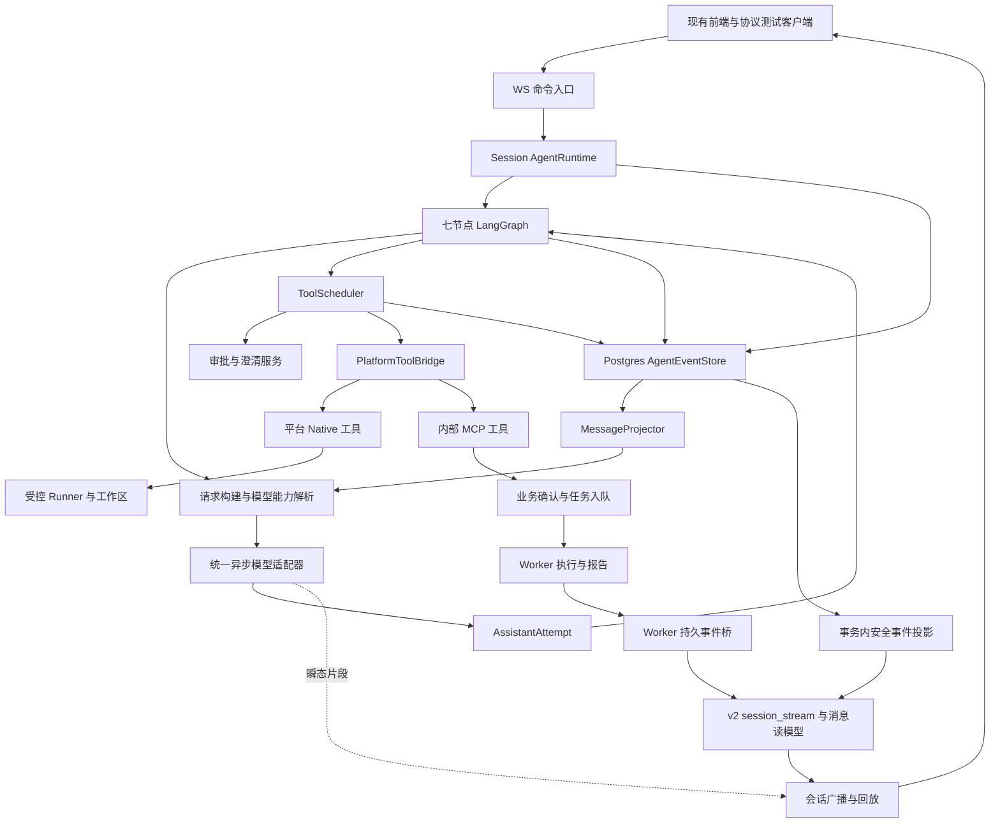
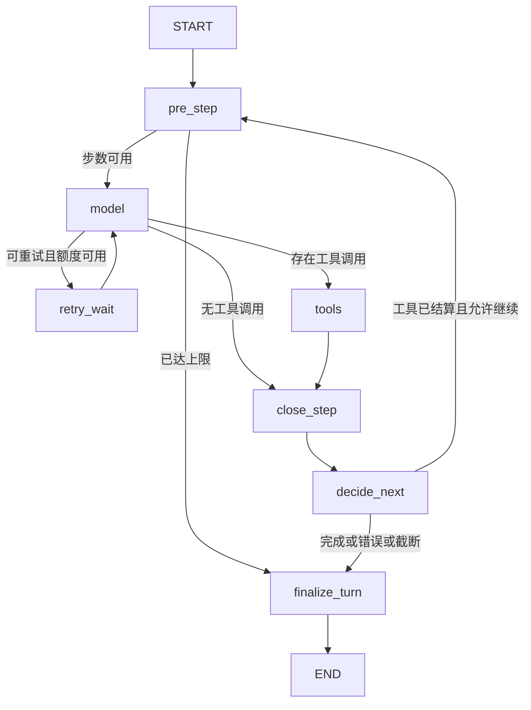

# AI 测试与评估平台 — Agent Loop 后端架构设计

> 版本：V0.4 ｜ 日期：2026-09-09 ｜ 状态：后端实现及本地回归完成；生产灰度、真实供应商与 Linux 执行尚待验收。
>
> 用户目标：完整采用 `deepseek-harness-py` 当前已实现的 Agent Loop 及其运行时、模型适配、消息、事件、审批、取消和恢复能力；工具复用平台现有实现，重写字段与接缝并完成兼容联调。核心验收是模型—工具—结果回填—再次模型调用的完整循环。
>
> V0.1–V0.3 为架构审查阶段。V0.4 已按用户授权实现后端代码、API v2 契约和 Alembic 迁移；前端改造留待后续要求。下文保留完整目标与验收标准，实际文件、启用步骤和验证边界见文末及《AgentLoop后端实施记录》，不能将验收矩阵视为全部验收通过。
>
> V0.2 修订：按审查修复四项问题——WS 改为独立 v2 协议与会话事件流；补齐供应商内容块/协议状态的采集、持久化和回传；分离回合结算与工作区执行隔离；区分普通工具失败、取消、禁止派发和调度基础设施异常。同步架构图、存储、阶段与验收矩阵。
>
> V0.3 修订：补充 LLM 调用层重写依据、源/平台字段映射、模型—工具—WS 全链路职责、中间层保留/替换/不迁入建议和删除前提；修正当前源工作区 DeepSeek medium 的透传行为，增加 A23–A26 兼容验收。仅进行了源码审查、隔离字段转换探针和文档校验，未调用真实模型。
>
> V0.4 修订：新 Agent 路径接入七节点循环、三协议异步适配、平台工具桥、PG 事实与会话投影、WS v2 和带终止证据的 Runner 客户端；旧网关和业务 Worker 保留。新增 `engine_version` 隔离路径与默认关闭的 `AGENT_LOOP_ENABLED`。补齐按实际裁剪消息索引重建请求、跨引擎工作区隔离、事务内回执和恢复语义。

## 1. 范围与设计基线

### 1.1 “全部功能”的边界

“全部”以源项目当前 Python 实现为准，覆盖下列能力，不以早期设计稿中的未来规划为准：

- 会话拥有运行时、单会话活动回合互斥、控制连接所有权、应用关闭清理。
- LangGraph 七节点 Agent Loop、多 step、每 step 多 attempt、步数上限。
- 原生工具声明、流式工具参数拼接、参数验证、工具执行与消息回填。
- 正文与 reasoning 分流、usage、finish reason、失败 attempt 和取消正文前缀。
- 有界滚动并行工具池、独占屏障、按模型顺序提交结果。
- 审批允许、拒绝、会话运行时内持续允许、超时和断连结算。
- 请求头、指纹和历史前缀追踪；从持久事件推导模型消息。
- 取消、未启动调用结算、已派发但结果未知结算、重启后继续对话。
- 语义事件、原始轨迹投影、瞬态 chunk、事件 schema catalog、版本和传输脱敏。
- DeepSeek/OpenAI Chat Completions 与 Anthropic Messages 异步适配及错误分类。

源项目尚未实现的 inbox、steer/inject、Plan-and-Execute、Reflection、自动截断续写、跨进程接力执行，不计入“源功能完整迁入”。平台已有的 Workflow 和 Reflection 单独处理其兼容边界，不能把它们误称为源项目功能。

不要求复制源项目所有工具、独立静态页面、`/ws` 路径或 JSONL/SQLite 部署形态。持久事实与可重建历史的语义完整迁入，生产存储落在平台 PostgreSQL 中。

### 1.2 本轮核对基线

| 项目 | 核对基线 | 使用方式 |
| :--- | :--- | :--- |
| deepseek-harness-py | HEAD `2b5eed88cee71a45d039ca81e6f5b9a649d09806`，含当前未提交修改 | 以工作区实际源码为功能基线；不是仅迁移该 commit |
| ai-eval-platform | 本轮初检为 `main / 6c21e0f`，存在未跟踪 `.claude/` | 仅核对当前本地代码；不等同于生产状态 |
| 源项目文档 | agent-loop-architecture、tool-catalog、event-stream-capability-plan | 用于定位；已实现状态以源码核对为准 |
| 平台文档 | API、Agent 原生工具装配、工作区与沙箱、混合驱动引擎 | 记录现有契约与过渡点，旧方案中的历史限制不直接代替本次目标 |

源项目当前未提交文件包括 runtime、LLM base、OpenAI/Anthropic 适配器及相关测试、README 和配置示例。实施开始前应固定迁入快照并记录 commit 或文件哈希，避免并行修改期间的半套迁入。本文不沿用源文档中“无 Git 仓库”或历史测试数量作为当前事实。

### 1.3 现有平台的真实衔接点

1. `agent/graph.py` 默认是纯对话；开启混合引擎后是 Router → direct/chat/Workflow/TAOR，TAOR 带 plan/discover/orchestrator/tools/reflect。
2. API 的 `llm/gateway.py` 经 `adapters.py` 已接 OpenAI/Anthropic SDK，支持 Chat Completions、Responses、Anthropic Messages；SDK 接口主要是同步调用，并非尚未接入 SDK。
3. `ToolRegistry`、Native/MCP、参数与权限检查、沙箱和 Worker 入队已经存在。
4. `NativeToolResultStore` 主要保存进程内工具正文；`ws_events` 的安全投影不能直接充当完整模型历史。
5. 平台当前事件词汇是 `event.v5`；旧文档中 v4、纯对话冻结、原生工具未接线等表述需要区分历史阶段。
6. 平台 shell 通过 runner/bwrap 执行；现有 HTTP 调用中断并不等价于已终止 runner 内进程。

## 2. 关键架构决策

| 编号 | 决策 | 目的与取舍 |
| :--- | :--- | :--- |
| D1 | 新 Agent 路径使用源项目七节点循环作为唯一模型/工具循环 | 不在旧 orchestrator 内再嵌套一套 loop；控制流、重试和终态只有一个所有者 |
| D2 | Runtime 属于 session，WS 是命令与订阅入口 | 断连、重复连接、发送失败不改变已提交事实 |
| D3 | PostgreSQL 保存规范 Agent 事实，JSONL 不成为第二写入权威 | 复用平台用户、会话、事务和备份；保留 JSONL 兼容导出能力 |
| D4 | 模型可见正文与浏览器安全投影分开保存、授权和读取 | 下一轮请求能准确重建；不能用 ToolCard 摘要替代真实工具结果 |
| D5 | 迁入源调度语义，执行仍走平台工具与沙箱 | 不把源项目裸 shell 引入 API 容器 |
| D6 | 新 loop 使用原生 tool calls，不解析 react.v1 文本执行工具 | 避免重复执行、模型普通 JSON 被误当成工具调用 |
| D7 | 模型协议保留平台三协议面，增加统一异步 chunk 契约 | 源项目的两类 SDK 适配器不覆盖平台已有 Responses 和图文能力 |
| D8 | 新 loop 审批由 Runtime 等待与结算；旧 H5 图恢复只服务旧引擎 | 不让 Future 等待和 LangGraph interrupt 同时拥有同一个审批 |
| D9 | 引擎绑定到会话；切换只发生在空闲边界 | 旧会话、活动审批、旧 checkpoint 不直接注入新 AgentState |
| D10 | 全部迁入能力必须验收；阶段划分只表示实施顺序 | 单次 tool_call 成功、能输出回答或 fake 测试通过，均不足以宣称完整迁入 |
| D11 | WS v2 重构命令、信封、事件与游标；旧协议仅存在于 legacy 边界 | 不要求沿用旧公共头、事件名或 response.completed；新前端按新状态机消费 |

**默认设计假设**：新引擎先在单 API 实例、每会话一个 writer 的部署下验收，使用 PostgreSQL 的写入与占用校验阻止双写。多实例透明迁移活动回合另行验收，不能因用了 PostgreSQL 就宣称已支持。

### 2.1 旧引擎与业务能力的处理

- 新建并放行的新引擎会话直接进入七节点 loop；不由旧 Router 再决定是否绕过它走纯对话。
- 旧 TAOR、Reflection、文本 react 和 H5 checkpoint 暂保留于 legacy 路径，供旧会话继续运行和灰度回滚。
- 新 loop 不强制执行旧 plan/discover/reflect。平台提示词、技能说明、权限白名单、业务验证仍可复用为请求构建与工具策略。
- Workflow 的业务补槽、确认、入队规则抽取为可复用服务。新 loop 通过平台工具调用这些服务，不启动第二套对话图。
- benchmark/testcase/rag/stress 仍由 Worker 执行；Agent 回合完成与评测任务完成是两个不同终态。
- 历史禁用项、沙箱放行条件仍作为执行许可输入；迁入 loop 不等于给所有用户开放所有工具。

## 3. 目标组件与依赖方向



| 组件 | 负责 | 不负责 |
| :--- | :--- | :--- |
| RuntimeRegistry | 创建/复用 session runtime、统一关闭 | 模型—工具循环 |
| AgentRuntime | turn 生命周期、互斥、取消、恢复、订阅者、控制连接 | 供应商 wire 转换 |
| LangGraph | pre_step/model/retry_wait/tools/close_step/decide_next/finalize_turn | 用户认证、WebSocket 发送 |
| RequestBuilder/Resolver | 固定模型档快照、历史窗口、system、tools、能力及请求头 | 执行工具 |
| AssistantAttempt | 按 attempt 拼装文本、reasoning、工具身份和原始参数 | 用半截参数执行调用 |
| ToolScheduler | 调度、审批次序、dispatch、取消 drain、结果提交顺序 | 决定下一次模型调用 |
| PlatformToolBridge | ToolDef 映射、字段转换、平台权限/执行/结果归一 | 第二个并行调度池、自动重放副作用 |
| AgentEventStore | 序号、幂等事实提交、事务投影 | 根据 UI 状态补模型事实 |
| MessageProjector | 从指定事件前缀推导合法模型消息 | 数据库查询、执行 I/O |
| WS/REST | 鉴权、参数验证、命令提交、授权轨迹与回放 | 分配 step 或修补工具历史 |

依赖注入经 FastAPI lifespan → RuntimeRegistry → Runtime/GraphRunContext 完成。数据库工厂、模型凭据、取消回调、连接和工具执行器不进入 AgentState 或 checkpoint。

## 4. 源功能完整迁入矩阵

| 能力 | 源实现 | 平台目标 | 验收编号 |
| :--- | :--- | :--- | :--- |
| session-owned runtime、活动 turn 互斥 | app/agent/runtime.py | RuntimeRegistry + 平台会话授权与写者占用 | A01/A12 |
| 七节点、step 上限 | app/agent/graph.py | 原拓扑与终止条件迁入 | A02/A07 |
| 同 step 多 attempt、分类重试 | graph.py、llm/base.py | 仅模型瞬态失败可重试；SDK 自动重试关闭 | A03 |
| 流式正文/reasoning/工具参数 | agent/stream.py、llm/base.py | AssistantAttempt 与统一 chunk | A04 |
| usage/finish/异常 EOF | llm/*_adapter.py、graph.py | 保留 finish 信号；EOF 不能伪造成功 | A05 |
| 完整模型消息回填 | session/messages.py | 事实投影与 call/result 严格配对 | A02/A06 |
| 请求头/指纹/历史前缀 | graph.py、runtime.py、llm/base.py | 可追溯实际请求配置与上下文版本 | A08 |
| parallel/exclusive、保序结果 | agent/tool_calls.py | 源调度器语义 + 平台执行接缝 | A09 |
| 审批及持续允许 | agent/approval.py、tool_calls.py | 平台卡片、身份、权限和 TTL | A10 |
| 取消、join、shell 终止 | runtime.py、tool_calls.py、tools/shell.py | adapter 关闭、I/O drain、runner 取消回执 | A11 |
| 恢复与 synthetic result | session/recovery.py | 追加补偿、区分 not_started/outcome_unknown | A12 |
| trace/schema/version/redaction | session/schema.py、redaction.py、ws/* | 带 ACL 的轨迹投影与 schema catalog | A13 |
| 会话创建/列表/继续与生命周期 | session/manager.py、main.py、ws/handler.py | 复用平台 REST/WS，行为完整而路径不照搬 | A01/A12 |
| DeepSeek/OpenAI/Anthropic | llm/factory.py、*_adapter.py | 按平台协议档选择异步实现 | A14 |
| 平台 Responses/图文/缓存兼容 | 平台现有 llm/adapters | 作为兼容必需项，不因迁入而丢失 | A15 |

## 5. 唯一 Agent Loop

### 5.1 拓扑



取消和进程中断不要求强行经过所有普通图节点；由 Runtime 调用同一恢复结算器补齐开放边界，并以幂等键保证终态一次。

### 5.2 节点契约

| 节点 | 输入/工作 | 产出与条件 |
| :--- | :--- | :--- |
| pre_step | 检查取消、步数预算；创建下一 step | step/start；步数不足直接 max_steps，不调用模型 |
| model | 构建请求、固定 header/history 前缀；创建新 attempt；消费流 | 完成消息或失败 attempt；保留所有工具调用与原始参数 |
| retry_wait | 记录失败类别、retry_index；可取消等待 | 同 step、相同请求输入、新 attempt；不重新执行工具 |
| tools | 所有调用必须进入结算，包括不可派发调用 | 每个 call 一个结构化结果，依原始顺序进入历史 |
| close_step | 工具全部结算或无工具，关闭当前 step | step/end |
| decide_next | 只读结算后的状态 | 工具调用已结算且响应允许执行 → 下一 step；正常无工具 → completed；错误/截断 → 对应终态 |
| finalize_turn | 汇总结果与统计，幂等提交终态 | 规范事实 turn/end，投影一次 WS v2 turn.end |

### 5.3 状态与身份

- `session_id`：沿用平台 session；`turn`：该会话单调回合号；`turn_id`：平台使用的不透明回合 ID。
- `step`：turn 内从 1 开始；`attempt_id`：每次实际 provider 调用唯一，重试必换。
- `call_id`：供应商工具调用 ID，用于模型协议回填；业务唯一键还必须包含 session/turn/attempt，避免不同响应复用 ID 时撞号。
- `call_seq`：工具调用事实的序号；`block_index`：同 attempt 内模型给出的调用顺序；两者不可互换。
- `AgentState` 保存上述身份、预算、finish、错误、header 引用和待结算调用的可序列化元数据。
- 源项目的 `messages` 计算语义保留，但平台生产 checkpoint 只保存可重建的引用；模型正文在执行时由事件投影取出，避免另存第二份正文快照。
- phase 建议使用 `idle/running/waiting_approval/waiting_user/cancelling/finished`；phase 不能取代持久事实判断。

### 5.4 终止与错误规则

1. `completed` 仅表示模型给出正常无工具结束，且此前调用均有结果。
2. `max_steps`、`max_tokens` 分别表示循环额度和生成额度耗尽，不伪装 completed，也不自动续写。
3. 没有 Done/finish 的 EOF、未知终止原因、缺失或冲突的调用身份均为协议失败；不派发工具。
4. 完整身份下的坏 JSON/未知字段可以形成失败 tool/result，供模型下一 step 修正；不能把坏参数变成空对象后执行。
5. 截断响应即使包含看似完整调用也不得新增副作用；已形成的调用历史必须配对结算为 not_started。
6. 失败 attempt 的部分正文不会混入成功 attempt；取消时可提交已接收的安全正文前缀，去除未完成 tool_calls，标记 interrupted。
7. 调用失败/拒绝作为结构化观察回填；是否再尝试由下一模型 step 决定，受步数上限限制。运行时不隐式再次执行失败写操作。
8. 预算统计含所有实际模型 attempt；缺失 usage 用 unknown/缺省表示，不能补零冒充未计费。

## 6. 规范模型请求、流和适配器

### 6.1 接口形状

```text
LlmRequest
  profile_id, profile_version, provider, protocol, model
  system / system_segments
  messages[]            # 正文/工具往返与已完成 protocol_state
  tools: ToolSpec[]
  max_tokens, temperature, timeout_s
  reasoning_enabled, reasoning_effort, provider_options

LlmAdapter.stream(request) -> AsyncIterator[
  TextDelta(text)
  | ReasoningDelta(text)
  | ToolCallStart(index, id, name)
  | ToolCallDelta(index, arguments_fragment)
  | ProviderItemStart(item_id, index, kind)
  | ProviderItemDelta(item_id, field, fragment)
  | ProviderItemEnd(item_id, item)
  | Done(finish_reason, usage, protocol_state)
]

ProtocolState
  version, provider, protocol, model, compatibility_key
  items[]               # 供应商必要的已完成原始 item，保留 ID/类型/顺序
  replay_policy         # 本地解析后的回传规则版本，不接受模型指定
```

API Key 在 resolver 的运行时凭据对象中，不能进入可持久化 LlmRequest/header、日志或错误。供应商扩展仅由 resolver 根据协议档能力生成，不能把模型输出作为任意 provider_options 透传。

`Done` 必须来自真实供应商终止信号。工具参数原串与解析对象同时保留，解析发生在 attempt 结算时，校验发生在 dispatch 前。

新增 ProviderItem* 是内部协议状态通道，不直接发送给普通 WS 订阅者。TextDelta/ReasoningDelta/ToolCall* 是同一原始流的语义视图；两个通道通过 item_id/index 关联，不能重复追加正文或工具。无需附加状态的协议返回空 protocol_state。

协议状态的唯一链路为：Adapter 采集原始 item/签名 → AssistantAttempt 按 ID 与顺序组装 → 校验完整性 → Done 提供完整 ProtocolState → 与 assistant/message 在同一事实内提交 → MessageProjector 保留 → 下一次 Adapter 按 replay_policy 回传。若增量组装与 Done 快照不一致，按协议错误结束，不任选一份；适配器不得把必要状态仅藏在自己的内存缓存中。

ProviderItemEnd 只接受结构合法、大小受限的完整项；item 未闭合、必要签名缺失或引用不一致时不得提交为可回传成功状态。reasoning 文本只用于语义展示，不能代替供应商原始块。取消或失败时，未完成的 protocol_state 不能进入下一轮；安全正文前缀可按 §5.4 保存，其未完成工具与状态一并剔除，诊断残片仅留受限 attempt 记录。

### 6.2 三协议分工

| 协议 | 迁入方式 | 必须保留/补齐 |
| :--- | :--- | :--- |
| openai_chat + DeepSeek | 以源 AsyncOpenAI 适配器为基础 | reasoning_content 回传、usage-only 尾块、索引工具增量、错误分类 |
| openai_chat + OpenAI/兼容端点 | 源异步流 + 平台协议档解析 | 超时、实际参数差异、图文、模型能力、base_url 规范化 |
| anthropic_messages | 以源 AsyncAnthropic 适配器为基础 | tool_use/tool_result 连续回填、错误结果；平台已有 thinking/cache/system 分段能力 |
| openai_responses | 将平台现有实现迁到相同异步 chunk 接口 | function_call/output、输出 item 顺序、reasoning summary、终止原因、usage 和图文 |

Responses 的必要非文本 item、Anthropic 等协议的 thinking/signature 及其他必要回传数据，均通过 §6.1 的 ProtocolState 保存。每个适配器按其实际协议需要登记必需字段；不是给所有模型统一添加 signature。不得将不透明块塞入用户正文或跨协议直接复用。

回传时，适配器按保存的 item 顺序组装原始块与规范工具结果，同一 tool call 只能出现一次。compatibility_key 包含协议、供应商及模型兼容边界；切换到不兼容协议/模型时，先在空闲边界拒绝原样携带并给出明确说明，显式建立不含不透明块的有效迁移上下文后才开始新 turn。不能静默删状态后声称原请求可精确重建，也不能将其他供应商签名透传。A19 使用带必要状态的 fake 协议严格验证，A15 再做真实档回归。

### 6.3 模型配置、思考与重试

- 模型来源仍为平台协议档与加密凭据。源项目全局 `DSH_PROVIDER/DSH_MODEL` 转换为每会话/每回合已授权协议档快照，不能启动时创建一个 adapter 后给全平台共用同一个模型。
- 本轮开始固定 profile 版本；管理员中途改档不改变正在执行的 step。显式回合思考覆盖只影响本 turn。
- 源项目当前工作区声明 `off/low/medium/high/max`；`deepseek_request_overrides()` 对 low/medium/high/max 原样发送 effort，并开启 thinking，off 则关闭 thinking。V0.2 的“medium 映射为 high”不符合当前源码，予以更正。这是源码行为，不表示每个真实端点都接受这些值；端点能力须经验证登记，header 同时记录 requested 与 resolved。
- 源项目当前 OpenAI/Anthropic 适配器对非 off 明确拒绝；平台已实现的其他思考能力按 protocol/model 的 capability 解析后保留，不能统一删除，也不能把 DeepSeek 参数直接发给其他模型。
- 源 max_tokens 回退为 8192，max_steps 为 16，重试额外次数为 2，等待 0.25 秒，并行数为 4。这些是迁移参考默认，不覆盖平台现有协议档预算与安全上限。
- 不将源 README 中某模型的大输出预算写成全平台通用默认；max_tokens 与思考强度独立，超预算明确结束。
- SDK 自动重试设为 0；图记录每次实际尝试。连接/超时/429/5xx 可按源分类重试；认证、参数、能力不支持和结构损坏不自动重试。
- 兼容地址统一解析一次：平台服务根地址与源含 /v1 地址必须归一，专项验证不会出现 /v1/v1。
- 新 loop 不再经旧同步模型子图转一次流；旧 ModelGateway 保留给旧 Agent/Workflow 调用方。标题、数据集和用例生成经独立的 llm_client → call_protocol 链路，也须保留，不能误认为只保留 Gateway 就已覆盖全部调用方。
- Worker 的 `app/protocol.py` 此期保留评测调用职责；其超时、评分和重试规则不转为 Agent 规则。共享修正需分别回归 API 与 Worker。

### 6.4 请求头与窗口重建

`request/header` 保存实际 model/provider/protocol、解析后参数、system/分段、工具 schema 及工具版本、profile 版本，计算稳定 fingerprint；密钥不参与保存。header 不包含历史正文。

每个 attempt 另保存 `header_seq/history_upto_seq` 和确定性的上下文选择描述：完整有效的消息组序号、窗口算法版本、裁剪标注。只保存“最后一条序号”不能重现经过窗口裁剪的真实输入。

- 从已提交 user/assistant/tool 事实推导规范消息，验证配对。
- 工具正文在入库前按明确预算裁剪，模型只能看到已提交的同一份裁剪正文。
- 请求窗口可以舍弃完整旧回合或完整 assistant-tool 组；不允许切开调用/结果组。
- 未结束的当前工具组不能被窗口压缩丢弃。无法容纳时明确报上下文预算错误，不伪造完整历史。
- 图文附件保存受权限保护的引用与内容版本；取回失败应明确失败，不用空字符串替代。
- 保留旧平台上下文裁剪的留痕语义，新流使用 context.trimmed；legacy context_trim 不直接进入 v2，压缩不改写旧事实。

### 6.5 LLM 调用层审查结论与证据

**需要重写新 Agent 路径的调用核心。** 重写范围是规范契约、异步 transport、增量解码和消息往返；平台协议档管理、加密凭据、业务生成和 Worker 不随之整层删除。直接让源 loop 调用旧 `ModelGateway.astream()`，或只把旧事件改名，不能达到源项目的完整性与取消语义。

以下为 2026-09-09 本地源码核对，不是供应商线上能力结论：

| 当前实现 | 实际差异 | 新路径处理 |
| :--- | :--- | :--- |
| `llm/gateway.py` 的 invoke/stream 各包一层单节点 StateGraph，底层仍调用同步 SDK iterator | `astream` 名称不代表底层原生异步；取消回调在旧流事件边界才检查 | 源七节点 loop 直接 await 异步 adapter；移除新路径内的模型子图和同步 iterator；等待首 token 时也能取消并关闭流 |
| `_stream_node()` 返回 `ModelResponse(usage={}, raw={})`，ModelResponse 无 finish_reason 字段 | 无法保留流式用量或判定正常停止、截断、异常终止 | 使用源 Done 契约；usage、终止原因与 attempt 一起结算；不可用量保持未知，不填零冒充真实用量 |
| `adapters.stream_protocol()` 在自然 EOF 后 `flush_tool_events()` | 未收到 finish 也可能把残留调用当完成调用输出 | 无真实结束信号则失败，保留诊断残片，不派发工具；不能用旧 completed 反推供应商 Done |
| `_complete_stream_tool_call()` 先解析 JSON，再输出完成对象；缺失 ID 时生成 ID | 原始片段、index 和 parse_error 无法交给源 AssistantAttempt；完整坏参数变为上游异常 | adapter 输出 Start/Delta；Attempt 保留原串及解析错误，dispatch 前校验；身份残缺按源完整性规则处理，不靠随机 ID 隐藏协议错误 |
| `_internal_tool_calls()` 只取 `arguments`，源消息使用 `args/arguments_raw` | 有效源参数变成空对象；旧 arguments 坏 JSON 时整项被忽略 | 为新规范消息写显式 codec，禁止把源 messages 原样交给旧 `_adapt_messages()` |
| Gateway 通过 `get_stream_writer()` 投影 content/reasoning/tool_call，未将 reasoning 收入最终 ModelResponse | 模型解码、图输出和展示耦合；无法作为源历史的完整输入 | adapter 只出内部 chunk；Attempt 留下模型需要的 reasoning/protocol_state；展示授权与 WS 投影另做 |
| 旧 SDK status 异常统一为 `AppError(UPSTREAM)`，状态码仅在展示 message 和 cause 中 | 规范异常无结构化 retryable；直接靠 UPSTREAM 不能区分 401 与 429 | SDK 边界保留内部 code/retryable/status_code，图决定重试；外层仍映射平台 ErrorCode 与脱敏文案，不解析错误字符串做控制流 |
| 平台已有 Responses、图文、system 分段/cache、多个模型的 thinking 参数处理 | 源 OpenAI/Anthropic 适配器覆盖范围更窄，原样覆盖会丢现有能力 | 以源异步骨架接回这些能力；旧启发式映射作为待回归素材，不能当作所有端点的真实能力证明 |

隔离探针只从 `adapters.py` 的 AST 提取 `_tool_call_arguments/_internal_tool_calls` 两个纯函数，以固定无敏感信息的消息执行；未导入应用、未连接数据库或模型。结果如下：

| 输入 assistant.tool_calls[0] | 当前转换结果 |
| :--- | :--- |
| `id=call_1, name=read, args={file_path: example.txt}` | `arguments={}`，参数丢失 |
| `id=call_1, name=read, arguments_raw='{"file_path":"example.txt"}'` | `arguments={}`，参数丢失 |
| `call_id=call_1, name=read, arguments={file_path: example.txt}` | 参数保留 |
| `call_id=call_1, name=read, arguments='{"file_path":'` | 返回空调用列表，调用被丢弃 |

这证明的是两个现有消息契约不能直接相接；不代表平台现有调用方本来就传入源字段。迁移时不能通过“缺失字段默认空对象”掩盖不兼容。

### 6.6 源字段到平台目标契约的逐项映射

新引擎以源 `LlmRequest/StreamChunk/Message` 语义为基础，补平台需要的字段。旧 `ModelRequest/ModelResponse` 在 legacy 路径保留；两种契约不能共用一个字段含义可变的 dict。源消息和平台内部事实允许不同键名，但必须由一个明确、可测试的边界转换。

| 数据 | 源项目 | 平台现有 | 新引擎约定 |
| :--- | :--- | :--- | :--- |
| 模型身份 | request.model/provider，factory 按全局 settings 建 adapter | ModelConfig.protocol/model/base_url | protocol 与 provider 分开；resolver 选授权 profile 快照和能力；协议决定 codec，provider 决定允许的扩展，不只靠 URL 子串猜测 |
| 连接信息 | adapter 持有 SDK client | ModelConfig 含 api_key | 凭据/client 运行时注入；不写入 State、事实/header；解析后的非敏感参数和配置版本可追溯 |
| 请求参数 | max_tokens、reasoning_effort、thinking | max_tokens/temperature/timeout_s、reasoning_enabled/effort | 扩展源请求为 §6.1；只发送该端点支持的参数；不可支持的组合在请求前拒绝，不静默降档 |
| 思考枚举 | off/low/medium/high/max | low/medium/high/xhigh/max，另有 enabled | 内部规范以 effort 表示关闭/强度；旧 enabled=false 在入口转换为 off；同一新请求显式给出 off 与 enabled=true 等冲突则拒绝；xhigh 仅作为能力声明允许的扩展，不自动转为 max |
| system | 单字符串 | system + SystemSegment(text, cacheable) | 分段非空时按固定规则生成同一 system 正文与协议缓存边界；两份输入矛盾则拒绝；不得重复插入 system |
| 工具声明 | ToolSpec(name, description, parameters) | ToolDef.parameters_schema，装配产出通用 mapping | ToolRegistry 的 parameters_schema → ToolSpec.parameters；新 schema 必须就是执行前验证的版本；provider 再转 function.parameters/input_schema 等 wire 字段 |
| assistant 工具调用 | id/name/args/arguments_raw/parse_error | NativeToolCall.call_id/name/arguments | 事实用 §7 的 call_id/args/arguments_raw；MessageProjector 输出源消息形状 id/name/args/arguments_raw/parse_error；id 与 call_id 是同一协议调用 ID，不重新生成 |
| 流式工具定位 | Start(index,id,name)，Delta(index,arguments_fragment) | 仅完成的 AdapterToolCall/NativeToolCall | 原样迁入 Start/Delta，按 attempt + index 组装；call_seq 为执行保序身份，不能替代供应商 index/id |
| 工具结果 | role=tool/tool_call_id/name/content，可带 is_error | 工具结果字典、NativeToolResultStore 与 UI 事件 | 先按 §7 收敛状态和正文，提交 tool/result；Projector 再生成 tool 消息；content 为模型回填事实，UI 安全投影不能反向当模型结果 |
| reasoning | assistant.reasoning_content 与独立 delta | 流投影 reasoning，最终 ModelResponse 未保留 | 分开保存正文、可展示 reasoning 与必要 opaque state；仅对需要的协议回传 reasoning_content；不把关闭 UI 展示误作删除必要模型历史 |
| 结束 | Done.finish_reason/usage | ModelStreamEvent.completed + ModelResponse | completed 只属旧流；新协议需真实 Done，源 stop/tool_calls/length/max_tokens 与其他错误终止语义完整保留；未知结束原因不得当 stop |
| 用量 | prompt_tokens/completion_tokens、可选 cached/reasoning 等 | 非流式 _norm_usage；Gateway 流式为空 | 规范 prompt_tokens/completion_tokens，保留缓存/推理明细及供应商扩展；明细不重复加进总数；累计按唯一 attempt 去重，未知不伪造 0 |
| 请求追踪 | header/fingerprint/history_upto_seq | 序列化 ModelRequest 等旧缓存 | 采用 §6.4，记录 fingerprint 算法版本与解析后的实际请求选项；工具/模型配置固定，历史以事实和确定性窗口重建 |
| 客户端流 | 源 WS 命令/事件及 trace | user_message 等 legacy 命令、旧事件投影 | 只映射为 §11 的 WS v2；内部 ToolCallDelta 不等于可执行命令，客户端不能发 args 直接驱动 dispatch |

`provider_options` 不是绕过规范字段的任意字典：只允许 resolver 产出的已登记参数；模型、工具结果、WS 客户端都不能直接注入。源 `thinking` 与目标 `reasoning_enabled` 的兼容转换只在入口做一次，图和 adapter 不再各自决定优先级。规范 JSON/指纹算法一旦变更必须更新版本，不拿两个不同算法的 hash 判定请求相同。

### 6.7 完整循环中的所有权与回填检查点

目标调用链固定为以下顺序，复用 §5 的七节点而不额外添加编排循环：

1. **WS v2 → Runtime**：票据、会话 ACL、request_id 幂等和控制连接归属检查；提交 user 事实并启动独立回合任务，收包循环继续接收取消/审批。
2. **pre_step → resolver/MessageProjector**：从已提交事实构造合法消息组；解析授权 profile、工具视野、字段版本和上下文窗口；固定请求快照。业务连接对象通过依赖注入，不进入可序列化状态。
3. **model → adapter**：一个实际 SDK 请求对应一个 attempt。adapter 负责 wire 编码、异步网络、供应商增量解码和内部异常分类；不直接写数据库、WS，不调用工具，不做第二轮重试。
4. **adapter → AssistantAttempt**：组装正文、reasoning、调用参数、必要协议块与 Done；真实完成且满足源完整性规则后提交 assistant 事实。瞬态 UI delta 带 attempt 身份；失败 attempt 的片段不能并入下一 attempt 的最终答案或历史。
5. **tools → PlatformToolBridge → 单次执行服务**：按规范调用找到 registry 工具，验证字段/权限/工作区，等待审批或澄清，通过唯一调度器派发；任务工具只完成确认入队，不等待 Worker。结果持久提交并按模型调用顺序排列。
6. **close_step/decide_next → 下一 model**：Projector 从已提交 assistant 和全部 tool/result 构造下一请求；OpenAI Chat 转 tool_calls + role=tool，Anthropic 转 tool_use + 配对 tool_result，Responses 转 function_call + function_call_output 并保留必要 item。不能只把工具结果推给前端而不回填模型，也不能从 WS 卡片重建历史。
7. **事实 → session_stream → WS v2**：正文/调用/结果/审批/终态由持久事实投影；transient chunk 单独发送，Worker 走事务去重桥。重连只回放已提交结果，不重跑模型或工具。只有 finalize_turn 产生回合终态，模型 Done 不等于 turn.end。

取消信号贯穿 Runtime → 当前 SDK 流/审批等待/工具调度/runner；每层只清理自己持有的资源，源回合结算和 §7.7 工作区 guard 分别维护。源有一次性本地工具调度，不意味着 API 可以在任务取消后认定远端进程已退出。

### 6.8 中间层与适配器：保留、替换、补齐、不迁入

这里的“删除”首先指退出**新引擎调用链**；仓库实体删除须满足 §6.9。源项目没有通用 middleware 插件流水线，无需为迁入能力新造一套注册、优先级或动态装配框架。按已有模块职责接入即可。

| 组件 | 建议 | 理由与边界 |
| :--- | :--- | :--- |
| 源 RuntimeRegistry/七节点图/AssistantAttempt/ToolScheduler/审批/恢复语义 | 保留并适配 | 属于本次全功能目标，不能以简化为由删掉失败 attempt、drain、保序、恢复或审批终态 |
| 源 AsyncOpenAI/AsyncAnthropic | 保留异步骨架，重写平台接缝 | 保留关闭、取消、raw 参数、Done、错误分类；接授权协议档和平台已有能力，不依赖全局唯一模型 |
| 平台 Responses | 保留并改为同一异步接口 | 源没有实现不构成删除理由；平台已有协议，补齐原始 item/usage/结束状态，不能降为纯文本 |
| 平台图文、system cache、thinking 映射 | 保留能力，逐协议回归后迁入 | 不能整段照搬名称/URL 启发式当能力事实；签名、缓存等必要状态走 ProtocolState |
| Profile resolver/消息 codec | 补齐，放 llm/resolver.py 与 providers | 解决 profile/凭据/参数和 args/arguments_raw 等确定的接缝；纯转换尽量用函数，不创建第二套模型服务体系 |
| PlatformToolBridge | 补齐，复用 ToolRegistry | 连接源 ToolSpec/调用/结果与平台工具、ACL、沙箱、MCP；无需把 ToolDef 全部再包装成 LangChain BaseTool |
| PG EventStore/MessageProjector/恢复与 WS v2 投影 | 补齐或改造平台实现 | 源 JSONL 语义可迁，生产事实与游标落 PG；UI messages 与 Redis 只作可重建投影/缓存 |
| Worker bridge、runner cancel/status、workspace guard | 补齐 | 平台业务与远程执行要求，不能靠源本地进程取消或旧 WS 转发替代 |
| 旧 ModelGateway 内部模型 StateGraph/get_stream_writer | 从新路径移除 | 七节点图已经拥有 attempt 与生命周期；adapter 不承担 UI 输出；旧调用方迁完前保留原文件 |
| 旧 ToolNode/batch 调度及 GraphInterrupt 审批恢复 | 新路径替换 | 复用单次权限/沙箱/执行服务，调度只用源调度器、审批用源 broker 语义；旧 H5 会话仍按旧引擎恢复 |
| NativeToolResultStore | legacy 保留；新路径不作历史事实源 | 可复用裁剪规则和预算；新正文进入 PG tool/result，不能再从独立内存结果库拼另一份模型历史 |
| stream_policy/native_tools_policy/stream_metrics | 旧引擎保留，迁移必要治理语义 | 新引擎在 turn 入口做协议档/工具授权和灰度检查，并行上限进入唯一 scheduler；保留指标。不得因旧熔断器触发而在同一 turn 中静默摘除 tools、改变已固定请求或回退旧 Agent |
| 旧 Router/ReAct 文本解析/Plan/Reflection 图 | 新循环不挂接，旧引擎保留 | 避免第二套循环抢占“下一步”决策；必要业务校验和入队抽成服务，不把整个旧图作为新 tool |
| llm_client.py、call_protocol、fetch_remote_models | 保留现有调用 | 标题、数据集/用例 AI 生成、协议档测试与模型发现均在使用；后续可单独迁移，不是本次需要删除的中间层 |
| Worker app/protocol.py | 保留 | 评测/裁判/用例请求有自身超时重试与预算，不接 Agent 的循环或 WS 生命周期 |
| harness/llm 与 execution/adapters 的占位 __init__.py | 新实现不再加一层转发 | 当前只是占位说明；统一落在 app/llm 与 loop_bridge，实施时确认无导入/打包依赖后可删除空占位，无须为目录存在而填实现 |
| 源 JSONL 文件存储、SQLite checkpointer、静态 UI/独立服务入口 | 不作为生产部署组件迁入 | 保留事件格式、可导出性和测试素材；用平台 PG、FastAPI lifespan、WS v2 与后续平台前端实现对应能力 |
| 源工具全集和第二个工具注册表 | 不迁入 | 用户已明确只选需要的工具；平台 registry 作为唯一来源，避免同名 read/write 语义冲突 |
| 新增通用 middleware 框架、二次 SDK 重试、隐式协议降级、自动截断续写 | 本期不新增 | 无必要或与本次源行为冲突；工具失败/重试/结束策略由七节点图负责，不能在中间层偷偷改变 |

如果业务确实需要熔断保护，应在新 turn 入场时明确拒绝或停止灰度放行，并产生可解释的控制回执；已发起请求的重试仍由图管理。不能把 legacy 的“摘除 tools 后继续普通聊天”视为保留完整工具循环。

### 6.9 最小实施切面与删除前提

LLM 部分的首个可交付切面为：新增规范请求/chunk/异常类型 → resolver → 三协议异步 adapter → 真实 AssistantAttempt → 一个真实平台工具 → 第二次模型请求。与 B1 的事实存储共同验证，不能仅以 adapter 单元测试通过宣布循环迁入。新类型可暂与 legacy 类型共存在 contracts.py；不强迫所有业务生成接口同批换签名。

删除旧实现前须逐个满足：

- 调用方搜索确认 API Agent、Workflow、协议档测试、标题/数据集/用例、Worker 中的实际消费者已迁移或仍有独立保留实现；不是只搜索新 Agent 入口。
- 已有 legacy 会话/H5 恢复和回滚窗口结束，旧 WS、模型与工具路径不再承担生产职责；历史读取与 guard 执行仍可用。
- 新旧公共能力对照通过 A14/A15/A18/A23–A26，尤其 Responses、图文/cache、字段往返和真实终止信号；删文件同时移除其专属调用与配置，保留共享依赖。
- Python SDK、LangGraph、langchain-core、SQLite 等依赖是否删除以所有包的导入和构建为准；不因源用了某依赖就整包新增，也不因某包装器不用就删除其他路径仍用的依赖。

本轮不执行上述代码或目录删除。文档给出的缺失适配层均有确定输入/输出和调用点，不要求先建设一个独立中间件平台。

## 7. 平台工具契约与执行桥

### 7.1 工具选择

`ToolRegistry` 继续作为平台工具定义和权限的唯一来源：

```text
实际模型工具集 =
  已注册工具
  ∩ 本会话已授权工具
  ∩ 协议档支持与灰度放行集合
  ∩ 当前工作区/沙箱/业务资源可用集合
```

源 ToolSpec 从 ToolDef 投影生成，禁止在新 loop 中手写第二份同名 schema。没有完整执行/结果/取消接缝的工具不装配；“注册存在”不等于“已迁移可用”。

增加请求级工具名称映射：内部名称与供应商 wire 名分离。为跨协议兼容，模型可见名称使用保守的字母/数字/下划线格式，例如 `task.create → platform_task_create`，返回时按本次请求冻结的映射恢复 registry 名。映射冲突在装配时拒绝；不能简单替换标点后覆盖重名，也不能按未知返回名动态注册。assistant/tool 历史保存内部名及该次 wire 名/映射版本，重建同协议请求时保持调用对应关系。现 adapters.py 原样发送内部名称，这也是业务工具进入真实模型视野前的必改接缝。

建议首批联调使用平台 `read/write/edit/web_search/web_fetch/bash/ask_user_question`，业务闭环再接 `task.create/task.status/task.cancel`。选择受实际授权与沙箱状态限制，不默认全量开放。

`task` 是计划工具，`TaskCreate/Get/Update/List` 是会话看板，`task.create/status/cancel` 是评测任务控制面，三者不能互换。前两类按需要适配，不要求首批全部装配。源 glob/grep/editor/list_dir/pwsh 不为“凑齐工具”而新增。

### 7.2 规范调用与结果

```text
CanonicalToolCall
  session_id, turn, step, attempt_id
  call_id, call_seq, block_index, name
  arguments_raw
  args                  # 成功解析后的模型字段
  parse_error?          # 有错误时不允许 dispatch
  tool_contract_version

CanonicalToolResult
  call_id, call_seq, name
  status                # succeeded/failed/denied/cancelled/not_started/outcome_unknown
  content               # 已裁剪且可持久化的模型可见正文
  error_code?, exit_code?
  synthetic
  display               # 浏览器白名单投影，独立于 content
  metadata              # 截断、耗时、执行标识、平台任务标识
```

`ok` 和 `is_error` 只作为兼容派生字段：`ok = status == succeeded`，`is_error = not ok`。不能反向从缺省 ok 推导成功。业务 data.status=queued/running 与工具 status=succeeded 不同字段，例如“成功创建 queued 任务”不表示评测已经成功。

### 7.3 字段重写与兼容表

新模型工具字段以平台 canonical schema 为准；源调用与历史字段经独立版本化适配转换。原始参数不改写，保存 normalized_args 与适配版本用于追溯。

| 工具/字段 | 目标 canonical | 兼容规则 |
| :--- | :--- | :--- |
| 通用调用 id/args | call_id/arguments 或内部 args | 在桥接边界统一；不按工具名配对结果 |
| read.file_path/path | file_path | path 只作为兼容别名；两者不同值时拒绝歧义 |
| read.offset/limit | 平台 0-based offset + 行数 limit | 源 read 为 1-based；只有显式 source-contract 适配时减 1，新平台模型调用不减 |
| read.next_offset | 下一次请求的 offset | 响应游标按平台原语义；不在新调用中同时下发两个字段 |
| write.file_path/content | 同平台 | 保留平台“仅新建、不覆盖”；不能照搬源 write 的覆盖行为 |
| write.description/reviewComment | 审查元数据 | 仅 schema 声明时接受，不影响文件正文 |
| edit.old/new 或 old_string/new_string | old_string/new_string | 只做声明别名映射；空 new_string 保留为合法删除内容 |
| edit.replace_all | boolean | 默认行为与平台一致，不能把多匹配偷偷转为全替换 |
| bash.command | command | 模型不可提供 cwd、用户、工作区根目录等受控字段 |
| bash.timeout | 毫秒整数 | 桥接到平台秒，受 runner 墙钟上限限制；记录 requested/effective |
| bash.run_in_background/dangerouslyDisableSandbox | 仅 false | true 明确拒绝；不把参数忽略后宣称按请求执行 |
| web_search.limit | max_results | 保留平台 engine/domain 等受支持字段与网络边界 |
| task.status/cancel.task_id | task_id | 必须查询当前用户/会话可访问的任务，不能直接信任模型 ID |
| ask_user_question.questions | 平台 questions schema | 答案经结构校验作为该 call 的 tool/result，不能作为插队 user 消息 |

特别注意：源与平台 read 的起始行不同，平台 write 与源覆盖写语义不同。这些必须用真实文件契约测试验证，不能仅以 JSON 字段同名判断兼容。

已有 aliases.py 对冲突别名偏向 canonical；新引擎改为明确拒绝冲突，旧引擎维持其版本行为。未知字段先报错，不静默丢弃。所选工具出现 $defs/$ref/组合 schema 时，需要保真校验或拒绝装配，不能删掉约束再发送。

### 7.4 单次调用管线

```text
工具身份与参数原串
 → 解析/工具存在性/实际下发白名单验证
 → 别名与契约版本归一
 → JSON Schema 验证 + 参数策略检查
 → 注入 session/user/workspace/附件 ACL
 → 检查权限、执行许可、资源配额
 → 必要的审批或业务确认
 → 再检查权限与会话占用
 → 提交 tool/dispatch
 → Native 或内部 MCP 单次执行
 → 结构化结果归一、裁剪与持久提交
 → 按模型顺序回填下一次请求
```

PlatformToolBridge 复用原 toolnode 的门禁、绑定、Native/MCP 和结果规则，拆出“单次执行”服务。旧 toolnode 的批次循环、GraphState pending_tool drain、事件发布和 LangGraph interrupt 不再包在新 scheduler 内，否则会形成双调度/双审批/双结果。

### 7.5 并行、屏障与副作用

- 继承源有界滚动池：同一连续 parallel 组中有空位即可启动下一只读调用，不必等整个波次结束。
- 初批并行映射仅允许已验证的 read/web_search/web_fetch；write/edit/bash/ask_user_question/任务修改为 exclusive。
- 平台 path_scoped 不能直接等同于 parallel；读取能力、资源冲突和 metadata 全部满足才放行。
- 审批和 dispatch 保持模型顺序；实际完成可乱序，tool/result 按 block_index 提交。
- 一个独占调用必须等前一组全部 drain，完成后才放下一组。
- MCP/HTTP 读调用取消后需关闭资源；同步文件 worker 要 join 到真实结束，不能 Task.cancel 后直接释放写者。
- 普通单项失败、坏参数或审批拒绝只结算该调用，保留兄弟结果并按原计划继续补充并发池/执行后续独占调用；不把整批剩余调用标为 not_started。这与源 ToolScheduler 的正常调度行为一致。未知调度 metadata 默认 exclusive。

| 原因 | 已启动调用 | 余下未启动调用 | 下一步 |
| :--- | :--- | :--- | :--- |
| 普通工具 failed/denied、单项参数错误 | 分别收集实际结果 | 继续按池与屏障调度 | 全部结果保序回填，模型决定后续动作 |
| 用户取消/控制连接断开 | 取消并 drain；已知结果保留，无法证明的记 outcome_unknown | 逐项 not_started | 关闭 turn，不请求下一模型 |
| 模型截断/其他整体禁止派发 | 不应新增已启动调用 | 全部形成配对 not_started | 按 max_tokens/error 收尾 |
| 调度器、事实提交或执行基础设施异常 | 停止新派发，drain/对账；有证据保留结果，否则未知 | 存储恢复后补 not_started | 记录 runtime/error，结束 turn；不是普通工具失败 |

调度异常期间数据库不可用时不伪造“已持久化结果”；等待恢复器追加缺失事实。外部执行仍可能存活的调用另外执行 §7.7 的工作区隔离，不因消息配对完成就解除隔离。

### 7.6 Runner 取消是必需补齐项

源 shell 可取消并等待子进程结束。平台当前 runner 有墙钟超时清理，但尚无等价的按调用取消契约；只断开 API→runner HTTP 流不足以达到源功能。

目标为现有 runner 增量补齐：每次调用带平台生成的 execution_id 和所属 session/turn/call；提供受内部认证保护的取消与状态查询，终止整个受控进程树，返回实际终态。重复取消幂等；执行标识不得复用为第二次启动。

- 同一 execution_id 的重发必须查现状，不能重新启动；runner 重启后若无可证实记录，返回 unknown，不能按“未找到”重新执行。
- runner 确认进程结束后才能记 cancelled；执行已成功则保留 succeeded。
- runner 不可达、请求丢失或进程状态不可证实时，记 outcome_unknown，禁止自动重试 shell。
- 增加取消信号不改变 bwrap、workspace scope、read-only/workspace-write 与资源上限。
- 新增内部接口及身份校验随 API/部署契约登记；不暴露宿主 shell 给浏览器。

### 7.7 结果未知与工作区隔离

**回合完成结算**和**外部执行停止**是两个独立状态。outcome_unknown 仅表示结果不可证实，既不表示成功/失败，也不证明进程已退出。为此增加持久 WorkspaceExecutionGuard，执行前登记，不能只用 Runtime busy 标记保护工作区。

- key 由平台解析的工作区根标识与规范 scope 构成；未绑定工作区用 legacy 根标识。比较相同、父子与重叠 scope，不能只按 session_id 或路径字符串相等判断。同工作区另一会话也必须受约束。
- guard 针对可能修改工作区或脱离 API 存活的执行（write/edit/bash 等）；纯只读调用不登记独占 guard，仍保留源 parallel 调度，但须检查该 scope 没有隔离。正常执行的读写互斥使用共同 scope 锁；相互兼容的读取可共享。
- dispatch 前在短事务中检查重叠占用，登记 execution_id、owner_epoch、runner 实例标识及 scope，占用状态为 active；与 tool/dispatch 同事务提交。并发申请的判定需在共同工作区锁内串行化。
- 已收到可信终止结果才把占用改为 released。连接断开、查询失败或结果不明时转为 quarantined 并持久化，API/runner 重启都不能仅靠内存清空解除。
- 新 turn 可以继续纯对话以及与该 scope 无关的工具；对隔离范围内的 write/edit/bash 及其他可能冲突的执行，在 dispatch 前返回明确 workspace_quarantined 结果。默认也阻止该 scope 的 read，避免将仍在变化的数据当成稳定校验结果；可用单独受控状态查询判断隔离进度。
- 模型实际派发许可取决于 guard，不仅取决于请求时是否装配工具。已有 legacy/新会话均通过共同执行入口检查，不能从旧路径绕过。
- 解除必须依据：原 runner/执行实例的终态回执，或能证明旧进程树已停止且隔离资源不再被使用的运维对账记录。只到达本地计时期限、未查到 execution_id、runner 换实例或用户再次点允许，都不是解除证据。
- 对账后追加 execution/reconciled 事实并更新 guard，不改写原 outcome_unknown 工具结果。新 turn 可获取对账结果；历史请求仍按其当时已提交事实重建。
- dispatch 已登记但实际未启动的崩溃窗口可能产生保守隔离；同样通过执行收据对账解除，不能猜测“应该没运行”。

本期选择受限继续：本地网络流/线程等可持有资源 drain 完成、结果与 guard 状态提交后即可释放 Agent turn 槽；未证实结束的远端执行保持 scope 隔离。若数据库故障导致 guard 不能可靠提交，则不接受新 dispatch，待恢复后再开放。该边界必须由 A20 跨会话、跨重启验证。

## 8. 持久事实、消息投影与事务

### 8.1 存储职责

新增 RuntimeState、AgentEvent、SessionStreamEvent、WorkspaceExecutionGuard 四个模型，统一定义于 backend/shared/models.py，通过 Alembic 迁移；其余复用既有数据模型：

| 模型/表（建议名称） | 字段要点 | 职责 |
| :--- | :--- | :--- |
| AgentRuntimeState / agent_runtime_state | session_id 唯一、engine_version、last_seq、next_turn、active_turn_id、phase、owner_epoch | 会话引擎与序号、活动回合状态；不保存连接或模型正文 |
| AgentEvent / agent_events | session_id、seq、type、schema_version、event_version、producer、ts、turn/step/attempt/call、data、logical_key | 追加式规范事实与模型可见内容；唯一约束 (session_id,seq) 和 (session_id,logical_key) |
| SessionStreamEvent / session_stream | session_id、cursor、type、data、correlation、source_kind/source_id/projection_kind、ts | WS v2 的持久语义流；唯一约束 (session_id,cursor) 与 (session_id,source_kind,source_id,projection_kind) |
| WorkspaceExecutionGuard / workspace_execution_guards | execution_id 唯一、workspace_key、canonical_scope、owner_epoch、runner_instance、active/quarantined/released、reconciliation | 外部执行占用与隔离；独立于 turn 是否结束，重启后仍有效 |
| 现有 messages | user/assistant 展示、附件、模型与作者元数据、source_id | UI/现有业务读模型，不作为新引擎重建的第二来源 |
| 现有 ws_events | event_id、event、payload、task_id | legacy 传输与过渡期 Worker outbox；不作为 v2 协议或游标 |
| 现有 pending_confirm | 卡片类型、owner、一次性回执、expiry、调用关联 | 同会话单一待处理卡；新旧引擎按 engine_version 路由 |
| checkpoint | 身份、阶段、引用和预算 | 可丢弃快照；不反向覆盖事实或自动重做工具 |

建议 AgentEvent 的 data 使用受控 JSONB；模型可见大正文按既定预算裁剪后保存。更大的原始文件仍留在工作区，不为此次迁移新建通用文件仓库。超大结果不能只保存临时内存引用。

### 8.2 对原平台“正文不持久化”的明确变更

原 NativeToolResultStore 的设计不允许工具正文进入持久层。它与源项目“重启后根据事实准确推导消息”不能同时成立。

本文选择：**持久保存实际发送给模型的工具结果与 assistant 消息，保留浏览器安全投影分离**。具体约束：

- 存的是模型确实消费的、已按预算裁剪的正文，及裁剪标注；不是无限量原始文件或 credential。
- 平台凭据从运行时注入，构建 header 和持久数据时排除。工具结果中的已知凭据在入模型与入库前使用同一过滤规则。
- 模型历史读取只能发生在已授权 session 内；team 可见性不能自动赋予内部提示词/trace 正文读取权。
- UI 和 trace 都读取脱敏深拷贝，不改写历史事实。
- NativeToolResultStore 可保留为性能缓存；缓存未命中必须可从事实恢复，不能再靠空 content/摘要补齐。
- 该变更在后续实施时同步 API、数据库、跨层契约、上下文/记忆和安全文档；本文没有声称这些文件已被修改。

### 8.3 事实提交与新会话流

`append_fact(..., logical_key)` 在短事务内执行：

1. 校验 writer epoch、锁定该 session 的 runtime 行与必要的 session 行；所有调用使用一致锁顺序。
2. 分配 agent seq，追加事实；相同 logical_key 重试返回原事实。
3. 更新必要的 runtime phase、pending card、messages 读模型。
4. 生成 v2 语义投影，在 session 锁内分配 session_stream.cursor；修改工具同步登记/更新必要的 workspace guard。
5. 同一事务写 session_stream 并提交；提交后通知 v2 Hub。WS 发送失败不回滚已提交事实。

每次分配 cursor 均在同一 session 行锁内读取/推进水位，不使用会产生回滚空号的全库序列直接充当 cursor。对该 session 的各来源写者使用同一分配函数与锁顺序；尚未提交的 cursor 不允许发送。命令、工具事务和业务桥不能各自维护内存计数。

`agent_events.seq` 排序内部 Agent 事实；`session_stream.cursor` 排序 v2 的全部持久语义事件，含 Agent、交互和 Worker 业务事件。`ws_events.event_id` 仅属于 legacy/outbox，三者不得互换。一个 assistant/message 事实可产生 assistant.message 和 assistant.end 两个语义投影，各占一个 cursor，source_seq 相同、projection_kind 不同。trace 通过单独授权的诊断视图提供，不再重复写入同一语义流。

Worker 桥接读取已提交的任务事件/outbox，按持久来源标识和源内顺序转换为 task.* 事件，锁内分配新 cursor；来源唯一键防止桥重启或重复扫描重复写入。桥的消费位置与流写入同事务提交，或在重扫时以来源唯一键对账推进。轮询只能桥接事实，不等待任务完成，也不把业务事件塞入模型消息。legacy 仍读原 outbox；loop_v1 前端只读 session_stream，不能同时消费两套来源。

同一 task 的 progress/终态保持源序；Agent 与 Worker 之间的 cursor 表示流提交顺序，不代表物理执行因果顺序。业务事件携带 task_id、源时间和来源引用；task 入队结果与 Worker 进度可经 task_id 关联，前端不得要求二者必按某个网络先后到达。

幂等唯一约束至少覆盖每 turn 的终态、每 step 的终态、每 attempt 的结算、每 call 的结果；同一个 attempt 不能同时提交失败和成功结算。投影同事务或使用来源唯一键去重，不能靠“发送过一次”判断。

持久事实、投影或写卡失败时回滚整个事务；不继续 dispatch。外部工具执行成功但结果事务失败时，后续从 dispatch 记录恢复为未知，不能返回假成功。DB 与外部 I/O 不是分布式事务，不能承诺外部副作用 exactly-once。

### 8.4 序号、占用与失败恢复

- 初期一个 API 进程执行 session turn，数据库活动状态与 writer epoch 防止重复启动。
- 如使用 PostgreSQL advisory lock，必须由专用连接持有，不能归还连接池后假定锁仍属于该 runtime；模型调用期间不持有长事务行锁。
- writer 连接或占用校验失效时停止新 dispatch，取消并 drain 活动作业；恢复方不能凭旧 checkpoint 继续写。
- owner_epoch 校验保护后续写入，不声称能撤回已经发生的外部副作用。多 API 失联接管需要额外 runner fencing 与演练。
- 顺序恢复为：获取会话所有权 → 读取全部开放边界与工作区 guard → 对未证实停止的执行保持/建立隔离 → 追加缺失终态 → 重建消息并验证 → 允许受 §7.7 限制的新 turn。
- 事件损坏或缺失必要配对时停止新模型请求，返回明确恢复错误；不能忽略异常记录继续对话。

### 8.5 规范事件与可导出性

继承源事件类型：

```text
session/start
turn/start, user/message
step/start, request/header
assistant/attempt_start, assistant/message, assistant/attempt, assistant/retry
tool/call, approval/asked, approval/decided, tool/dispatch, tool/result
step/end, runtime/error, turn/end
```

平台增量登记 runtime/command、runtime/cancel_requested、runtime/interaction_response、question/asked、question/answered、task_confirmation/requested、task_confirmation/resolved、execution/quarantined/reconciled 等事实，分别支持命令幂等、可回放交互与隔离对账。新增类型必须有 schema/producer/权限和唯一键，不把 UI 控制帧反向当作事实写入。

event envelope 保留 schema_version、session_id、seq、ts、type、data、schema descriptor、producer 和 correlation。实际信封版本为 2，catalog 版本为 3；catalog 新增请求历史选择索引、指纹算法和命令回执描述，兼容旧 attempt 缺少这些字段的事实。平台新增 engine_version、turn_id、profile 版本等扩展字段，不修改源类型的含义。

- schema catalog 有 version、etag、敏感路径描述；生产者必须登记已知执行事件。
- 未知类型可保存在导入/诊断副本并以 unknown 展示，但不能触发执行、推导成模型消息或绕过平台事件白名单。
- 权限允许的事件查询/JSONL 导出保留 envelope 和 seq；面向用户的导出为脱敏副本，不能把它当作精确恢复凭据。
- 内部备份恢复使用受保护规范事实，不从前端下载文件恢复 writer。
- WS v2 `assistant.end` 可从已提交消息或失败 attempt 投影；无正文取消的 abandoned 状态也要有可回放的结算依据，不能只存在于瞬态帧。

## 9. 审批、澄清与业务确认

### 9.1 新引擎的等待模型

新 loop 采用源 Runtime + 可取消 Future 的审批等待。pending_confirm 和事实持久化完成后再发布卡片；等待时不持有数据库事务。旧 H5 interrupt/checkpointer 逻辑只接旧引擎卡片。

同一会话保持一个待处理卡；新工具调度遇审批/澄清/业务确认采用独占屏障，不并行生成多张互斥卡。API 收包循环继续处理 heartbeat、stop 和回执，不 await 整轮图。

### 9.2 身份和决定

审批回执至少校验：session、owner_user_id、engine_version、turn_id/turn、attempt_id、call_id、interaction_id、一次性 nonce 和 expiry。内部 pending_confirm.id 对应 interaction_id；v2 不接旧 card_id 回执，旧字段只在 legacy 解析器中处理。身份缺失不能靠“当前那张卡”猜测。

| 输入/情况 | 事实/结果 | 后续 |
| :--- | :--- | :--- |
| allow | approval/decided=allow | 再验权限后提交 dispatch |
| deny | approval/decided=deny；tool/result=denied | 原生回填拒绝原因，可进入下一模型 step |
| always | 记录决定并允许当前调用 | 仅当前 session runtime 生命周期、同工具和同授权 scope 生效 |
| 超时 | approval/decided=expired；tool/result=denied | 卡片终态明确，循环按已结算结果继续 |
| turn 取消/控制连接断开 | approval/decided=cancelled；未派发工具不得运行 | 结算工具并关闭 turn |
| 重复/过期/跨身份回执 | VALIDATION/UNAUTHORIZED 等平台错误 | 不清除另一张卡、不唤醒另一回合 |

always 不跨用户、工作区变更或进程重启，不放大原权限、不绕过沙箱升档和业务任务确认。每次隐式授权仍产生可审计 decided 记录。管理员不可通过浏览器字段伪造授权范围。

上表采用平台决定术语；源事件中的 `allowed/denied/allowed-always/timed_out/cancelled` 经版本化映射对应 `allow/deny/always/expired/cancelled`，保留 source_outcome 供轨迹核对，不能把源 timed_out 当成未知成功。

### 9.3 ask_user_question

这是平台已有工具，应适配为新调度器的 waiting_user：

1. 校验 questions，写卡与 question/asked 事实，投影 v2 question.requested。
2. 接收 v2 question.respond，复用平台答案验证规则，校验题目/选项/身份。
3. 清卡、记录答复并生成该 call 的结构化 answers 结果。
4. 与其他工具结果一起按模型顺序回填；下一 step 使用答案继续执行。

等待用户时间使用单独交互 TTL，不能沿用旧 handler 的短执行 timeout。回答作为 tool/result，不能在未闭合工具组之间插入普通 user/message。取消/超时也要产生相应工具终态。

### 9.4 task.create 的确认和入队

新引擎可以选择暴露平台已有 task.create，但仅在业务闭环阶段完成以下桥接后放行。这是相对旧“只由 Workflow W6 入队”的明确接线变化。

- 复用 Workflow 的资源校验、缺槽规则、确认卡默认值和 worker_bridge；不复制另一套 TaskSpec。
- 缺少字段时给模型结构化反馈，必要时用 ask_user_question；不能自动猜 dataset/profile/压测配置。
- TaskSpec 规范化后生成确认卡及 v2 task_confirmation.requested；task_confirmation.respond 绑定 spec_hash、call identity、用户与会话，模型不能以 confirmed=true 绕过。
- 用户确认后，再校验资源权限、活动任务与额度。
- task 入队、AuditLog、已确认卡状态与 call 执行收据在同一数据库事务内提交；以调用唯一键关联 task_id，重复回执返回同一任务。
- 现 task_tools handler 自管数据库 Session，且会拒绝已有 pending_confirm；新桥不能原样调用它后另清卡。应抽取接收同一事务与已验证确认上下文的创建服务，锁内消费对应卡，复用 `enqueue_long_task(commit=False)`，让 legacy handler 和新桥分别调用同一业务校验/入队实现。
- 同库创建若 tool/result 尚未提交便进程中断，恢复时可根据执行收据对账为 succeeded/queued；没有证据时保持 outcome_unknown。
- 调用返回 `status=succeeded, data.status=queued, task_id`，模型再调用一次并告知真实入队状态。
- Worker 后续事实经业务桥投影 v2 task.progress/task.report/task.end；Agent 不在 loop 内轮询直到评测完成。
- task.cancel 仅提交取消请求；业务取消完成以持久 task_cancelled/任务终态为准，v2 由桥转为 task.end(status=cancelled)，不能把接收取消请求等同于停止完成。
- 用户停止按钮发送 v2 turn.cancel，只停止当前 Agent turn；取消已入队评测必须走任务取消入口。/stop 仅是 legacy 表达。

## 10. 取消、断连、重启与关闭

### 10.1 统一结算规则

| 中断位置 | 应保存的事实 | 是否可自动执行 |
| :--- | :--- | :--- |
| Runtime 接受输入后图尚未开始 | 关闭已开启 turn，不遗留 busy | 不执行工具 |
| 模型流中 | 可保存正文前缀；未完成调用不提交为可执行消息 | 不执行部分调用 |
| retry_wait | 终止等待，关闭 step/turn | 不发下一次模型请求 |
| 工具已声明、未 dispatch | tool/result=not_started（拒绝/审批取消按具体原因） | 不启动 |
| 已 dispatch，确认被终止 | tool/result=cancelled | 不重启 |
| 已完成且拿到结果 | 保留 succeeded/failed | 不覆盖成 cancelled |
| 已 dispatch，无法证明结果 | tool/result=outcome_unknown，synthetic=true；可能仍运行的工作区执行保持 guard 隔离 | 不自动重试；同 scope 冲突工具禁止派发 |
| 结果已提交、step/turn 未关闭 | 只追加缺少的边界 | 不重复结果或副作用 |

取消请求幂等，但“已请求取消”不是“结算完成”。本地可持有资源 drain 完成，已知结果/未知结果与必要 guard 均提交后，才释放 session 的 turn 槽。远端停止尚未证实可以结算 turn，但工作区 guard 继续隔离，不能随 turn.end 清除；数据库不可写时停止新 dispatch。重复取消不能打断 cleanup，取消一个子任务不能吞掉其他已完成结果。

### 10.2 控制连接

- 一个运行 turn 只有一个控制连接，协作者可以订阅；连接 ID 不进入模型。
- 新引擎按源默认：控制连接断开会取消当前 turn 并结算；旁观连接断开只退订。
- 运行中不能静默切 session、抢占审批或覆盖 controller；重复输入明确返回忙状态。
- `client_message_id` 沿用平台幂等能力；重发已接受的输入返回既有 turn，不生成第二次请求。
- 活跃流的瞬态字符不保证在强杀前持久；重连以持久消息/attempt 终态为准。不能承诺逐字符恢复。
- 历史补发与实时订阅先取高水位，再回放至该水位并衔接后续事件；服务端和客户端按身份去重。

### 10.3 重启语义

新 loop 保留源“结算中断后开启下一 turn”的恢复语义，不自动从 checkpoint 重做旧工具：

- 序号、turn、request header 从 PostgreSQL 恢复。
- 已问但未答的卡片标记中断终态，Future 不跨进程复活，always 授权清空。
- 未 dispatch 调用记 not_started，已 dispatch 未回执记 outcome_unknown；加载持久 guard，对可能仍存活的执行保持隔离。可对账的同库 task.create 例外见 §9.4。
- 原 turn 以 interrupted 收尾，接着允许用户继续提问；下一请求历史必须配对合法。允许新 turn 不代表恢复同工作区的工具许可，跨会话冲突派发仍由 §7.7 阻止，直到有可信对账记录。
- 旧 H5 会话仍可走旧 checkpoint resume；新卡不能被旧 resume handler 消费。
- 若后续要求“重启后继续等待原审批并从原节点执行”，属于额外持久交互工作流，需要另加状态机与验收，不能宣称源项目已有此能力。

### 10.4 应用关闭

顺序为：停止接收新 turn → 向活动 Runtime 取消 → drain 工具/审批/模型流 → 提交终态 → 退订并关闭 Runtime → 关闭共享 adapter 与数据库/checkpoint 资源。

单个 Runtime.close 不能关闭其他会话共享 SDK 客户端；共享客户端的缓存键应包含协议档版本/身份，变更后旧请求仍使用已固定实例。关闭 Runtime 不删除未解除的工作区 guard；关机期限内无法确认远端终止时，保留隔离状态交下一次启动对账。

## 11. WS v2 重构与统一会话事件流

### 11.1 协议边界与入口

本次重构不保留旧 WS 公共头或旧事件命名。新入口建议为 `/ws/agent/v2?ticket=...`，复用平台短票、session ACL 和 HTTP-only 登录机制；`/ws/agent` 仅服务 legacy。最终路径随 API 文档和反向代理配置登记，不以两个路径互相回退来猜客户端能力。

连接建立后发送 hello/capabilities，客户端声明支持的 protocol_version=2 并 subscribe 会话。版本不匹配时明确拒绝；未完成协商/订阅不得接受 turn.submit。源项目的会话创建/列表通过现有 REST 实现，继续会话通过 subscribe 实现，能力保留而协议独立定义。

- 新 WS 协议版本为 2；Agent 事实 envelope 版本、stream schema 版本、schema catalog 版本分别管理，不能共用一个整数。
- shared/event_vocab.py 成为按 legacy/v2 分区的注册来源；legacy 保留现有 event.v5 集合，新分区登记 v2 事件与 durability/生产者。不得把新消息塞进旧白名单后仍按旧逻辑处理。
- 新前端、WS 解析器、Hub、业务桥和 REST 回放读取同一 v2 schema；旧 WsServerEvent 联合类型不承担新协议契约。
- 旧 `assistant_delta/response.completed/confirm_ack` 等名称只留在 legacy 或源 outbox 映射代码中；新前端以 `turn.end` 为唯一回合终态。

### 11.2 命令与命令回执

客户端命令公共字段：`protocol_version/type/request_id/session_id/data`；subscribe 前 session_id 由命令显式给出。request_id 是不透明请求标识，不能由连接序号代替。

| 命令 type | data 要点 | 处理 |
| :--- | :--- | :--- |
| subscribe | after_cursor、view=semantic、可选 trace 订阅 | 检查会话可见性，返回订阅结果并开始回放 |
| unsubscribe | 无 | 旁观连接退订；控制连接按断连取消语义先结算 |
| turn.submit | client_message_id、content、附件引用、回合配置覆盖 | 接受一个 turn，固定模型档与权限快照 |
| turn.cancel | turn_id | 仅取消指定活动回合，陈旧身份明确拒绝 |
| approval.respond | interaction_id、turn/attempt/call、nonce、decision | allow/deny/always；映射 §9.2 |
| question.respond | interaction_id、turn/attempt/call、nonce、answers | 结构校验后作为工具答案 |
| task_confirmation.respond | interaction_id、turn/attempt/call、nonce、spec_hash、decision | 确认或拒绝指定 TaskSpec |
| trace.subscribe / trace.unsubscribe | after_seq、catalog_etag | 独立 trace 权限；不改变语义流 cursor |
| ping | 可选客户端时间 | pong，控制帧 |

业务任务取消仍由受控 task.cancel 工具或任务 REST 发起，不将 turn.cancel 偷换为取消评测任务。

```json
{
  "protocol_version": 2,
  "type": "turn.submit",
  "request_id": "req-001",
  "session_id": "session-001",
  "data": {
    "client_message_id": "message-001",
    "content": "读取 a.txt 并修正标题"
  }
}
```

服务端使用 `command.accepted/command.rejected` 控制帧关联 request_id；accepted 仅表示命令已接受，不表示模型或工具已完成。涉及状态修改的 accepted 必须在领域事实/卡回执提交后发送，包含相应 turn_id/interaction_id/source_seq。接收取消也要等实际 turn.end 才算停止完成。

幂等范围为 actor_user_id + session_id + request_id；同 ID 同输入返回原接受结果，同 ID 不同输入拒绝。turn.submit 另以 client_message_id 去重；相关输入摘要和 request_id 保存在接受命令对应的持久事实/交互决定中，并加唯一约束，不能仅存在内存。取消的接受记录可用新增 runtime/cancel_requested 事实承载。拒绝命令不创建 turn。

### 11.3 服务端信封

新服务端统一字段：

```text
protocol_version: 2
type: 事件类型
durability: persistent | transient | control
session_id: 已订阅会话（hello 等连接帧可省略）
ts: 服务端时间
cursor: 仅 persistent 必填，session_stream 的会话内递增整数
request_id: 仅命令回执使用
correlation:
  turn_id?, turn?, step?, attempt_id?, call_id?, call_seq?, task_id?
  source_seq?            # Agent 来源引用；不是语义流 cursor
data: 按 type 定义的对象
```

类型的 durability 由注册表固定，不依赖 `payload.stream` 等临时字段推断。所有 transient/control 必须省略 cursor，不能复用连接上次 cursor。错误沿用平台 ErrorCode 和安全摘要，放在 data.code/message，不外发 traceback。

```json
{
  "protocol_version": 2,
  "type": "tool.result",
  "durability": "persistent",
  "session_id": "session-001",
  "cursor": 18,
  "ts": "2026-09-09T00:00:00Z",
  "correlation": {
    "turn_id": "turn-001",
    "turn": 1,
    "step": 1,
    "attempt_id": "attempt-001",
    "call_id": "call-001",
    "call_seq": 8,
    "source_seq": 10
  },
  "data": {
    "name": "read",
    "status": "succeeded",
    "synthetic": false,
    "display": {"summary": "已读取 a.txt"}
  }
}
```

cursor=18 与 source_seq=10 可以不同。规范工具模型正文存于 agent_events；语义流默认仅有受控 display，不能由这个示例的摘要重建模型输入。

### 11.4 事件分类与生命周期

| type | durability | 来源与含义 |
| :--- | :--- | :--- |
| user.message | persistent | 已接受用户消息及作者/附件的安全投影 |
| turn.start / turn.end | persistent | 一次 turn 的开始与唯一终态；end.reason 含 completed/cancelled/error/max_tokens/max_steps/interrupted |
| step.start / step.end | persistent | 单个模型逻辑请求与工具组的边界 |
| assistant.start | persistent | 实际 provider attempt 开始，带 header/history 引用 |
| assistant.text.delta / assistant.reasoning.delta | transient | 带 attempt_id/chunk_index 的实时语义增量 |
| assistant.message | persistent | 已提交的消息/工具声明或取消正文前缀，不结束 turn |
| assistant.end | persistent | attempt 的 committed/failed/abandoned 终态及 source_seq |
| assistant.retry | persistent | 重试原因、上一 attempt 和 retry_index |
| tool.call / tool.dispatch / tool.result | persistent | 声明、跨执行边界、六态结算；同 call 有一次 result |
| approval.requested / approval.resolved | persistent | 工具审批，带 interaction_id；resolved 不替代 tool.result |
| question.requested / question.resolved | persistent | 工具澄清与答复，最终答案仍回填该 call |
| task_confirmation.requested / task_confirmation.resolved | persistent | 业务确认，绑定 spec_hash，与工具审批分开 |
| execution.quarantined / execution.reconciled | persistent | scope 隔离/对账状态；不改写已结算工具结果 |
| task.queued / task.progress / task.report / task.end | persistent | Worker/任务控制面事实投影，带 task_id；task.end 不结束 Agent turn |
| session.updated / context.trimmed | persistent | 标题/会话展示元信息、已提交上下文裁剪元信息 |
| runtime.error | persistent | 回合运行故障，需随后正确结算 turn |
| trace.event | control | 已提交事实的受限诊断投影，data.event.seq 供 trace 回放；不是聊天状态事件 |
| trace.chunk | transient | 按源能力提供的实时诊断片段，无事实 seq |
| hello / capabilities / schema.catalog / command.accepted / command.rejected / subscribed / replay.completed / resync.required / pong | control | 协商、命令结果、回放边界和判活，不产生领域状态 |

源持久类型仍使用 `turn/start/tool/result` 等规范事实；上表是单独定义的 v2 传输投影，不要求名字一对一相同。多个投影必须有稳定 projection_kind。审批、澄清、确认和 scope 对账需要登记相应规范事实 schema；不能只写卡表而漏掉可回放事实。

`assistant.message` 与 `assistant.end` 来自同一已结算 attempt 的不同投影；失败/无正文放弃也要有对应的 attempt 结算事实。不能仅在瞬态管道中发送 end。前端始终按 turn/attempt/call 定位块，不能再用“最后一个助手气泡”定位多 step 内容。

### 11.5 Worker 接入与权限

Worker 桥使用 §8.3 的持久来源去重：把当前 outbox 的 progress/report/任务终态等转为 v2 task.*，会话标题更新转为 session.updated。只转发注册的业务/会话事件；旧 Agent 的 thought/tool 等记录不得再次输入 loop_v1 语义流。

任务已入队后 Agent 可结束；Worker 随后仍向同一 session_stream 追加业务事件。新模型若需任务状态，通过已授权 task.status 查询；前端收到 task.progress 不能直接改模型历史或自动发起下一 step。

语义流对所有有权查看 session 的连接保持同一 cursor 序列，只保存基础可见投影。受限卡片详细参数、reasoning 和 trace 按接收者权限逐连接裁剪；无权查看的语义事件发送同 cursor 的受限占位，不能丢掉整帧后让客户端永远等待缺号。旧 Hub 的“同一原始 frame 广播给全部连接”必须改造。

trace 采用独立授权和 after_seq：由 agent_events 生成脱敏深拷贝，经 trace.event 发送，data 标注 source=history/runtime 与原事实 seq；该帧本身不占 semantic cursor。控制连接默认也不自动拥有内部 system/opaque protocol_state 读取权。权限变化即时影响在线发送和 REST 回放；撤销 session 可见性则关闭连接。

### 11.6 回放、快照、去重和慢连接

1. subscribe 使用 after_cursor，不接受旧 last_event_id 作为替代。服务端先注册暂存，再在一致性快照中读取高水位 H 和对应恢复状态。
2. 按 cursor 发送 (after_cursor,H] 的持久语义事件；暂存 >H 的新事件，不能让它们越过回放。实时 Hub 同样按 cursor 读取已提交流的连续前缀后发送，不能仅按通知到达顺序发送并推进游标，否则大号通知抢先会吞掉小号事件。
3. replay.completed(H) 后衔接 >H 的缓冲流，重合事件按 cursor 去重。前端实时和回放共用同一 reducer。
4. 恢复状态包含已提交的 turn/attempt/tool/交互/guard 状态，不包含未落库字符。快照覆盖 H 时前端先替换对应语义状态，再处理 >H；不能把快照和 ≤H 事件重复追加。
5. cursor 不存在、超出该会话水位或已超保留窗口时，返回 resync.required，并提供受权且绑定 H 的快照/分页读取方案；不能静默把 cursor 置零后重复执行输入。
6. trace 独立按 after_seq 追踪，其未知类型只能诊断显示；不进入语义 reducer，不更新 after_cursor。
7. transient 只按 attempt/chunk_index 去重；断线丢失的字符由最终 assistant.message 修正。回放期间可丢弃瞬态片段，但不能把不同 attempt 的前缀拼接。
8. 为每连接设置有界发送/回放缓冲。满时优先丢弃可由已提交消息校正的瞬态增量；仍无法跟上则以明确原因断开，持久事件留待 cursor 回放。不能因慢连接阻塞 Runtime 写事实，也不能让队列无限增长。
9. 对控制连接的慢连接断开遵循 §10 的取消结算；协作者掉线不取消 turn。断连重试需重新领票，不默认抢占旧控制连接。
10. request_id/client_message_id 重发只取回既有命令结果；重放事件绝不触发工具、业务入队或发送新的用户命令。

### 11.7 正常循环样例

```text
客户端 turn.submit(req-001)
  command.accepted(req-001, turn-001)    # 接受事实提交后发送
  user.message / turn.start             # 与 accepted 的网络先后不作为状态依据
  step.start(1) → assistant.start(A1)
    assistant.text.delta(A1, ...)
    assistant.message(tool_calls=[C1]) → assistant.end(A1)
    tool.call(read,C1) → tool.dispatch(C1) → tool.result(C1,succeeded)
  step.end(1)
  step.start(2) → assistant.start(A2)
    请求包含 C1 的原文结果
    assistant.message(tool_calls=[C2]) → assistant.end(A2)
    tool.call(edit,C2) → approval.requested(I1)
    客户端 approval.respond(I1,allow)
    approval.resolved(I1) → tool.dispatch(C2) → tool.result(C2,succeeded)
  step.end(2)
  step.start(3) → assistant.start(A3)
    assistant.message(tool_calls=[C3]) → assistant.end(A3)
    tool.call(read,C3) → tool.dispatch(C3) → tool.result(C3,succeeded)
  step.end(3)
  step.start(4) → assistant.start(A4)
    assistant.text.delta(A4,...) → assistant.message(最终回答)
    assistant.end(A4) → step.end(4)
  turn.end(reason=completed)
```

持久帧均有递增 cursor；同源 trace 只在诊断视图出现。assistant.end 早于相应工具 dispatch，tool.result 包含实际六态；工具、交互与助手局部终态都不代替 turn.end。

## 12. 兼容迁移、回滚与部署

### 12.1 引擎版本

建议在 runtime state 固定 `legacy` 或 `loop_v1`。一个入口选择会话引擎；新 loop 不再同时受旧 hybrid 主开关、react 回退和原生首轮开关控制其核心循环。

- 工具、协议档和沙箱放行仍保留；loop_v1 内禁用工具时应明确为无工具能力，不能仍宣称全流程已启用。
- 配置新增仅覆盖 loop 必要预算/灰度，优先复用已有 max_parallel_tool_calls、审批 TTL 等字段，并由一个 resolver 给出有效配置。
- 长期不保留“双重试、双 ToolRegistry、双事件 writer、双模型历史”的实现。

### 12.2 旧会话

- 有活动 turn/pending card 的 legacy 会话不原地迁移。
- 初期只对新会话开启 loop_v1；旧会话保持原路径是兼容范围，不是核心能力缺失。
- 需要旧历史继续新 loop 时，在空闲边界显式转换，记录 migration 来源与水位。
- 旧 user/assistant 正文可转换为历史事实；旧工具原文缺失时不能伪造完整 tool/result。使用明确的历史摘要/迁移边界，保留旧 UI 记录，说明无法精确还原旧工具上下文。
- 新事件不反写为旧 GraphState；旧 H5 thread_id/nonce 不转换为新 Future。

### 12.3 回滚

先停止新会话放行，再等待/取消结算活动新 turn；不得在 step 中途换回旧循环。回滚保留 agent_events、session_stream、未解除的 workspace guard 和新消息投影；保留 v2 reader/回放入口，旧前端不能接入新会话。不得回退到完全不识别新协议并静默丢历史的前端/API 组合，也不能回退到绕过 guard 的旧工具执行器。

数据库初期使用增量迁移；软件回滚不删除规范事实/语义流/隔离表。legacy 与 v2 按 engine_version 分别选择 endpoint、消息类型和 reader，不在新流内双发旧事件。多副本、runner 取消和真实 provider 都以实际验收结果放行，不沿用历史文档中的 CI/Deploy 数字。

## 13. 目标文件映射与修改职责

以下均为建议落点；实施时结合模块体量保持简单，不为一次性转换增加插件体系。

| 源模块 | 平台目标文件/目录 | 变更 |
| :--- | :--- | :--- |
| agent/runtime.py | backend/api/app/agent/runtime.py | 新增 RuntimeRegistry/AgentRuntime，复用平台身份与取消入口 |
| agent/graph.py | backend/api/app/agent/loop.py | 新增七节点图；现 graph.py 作为引擎选择/旧引擎入口 |
| agent/stream.py | backend/api/app/agent/stream.py | attempt 拼装、ProviderItem/ProtocolState 完整性校验 |
| agent/tool_calls.py | backend/api/app/harness/execution/scheduler.py | 迁入调度/保序/取消结算 |
| agent/approval.py | backend/api/app/harness/execution/approval.py | 新引擎审批 broker，接 pending_confirm |
| tools/specs.py | backend/api/app/harness/execution/loop_bridge.py | ToolDef → ToolSpec、执行与结果映射 |
| session/messages.py/recovery.py | backend/api/app/harness/memory/agent_messages.py、agent_recovery.py | 纯消息投影与开放边界修复 |
| session/store.py | backend/api/app/harness/memory/agent_events.py | PostgreSQL 事实提交、v2 语义流事务投影与占用 |
| session/schema.py/redaction.py | backend/api/app/harness/contracts/agent_events.py、现 security 模块 | envelope/catalog、受权外发脱敏 |
| llm/base.py/factory.py | backend/api/app/llm/contracts.py、resolver.py | chunk 与模型能力解析 |
| llm/*_adapter.py | backend/api/app/llm/providers/ | OpenAI/Anthropic 异步实现，补 Responses |
| ws/protocol.py/handler.py | backend/api/app/routers/ws_v2.py、agent/events.py、schemas.py | 新命令/回执/信封/回放；ws.py 只保留 legacy 路径 |
| 平台工具链 | registry.py、aliases.py、toolnode.py、native.py、dispatch.py | 字段版本、单次执行服务、结构化结果 |
| 平台业务桥 | workflow_nodes.py、worker_bridge.py、task_tools.py | 复用校验/确认/入队服务，调用幂等收据 |
| 平台沙箱 | sandbox.py、backend/runner/main.py、backend/shared/sandbox_kernel.py、execution/workspace_guard.py | execution_id、进程取消、持久 scope 隔离与对账 |
| 平台数据模型 | backend/shared/models.py、backend/api/migrations/ | runtime/事实/session_stream/guard 四个模型与约束；按需扩展任务调用收据 |
| 平台事件 | backend/shared/event_vocab.py、session_connections.py、Worker events/业务桥 | 分版本词汇、统一 v2 cursor、逐连接 ACL、背压与回放 |
| 平台路由/部署 | backend/api/app/main.py、sessions 路由、前端与网关路由配置 | v2 endpoint、快照/分页入口、legacy 与 v2 会话选择 |
| 平台启动 | backend/api/app/main.py、config.py | 生命周期与有效配置 |
| 测试 | backend/api/tests、backend/runner/tests、backend/worker/tests | 按 §14 验收，不以复制测试文件数量交付 |

协议文档同步清单：API、数据库设计、Agent 开发文档、原生工具装配、Harness 跨层契约/执行/记忆/安全、工作区与沙箱。前端计划单独成文，本文只冻结其需要消费的后端语义。

## 14. 实施顺序与全流程验收

### 14.1 阶段

| 阶段 | 交付 | 验证 |
| :--- | :--- | :--- |
| B0 基线与契约 | 固定源快照、能力矩阵、WS v2/模型状态/工具/隔离契约与数据库方案 | 每项源能力有目标与用例；冻结新协议与 legacy 边界 |
| B1 事实与 Runtime | PG store、投影、会话互斥、恢复、生命周期 | A01/A08/A12/A13，故障注入不双写 |
| B2 模型与七节点 | 异步 adapters、attempt、loop、重试/终态/ProtocolState | A02–A07/A14/A15/A19/A23/A24，fake 流驱动多 step、字段往返与原始状态回传 |
| B3 工具闭环 | 平台工具 bridge、字段校验、并行、完整结果回填 | A06/A09/A21，真实临时工作区 read/edit/read 与四类失败分支 |
| B4 人机交互与取消 | 审批/澄清/always、runner 取消、guard 与统一结算 | A10/A11/A12/A20，Linux runner、跨会话隔离与重启演练 |
| B5 平台业务联调 | task.create 确认入队、Worker 桥、WS v2/trace/回放 | A13/A16/A17/A22，新协议完整平台链路 |
| B6 灰度与交付 | v2 前端、真实三协议闭环、旧会话和回滚 | A14–A26，所有阻断项清零 |

B2 或 B3 只能称中间阶段；B4 的取消/恢复、B5 的业务与事件联调不能以“后续优化”排除后宣布全部功能迁入。

### 14.2 验收矩阵

| 编号 | 场景 | 必须观察到的结果 |
| :--- | :--- | :--- |
| A01 | 同 session 双连接/重复 turn.submit/并发启动 | 一个活动 turn，重复幂等输入不多写，错误身份不能操作 |
| A02 | read → edit → read → 最终回答；再发送第二轮 | 至少四个 model step；每次请求带此前完整 tool 往返；第二轮历史一致 |
| A03 | 429/网络错误后成功；认证失败；等待中取消 | 新 attempt、同 step；次数有界；不可重试错误不重试；取消无下一请求 |
| A04 | 碎片身份/参数、reasoning 与正文交错、坏 JSON | 原串保留；无半截 dispatch；失败参数形成明确结果 |
| A05 | usage-only 尾块、无 finish EOF、未知 finish | 用量保留；无 finish 不成功；不派发未完成调用 |
| A06 | read 起始行、别名冲突、write 已存在、edit 空替换 | 0/1-based 不混淆；冲突拒绝；新建策略保留；删除语义合法 |
| A07 | max_steps/max_tokens、截断且含 tool_calls | 正确终态且一次；调用全部结算，副作用未启动 |
| A08 | 改模型档/思考覆盖/裁剪窗口/重启 | header 指纹和请求前缀可追溯；从事实还原输入与运行时逐字段一致 |
| A09 | 多 read 慢快混合 + edit 屏障 + 后续 read | 滚动并发不超限；屏障有效；结果按模型顺序持久化 |
| A10 | allow/deny/always/超时/澄清答案/跨身份回执 | 卡、事实、tool/result 一致；答案回填；always 不越权或跨重启 |
| A11 | 流中/审批中/并行工具中/shell 中多次取消 | 本地资源 drain；实际结果保留；runner 证实终止才记 cancelled，未知执行保留 guard |
| A12 | dispatch 前/后强杀、结果提交前后强杀 | 补齐 not_started/outcome_unknown；不重做副作用；新 turn 消息有效且遵守持久 guard |
| A13 | 持久投影失败、发送失败、重连、Worker 插入事件 | agent seq/v2 cursor/legacy event_id 分工正确；桥去重；实时与回放一致 |
| A14 | DeepSeek/OpenAI Chat/Anthropic 真实协议档 | 原生工具参数—执行—tool 回填—第二模型请求—正常终态，全链证据 |
| A15 | Responses、图文、thinking/cache 配置 | 既有协议能力未退化；必要 opaque item 可恢复；不支持组合明确错误 |
| A16 | 用户要求评测 → 确认 → task.create → 模型答复 | 确认绑定真实 spec；只入队一次；模型拿真实 task_id，未宣称已评测完成 |
| A17 | Worker 完成/失败/取消及重新打开会话 | task.progress/task.report/task.end 如实回放；无 Agent 内等待长任务 |
| A18 | legacy 会话、新会话灰度、停止放行、软件回滚 | endpoint/解析器隔离，旧审批不串线；新事实和 guard 不丢，不中途换引擎 |
| A19 | ProviderItem/签名增量、Done 状态、重启后回传、模型切换 | 必要原始状态逐字段/顺序还原；不重复 tool call；不完整项失败；不兼容跨协议明确拒绝 |
| A20 | runner 失联仍写文件、API 重启、另一会话操作重叠 scope | turn 可结算但 guard 保留；纯对话可继续，冲突读写均不 dispatch；只有可信对账后解除 |
| A21 | 普通 failed/denied、取消、截断禁派发、调度器异常四组对照 | 普通失败继续剩余调用；其余按原因停止/结算，兄弟结果不丢；A09 顺序与上限不变 |
| A22 | v2 协商/回执、慢连接、trace ACL、快照高水位与游标过期 | 控制/瞬态无 cursor；命令重发不重复执行；仅 turn.end 收尾；快照/实时不重放副作用，旧帧不进入 v2 reducer |
| A23 | 源 args/arguments_raw、旧 arguments、parse_error、工具 schema 和六类结果往返 | 新 codec 不丢参数/调用；坏 JSON 不执行且留下结果；工具 ID/正文经 Projector 和各协议回填一致，不默认成空对象 |
| A24 | SDK 建连/首 token 等待/两 chunk 间取消，401/429/EOF/usage 尾块 | 原生异步流可中断关闭；本地取消不重试；无 finish 不成功；图能结构化区分可重试性；用量按 attempt 保留并去重 |
| A25 | 旧生成端点、模型发现、Workflow/Worker 与新引擎共存，灰度/熔断触发 | 标题/数据集/用例和评测职责保留；新回合明确放行/拒绝；进行中不静默换协议/摘 tools/降级旧图；旧 metrics 读取仍兼容 |
| A26 | 三协议 fake 完整链：v2 submit → 模型碎片 → 真实工具 → 第二次请求 → 终态/重连 | 不 mock 掉 Runtime/Attempt/Projector/ToolBridge；断言下一请求 wire 的参数、调用 ID、结果和 opaque state，并与持久事实/WS 投影关联一致；真实档另通过 A14/A15 |

### 14.3 证据与门禁

- 源用例迁移采用契约断言；平台 fake adapter 测试使用真实 Runtime/Graph/Store/ToolBridge，不能分别 mock 掉整段回填后称端到端。
- PostgreSQL 故障注入至少覆盖事实与投影事务回滚、结果 commit 失败、重复回执/写者竞争。
- 临时目录测试验证真实读写及调度；Linux runner 验证进程树取消与工作区隔离。Windows 单测不能代替后者。
- API：Ruff + 单元/图/WS/PG 契约测试；Runner 和 Worker 各自完整回归。
- 前后端联调由 v2 前端或协议客户端跑通，再补浏览器检查；旧前端不作为新协议验收客户端，typecheck/build 通过不等于流转正确。
- 真实 provider 验收至少记录 session/turn/attempt/call、协议档版本、请求工具集、结果回填、finish 和 usage；证据脱敏，不记录密钥。
- 真实凭据、runner 或数据库不可用时记录“未验证/环境阻断”，不能以 fake 通过代替。
- 最终提交前按 AGENTS.md 跑对应门禁；合并、部署、生产验收分别报告，不能互相替代。

**完成定义**：源项目所有已实现能力都有平台对应实现与通过证据；选定工具的模型字段、执行入参、结果正文、事件和下一次模型请求一致；取消/拒绝/重启仍保持合法历史；三协议和业务任务链路联调通过；没有双循环、双调度或第二模型历史来源。

V0.2 额外阻断条件：WS v2 必须完成命令/事件/回放重构；protocol_state 必须可持久化并回传；outcome_unknown 不得释放冲突 scope；普通单项失败必须保持源调度行为。A19–A22 未通过不得标记上述修复已实施。

V0.3 额外阻断条件：A23/A24 必须证明新 LLM 路径没有字段丢失、假完成或取消滞后；A25/A26 证明保留的业务能力和完整往返链路可用。本轮隔离转换探针是现状问题证据，不是这些迁移验收已经通过。

## 15. 本文涉及的契约变化登记

| 既有约束/行为 | 本方案变化 | 实施时同步位置 |
| :--- | :--- | :--- |
| TAOR/Reflection 决定 Agent 结束 | loop_v1 七节点决定结束；legacy 保留 | Agent/混合引擎文档、graph 入口 |
| 工具正文仅 NativeToolResultStore | 实际模型结果受控持久化，内存仅缓存 | 数据库、记忆、安全、上下文契约 |
| tool_result 主要 ok/摘要 | 增加六态和模型/展示双投影 | API、ToolDef/bridge、前端计划 |
| 审批用图 interrupt/resume | 新引擎 Runtime 等待；重启结算旧 turn | API、pending_confirm、H5 兼容说明 |
| Workflow W6 唯一创建任务 | 新 loop 通过同一业务服务受确认创建 | Workflow/worker_bridge/工具白名单 |
| 同步适配器聚合流 | 异步 chunk + attempt；保留三协议 | llm contracts、协议档、适配器测试 |
| WS 路由负责事实落库 | Runtime/Store 与 session_stream 同事务提交，WS 订阅 | ws_v2、Hub、shared event vocab |
| 旧公共头与事件名 | 独立 v2 命令/信封/生命周期/cursor，legacy 隔离 | API、网关、前端改造计划 |
| UI assistant_message 可视为结束 | v2 仅 turn.end 结束 turn | API 与前端改造计划 |
| 文本 chunk 无原始状态通道 | ProviderItem*/Done.ProtocolState 全链保真 | llm/Attempt/消息投影契约 |
| shell 仅墙钟终止 | execution_id 取消/回执；未知结果保留持久 scope 隔离 | Runner/沙箱/共享模型 |
| 普通失败与取消混写 | 普通失败继续调度，其余分支分别停止/结算 | Scheduler/验收 A21 |

这些是本次架构迁移明确需要实现的改变，不是要求绕过现有契约直接动代码；应随各阶段实现同步更新对应文档和测试。

## 16. 源码导航与本次文件变更

### 16.1 源项目导航

- [Agent Loop](../../deepseek-harness-py/app/agent/graph.py)
- [Runtime](../../deepseek-harness-py/app/agent/runtime.py)
- [Attempt 拼装](../../deepseek-harness-py/app/agent/stream.py)
- [工具调度](../../deepseek-harness-py/app/agent/tool_calls.py)
- [消息投影](../../deepseek-harness-py/app/session/messages.py)
- [恢复结算](../../deepseek-harness-py/app/session/recovery.py)
- [事件 schema](../../deepseek-harness-py/app/session/schema.py)
- [WS 协议](../../deepseek-harness-py/app/ws/protocol.py)
- [LLM 基础契约](../../deepseek-harness-py/app/llm/base.py)
- [OpenAI/DeepSeek 异步适配器](../../deepseek-harness-py/app/llm/openai_adapter.py)
- [Anthropic 异步适配器](../../deepseek-harness-py/app/llm/anthropic_adapter.py)
- [源模型工厂](../../deepseek-harness-py/app/llm/factory.py)

上述链接按两个项目同处 Desktop 的本机布局解析；发布仓库文档时应另附固定源快照链接，不能把本机目录当作线上依赖。

### 16.2 平台导航

- [现有 Agent 入口](../backend/api/app/agent/graph.py)
- [WS 路由](../backend/api/app/routers/ws.py)
- [模型适配器](../backend/api/app/adapters.py)
- [现有 LLM 契约](../backend/api/app/llm/contracts.py)
- [现有 ModelGateway](../backend/api/app/llm/gateway.py)
- [业务生成调用](../backend/api/app/llm_client.py)
- [协议档管理](../backend/api/app/routers/profiles.py)
- [Worker 模型调用](../backend/worker/app/protocol.py)
- [工具注册表](../backend/api/app/harness/execution/registry.py)
- [原生结果缓存](../backend/api/app/harness/execution/native_results.py)
- [工作区绑定](../backend/api/app/workspace_service.py)
- [Runner](../backend/runner/main.py)
- [共享模型](../backend/shared/models.py)
- [事件词汇表](../backend/shared/event_vocab.py)

### 16.3 修改代码文件与作用清单

V0.1–V0.3 只修订设计。V0.4 的实际代码清单如下；§13 保留目标职责分解，实际命名以本表为准。

| 实际文件（相对项目根） | 作用 |
| :--- | :--- |
| `backend/api/app/agent/{loop,runtime,stream,loop_settings}.py` | 源七节点循环、attempt、单会话回合与恢复 |
| `backend/api/app/agent/{loop_service,loop_wiring}.py` | 平台授权、协议档、幂等命令、审批/澄清/业务确认与资源生命周期 |
| `backend/api/app/llm/loop_contracts.py`、`resolver.py`、`providers/` | 源字段契约、配置解析、异步 OpenAI Chat/Responses 与 Anthropic 适配 |
| `backend/api/app/harness/execution/{loop_bridge,loop_tools,scheduler,approval,loop_runner}.py` | 平台工具选择与映射、并行屏障、审批和可信 Runner 客户端 |
| `backend/api/app/harness/execution/{task_tools,native,workspace_guard}.py`、`mcp/manager.py` | 业务准备/入队复用、跨旧新路径执行隔离、MCP 取消后 drain |
| `backend/api/app/harness/memory/{agent_events,agent_messages,agent_recovery}.py` | PG 原始事实、投影、写者占用、Worker 桥、恢复及消息重建 |
| `backend/api/app/agent/events.py`、`harness/contracts/loop_events.py`、`harness/security/loop_redaction.py`、`routers/ws_v2.py` | schema、公开事件/trace、脱敏与独立 WS v2 |
| `backend/shared/models.py`、`backend/api/app/models.py`、迁移 `77586e897dae` | 四张新表及 `sessions.engine_version` |
| `backend/api/app/{config,main,schemas}.py`、`routers/{sessions,ws}.py` | 默认关闭的开关、新会话选择、启动清理及旧入口隔离 |
| `backend/runner/main.py`、`backend/shared/sandbox_kernel.py` | 执行 ID、实例代次、内部认证、查询/取消及 cgroup 停止证据 |
| `.env.example`、`docker-compose.yml` | API/Runner 开关与内部凭据、委派根配置项 |
| `backend/api/tests/test_loop_*.py`、`backend/runner/tests/test_{executions,kernel_cancellation}.py` | 源语义、适配器、真实 PG、临时文件、WS、取消与恢复回归 |

实际验证结果、启用顺序、剩余平台验收见 [后端实施记录](AI测试与评估平台-AgentLoop后端实施记录.md)。新路径默认关闭，未改前端、未提交或部署；源码测试不能替代 A14 的真实协议档与 A20 的 Linux 执行故障演练。
