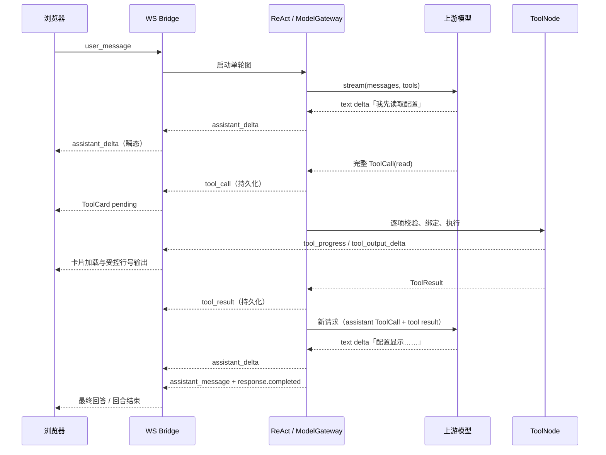

# AI 测试与评估平台 — Agent 内容块交错流式调用规划

| 项目 | 内容 |
| --- | --- |
| 文档版本 | V0.7 |
| 状态 | P1–P4 已落地；并行默认关且须协议档白名单；P1 流式可一键回退；关联错乱每回合只记一笔终态；P3 集成测试已补 |
| 撰写日期 | 2026-08-26 |
| 对应 PRD | `AI测试与评估平台-PRD.md`（L0 产品权威） |
| 对应接口 | `AI测试与评估平台-API.md` V1.48（L1 JSON/WS 契约权威） |
| 对应 Agent 文档 | `AI测试与评估平台-Agent开发文档.md` V1.5.15 |
| 目标范围 | 仅 Agent 原生工具调用（`tool_call_mode=native`）的流式控制流与受控并发 |

> **裁决说明**：本文定义未来实现的技术路线和验收条件。任何新增 REST/WS 字段、状态或产品行为，必须先回写 PRD 与 API.md；实现中的字段名、路径和错误码仍以 API.md 为准。

---

## 1. 结论与边界

方案可行，能把当前「工具结束后才看到模型正文」的体验升级为「模型先给出简短阶段叙述 → 工具卡立即执行并流式显示安全输出 → 模型基于结果继续生成」。

但必须遵守下面的模型协议事实：

1. `tool_use` / function call 会结束**当前**模型响应；运行时取得完整参数、执行工具、回填结果后，才发起**下一次**模型请求。工具结果依赖的正文不可能出现在同一条上游 HTTP/SSE 响应中。
2. 上游可在一条响应中生成多个文本块和多个工具调用块；文本块的原始顺序必须保留，但浏览器只接收正文增量和已完整解析的 ToolCall，绝不接收工具参数碎片。
3. 并行不是默认策略。模型不会可靠声明数据依赖，平台只能对被注册表明确标记为无副作用且无资源冲突的调用并行；写文件、编辑、bash、任务创建/取消等必须保持串行。
4. 该能力只对人工验证过的 `native` 协议档开放。`legacy` 继续采用严格 `react.v1` JSON-ReAct，不能把半截 JSON 当作正文或参数执行。

Anthropic 的 Messages 流原生使用 content block 事件表达文本和 tool use；客户端工具调用以 `stop_reason=tool_use` 结束，必须带对应的 `tool_result` 再继续。OpenAI Responses 则分别给出函数参数增量和参数完成事件。因此项目需要做**协议归一**，不能把单一供应商的 wire format 当公共契约。

参考：

- [Anthropic Streaming Messages](https://platform.claude.com/docs/en/build-with-claude/streaming)
- [Anthropic Client Tool Use](https://platform.claude.com/docs/en/agents-and-tools/tool-use/server-tools)
- [OpenAI Responses Streaming Events](https://platform.openai.com/docs/api-reference/responses-streaming/response/refusal/delta?lang=curl)

### 1.1 与通用 Agent「内容块交错」描述的对照

通用描述成立的部分：一次上游响应是按序内容块（`text` / `tool_use`）；运行时把 `text` 边生成边推；完整 `tool_use` 执行后把 `tool_result` 回填，再发下一次模型请求；直到某次响应不再含工具调用，本回合才结束。同一次上游响应里，工具执行前可以先说再调；工具跑完后的正文一定来自下一次请求。

本平台必须改写的三点：

1. 完整 ToolCall **要**持久化并推给浏览器（ToolCard），不是对用户不可见；只有参数碎片不出站。传输是 WebSocket，不是 SSE。
2. 一条响应里多个 `tool_use` 只表示同批，不表示默认可并行。依赖由注册表判定，不由模型自然语言维护。`write` / `edit` / `bash` / `task.create` / `task.cancel` 始终串行。
3. 没有对话内短工具 `rag_query`。大文件走 `read` 的 `offset`/`limit` 分页；完整 Observation 只进单回合临时存储，不出浏览器。

---

## 2. 现状基线

### 2.1 已具备的能力

| 层级 | 当前能力 | 约束 |
| --- | --- | --- |
| `app/adapters.py` | 归一 OpenAI Chat、OpenAI Responses、Anthropic Messages；流内累计工具参数，参数完整后产生 ToolCall | 不向浏览器暴露参数增量 |
| `ModelGateway` | `content` / `reasoning` / `tool_call` / `completed` 的内部流事件 | native 无 `stream` 的测试桩仍回退 `invoke` |
| ReAct / ToolNode | native 首轮与回填后回合均走 `gateway.stream()`；`pending_tool_batch` 保序；flag 关闭时一次一项；打开后只读波次可 `TaskGroup` 并行 | `write`/`edit`/`bash`/`task.create`/`task.cancel` 始终串行；`task`/`task.status` P3 仍串行 |
| 工具执行 | read、write、bash 的受控行级输出；最终以 `tool_result` 收敛 | 浏览器单 ToolCall 累计最多 4,000 字符；完整 Observation 不可出站 |
| WebSocket | `assistant_delta`、工具进度和工具输出为瞬态；`assistant_message`、`tool_call`、`tool_result`、`response.completed` 可回放 | 瞬态帧不占 `event_id`，断线不补发 |

### 2.2 当前缺口

```text
P4 已落地：stream/invoke 由协议档灰度决定 → ToolBatch → 白名单+脚踢线后只读并行可选 → 批次终态后按原顺序回填
segment_id 仍不进入公共 WS 契约
```

1. ~~首轮原生调用没有统一走 `gateway.stream()`~~（P1 已改；无 `stream` 的测试桩仍回退 `invoke`）。
2. `ModelResponse(text, tool_calls)` 主要保留汇总文本和调用列表，缺少完整的内容块次序信息。
3. ~~ToolNode 以 `pending_tools` 隐式队列串行执行；没有批次、依赖或冲突模型~~（P2 批次 + P3 注册表并发类与只读波次；flag 默认关）。
4. 现有 `assistant_delta` 只承载正文增量，未定义「本次模型响应中的第几个正文片段」的可选关联信息。
5. 断线后只应由持久化的阶段叙述、ToolCall、ToolResult 恢复；不能尝试补发半截正文或半截工具输出。

### 2.3 不在本次规划范围

- 外部 MCP、浏览器直连 MCP、动态工具加载；
- Agent 进程同步执行 benchmark、RAG、用例生成、压测等长任务；
- 绕过 bwrap 的 bash 执行、放宽文件/网络/附件权限；
- 将隐藏推理链或完整工具 Observation 推给浏览器；
- 多 API 副本的跨进程流广播（当前单副本前提不改变）。

---

## 3. 目标行为

### 3.1 单工具回合



### 3.2 文本片段的语义

一次上游模型响应可形成多个正文片段。每个片段分为两类：

| 类型 | 浏览器行为 | 持久化行为 | 约束 |
| --- | --- | --- | --- |
| 工具前/工具间阶段叙述 | `assistant_delta` 实时显示 | 片段结束后可固化为 `assistant_message(interim=true)` | 建议≤200字；不得包含完整 Observation |
| 无 ToolCall 的最终正文 | `assistant_delta` 实时显示 | 收尾时固化为 `assistant_message(interim=false)`，随后 `response.completed` | 是用户可回放的最终交付 |

工具调用期间已经显示的阶段叙述不可被删除或改写；最终答案必须作为新片段追加，禁止前端拼接成一条不可追溯的历史消息。

### 3.3 执行前置条件

单个工具调用只有同时满足下列条件才能进入 ToolNode：

1. 上游适配器确认工具名、`call_id` 与 JSON 参数完整；
2. 同一上游响应内 `call_id` 非空且不重复；
3. 该响应已经收到协议层的工具调用完成/响应结束信号；
4. 平台已经持久化对应 `tool_call`，使所有瞬态进度和输出都有可关联的 ToolCard；
5. ToolNode 的 Schema、Gate、附件归属、会话占槽和沙箱边界全部通过。

第 3 条是默认保守策略。后续可评估「参数完整即预启动」的只读优化，但不得在未确认上游 response finish 语义前执行。

---

## 4. 协议归一设计

### 4.1 内部内容块模型

新增仅在模型层和 Agent 图内流转的 `NormalizedContentBlock`；不直接作为 WebSocket 或数据库对象。

```python
@dataclass(frozen=True, slots=True)
class NormalizedContentBlock:
    """单次模型响应内保持顺序的已归一内容块。"""

    response_id: str                 # 上游可用则保留；否则本地回合 ID
    block_index: int                 # 同一响应内严格单调
    kind: Literal["text", "reasoning", "tool_call"]
    text: str = ""                   # 仅 text/reasoning 增量
    call_id: str = ""                # 仅完整 tool_call
    name: str = ""
    arguments: Mapping[str, object] = field(default_factory=dict)
```

设计原则：

- `tool_args_delta` 只能存在于适配器局部累积器，不进入该对象、不写日志、不推 WebSocket；
- `block_index` 用于保持文本与 ToolCall 的相对顺序，不用于跨响应排序；
- 调用参数完整后才产生 `kind="tool_call"`；
- `ModelResponse` 保留既有汇总字段以兼容，但新增有序块或等价的回合收集结果，供 ReAct 持久化阶段叙述、生成 ToolBatch 与构造下一轮供应商消息。

### 4.2 三协议映射

| 上游协议 | 文本来源 | 工具参数完成信号 | 归一要求 |
| --- | --- | --- | --- |
| OpenAI Chat Completions | `choices[].delta.content` | `finish_reason=tool_calls/function_call` 后累计 indexed `tool_calls[].function.arguments` | 按调用 index 保留参数；只在结束后发出完整调用 |
| OpenAI Responses | 输出文本增量事件 | `response.function_call_arguments.done` | 使用 `output_index` 作为块序；记录 `call_id` 和完整 arguments |
| Anthropic Messages | `content_block_start/delta/stop` 的 text block | `tool_use` block 的 `input_json_delta` 累积完成，且响应 `stop_reason=tool_use` | 使用 content block index；多个 tool_result 在下一次请求合并为同一 user 消息 |

适配器必须继续处理兼容网关忽略 `stream=true` 而直接返回完整 JSON 的情况：将其降级为一个完整 text block 与若干完整 ToolCall，不得把空流误判为模型收敛。

### 4.3 浏览器事件边界

首期复用现有 API.md §4.3 的事件名，避免为上游 wire format 新增浏览器协议：

| 内部事件 | 浏览器事件 | 是否持久化 | 说明 |
| --- | --- | --- | --- |
| text 增量 | `assistant_delta` | 否 | 仅已过滤的可展示正文 |
| text 片段结束 | `assistant_message` | 是 | 工具前片段标 `interim=true`；最终片段为交付句 |
| 完整 ToolCall | `tool_call` | 是 | 必须先于该调用的进度/输出 |
| ToolNode 执行中 | `tool_progress`、`tool_output_delta` | 否 | 仅已有的 4KB 安全窗口 |
| 工具终态 | `tool_result` | 是 | 原 `call_id`；失败含脱敏 recovery |
| 本回合完成 | `response.completed` | 是 | 每回合唯一，最后发出 |

如后续前端确实需要区分同一模型响应内的多个实时正文片段，再提议为 `assistant_delta` 增加可选 `segment_id` / `seq`。该字段属于 API 演进，必须先更新 API.md、类型和历史兼容策略；P0 不引入。

---

## 5. ToolBatch：依赖、并发与结果回填

### 5.1 核心原则

模型在同一响应内给出多个调用，并不等于这些调用可以并行。平台不依赖自然语言提示猜测依赖，而是按照工具注册表的执行语义进行保守调度。

```text
同一模型响应的完整 ToolCall
        ↓
按原 block_index / call_id 形成 ToolBatch
        ↓
注册表判断：只读、资源键、是否有副作用、是否需确认
        ↓
并行只读组（可选） + 串行副作用屏障
        ↓
所有本批结果完成，按原调用顺序组装 tool-result 消息
        ↓
下一次模型流
```

### 5.2 拟新增的注册表执行语义

`ToolDef` 在现有输入/输出 Schema、权限和恢复策略之外，新增内部字段；不直接暴露给模型或浏览器：

| 字段 | 候选值 | 用途 |
| --- | --- | --- |
| `concurrency_class` | `read_only`、`path_scoped`、`exclusive`、`session_exclusive` | 决定能否与其他调用同批执行 |
| `resource_key(arguments)` | 不可用/工作区相对路径/任务 ID/会话 | 检测同资源冲突 |
| `requires_prior_result` | `false` 为默认 | 仅用于平台已知的明确依赖，不由模型自由声明 |

初始映射：

| 工具 | 调度类 | 是否可并行 | 原因 |
| --- | --- | --- | --- |
| `read` | `path_scoped`（只读） | 可；但与同路径 write/edit/bash 冲突 | 只读文件窗口 |
| `web_search` / `web_fetch` | `read_only` | 可；受每回合网络并发和超时上限限制 | 无本地副作用，仍走 SSRF 防护 |
| `task.status` | `read_only` | 可 | 只读查询，仍校验会话归属 |
| `task`（对话内拆解） | `read_only` | 可 | 无外部副作用 |
| `write` / `edit` | `path_scoped`（写） | 默认串行 | 防同路径竞争、覆盖和观察顺序错误 |
| `bash` | `exclusive` | 串行 | 可修改整个会话工作区，即使仍在 bwrap 中 |
| `task.create` / `task.cancel` | `session_exclusive` | 串行 | 会影响会话占槽、队列和审计 |

### 5.3 批次执行规则

1. 按 `block_index` 遍历调用；遇到 `exclusive` 或 `session_exclusive` 时，先等待此前并行组完成，再单独执行。
2. 对 `path_scoped`，路径规范化后相同或存在读写冲突时串行；绝不以原始字符串比较路径。
3. 只读组最多 `max_parallel_tool_calls` 个，首期建议为 3，并复用每工具既有 timeout 与预算扣减。
4. 每个调用仍独立经过 Schema、Gate、附件绑定、权限和恢复策略；并行不得绕过任何一道检查。
5. 一个调用失败不取消同组其他可独立调用；每项都产生同 `call_id` 的 `tool_result`。仅在回合预算耗尽、用户 `/stop` 或会话取消时取消未开始项。
6. 模型回填顺序固定为模型原 ToolCall 顺序，而不是实际完成顺序；浏览器可按真实完成顺序更新各自 ToolCard。
7. Anthropic 等要求同一响应多个 ToolResult 合并回填的协议，必须等批次全部终态后才请求下一轮模型。禁止每完成一个就单独开下一次模型请求。

### 5.4 为什么不让模型标注“可并行”

模型可以建议操作次序，但不能获得执行器的资源锁、会话占槽、真实文件状态或权限事实。允许模型自行把 write/bash 标为无依赖会导致竞态、不可重放结果和副作用重试风险。模型的职责是选择工具，平台的职责是确定安全执行计划。

---

## 6. 状态机与持久化

### 6.1 ReAct 状态扩展

| 状态字段 | 作用 | 持久化限制 |
| --- | --- | --- |
| `pending_content_blocks` | 当前上游响应内已完成的有序块 | 不保存半截参数；回合结束清理 |
| `pending_tool_batch` | 已解析、待调度的 ToolCall 列表及原始顺序 | 仅可序列化参数和 `call_id`；不含完整 Observation |
| `active_batch_id` | 关联工具卡、取消和指标的当前批次 ID | 仅当前回合有效 |
| `native_messages` | 下一轮模型回填所需的 assistant ToolCall / tool result 关联元数据 | 完整工具正文继续保存在单回合临时存储，不进检查点 |

是否真的将 `pending_content_blocks` 写入 GraphState，应在实现设计评审中决定。首期优先在单次 ReAct 节点局部收集、在节点完成时仅写入稳定的 ToolBatch 与持久事件意图，避免增加 memory Checkpointer 的半流恢复语义。

### 6.2 正常转移

```text
MODEL_STREAMING
  ├─ text delta ─────────────► MODEL_STREAMING（推 assistant_delta）
  ├─ complete ToolCall ──────► MODEL_STREAMING（暂存，尚不执行）
  └─ response finished
        ├─ 无 ToolCall ──────► FINALIZE_TEXT → response.completed
        └─ 有 ToolCall ──────► PERSIST_TOOL_CALLS → EXECUTE_BATCH
                                         │
                                         ├─ 各 ToolResult
                                         └─ 全部终态 → MODEL_STREAMING（下一次请求）
```

### 6.3 取消、失败与断线

| 场景 | 平台行为 |
| --- | --- |
| 上游流断开/协议不完整 | 归一为 `UPSTREAM`；不得执行未完成参数的工具；已持久化的阶段叙述保留 |
| 工具参数无效/权限拒绝 | 发同 `call_id` 的失败 `tool_result` 和脱敏 recovery；可继续回填模型让其修复 |
| 用户 `/stop` | 停止读取模型流；取消尚未开始工具和可取消的执行任务；按当前 API 的完成/取消规则收尾 |
| WebSocket 断开 | Agent 后台任务与工具执行不因浏览器断开而直接失控；瞬态增量丢失，重连后由持久 ToolCall/Result/消息恢复 |
| API 进程异常 | 不伪造成功；单回合临时完整 Observation 丢失时沿用现有明确失败语义，禁止模型编造结果 |

---

## 7. 分阶段实施计划

### P0：契约冻结与回归基线

目标：不改变运行行为，先锁定术语、事件和测试夹具。

- 在 API.md 明确「一次 ToolCall 终止当前上游响应，结果回填后发起下一请求」；
- 在 Agent 文档明确现有串行队列与拟议 ToolBatch 的边界；
- 建立三协议交错块 fixture：`text → tool_call`、多 ToolCall、无工具最终正文、参数碎片、异常流结束；
- 保持现有 `assistant_delta`、`tool_call`、`tool_progress`、`tool_output_delta`、`tool_result` 事件名不变。

完成门槛：文档评审通过，所有现有 API/Agent/适配器测试为绿。

### P1：首轮原生内容块流（已落地）

目标：`native` 首轮也使用流式网关，实时显示工具前正文，但执行模型不变为串行。

- 扩展模型层内部回合收集器，保留 text 与完整 ToolCall 的原始顺序；
- ReAct 首轮从 `gateway.invoke()` 切换到 `gateway.stream()` / `astream()`；
- 只有响应结束后才把 ToolCall 写入 `pending_tool(s)`；
- 把已结束的工具前文本固化为 `assistant_message(interim=true)`；无工具响应沿用最终回答收尾；
- 确保不存在文本重复：一次 delta 只渲染一次，一段最终正文只持久化一次。

完成门槛：三协议 fixture 均能展示「文本 → ToolCard → 结果后文本」，旧 `legacy` 模式行为不变。

### P2：ToolBatch 与安全串行屏障（已落地）

目标：将同一模型响应的一组调用作为显式批次调度，但初期仍可全部串行。

- 引入批次 ID、原始 block 顺序和每项终态收集；
- 从 `pending_tools` 隐式队列迁移到兼容的批次结构，保留 GraphState 可序列化性；
- 在批次结束后一次性构造上游所需的 ToolResult 消息；
- 首期不改变安全边界、预算计数、结果临时存储或 ToolCard 数据投影。

完成门槛：同轮两次 `read`、一次 read+一次 write、一次失败+一次成功的结果都能按原 `call_id` 关联且模型回填顺序正确。

### P3：受控只读并行（已落地，flag 默认关）

目标：只为明确独立的调用降低等待时间。

- 在注册表增加 `concurrency_class` 和资源键解析；路径必须规范化比较；
- 用 `asyncio.TaskGroup` 执行只读组，限制 `max_parallel_tool_calls`（默认 3）；
- 组内单项失败隔离，不取消同组其他项；无显式批次时仍一次一项；
- feature flag `agent_parallel_tool_batch_enabled` 默认关闭。P3 不新增 WS 字段，也不把并发类投影给模型。

首批可并行：仅 `read`、`web_search`、`web_fetch`。完成门槛：两个独立 read/web 可重叠执行；同路径写、bash、task.create/cancel 始终未并行；现有 Gate 与串行回归保持绿色。

### P4：灰度、观测与回滚（已落地）

目标：按协议档逐步启用，出现上游兼容问题可立即退回现有串行/非流式路径。

- native 流式（P1）默认对全部 `tool_call_mode=native` 开放；`AGENT_NATIVE_STREAM_ENABLED=false` 或白名单立即回退 `invoke`；
- 并行须 `AGENT_PARALLEL_TOOL_BATCH_ENABLED=true` **且** `AGENT_PARALLEL_TOOL_BATCH_PROFILE_IDS` 命中（空=不开，`*`=全部）；
- 进程内记录不含正文/参数的指标：首 delta 延迟、ToolCall 解析延迟、批次时长、并发波次、取消数、不完整流比例；只读入口 `GET /api/agent/metrics`；
- 连续 `UPSTREAM` / 关联错乱达阈值时进程内暂时禁用并行，冷却后恢复；运维关环境变量即可全局回滚。**不修改历史事件**；
- `segment_id` 仍不写入公共 WS 契约。

完成门槛：关闭任一开关后行为回到串行/invoke；快照不含参数与正文；现有回归保持绿色。

---

## 8. 测试与验收矩阵

| 编号 | 场景 | 断言 |
| --- | --- | --- |
| A1 | OpenAI Chat：文本后多个 function calls | 参数完整前不执行；ToolCall 按 index/call_id 持久化 |
| A2 | OpenAI Responses：arguments delta/done | 仅 `done` 后进入 ToolBatch；保留 output 顺序 |
| A3 | Anthropic：text block + 多 tool_use | 依 content block index 排序；下一请求合并全部 tool_result |
| A4 | 兼容网关返回非 SSE 完整 JSON | 降级为完整块，不空流、不漏 ToolCall |
| A5 | 工具前文本 | 在线收到 `assistant_delta`；片段结束最多一条 `interim` 持久消息 |
| A6 | 工具后最终文本 | 不重复显示；`assistant_message` 在 `response.completed` 前且只一次 |
| A7 | 两个独立 read | flag 关闭串行正确；开启后可并行，结果按原调用顺序回填模型 |
| A8 | read 与同路径 write / 两个 write / bash | 始终串行，不出现竞争或越权 |
| A9 | 一项工具失败 | 失败 ToolResult 含原 call_id 与 recovery；独立项仍可完成 |
| A10 | `/stop`、WS 断线、上游断流 | 不执行半截参数；不泄露内容；终态和重连行为符合 API.md |
| A11 | 输出边界 | 浏览器不出现完整文件、完整 Observation、密钥、绝对路径或超过 4KB 的工具增量 |
| A12 | legacy 协议档 | 不发送 native tools，不改变既有 JSON-ReAct 输出 |

除单元测试外，P3 必须增加以下集成测试：真实 bwrap 特权容器中的 bash 串行屏障、WebSocket `last_event_id` 重连、同 team 在线成员的瞬态广播范围，以及前端 ToolCard 在多个 call_id 完成顺序不同情况下的稳定渲染。落地位置：`backend/api/tests/test_stream_p3_integration.py`；前端关联规则收口于 `frontend/src/utils/toolCard.ts` 的 `findPendingToolItem`。

---

## 9. 风险与控制措施

| 风险 | 影响 | 控制措施 |
| --- | --- | --- |
| 将参数碎片当完整 JSON 执行 | 越权/错误副作用 | 适配器局部累计；只接受完成信号后的对象；Schema 再校验 |
| 上游文本与工具调用顺序丢失 | UI 叙事混乱、模型消息非法 | `block_index` 保序；回填按原 ToolCall 顺序 |
| 并行写入竞争 | 文件损坏、任务占槽不一致 | 副作用类强制串行；路径资源键与会话屏障 |
| 中间正文被误作最终答案 | 历史重复、断线回放混乱 | 明确 `interim=true`；最终文本唯一；completed 只在整轮收尾 |
| 工具输出扩大浏览器暴露面 | 文件/密钥泄露、性能退化 | 沿用 4KB、完整行、脱敏、非持久化窗口 |
| 供应商兼容差异 | ToolCall 丢失或提前执行 | 三协议夹具、协议档白名单、feature flag、完整 JSON 兜底 |
| TaskGroup 取消不完整 | 僵尸任务或重复结果 | 调用级超时、取消传播、结果收集幂等、call_id 去重 |

---

## 10. 评审决策清单

实施前必须确认：

1. P1 是否将工具前文本全部持久化为 `interim`，还是仅持久化受长度限制的阶段叙述？
2. P2 的批次字段是否进入 GraphState，还是仅在单次 ReAct 节点局部保存？
3. ~~P3 的首批可并行工具是否限定为 `read`、`web_search`、`web_fetch`，以及并发上限是否为 3？~~（已按此落地；`task`/`task.status` 仍串行。）
4. 是否需要为 `assistant_delta` 增加 `segment_id` / `seq`；若需要，先完成 API.md 版本演进和旧客户端兼容设计。
5. 当前单 API 实例可承载 P1/P3；若未来扩为多副本，是否先建设进程外实时广播与会话粘性？

P3 实现不得通过修改提示词模拟并行，也不得绕过现有 ToolNode/Gate/bwrap 边界。P4 灰度与指标已落地；`segment_id` 仍待稳定后再评估。

---

## 11. 计划涉及文件与本次文档清单

### 11.1 计划涉及的实现文件（尚未修改）

| 文件 | 计划作用 |
| --- | --- |
| `backend/api/app/adapters.py` | 三协议内容块、工具参数完成和顺序归一。 |
| `backend/api/app/llm/contracts.py` / `gateway.py` | 内部内容块/回合收集契约与首轮流式投影。 |
| `backend/api/app/agent/react.py` / `graph.py` | P1 首轮流式已接线；P2 写入 `pending_tool_batch`。 |
| `backend/api/app/harness/memory/state.py` | `pending_tool_batch` 已纳入可序列化状态。 |
| `backend/api/app/harness/execution/batch.py` / `toolnode.py` | P2 批次保序；P3 并发类、规范化路径键与只读 TaskGroup。 |
| `backend/api/app/routers/ws.py` | 复用现有瞬态/持久事件顺序，必要时处理批准后的可选字段。 |
| `frontend/src/views/Agent.vue` / `components/agent/ToolCard.vue` | 多正文片段和多 ToolCard 乱序完成的渲染回归。 |
| `backend/api/tests/test_adapters.py` / `test_agent_react.py` / `test_harness_execution.py` | 协议交错、批次调度、安全边界和取消回归。 |

### 11.2 本次修订文件与作用清单（2026-08-26）

| 文件 | 作用 |
| --- | --- |
| `docs/AI测试与评估平台-Agent内容块交错流式调用规划.md` | V0.1 规划；V0.2 机制对照与 P1；V0.3 标记 P2 落地；V0.4 标记 P3 落地；V0.5 标记 P4 落地；V0.6 脚踢记账与契约对齐；V0.7 P3 集成测试。 |
| `backend/api/app/agent/react.py` | native 首轮 `gateway.stream()`；同轮调用写入 ToolBatch。 |
| `backend/api/app/harness/execution/batch.py` | 可序列化批次、block_index 保序、一次性 tool 回填消息。 |
| `backend/api/app/harness/execution/toolnode.py` / `memory/state.py` | 消费批次、中间项不回填、终态后按原顺序组装。 |
| `backend/api/tests/test_agent_react.py` / `test_llm_graph.py` / `test_adapters.py` / `test_harness_execution.py` | 首轮交错流、三协议夹具、批次保序与 read+write。 |
| `docs/AI测试与评估平台-API.md` | V1.46，冻结「ToolCall 结束当前上游响应」。 |
| `docs/AI测试与评估平台-Agent开发文档.md` | V1.5.13，记录流式/并行灰度与度量入口。 |
| `backend/api/app/config.py` / `.env.example` / `docker-compose.yml` | `AGENT_PARALLEL_TOOL_BATCH_ENABLED` 默认 false；并行须白名单。 |
| `backend/api/app/harness/execution/registry.py` | 运行时并发类；不进入模型目录。 |
| `backend/api/app/harness/execution/stream_policy.py` / `stream_metrics.py` | 协议档灰度、脱敏指标、并行脚踢线。 |
| `backend/api/app/routers/agent_prefs.py` | `GET /api/agent/metrics`。 |
| `docs/AI测试与评估平台-API.md` | V1.47。 |
| `backend/api/app/agent/react.py` | V0.6：每模型回合只记一笔流式终态，关联错乱可累计脚踢。 |
| `backend/api/tests/test_stream_rollout.py` / `test_agent_react.py` | 连续 associate_error；流式空 call_id 两轮 rounds=2。 |
| `docs/AI测试与评估平台-API.md` | V1.48，§4.3 默认串行、灰度只读并行。 |
| `docs/AI测试与评估平台-Agent开发文档.md` | V1.5.14。 |
| `backend/api/tests/test_stream_p3_integration.py` | V0.7：真实 bwrap bash 屏障、WS 重连、team 瞬态广播、ToolCard 乱序契约。 |
| `frontend/src/utils/toolCard.ts` / `views/Agent.vue` | 直播与历史回放共用 call_id 匹配。 |
| `docs/AI测试与评估平台-Agent开发文档.md` | V1.5.15。 |

*V0.7：补齐 §8 P3 集成测试（真实 bwrap 屏障、`last_event_id` 重连、team 瞬态广播、ToolCard 乱序 call_id）。本文不替代 PRD、API.md 或 Agent 开发文档中的已冻结契约。*
