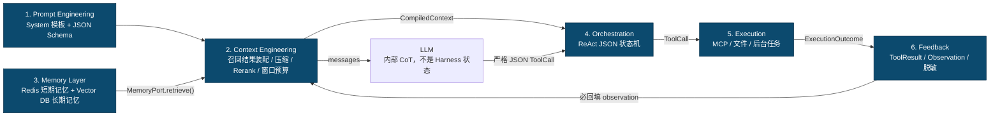
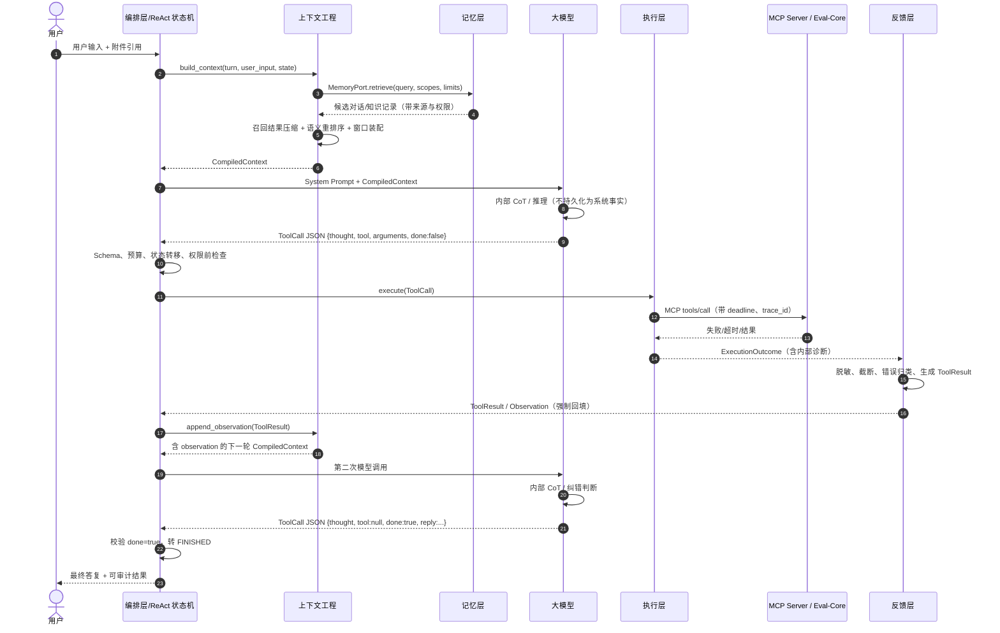

# AI 测试与评估平台 — Harness 六层 ReAct 核心架构设计

| 项 | 内容 |
| :--- | :--- |
| 文档名称 | Harness 六层 ReAct 核心架构设计 |
| 版本 | V1.0（目标架构） |
| 目标运行时 | Python 3.10+ / `asyncio` / Pydantic v2 或等价 JSON Schema 校验器 |
| 适用范围 | 高性能、多轮 ReAct Agent、MCP 工具与 Eval-Core 等远程执行服务 |
| 架构原则 | 模型只推理和产生结构化意图；Harness 是唯一控制、执行、持久化和授权主体 |

> **设计状态**：本文是按六层约束定义的目标架构，不等同于仓库当前仅开放两项多媒体 MCP 的运行实现。迁移时必须按本文的接口边界逐层替换，禁止把 Redis、Vector DB、MCP I/O 或状态机判断偷偷塞进模型提示词或单一 Agent 类。

---

## 第一章：总体架构分层图解

### 1.1 六层职责与不可跨越边界

| 层 | 唯一职责 | 可依赖 | 禁止承担 |
| :--- | :--- | :--- | :--- |
| 1. 提示词工程 | 固定 System Prompt、阶段角色及 JSON Schema 约束 | `prompts/` 静态模板 | 上下文检索、CoT 内容、工具执行、状态存储 |
| 2. 上下文工程 | 动态窗口、召回结果装配、压缩、重排序和 token 预算 | Memory 的抽象检索端口、Prompt 模板 | 直接操作 Redis/Vector DB、执行工具、业务授权 |
| 3. 记忆层 | 短期状态持久化、长期对话/知识索引和检索 | Redis、Vector DB、关系库等基础设施 | 窗口裁剪、摘要策略、提示词拼接、模型调用 |
| 4. 编排层 | ReAct JSON 状态机、ToolCall 解析、预算、停止条件 | Context 编译器、Execution 门面、Feedback 门面 | 解析自由文本作为动作、直接 I/O、直接访问存储驱动 |
| 5. 执行层 | 权限后的 I/O、MCP 客户端、文件能力、超时与后台任务提交 | MCP 适配器、文件沙箱、队列客户端 | 调模型、决定下一轮、向模型拼接上下文 |
| 6. 反馈层 | 将执行结果/错误规范化成可注入的 `ToolResult` observation | 脱敏器、诊断审计、事件发布器 | 直接重试工具、绕过编排层调用模型 |

层之间的依赖图如下。箭头表示“左侧结果被右侧消费”，闭环只能通过 Feedback 回到 Context，不能由执行器直接重入模型。



关键依赖规则：

```text
Context ──只通过 MemoryPort──> Memory；不得 import Redis SDK 或 Vector DB SDK
Memory  ──只负责存取/检索──> Storage；不得 import ContextCompiler
Orchestration ──只接收 JSON──> 不把模型纯文本解释成工具动作
Execution ──只返回 Outcome──> 不调用 LLM，不决定“是否下一步”
Feedback ──只生成 ToolResult──> 不执行重试、不访问模型
```

### 1.2 ReAct 运行时时序

`thought` 是模型输出的受限、可审计的**动作理由摘要**；模型可能有内部 CoT，但其完整原文不是提示词内容、不是记忆事实、不是工具授权依据。编排器只消费通过 Schema 校验后的 JSON 字段。



### 1.3 提示词工程的严格定义

提示词层只存放版本化静态模板，职责只有两个：

1. 固定 System Prompt 的角色、安全边界和阶段职责；
2. 固定严格 JSON 输出契约，包括字段、枚举、互斥条件和禁止 Markdown 围栏。

例如 ReAct 的输出契约可以表达为：

```json
{
  "type": "object",
  "required": ["thought", "tool", "arguments", "done"],
  "properties": {
    "thought": {"type": "string", "maxLength": 512},
    "tool": {"type": ["string", "null"]},
    "arguments": {"type": "object"},
    "done": {"type": "boolean"},
    "reply": {"type": "string", "maxLength": 4000}
  }
}
```

它不应包含“请逐步展示你的推理”“把 CoT 写入记忆”等指令。`thought` 仅用于表达当前动作的简要目的；任何完整推理链都不能成为业务状态、权限依据或长期记忆。

---

## 第二章：目录结构设计（Project Tree）

```text
harness/
├── __init__.py
├── app.py                         # 依赖注入根；仅在此处装配六层实现
├── contracts/
│   ├── tool_call.py               # ToolCall、ToolResult、Observation JSON Schema/Pydantic 模型
│   ├── context.py                 # ContextItem、CompiledContext、Provenance
│   ├── memory.py                  # MemoryQuery、MemoryRecord、MemoryPort 协议
│   └── errors.py                  # ErrorClass、DiagnosticRef、RetryPolicy
├── prompts/                       # 仅静态 YAML/JSON；无业务 Python 逻辑
│   ├── system.yaml
│   ├── react-output.schema.json
│   ├── planner-output.schema.json
│   └── versions.yaml
├── context/
│   ├── compiler.py                # 只调用 MemoryPort；输出 CompiledContext
│   ├── window_manager.py          # token 预算、最近对话槽位、Lost-in-the-Middle 布局
│   ├── retriever_facade.py        # MemoryPort 查询编排；不感知 Vector DB SDK
│   ├── summarizer.py              # 对候选记录做受约束压缩/证据抽取
│   ├── reranker.py                # 对压缩后的候选进行语义重排序
│   ├── provenance.py              # 来源、时效、权限和冲突检查
│   └── policies.py                # 上下文优先级、最大 token、注入白名单
├── memory/
│   ├── ports.py                   # ShortTermMemoryPort / LongTermMemoryPort / MemoryPort
│   ├── short_term_redis.py        # Redis：回合状态、会话索引、TTL、幂等键
│   ├── long_term_vector.py        # Vector DB：向量检索、metadata 过滤、文档版本
│   ├── conversation_store.py      # 长期对话归档接口
│   ├── knowledge_store.py         # 知识库写入/删除/撤权接口
│   └── retention.py               # TTL、删除、重建索引、数据主权策略
├── orchestration/
│   ├── react_loop.py              # ReAct 总控循环；只读写状态机和层接口
│   ├── state_machine.py           # INIT/CONTEXT_READY/AWAIT_MODEL/... 状态转移
│   ├── parser.py                  # 严格 JSON 解析与 Schema 校验；拒绝纯文本动作
│   ├── budgets.py                 # 最大轮数、总 deadline、重复调用与退避判断
│   ├── authorization.py           # 用户确认、策略检查和能力授权
│   └── finalizer.py               # done 后交付、审计收尾、不可逆操作确认
├── execution/
│   ├── facade.py                  # ToolCall -> ExecutionOutcome 的唯一门面
│   ├── tool_registry.py           # 工具元数据、权限、参数 schema、幂等性和超时
│   ├── file_sandbox.py            # 根目录限定、文件句柄/URI 授权，不接受任意路径
│   ├── jobs.py                    # 长任务入队、取消、状态查询、结果引用
│   ├── mcp/
│   │   ├── client.py              # MCP 生命周期、能力协商、tools/list、tools/call
│   │   ├── transport.py           # McpTransport 抽象协议
│   │   ├── stdio.py               # 标准 MCP stdio 适配器
│   │   ├── streamable_http.py     # 标准 MCP Streamable HTTP 适配器
│   │   ├── websocket_custom.py    # Eval-Core WebSocket 自定义传输适配器
│   │   └── session_pool.py        # 连接池、重连、session 和协议版本
│   └── adapters/
│       ├── eval_core.py           # Eval-Core 工具名/参数的领域映射
│       └── local_files.py         # 受沙箱保护的本地文件能力
├── feedback/
│   ├── normalizer.py              # Outcome -> ToolResult；绝不将异常向上裸抛
│   ├── redaction.py               # secret/PII/路径/堆栈脱敏
│   ├── observation.py             # 结果截断、可读摘要、来源标注
│   ├── diagnostics.py             # 原始 traceback 仅服务端审计，生成 diagnostic_id
│   └── publisher.py               # 回合事件、UI 事件、审计事件
├── security/
│   ├── policy.py                  # 工具/资源/租户权限策略
│   ├── consent.py                 # 用户确认与高风险写操作授权
│   └── secrets.py                 # 凭据引用、轮换、永不进入模型上下文
└── tests/
    ├── context/                   # 召回-压缩-Rerank、窗口布局、来源冲突测试
    ├── memory/                    # Redis TTL、向量过滤、撤权和删除测试
    ├── orchestration/             # 状态机、done、死循环与 JSON 解析测试
    ├── execution/                 # MCP stdio/HTTP/WS、超时、取消、文件沙箱测试
    └── feedback/                  # traceback 脱敏、ToolResult 回填和错误降级测试
```

### 2.1 依赖倒置要求

`context/` 只能依赖 `contracts.memory.MemoryPort`。该 Port 暴露 `retrieve()`、`append()`、`forget()` 等抽象能力；Redis/Vector DB 的具体 SDK 只允许出现在 `memory/`。这保证更换 Qdrant、Milvus、pgvector 或 Redis Cluster 不会改动窗口管理、压缩和 Rerank 策略。

同理，`orchestration/` 只能通过 `ExecutionFacade` 调用执行层，只能通过 `FeedbackNormalizer` 接收结果；`execution/` 不允许 import `orchestration.react_loop` 或任意 LLM SDK。循环控制权必须单向集中在编排层。

---

## 第三章：核心数据流与防幻觉机制

### 3.1 上下文工程：召回 → 压缩 → 重排序

记忆层和上下文工程严格分工：Memory 层负责在权限范围内返回候选记录；Context 层对这些记录做**本轮可见性决策**。Memory 不知道 token 预算和模型提示词，Context 不知道向量索引、Redis key 或数据库连接。

```text
用户目标 + 当前 Agent 状态
  │
  ├─ Context 生成 MemoryQuery（租户、会话、权限范围、时间范围、意图）
  ▼
MemoryPort.retrieve()
  ▼
候选记录（原文 + source_id + version + ACL + timestamp + score）
  ▼
① 召回：高召回率获取候选
  ▼
② 压缩：抽取与当前目标相关、带来源的最小证据单元
  ▼
③ 重排序：依据目标、约束、时效、权威性和多样性排序
  ▼
WindowManager：与 System Prompt、当前用户问题、最近对话、Observation 一起装配
  ▼
CompiledContext（token 上限内、每项可追溯）
```

#### 阶段 A：召回（Recall）

召回由 `MemoryPort.retrieve(MemoryQuery)` 实现，输入必须包含：

```text
tenant_id / user_id / session_id / permitted_resource_ids
query_text / intent / time_range / record_types / top_k_recall
```

检索策略可以在 Memory 层组合关键词、向量相似度、元数据过滤和会话邻近度，但必须先做 ACL/租户/删除状态过滤，后做相似度计算。返回 `MemoryRecord` 时必须带 `source_id`、版本、创建时间和访问级别；缺少来源的文本不得作为高可信事实进入模型上下文。

#### 阶段 B：压缩（Summarization）

压缩发生在 Context 层，对**已授权的候选**而不是对整个存储库进行。优先使用可回链的抽取式压缩：保留原文片段范围、事实类型、数值、否定条件和 `source_id`。只有在 token 仍超限时，再使用受 JSON Schema 约束的生成式摘要。

压缩产物示例：

```json
{
  "source_id": "kb:eval-core:guide:v7#p12",
  "claims": ["Eval-Core 的取消接口需要 job_id 与 idempotency_key"],
  "constraints": ["不得将远程 traceback 回显给最终用户"],
  "open_questions": [],
  "token_cost": 47
}
```

禁止把“摘要”当作新的无来源知识。每个 claim 都必须能回链到原始记录；原文修订、撤权或删除时，相关摘要需要失效或重建。

#### 阶段 C：重排序（Rerank）

Reranker 对压缩后的证据单元计算最终优先级，而不是只按向量相似度排序。推荐评分由以下信号组成：

```text
final_score = relevance
            + authority
            + freshness
            + task_state_match
            + diversity_bonus
            - stale_penalty
            - conflict_penalty
```

`Lost-in-the-Middle` 的防护不是简单“把更多文本放进窗口”，而是：

1. 固定 System Prompt 和安全约束始终置于最前；
2. 每个证据压缩为独立、可引用的小单元，不插入长篇未切分原文；
3. 最高优先级事实同时放在证据区首位，并在当前用户问题前的“关键约束槽位”再次以短引用出现；
4. 最近对话与本轮 `ToolResult` 放在用户问题附近；
5. 低分、过期、冲突且未消解的候选直接丢弃，而不是塞进中部碰碰运气。

最终 `CompiledContext` 需要公开 token 预算账本：

| 槽位 | 优先级 | 超额时策略 |
| :--- | :--- | :--- |
| System Prompt + JSON Schema | 不可降级 | 拒绝启动配置错误的回合 |
| 当前用户输入与已授权附件引用 | 不可降级 | 超限时要求上传/输入分块 |
| 最近会话状态与未完成约束 | 高 | 保留摘要、淘汰低价值历史 |
| 本轮 ToolResult observation | 高 | 截断 payload，保留状态/错误/来源 |
| Rerank 后知识证据 | 中 | 从末尾淘汰低分候选 |
| 一般历史对话 | 低 | 压缩或不注入 |

### 3.2 编排层：严格 JSON ReAct 状态机

编排层绝不依据模型自然语言中的“我会调用工具”执行动作。唯一可执行输入是经 Schema 解析后的 `ToolCall`：

```json
{
  "turn_id": "01H...",
  "thought": "需要读取评测任务状态以确认是否可取消",
  "tool": "eval.task.get",
  "arguments": {"task_id": "t_123"},
  "done": false
}
```

状态机：

```text
INIT → CONTEXT_READY → AWAIT_MODEL → PARSED
PARSED ── done=true ─────────────────────────────→ FINISHED
PARSED ── done=false 且 ToolCall 合法 ────────────→ EXECUTING
PARSED ── JSON/Schema 不合法 ────────────────────→ FEEDBACK_READY
EXECUTING → FEEDBACK_READY → CONTEXT_READY
任意状态 ── 用户取消/全局 deadline ──────────────→ CANCELLED
任意状态 ── 不可恢复策略失败 ────────────────────→ FAILED_STOP
```

`done` 的强制不变量：

| 条件 | 编排器处理 |
| :--- | :--- |
| `done=true` 且 `tool=null` | 校验最终 `reply`，进入 `FINISHED`，绝不再执行工具。 |
| `done=true` 且 `tool!=null` | 拒绝为 schema 违规，构造 `ToolResult(error="DONE_TOOL_CONFLICT")` 回填。 |
| `done=false` 且 `tool=null` | 拒绝为 `MISSING_TOOL`，回填要求模型澄清或结束。 |
| `done=false` 且工具不在注册表 | 不执行，回填 `TOOL_NOT_ALLOWED`。 |
| `done=false` 且参数不合规 | 不执行，回填 `ARGUMENT_VALIDATION_ERROR`。 |

避免死循环不能只依赖 `done`。`budgets.py` 必须同时维护：

```text
max_react_steps                 # 例如 6
turn_deadline                   # 例如 60 秒；长任务不占用该回合
max_same_call_fingerprint       # 同 tool + 规范化 arguments 至多 1 或 2 次
max_consecutive_retryable_error # 例如 2
max_context_rebuilds            # 例如 1，防止摘要/检索反复震荡
cancel_token                    # 用户停止可从任意 await 点退出
```

一旦命中预算，编排器不应静默截断：必须写入 `BUDGET_EXHAUSTED` ToolResult/turn event，并让模型在**最后一次、无工具权限**的调用中生成澄清或失败交付；若模型不可用，则由固定错误文案交付。

### 3.3 执行层与反馈层：异常必须变为 ToolResult

执行层的返回类型是 `ExecutionOutcome`，而不是“成功时返回 dict，失败时向上抛异常”。建议统一契约：

```json
{
  "call_id": "call_...",
  "tool": "eval.task.get",
  "status": "ok | error | timeout | cancelled | pending",
  "data": {},
  "error": {
    "class": "UPSTREAM_TIMEOUT",
    "message": "Eval-Core 在 10 秒内未响应",
    "retryable": true,
    "diagnostic_id": "diag_..."
  },
  "latency_ms": 10000,
  "source": {"server": "eval-core", "transport": "websocket"}
}
```

执行门面必须捕获预期的 I/O、协议、超时和工具错误；将错误分类后交给 Feedback：

```python
async def execute(call: ToolCall) -> ExecutionOutcome:
    try:
        return await registry.dispatch(call)
    except asyncio.CancelledError:
        # 取消是控制流，交由编排器完成状态转移；不伪装成成功。
        raise
    except TimeoutError as exc:
        return ExecutionOutcome.timeout(call, diagnostic=record_diagnostic(exc))
    except McpProtocolError as exc:
        return ExecutionOutcome.error(call, "MCP_PROTOCOL_ERROR", diagnostic=record_diagnostic(exc))
    except Exception as exc:
        return ExecutionOutcome.error(call, "TOOL_INTERNAL_ERROR", diagnostic=record_diagnostic(exc))
```

随后 Feedback 层**无条件**把 outcome 转为可注入的 `ToolResult`：

```text
ExecutionOutcome
  → 记录完整 traceback 到受限审计存储（diagnostic_id）
  → 删除密钥、Cookie、绝对路径、SQL、堆栈原文和不可信工具提示
  → 截断结果并保留状态、来源、延迟、可重试标记
  → 生成 ToolResult / Observation
  → 追加到本回合状态
  → 由 Context 工程放进下一次模型调用
```

因此“强制回填 traceback”应理解为 **强制回填被脱敏后的错误 observation**。原始 traceback 进入模型会泄露凭据、把远程服务返回的提示注入带入系统、并显著浪费窗口；它只能由拥有诊断权限的服务端人员通过 `diagnostic_id` 查看。无论成功、工具错误、超时、取消还是 JSON 解析失败，编排器都要获得一个结构化结果，禁止因普通工具异常导致 Agent 进程崩溃。

### 3.4 反幻觉不变量

1. **事实来源不可伪造**：记忆记录、工具结果、附件与任务状态均带 `source_id`、权限和版本；模型生成内容默认不是事实。
2. **动作不可伪造**：模型只提出 ToolCall，执行层以注册表、用户授权和参数 schema 二次校验。
3. **错误不可吞没**：每项执行尝试都有 call_id、ToolResult 和审计事件；失败不会被模型解释成成功。
4. **窗口不可失控**：所有动态上下文都有 token 预算、优先级和降级策略；低可信长文本不能抢占关键槽位。
5. **摘要不可越权**：摘要只能派生自可见来源，原始记录变更时必须失效；写操作重读权威状态而非信任摘要。
6. **循环不可无限**：`done`、最大步骤、截止时间、调用指纹和取消令牌共同决定停止。

---

## 第四章：MCP 协议适配策略

### 4.1 客户端、传输和领域适配三层

MCP 使用 JSON-RPC 2.0，由 Host、Client 和 Server 组成；Server 可提供 resources、prompts 和 tools。标准传输为 `stdio` 与 Streamable HTTP；WebSocket 可以作为保留 JSON-RPC 生命周期的自定义传输实现。这个结论与 MCP 2025-06-18 规范一致：[MCP Specification](https://modelcontextprotocol.io/specification/2025-06-18) 与 [Transports](https://modelcontextprotocol.io/specification/2025-06-18/basic/transports)。

适配器分为三层：

```text
ReAct ToolCall
  → ExecutionFacade（注册表、授权、deadline）
  → McpClient（initialize、能力协商、tools/list、tools/call、取消）
  → McpTransport（stdio / Streamable HTTP / WebSocket custom）
  → MCP Server / Eval-Core
```

所有传输实现统一满足以下异步协议：

```python
class McpTransport(Protocol):
    async def connect(self) -> None: ...
    async def send(self, message: dict[str, object]) -> None: ...
    async def receive(self, *, deadline: float) -> dict[str, object]: ...
    async def close(self) -> None: ...
```

`McpClient` 负责 JSON-RPC id 关联、初始化和 `protocolVersion`/capability 协商；适配器不得在其外绕过 `initialize` 直接发送 `tools/call`。

| 传输 | 适用场景 | 必须实现的约束 |
| :--- | :--- | :--- |
| `stdio.py` | 本机受信任 MCP 子进程 | Client 启动子进程；stdin/stdout 只能传 UTF-8 JSON-RPC 行；stderr 只作日志；进程组隔离和退出回收。 |
| `streamable_http.py` | 标准远程 MCP 服务 | POST/GET + JSON-RPC/SSE；维护 `Mcp-Session-Id`、协议版本、Origin 校验、认证与断线恢复。 |
| `websocket_custom.py` | Eval-Core 等已有 WebSocket 服务 | 明确标为 custom transport；承载同一 JSON-RPC 消息与 MCP 生命周期；使用 WSS、认证、心跳、重连和 request-id 对应。 |

WebSocket 不应被错误称作“当前 MCP 的标准远程传输”。若 Eval-Core 使用 WebSocket，`websocket_custom.py` 应记录握手、帧格式、认证、重连与取消语义，并保证不会把 WebSocket 特有事件泄露给 ReAct 状态机。这样可同时满足现有服务兼容性和 MCP 标准可演进性。

### 4.2 工具发现、授权与文件能力

工具元数据只能在显式连接和成功协商后写入 `ToolRegistry`。每个工具至少声明：

```text
server_id / name / input_schema / output_schema / permission / timeout
idempotency / long_running / requires_confirmation / allowed_roots
```

工具描述、资源文本和远程错误消息均视作不可信输入：可以作为 observation，但不可覆盖 System Prompt、不可自动扩大文件根目录、不可赋予调用权限。文件读写通过 `file_sandbox.py` 执行 URI/句柄到受限目录的映射，拒绝模型提供的任意绝对路径、`..` 穿越、符号链接逃逸和未授权网络路径。

### 4.3 Long-Running Tasks 的兜底策略

长任务绝不能占用 ReAct 工具调用直到结束。执行层要按工具元数据 `long_running=true` 走后台化路径：

```text
ToolCall
  → 用户确认（如工具为写操作/高成本操作）
  → 生成 idempotency_key + deadline + trace_id
  → 投递任务队列或调用 MCP 异步 job API
  → 立即返回 ToolResult(status="pending", job_ref=...)
  → 编排器结束当前工具循环或等待用户下一步，而非忙等
  → Worker/订阅器接收 progress、result、error、cancelled
  → 事件写入持久化状态；仅按需摘要为未来上下文
```

每个长任务必须有以下控制面：

| 控制项 | 设计要求 |
| :--- | :--- |
| Deadline | 连接、初始化、单次调用、整体任务分别配置；超时统一产生 `timeout` ToolResult。 |
| 取消 | 传播用户取消令牌；向 MCP 发送取消通知或调用远端 cancel；取消不等于连接断开。 |
| 幂等 | 相同用户动作使用稳定 `idempotency_key`，重连/重试不得重复创建评测。 |
| 进度 | 进度写任务事件流，不将每个进度帧自动塞入模型窗口。 |
| 重试 | 只对标记 `retryable` 的错误按退避策略重试；非幂等写操作须先查 job 状态。 |
| 恢复 | 任务状态和 job_ref 持久化；进程重启后由 Worker 恢复订阅或轮询。 |

---

## 架构逻辑自检清单

- [x] 明确为 Harness 定义了独立于大模型的六层运行时，模型不持有控制逻辑。
- [x] 提示词工程层仅包含 System Prompt 与严格 JSON Structured Output 约束；未将 CoT 写入提示词内容。
- [x] 将模型 CoT 与 `thought` 动作摘要、结构化 ToolCall、授权事实明确区分。
- [x] 上下文工程层包含动态窗口、Summarization、Rerank、token 预算和 Lost-in-the-Middle 防护。
- [x] 按“召回 → 压缩 → 重排序”详细定义了三段式数据流，并规定来源、权限与上下文布局。
- [x] 记忆层与上下文工程严格解耦：Memory 只负责 Redis/Vector DB 的存储和检索，Context 仅经 `MemoryPort` 搬运和编排。
- [x] 编排层仅解析 JSON 状态机，规定 `ToolCall(thought, tool, done)`、`done` 不变量、最大轮数和停止条件，不从纯文本执行动作。
- [x] 执行层负责文件沙箱、MCP I/O、工具注册、超时、取消和后台任务，不调用模型。
- [x] 反馈层将每一次成功、错误、超时、取消或解析失败强制封装为脱敏 `ToolResult`，回填下一轮上下文，不让普通工具异常崩溃 Agent。
- [x] 明确原始 Traceback 仅进受限服务端诊断，模型接收安全 observation，避免泄密和注入。
- [x] 提供了六层 Mermaid 静态依赖图和包含“执行报错 → 反馈 → 二次推理”的 Mermaid 时序图。
- [x] 提供了包含 `context/`、`memory/`、`orchestration/`、`execution/`、`prompts/`、`feedback/` 的 Python 3.10+ 项目树。
- [x] 通过适配器模式定义了 MCP `stdio`、标准 Streamable HTTP 与 Eval-Core WebSocket custom transport 的兼容策略。
- [x] 为 Long-Running Tasks 定义了超时、确认、后台化、进度、取消、幂等、重试和恢复策略。

## 本次文档变更范围

本次仅新增目标架构文档，不改变现有 API、数据库、前端或 Agent 运行代码。

| 文件 | 作用 |
| :--- | :--- |
| `docs/AI测试与评估平台-Harness六层ReAct核心架构设计.md` | 定义严格解耦的六层 Harness 目标架构、ReAct 数据流、MCP 适配策略和逻辑自检清单。 |
