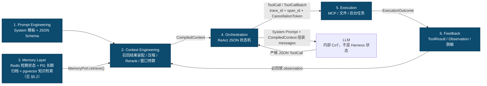
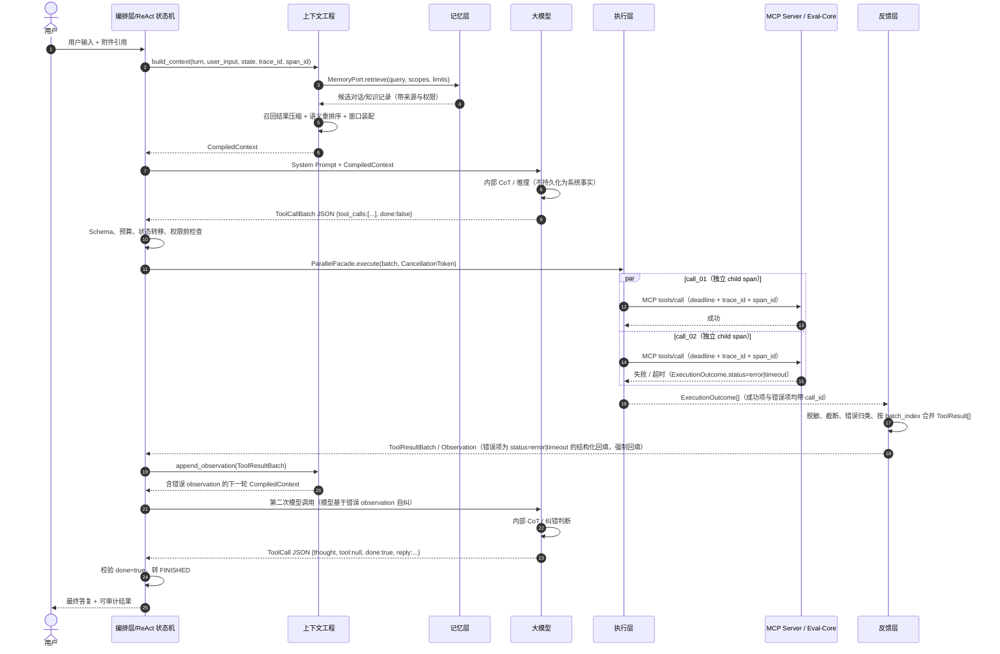

# AI 测试与评估平台 — Harness 六层 ReAct 核心架构设计

| 项 | 内容 |
| :--- | :--- |
| 文档名称 | Harness 六层 ReAct 核心架构设计 |
| 版本 | V1.2（目标架构） |
| 审查日期 | 2026-08-21 |
| 目标运行时 | Python 3.12 / `asyncio` / Pydantic v2 或等价 JSON Schema 校验器 |
| 适用范围 | 高性能、多轮 ReAct Agent、MCP 工具与 Eval-Core 等远程执行服务 |
| 架构原则 | 模型只推理和产生结构化意图；Harness 是唯一控制、执行、持久化和授权主体 |

> **设计状态**：本文是按六层约束定义的目标架构，不等同于仓库当前仅开放两项多媒体 MCP 的运行实现。迁移时必须按本文的接口边界逐层替换，禁止把具体存储 SDK（PG、LightRAG、Redis、向量库）、MCP I/O 或状态机判断偷偷塞进模型提示词或单一 Agent 类。

> **V1.1 定向修订定位**：在原第二章项目树中新增追踪、取消与并行门面文件；在第三章 `§3.2` 中扩展为批量 ToolCall、并行状态机和流式取消；在 `§3.3` 中替换取消异常处理；在 `§3.4` 后新增 `§3.5` 跨层强制链路追踪；在第四章 `§4.3` 后补充长任务取消时限；在文末自检清单新增对应不变量。原有六层、记忆解耦、MCP 和反幻觉设计均保留。

> **V1.2 定向修订定位**：① 裁决 LLM 客户端归属——新增 `llm/` 模块并由编排层独占持有，修正 `§1.1`/`§1.2` 两图关于"谁调用模型"的矛盾；② 新增第五章"现状迁移映射与基础设施决策"（现有 `app/agent/` 模块 → 目标目录映射、**首期 PostgreSQL（含 pgvector）+ Redis、LightRAG 暂不接入**的存储决策与部署红线、分阶段迁移与持久化契约）；③ 新增第六章"安全层契约与错误码对齐"（`security/` 三文件契约、ToolResult 内部枚举与 10 大 ErrorCode 的关系、与 Agent 开发文档的裁决关系）；④ 在 `§3.2.2` 补充权威预算默认值表；⑤ 修正 `§3.5` 批量合并场景的 trace 父子校验说明；⑥ `§1.2` 时序图补显式"执行报错 → 反馈 → 二次推理"分支；⑦ 文档头部补审查日期、目标运行时对齐 Python 3.12。

---

## 第一章：总体架构分层图解

### 1.1 六层职责与不可跨越边界

| 层 | 唯一职责 | 可依赖 | 禁止承担 |
| :--- | :--- | :--- | :--- |
| 1. 提示词工程 | 固定 System Prompt、阶段角色及 JSON Schema 约束 | `prompts/` 静态模板 | 上下文检索、CoT 内容、工具执行、状态存储 |
| 2. 上下文工程 | 动态窗口、召回结果装配、压缩、重排序和 token 预算 | Memory 的抽象检索端口、Prompt 模板 | 直接操作任何具体存储（PostgreSQL、LightRAG、缓存或向量库）、执行工具、业务授权 |
| 3. 记忆层 | 短期状态持久化、长期对话/知识索引和检索 | PostgreSQL（含 pgvector）+ Redis（首期安装）；LightRAG、独立向量库为后续演进，见 §5.2 | 窗口裁剪、摘要策略、提示词拼接、模型调用 |
| 4. 编排层 | ReAct JSON 状态机、ToolCall 解析、预算、停止条件、经 `llm/` 客户端发起模型调用 | Context 编译器、Execution 门面、Feedback 门面、`llm/` 模型客户端 | 解析自由文本作为动作、直接 I/O、直接访问存储驱动 |
| 5. 执行层 | 权限后的 I/O、MCP 客户端、文件能力、超时与后台任务提交 | MCP 适配器、文件沙箱、队列客户端 | 调模型、决定下一轮、向模型拼接上下文 |
| 6. 反馈层 | 将执行结果/错误规范化成可注入的 `ToolResult` observation | 脱敏器、诊断审计、事件发布器 | 直接重试工具、绕过编排层调用模型 |

层之间的依赖图如下。箭头表示“左侧结果被右侧消费”，闭环只能通过 Feedback 回到 Context，不能由执行器直接重入模型。



关键依赖规则：

```text
Context ──只通过 MemoryPort──> Memory；不得 import 任何具体存储 SDK（SQLAlchemy/PG、LightRAG、Redis、向量库）
Memory  ──只负责存取/检索──> Storage；不得 import ContextCompiler
Orchestration ──只接收 JSON──> 不把模型纯文本解释成工具动作
Orchestration ──独占经 llm/ 客户端调用──> LLM；Context 只编译消息，不发起模型调用
Execution ──只返回 Outcome──> 不调用 LLM，不决定“是否下一步”
Feedback ──只生成 ToolResult──> 不执行重试、不访问模型
TraceContext ──贯穿六层──> 每一跨层调用必须携带 trace_id 与 span_id
```

**LLM 客户端归属裁决（V1.2）**：模型调用权唯一属于编排层。`llm/` 目录是编排层私有的基础设施适配器（Provider 适配、流式读取、结构化输出解析与 token 记账），只有 `orchestration/` 与依赖注入根 `app.py` 允许 import 它；`context/`、`execution/`、`feedback/`、`security/` 一律禁止 import LLM SDK 或 `llm/`。Context 的产物是 `CompiledContext`（静态消息素材），不是模型调用；执行层拿到的是 ToolCall，永远拿不到 messages。

### 1.2 ReAct 运行时时序

`thought` 是模型输出的受限、可审计的**动作理由摘要**；模型可能有内部 CoT，但其完整原文不是提示词内容、不是记忆事实、不是工具授权依据。编排器只消费通过 Schema 校验后的 JSON 字段。



### 1.3 提示词工程的严格定义

提示词层只存放版本化静态模板，职责只有两个：

1. 固定 System Prompt 的角色、安全边界和阶段职责；
2. 固定严格 JSON 输出契约，包括字段、枚举、互斥条件和禁止 Markdown 围栏。

例如 ReAct 的输出契约可以表达为：

```json
{
  "type": "object",
  "required": ["thought", "tool", "arguments", "done"],
  "properties": {
    "thought": {"type": "string", "maxLength": 512},
    "tool": {"type": ["string", "null"]},
    "arguments": {"type": "object"},
    "done": {"type": "boolean"},
    "reply": {"type": "string", "maxLength": 4000}
  }
}
```

它不应包含“请逐步展示你的推理”“把 CoT 写入记忆”等指令。`thought` 仅用于表达当前动作的简要目的；任何完整推理链都不能成为业务状态、权限依据或长期记忆。

---

## 第二章：目录结构设计（Project Tree）

```text
harness/
├── __init__.py
├── app.py                         # 依赖注入根；仅在此处装配六层实现
├── contracts/
│   ├── tool_call.py               # ToolCall、ToolResult、Observation JSON Schema/Pydantic 模型
│   ├── context.py                 # ContextItem、CompiledContext、Provenance
│   ├── memory.py                  # MemoryQuery、MemoryRecord、MemoryPort 协议
│   ├── trace.py                   # 强制 TraceContext(trace_id、span_id、parent_span_id)
│   ├── cancellation.py            # CancellationToken、取消原因与 100ms 调度预算
│   └── errors.py                  # ErrorClass、DiagnosticRef、RetryPolicy
├── prompts/                       # 仅静态 YAML/JSON；无业务 Python 逻辑
│   ├── system.yaml
│   ├── react-output.schema.json
│   ├── planner-output.schema.json
│   └── versions.yaml
├── context/
│   ├── compiler.py                # 只调用 MemoryPort；输出 CompiledContext
│   ├── window_manager.py          # token 预算、最近对话槽位、Lost-in-the-Middle 布局
│   ├── retriever_facade.py        # MemoryPort 查询编排；不感知任何具体存储 SDK
│   ├── summarizer.py              # 对候选记录做受约束压缩/证据抽取
│   ├── reranker.py                # 对压缩后的候选进行语义重排序
│   ├── provenance.py              # 来源、时效、权限和冲突检查
│   └── policies.py                # 上下文优先级、最大 token、注入白名单
├── memory/
│   ├── ports.py                   # ShortTermMemoryPort / LongTermMemoryPort / MemoryPort
│   ├── short_term_redis.py      # Redis：回合状态、会话索引、TTL、幂等键（首期实现）
│   ├── long_term_pgvector.py    # pgvector：向量检索、metadata 过滤、文档版本（首期实现）
│   ├── long_term_lightrag.py    # 可选演进：LightRAG 适配器；RAG 接入评审通过前不创建此文件
│   ├── conversation_store.py      # 长期对话归档（首期 PG 实现，带溯源字段）
│   ├── knowledge_store.py         # 知识库写入/删除/撤权（首期基于 pgvector 实现）
│   └── retention.py               # TTL、删除、重建索引、数据主权策略
├── orchestration/
│   ├── react_loop.py              # ReAct 总控循环；强制 trace/cancel 透传
│   ├── parallel_facade.py         # ToolCallBatch 并发、顺序收敛、部分失败隔离
│   ├── state_machine.py           # 含 PARALLEL_EXECUTING/FINALIZING_STREAM/CANCELLED
│   ├── parser.py                  # 严格 JSON 解析与 Schema 校验；拒绝纯文本动作
│   ├── budgets.py                 # 最大轮数、总 deadline、重复调用与退避判断
│   ├── streaming.py               # 最终回复流式读取、背压、断开与取消协调
│   ├── authorization.py           # 用户确认、策略检查和能力授权
│   └── finalizer.py               # done 后交付、审计收尾、不可逆操作确认
├── execution/
│   ├── facade.py                  # ToolCall -> Outcome；强制 trace/cancel、不得裸抛工具异常
│   ├── tool_registry.py           # 工具元数据、权限、参数 schema、幂等性和超时
│   ├── file_sandbox.py            # 根目录限定、文件句柄/URI 授权，不接受任意路径
│   ├── jobs.py                    # 长任务入队、取消、状态查询、结果引用
│   ├── mcp/
│   │   ├── client.py              # MCP 生命周期、能力协商、tools/list、tools/call
│   │   ├── transport.py           # McpTransport 抽象协议
│   │   ├── stdio.py               # 标准 MCP stdio 适配器
│   │   ├── streamable_http.py     # 标准 MCP Streamable HTTP 适配器
│   │   ├── websocket_custom.py    # Eval-Core WebSocket 自定义传输适配器
│   │   └── session_pool.py        # 连接池、重连、session 和协议版本
│   └── adapters/
│       ├── eval_core.py           # Eval-Core 工具名/参数的领域映射
│       └── local_files.py         # 受沙箱保护的本地文件能力
├── feedback/
│   ├── normalizer.py              # Outcome -> ToolResult；绝不将异常向上裸抛
│   ├── redaction.py               # secret/PII/路径/堆栈脱敏
│   ├── observation.py             # 结果截断、可读摘要、来源标注
│   ├── diagnostics.py             # 原始 traceback 仅服务端审计；缺 trace_id/span_id 直接拒绝记录
│   └── publisher.py               # 回合事件、UI 事件、审计事件
├── llm/                           # 模型客户端；仅 orchestration/ 与 app.py 允许 import（V1.2 裁决）
│   ├── client.py                  # Provider 适配、连接管理、流式读取、退避重试
│   ├── structured.py              # 严格 JSON 结构化输出解析、Schema 校验失败的重试策略
│   └── usage.py                   # token 用量与成本记账，回填 Context 预算账本与 turn 审计
├── security/
│   ├── policy.py                  # 工具/资源/租户权限策略
│   ├── consent.py                 # 用户确认与高风险写操作授权
│   └── secrets.py                 # 凭据引用、轮换、永不进入模型上下文
└── tests/
    ├── context/                   # 召回-压缩-Rerank、窗口布局、来源冲突测试
    ├── memory/                    # Redis TTL、pgvector 向量过滤、撤权和删除测试
    ├── orchestration/             # 状态机、done、死循环与 JSON 解析测试
    ├── execution/                 # MCP stdio/HTTP/WS、超时、取消、文件沙箱测试
    ├── feedback/                  # traceback 脱敏、ToolResult 回填和错误降级测试
    └── tracing/                   # 跨层 trace/span 透传、缺失 trace fail-fast 测试
```

### 2.1 依赖倒置要求

`context/` 只能依赖 `contracts.memory.MemoryPort`。该 Port 暴露 `retrieve()`、`append()`、`forget()` 等抽象能力；具体存储 SDK 只允许出现在 `memory/`（首期 SQLAlchemy/PG + pgvector、redis-py；后续 LightRAG 等同样只落此层）。这保证后续引入检索或缓存增强实现时，不会改动窗口管理、压缩和 Rerank 策略。

同理，`orchestration/` 只能通过 `ExecutionFacade` 调用执行层，只能通过 `FeedbackNormalizer` 接收结果；`execution/` 不允许 import `orchestration.react_loop` 或任意 LLM SDK。循环控制权必须单向集中在编排层。

模型客户端的依赖规则同样单向：`llm/` 是编排层的私有适配器，`llm/client.py` 不感知状态机、不解析业务 ToolCall 语义（只负责传输与结构化输出），`orchestration/` 通过它发起模型调用并读取流式回复（`orchestration/streaming.py` 消费的流由此产生）。现有 `app/llm.py` 的 Provider 适配逻辑迁入 `llm/`，其对外错误归一（`VALIDATION` / `UPSTREAM` / `TIMEOUT`）保持不变。

### 2.2 强制 TraceContext 与 CancellationToken 契约（V1.1 新增）

`contracts/trace.py` 必须定义不可选的请求链路上下文。`trace_id` 标识一个用户 Turn 的完整因果链；`span_id` 标识该链中的单次层内/跨层操作；`call_id` 只标识一个工具调用，**不得**替代 trace 或 span。

```python
@dataclass(frozen=True)
class TraceContext:
    trace_id: str                 # 全 Turn 唯一、不可为空
    span_id: str                  # 当前操作唯一、不可为空
    parent_span_id: str | None
    turn_id: str

    def child(self, component: str) -> "TraceContext": ...

@dataclass
class CancellationToken:
    turn_id: str
    cancelled: asyncio.Event
    reason: str | None = None
    requested_at_monotonic: float | None = None
    propagation_budget_ms: int = 100
```

所有核心类的构造函数**或其每个公开调用方法**必须以非可选关键字参数接收 `trace_id` 与 `span_id`；推荐在参数表中接收已验证的 `trace: TraceContext`，但不得允许 `None`，也不得只传 `trace_id` 而省略 `span_id`：

```python
async def build_context(..., *, trace: TraceContext, cancel: CancellationToken) -> CompiledContext: ...
async def retrieve(..., *, trace: TraceContext) -> list[MemoryRecord]: ...
async def run_turn(..., *, trace: TraceContext, cancel: CancellationToken) -> TurnResult: ...
async def execute(..., *, trace: TraceContext, cancel: CancellationToken) -> ExecutionOutcome: ...
async def normalize(..., *, trace: TraceContext) -> ToolResult: ...
```

依赖注入容器可在应用启动时构造无状态服务，但服务不得在 `__init__` 中缓存上一个请求的 TraceContext。每次 Turn/调用都必须显式传入当前 trace，并在跨层边界调用 `trace.child("component-name")` 生成新的 span。

---

## 第三章：核心数据流与防幻觉机制

### 3.1 上下文工程：召回 → 压缩 → 重排序

记忆层和上下文工程严格分工：Memory 层负责在权限范围内返回候选记录；Context 层对这些记录做**本轮可见性决策**。Memory 不知道 token 预算和模型提示词，Context 不知道 PG 表结构、LightRAG 接口或任何存储细节。

```text
用户目标 + 当前 Agent 状态
  │
  ├─ Context 生成 MemoryQuery（租户、会话、权限范围、时间范围、意图）
  ▼
MemoryPort.retrieve()
  ▼
候选记录（原文 + source_id + version + ACL + timestamp + score）
  ▼
① 召回：高召回率获取候选
  ▼
② 压缩：抽取与当前目标相关、带来源的最小证据单元
  ▼
③ 重排序：依据目标、约束、时效、权威性和多样性排序
  ▼
WindowManager：与 System Prompt、当前用户问题、最近对话、Observation 一起装配
  ▼
CompiledContext（token 上限内、每项可追溯）
```

#### 阶段 A：召回（Recall）

召回由 `MemoryPort.retrieve(MemoryQuery)` 实现，输入必须包含：

```text
tenant_id / user_id / session_id / permitted_resource_ids
query_text / intent / time_range / record_types / top_k_recall
```

检索策略可以在 Memory 层组合关键词、向量相似度、元数据过滤和会话邻近度，但必须先做 ACL/租户/删除状态过滤，后做相似度计算。返回 `MemoryRecord` 时必须带 `source_id`、版本、创建时间和访问级别；缺少来源的文本不得作为高可信事实进入模型上下文。

#### 阶段 B：压缩（Summarization）

压缩发生在 Context 层，对**已授权的候选**而不是对整个存储库进行。优先使用可回链的抽取式压缩：保留原文片段范围、事实类型、数值、否定条件和 `source_id`。只有在 token 仍超限时，再使用受 JSON Schema 约束的生成式摘要。

压缩产物示例：

```json
{
  "source_id": "kb:eval-core:guide:v7#p12",
  "claims": ["Eval-Core 的取消接口需要 job_id 与 idempotency_key"],
  "constraints": ["不得将远程 traceback 回显给最终用户"],
  "open_questions": [],
  "token_cost": 47
}
```

禁止把“摘要”当作新的无来源知识。每个 claim 都必须能回链到原始记录；原文修订、撤权或删除时，相关摘要需要失效或重建。

#### 阶段 C：重排序（Rerank）

Reranker 对压缩后的证据单元计算最终优先级，而不是只按向量相似度排序。推荐评分由以下信号组成：

```text
final_score = relevance
            + authority
            + freshness
            + task_state_match
            + diversity_bonus
            - stale_penalty
            - conflict_penalty
```

`Lost-in-the-Middle` 的防护不是简单“把更多文本放进窗口”，而是：

1. 固定 System Prompt 和安全约束始终置于最前；
2. 每个证据压缩为独立、可引用的小单元，不插入长篇未切分原文；
3. 最高优先级事实同时放在证据区首位，并在当前用户问题前的“关键约束槽位”再次以短引用出现；
4. 最近对话与本轮 `ToolResult` 放在用户问题附近；
5. 低分、过期、冲突且未消解的候选直接丢弃，而不是塞进中部碰碰运气。

最终 `CompiledContext` 需要公开 token 预算账本：

| 槽位 | 优先级 | 超额时策略 |
| :--- | :--- | :--- |
| System Prompt + JSON Schema | 不可降级 | 拒绝启动配置错误的回合 |
| 当前用户输入与已授权附件引用 | 不可降级 | 超限时要求上传/输入分块 |
| 最近会话状态与未完成约束 | 高 | 保留摘要、淘汰低价值历史 |
| 本轮 ToolResult observation | 高 | 截断 payload，保留状态/错误/来源 |
| Rerank 后知识证据 | 中 | 从末尾淘汰低分候选 |
| 一般历史对话 | 低 | 压缩或不注入 |

### 3.2 编排层：严格 JSON ReAct 状态机

编排层绝不依据模型自然语言中的“我会调用工具”执行动作。唯一可执行输入是经 Schema 解析后的 `ToolCall` 或 `ToolCallBatch`。单调用和多调用必须使用同一状态机与同一结果契约：

```json
{
  "turn_id": "01H...",
  "thought": "需要读取评测任务状态以确认是否可取消",
  "tool": "eval.task.get",
  "arguments": {"task_id": "t_123"},
  "done": false
}
```

模型输出的 JSON 不得自行指定 `trace_id` 或 `span_id`。Parser 成功后必须由编排层将当前 Turn 的 `TraceContext` 绑定到 ToolCall；每个实际执行调用再派生独立 child span，避免模型伪造或串改追踪链路。

### 3.2.1 并行 ToolCall 编排（V1.1 新增）

模型可以在一次结构化响应中返回 `tool_calls` 数组，但并行不是默认许可。Parser 必须先将其收敛为以下批次契约，再交给 `ParallelFacade`：

```json
{
  "turn_id": "01H...",
  "thought": "并行读取互不依赖的任务与数据集状态",
  "tool_calls": [
    {"call_id": "call_01", "batch_index": 0, "tool": "eval.task.get", "arguments": {"task_id": "t_1"}},
    {"call_id": "call_02", "batch_index": 1, "tool": "dataset.get", "arguments": {"dataset_id": "d_1"}}
  ],
  "done": false
}
```

`ParallelFacade` 必须在执行前逐项校验，并拒绝任何不满足并行条件的批次：

| 必须条件 | 强制规则 |
| :--- | :--- |
| `call_id` | 每项在 Turn 内唯一；ExecutionOutcome 和 ToolResult 必须原样携带它。 |
| `batch_index` | 从 0 连续且唯一；只用于确定性反馈排序，不能以完成时间排序。 |
| 工具元数据 | 必须标为 `parallel_safe=true`；缺省值必须是 `false`。 |
| 副作用 | 写工具、非幂等工具、同一可变资源、存在数据依赖的工具禁止并行。 |
| 授权与配额 | 每项独立完成权限、参数、租户和限流检查；一项通过不代表整批通过。 |
| 上限 | `max_parallel_calls` 必须受配置和当前连接池容量双重限制。 |

实现必须使用 `asyncio.gather(..., return_exceptions=True)` 或等价的受限线程池；禁止一个子调用异常取消同批其他调用。`ParallelFacade` 的行为固定为：

```text
ToolCallBatch
  → 为每个 call 创建独立 child span、deadline 和执行 task
  → 并发执行，结果按 call_id 收集
  → Timeout/Error/Cancelled 均转换为该 call_id 的 ExecutionOutcome
  → 等待其余未取消子调用完成或达到该批次 deadline
  → 按 batch_index 升序形成 ToolResultBatch
  → Feedback 一次性回填“全部成功 + 局部失败”的完整 observation
```

反馈层必须同时提供两种稳定访问方式：

```text
ordered_results: list[ToolResult]          # 严格按 batch_index，供模型顺序阅读
results_by_call_id: dict[str, ToolResult]  # 按 call_id 精确关联，供状态机/审计读取
```

禁止以 Future 完成时间、网络到达顺序或字典遍历顺序组装 observation。任一子调用失败时，其他成功结果必须保留；失败项仍经 Feedback 脱敏为 `ToolResult(status=error|timeout|cancelled)`。只有在批次全部收敛为 ToolResultBatch 后，编排层才能开始下一次 Context 构建或模型调用。

### 3.2.2 流式最终输出与取消状态机（V1.1 新增）

`done=true` 不再直接跳到 `FINISHED`。它表示“不再请求工具”，但最终回复可能仍在流式读取。状态机必须先进入 `FINALIZING_STREAM`，只有流结束、持久化最终消息成功后才进入 `FINISHED`。

状态机：

```text
INIT → CONTEXT_READY → AWAIT_MODEL → PARSED
PARSED ── done=true 且无工具 ────────────────────→ FINALIZING_STREAM → FINISHED
PARSED ── done=false 且 ToolCall 合法 ────────────→ EXECUTING
PARSED ── done=false 且 ToolCallBatch 合法 ───────→ PARALLEL_EXECUTING
PARSED ── JSON/Schema 不合法 ────────────────────→ FEEDBACK_READY
EXECUTING → FEEDBACK_READY → CONTEXT_READY
PARALLEL_EXECUTING → FEEDBACK_READY → CONTEXT_READY
任意非终态 ── 取消信号 ──────────────────────────→ CANCELLING → CANCELLED
任意状态 ── 不可恢复策略失败 ────────────────────→ FAILED_STOP
```

`CANCELLED` 是终态。进入 `CANCELLED` 后，编排层**必须**满足以下不变量：

1. 不再执行任何新的 ToolCall、ToolCallBatch 或重试；
2. 不再构建新的 `CompiledContext`，也不再发起模型调用；
3. 停止最终回复的 token 流、关闭/取消未完成的本地 task；
4. 将当前 turn 标记为 `cancelled`，并持久化已完成工具的结果；
5. 对仍在远端运行的 MCP 调用，在 100ms 传播预算内发出取消请求；无法确认远端停止时记为 `cancel_requested`，而不是伪报已停止。

`CancellationToken` 必须由前端“停止生成”、会话关闭或连接断开触发，并通过 `react_loop.py → ParallelFacade/ExecutionFacade → McpClient/LLM stream` 原样传递。Harness 从收到取消信号到调用本地取消器、关闭 LLM 流读取并向支持取消的 MCP Server 发出取消消息的时间，**必须不超过 100ms**；该指标是客户端取消调度 SLO，远端实际终止时间需单独记录 `cancel_ack_latency_ms`。

取消不等于运行时崩溃。Feedback 必须将已开始但未完成的调用记录为 `ToolResult(status="cancelled")`，并写入 turn 审计。该 observation 可以在**下一次用户主动发起的 Turn**中由 Context 工程按需召回；被取消的当前 Turn 严禁为了“回填给模型”再构建一次上下文。

`done` 的强制不变量：

| 条件 | 编排器处理 |
| :--- | :--- |
| `done=true` 且 `tool=null`、`tool_calls=[]` | 校验最终 `reply`，进入 `FINALIZING_STREAM`；流完整结束后才 `FINISHED`。 |
| `done=true` 且存在 `tool` 或非空 `tool_calls` | 拒绝为 schema 违规，构造 `ToolResult(error="DONE_TOOL_CONFLICT")` 回填。 |
| `done=false` 且 `tool=null` | 拒绝为 `MISSING_TOOL`，回填要求模型澄清或结束。 |
| `done=false` 且工具不在注册表 | 不执行，回填 `TOOL_NOT_ALLOWED`。 |
| `done=false` 且参数不合规 | 不执行，回填 `ARGUMENT_VALIDATION_ERROR`。 |
| `done=false` 且批次含并行不安全/依赖调用 | 不执行该批次，回填 `PARALLEL_POLICY_VIOLATION`，要求模型改为串行。 |

避免死循环不能只依赖 `done`。`budgets.py` 必须同时维护：

```text
max_react_steps                 # 例如 6
turn_deadline                   # 例如 60 秒；长任务不占用该回合
max_same_call_fingerprint       # 同 tool + 规范化 arguments 至多 1 或 2 次
max_consecutive_retryable_error # 例如 2
max_context_rebuilds            # 例如 1，防止摘要/检索反复震荡
cancel_token                    # 用户停止可从任意 await 点退出
```

预算与调度的**权威默认值**（V1.2 固化，经环境变量覆盖时必须在启动日志中回显实际生效值）：

| 配置键 | 默认值 | 说明 |
| :--- | :--- | :--- |
| `HARNESS_MAX_REACT_STEPS` | 6 | 单回合最大模型推理轮数；超限走 `BUDGET_EXHAUSTED` 交付路径。 |
| `HARNESS_TURN_DEADLINE_S` | 60 | 单回合整体截止（秒）；长任务后台化后不占用该预算。 |
| `HARNESS_MAX_SAME_CALL_FINGERPRINT` | 2 | 同 `tool + 规范化 arguments` 重复调用上限，防死循环。 |
| `HARNESS_MAX_CONSECUTIVE_RETRYABLE_ERROR` | 2 | 连续可重试错误上限；超过后要求模型改道或结束。 |
| `HARNESS_MAX_CONTEXT_REBUILDS` | 1 | 同一回合内允许的上下文重建次数，防检索震荡。 |
| `HARNESS_MAX_PARALLEL_CALLS` | 4 | 单批次并行上限；实际取 min(配置, 连接池容量)。 |
| `HARNESS_CANCEL_PROPAGATION_BUDGET_MS` | 100 | 取消传播调度 SLO（见 `§4.4`）。 |
| `HARNESS_DIAGNOSTICS_RETENTION_DAYS` | 30 | 诊断审计记录保留天数（见 `§5.4`）。 |

一旦命中预算，编排器不应静默截断：必须写入 `BUDGET_EXHAUSTED` ToolResult/turn event，并让模型在**最后一次、无工具权限**的调用中生成澄清或失败交付；若模型不可用，则由固定错误文案交付。

### 3.3 执行层与反馈层：异常必须变为 ToolResult

执行层的返回类型是 `ExecutionOutcome`，而不是“成功时返回 dict，失败时向上抛异常”。建议统一契约：

```json
{
  "call_id": "call_...",
  "trace_id": "trace_...",
  "span_id": "span_execution_...",
  "tool": "eval.task.get",
  "status": "ok | error | timeout | cancelled | pending",
  "data": {},
  "error": {
    "class": "UPSTREAM_TIMEOUT",
    "message": "Eval-Core 在 10 秒内未响应",
    "retryable": true,
    "diagnostic_id": "diag_..."
  },
  "latency_ms": 10000,
  "source": {"server": "eval-core", "transport": "websocket"}
}
```

执行门面必须捕获预期的 I/O、协议、超时和工具错误；将错误分类后交给 Feedback：

```python
async def execute(
    call: ToolCall,
    *,
    trace: TraceContext,
    cancel: CancellationToken,
) -> ExecutionOutcome:
    try:
        cancel.raise_if_cancelled()
        return await registry.dispatch(call, trace=trace, cancel=cancel)
    except asyncio.CancelledError:
        # Facade 必须在 100ms 预算内向本地 task/MCP Server 转发取消，
        # 再将控制流转换为可审计结果；不得向上裸抛为 Agent 崩溃。
        await registry.cancel(call, trace=trace, budget_ms=cancel.propagation_budget_ms)
        return ExecutionOutcome.cancelled(call, trace=trace)
    except TimeoutError as exc:
        return ExecutionOutcome.timeout(call, trace=trace, diagnostic=record_diagnostic(exc, trace=trace))
    except McpProtocolError as exc:
        return ExecutionOutcome.error(call, "MCP_PROTOCOL_ERROR", trace=trace, diagnostic=record_diagnostic(exc, trace=trace))
    except Exception as exc:
        return ExecutionOutcome.error(call, "TOOL_INTERNAL_ERROR", trace=trace, diagnostic=record_diagnostic(exc, trace=trace))
```

随后 Feedback 层**无条件**把 outcome 转为可注入的 `ToolResult`：

```text
ExecutionOutcome
  → 先断言 trace_id/span_id 存在；缺失则 diagnostics Fail-fast 拒绝记录
  → 记录完整 traceback 到受限审计存储（diagnostic_id + trace_id + span_id）
  → 删除密钥、Cookie、绝对路径、SQL、堆栈原文和不可信工具提示
  → 截断结果并保留状态、来源、延迟、可重试标记
  → 生成 ToolResult / Observation
  → 追加到本回合状态
  → 由 Context 工程放进下一次模型调用
```

因此“强制回填 traceback”应理解为 **强制回填被脱敏后的错误 observation**。原始 traceback 进入模型会泄露凭据、把远程服务返回的提示注入带入系统、并显著浪费窗口；它只能由拥有诊断权限的服务端人员通过 `diagnostic_id` 查看。无论成功、工具错误、超时、取消还是 JSON 解析失败，编排器都要获得一个结构化结果，禁止因普通工具异常导致 Agent 进程崩溃。

### 3.4 反幻觉不变量

1. **事实来源不可伪造**：记忆记录、工具结果、附件与任务状态均带 `source_id`、权限和版本；模型生成内容默认不是事实。
2. **动作不可伪造**：模型只提出 ToolCall，执行层以注册表、用户授权和参数 schema 二次校验。
3. **错误不可吞没**：每项执行尝试都有 call_id、ToolResult 和审计事件；失败不会被模型解释成成功。
4. **窗口不可失控**：所有动态上下文都有 token 预算、优先级和降级策略；低可信长文本不能抢占关键槽位。
5. **摘要不可越权**：摘要只能派生自可见来源，原始记录变更时必须失效；写操作重读权威状态而非信任摘要。
6. **循环不可无限**：`done`、最大步骤、截止时间、调用指纹和取消令牌共同决定停止。

### 3.5 跨层强制链路追踪（V1.1 新增）

每个用户 Turn 在进入 Harness 时必须创建一个 `TraceContext(trace_id, span_id, turn_id)`；所有子操作通过 `trace.child()` 创建新 span，但必须保持同一 `trace_id`。`trace_id`、`span_id` 是架构必填字段，不是可选日志标签。

```text
Turn trace_id=T-01
  ├─ Context.compile             span=C-01
  │   ├─ Memory.retrieve          span=M-01
  │   ├─ Context.summarize        span=C-02
  │   └─ Context.rerank           span=C-03
  ├─ Orchestration.parse          span=O-01
  ├─ Execution.call_01            span=X-01
  ├─ Execution.call_02            span=X-02
  └─ Feedback.merge_batch         span=F-01
```

以下透传规则是强制的：

| 边界 | 必须动作 |
| :--- | :--- |
| Logging | 每条结构化日志必须自动带 `trace_id`、`span_id`、`turn_id` 和可选 `call_id`；禁止依赖人工字符串拼接。 |
| Context ↔ Memory | `MemoryQuery`、`MemoryRecord` 与存储 metadata（PG 行、pgvector 向量记录、Redis 值）必须携带同一 `trace_id`；用于短期回合状态的 Redis Key 必须包含 `trace:{trace_id}`。 |
| Memory 持久化 | 长期记录保存 `origin_trace_id` 和 `origin_span_id`，便于回放“事实由哪一回合写入”。 |
| Orchestration ↔ Execution | 每个 ToolCall 必须有 child span；并行批次中每个 `call_id` 使用独立 `span_id`。 |
| MCP | Streamable HTTP 请求必须发送 `X-Trace-Id`、`X-Span-Id`，并建议同步 `traceparent`；WebSocket 握手和每条关联请求必须携带同值。stdio 没有 HTTP 请求头，适配器必须以进程内请求关联/受协商的 metadata 传递同一 trace，禁止伪造 HTTP header。 |
| Feedback/Diagnostics | `ExecutionOutcome`、`ToolResult`、诊断事件和用户可见事件都必须包含 trace/span。 |

`feedback/diagnostics.py` 必须 Fail-fast：没有 trace 上下文的 Outcome 不是普通工具错误，而是违反运行时不变量；不得写入诊断库、不得生成“无来源” ToolResult、不得被静默降级。

```python
def record_diagnostic(exc: Exception, *, trace: TraceContext) -> DiagnosticRef:
    if not trace.trace_id or not trace.span_id:
        raise MissingTraceContext("diagnostics 拒绝记录未携带 trace_id/span_id 的 Outcome")
    return audit_store.append(
        trace_id=trace.trace_id,
        span_id=trace.span_id,
        traceback=traceback.format_exc(),
    )

def normalize(outcome: ExecutionOutcome, *, trace: TraceContext) -> ToolResult:
    if not outcome.trace_id or not outcome.span_id:
        raise MissingTraceContext("Feedback 拒绝未携带 trace_id/span_id 的 Outcome")
    if outcome.trace_id != trace.trace_id or trace.parent_span_id != outcome.span_id:
        raise TraceMismatch("Feedback 拒绝不具备父子关系的 trace/span 合并")
    return redact_and_compact(
        outcome,
        trace=trace,                    # ToolResult 使用 Feedback 的新 span
        caused_by_span_id=outcome.span_id,
    )
```

上例为**单调用路径**的父子校验。批量路径（`§3.2.1`）中，`Feedback.merge_batch` 不得用一个 Feedback span 与多个不同执行 span 直接判父子（一个 span 只有一个父）。正确做法：批次执行时先为整批创建一个批次执行 span（父为编排解析 span），每个 `call_id` 派生独立 child 执行 span；`merge_batch` 再为每个 outcome 逐项执行 `normalize`，逐项校验"该 outcome 执行 span 的 parent == 批次执行 span"，最后由 `merge_batch` 自身的独立 span 汇总产出 `ToolResultBatch`。任何一项校验失败按 `TraceMismatch` 熔断整个 Turn。

`MissingTraceContext` 与 `TraceMismatch` 必须立即触发告警、熔断当前 Turn 并交付固定的内部追踪错误码；它们不属于可由模型自行修复的工具失败。这样既满足“工具异常不能令 Agent 崩溃”，又不允许可观测性缺失被悄然吞没而导致不可复现的错误。

---

## 第四章：MCP 协议适配策略

### 4.1 客户端、传输和领域适配三层

MCP 使用 JSON-RPC 2.0，由 Host、Client 和 Server 组成；Server 可提供 resources、prompts 和 tools。标准传输为 `stdio` 与 Streamable HTTP；WebSocket 可以作为保留 JSON-RPC 生命周期的自定义传输实现。这个结论与 MCP 2025-06-18 规范一致：[MCP Specification](https://modelcontextprotocol.io/specification/2025-06-18) 与 [Transports](https://modelcontextprotocol.io/specification/2025-06-18/basic/transports)。

适配器分为三层：

```text
ReAct ToolCall
  → ExecutionFacade（注册表、授权、deadline）
  → McpClient（initialize、能力协商、tools/list、tools/call、取消）
  → McpTransport（stdio / Streamable HTTP / WebSocket custom）
  → MCP Server / Eval-Core
```

所有传输实现统一满足以下异步协议：

```python
class McpTransport(Protocol):
    async def connect(self) -> None: ...
    async def send(self, message: dict[str, object]) -> None: ...
    async def receive(self, *, deadline: float) -> dict[str, object]: ...
    async def close(self) -> None: ...
```

`McpClient` 负责 JSON-RPC id 关联、初始化和 `protocolVersion`/capability 协商；适配器不得在其外绕过 `initialize` 直接发送 `tools/call`。

| 传输 | 适用场景 | 必须实现的约束 |
| :--- | :--- | :--- |
| `stdio.py` | 本机受信任 MCP 子进程 | Client 启动子进程；stdin/stdout 只能传 UTF-8 JSON-RPC 行；stderr 只作日志；进程组隔离和退出回收。 |
| `streamable_http.py` | 标准远程 MCP 服务 | POST/GET + JSON-RPC/SSE；维护 `Mcp-Session-Id`、协议版本、Origin 校验、认证与断线恢复。 |
| `websocket_custom.py` | Eval-Core 等已有 WebSocket 服务 | 明确标为 custom transport；承载同一 JSON-RPC 消息与 MCP 生命周期；使用 WSS、认证、心跳、重连和 request-id 对应。 |

WebSocket 不应被错误称作“当前 MCP 的标准远程传输”。若 Eval-Core 使用 WebSocket，`websocket_custom.py` 应记录握手、帧格式、认证、重连与取消语义，并保证不会把 WebSocket 特有事件泄露给 ReAct 状态机。这样可同时满足现有服务兼容性和 MCP 标准可演进性。

### 4.2 工具发现、授权与文件能力

工具元数据只能在显式连接和成功协商后写入 `ToolRegistry`。每个工具至少声明：

```text
server_id / name / input_schema / output_schema / permission / timeout
idempotency / long_running / requires_confirmation / allowed_roots
```

工具描述、资源文本和远程错误消息均视作不可信输入：可以作为 observation，但不可覆盖 System Prompt、不可自动扩大文件根目录、不可赋予调用权限。文件读写通过 `file_sandbox.py` 执行 URI/句柄到受限目录的映射，拒绝模型提供的任意绝对路径、`..` 穿越、符号链接逃逸和未授权网络路径。

### 4.3 Long-Running Tasks 的兜底策略

长任务绝不能占用 ReAct 工具调用直到结束。执行层要按工具元数据 `long_running=true` 走后台化路径：

```text
ToolCall
  → 用户确认（如工具为写操作/高成本操作）
  → 生成 idempotency_key + deadline + trace_id
  → 投递任务队列或调用 MCP 异步 job API
  → 立即返回 ToolResult(status="pending", job_ref=...)
  → 编排器结束当前工具循环或等待用户下一步，而非忙等
  → Worker/订阅器接收 progress、result、error、cancelled
  → 事件写入持久化状态；仅按需摘要为未来上下文
```

每个长任务必须有以下控制面：

| 控制项 | 设计要求 |
| :--- | :--- |
| Deadline | 连接、初始化、单次调用、整体任务分别配置；超时统一产生 `timeout` ToolResult。 |
| 取消 | 传播用户取消令牌；向 MCP 发送取消通知或调用远端 cancel；取消不等于连接断开。 |
| 幂等 | 相同用户动作使用稳定 `idempotency_key`，重连/重试不得重复创建评测。 |
| 进度 | 进度写任务事件流，不将每个进度帧自动塞入模型窗口。 |
| 重试 | 只对标记 `retryable` 的错误按退避策略重试；非幂等写操作须先查 job 状态。 |
| 恢复 | 任务状态和 job_ref 持久化；进程重启后由 Worker 恢复订阅或轮询。 |

### 4.4 长任务取消、流式断开与 100ms 传播 SLO（V1.1 新增）

`execution/facade.py`、`execution/jobs.py` 和每个 MCP Transport 必须订阅同一个 `CancellationToken`。收到用户停止、会话关闭或前端断开时，取消协调器必须在 100ms 内完成以下本地动作：

```text
1. 原子置位 CancellationToken，并记录 requested_at_monotonic、trace_id、reason
2. 停止 LLM 最终回复流的读取与向前端继续发送 token
3. 取消尚未开始的 ParallelFacade 子调用
4. 对运行中的本地 task 调用 task.cancel()
5. 对支持取消的 MCP Server 发送 CancelledNotification / 领域 cancel(job_ref)
6. 为每个受影响 call 生成 ExecutionOutcome(status="cancelled" 或 "cancel_requested")
```

100ms 是 Harness 自身“检测 → 调度取消消息/本地取消”的硬 SLO，不得把网络往返或远端进程真正停止时间伪装进该指标。适配器必须额外记录 `cancel_dispatch_latency_ms`、`cancel_ack_latency_ms` 和 `remote_completion_after_cancel`。若 Server 不支持取消或未在 `cancel_ack_deadline` 内确认，Harness 仍必须进入 `CANCELLED`，禁止继续消费结果、禁止再次调用模型，并将远端任务标记为 orphan/cancel_requested 交由后台治理。

对于已经后台化的长任务，取消请求必须携带同一 `trace_id`、`job_ref` 和 `idempotency_key`。断开重连时只能查询该 job 的最终状态，禁止用相同用户动作创建第二个任务。

---

## 第五章：现状迁移映射与基础设施决策（V1.2 新增）

### 5.1 现有 `app/agent/` 模块 → 目标目录映射

仓库当前实现是 `backend/api/app/agent/` 下的扁平结构（约 19 个文件）加 `app/llm.py`，并非六层目录。迁移必须按下表逐模块落位，**行为保持不变**（尤其两项多媒体 MCP 工具与 WS 对外协议）：

| 现有模块 | 目标落点 | 迁移动作 |
| :--- | :--- | :--- |
| `agent/react.py` | `harness/orchestration/react_loop.py` + `parser.py` + `budgets.py` | 拆分为循环、严格解析与预算三件；禁止整文件搬运后继续内联解析。 |
| `agent/harness.py` | `harness/orchestration/state_machine.py` + `finalizer.py` + `harness/app.py` | 状态转移与交付收尾分离；依赖装配只留在 `app.py`。 |
| `agent/context.py` | `harness/context/compiler.py` + `window_manager.py` | 现有上下文装配逻辑迁入，补充 token 账本与槽位优先级。 |
| `agent/mcp_registry.py` / `agent/mcp_tools.py` | `harness/execution/tool_registry.py` + `harness/execution/adapters/` | 工具元数据补 `parallel_safe`（缺省 false）、`idempotency`、`timeout` 字段。 |
| `agent/imagegen.py` / `agent/voiceclone.py` | `harness/execution/adapters/` | 现有两项多媒体 MCP 工具行为原样保留，仅改经注册表分发。 |
| `agent/long_tasks.py` | `harness/execution/jobs.py` | 长任务入队/取消/恢复走后台化路径（`§4.3`）。 |
| `agent/reflect.py` / `agent/plan.py` | `harness/orchestration/`（复核门禁保留） | 复核硬门禁逻辑不变，以 Agent 开发文档 `§5.3` 为准。 |
| `agent/slash.py` | 保留在 `api` 层（routers） | 斜杠命令是 API 协议面，不进 Harness 六层。 |
| `agent/persona.py` / `agent/prefs.py` / `agent/defaults.py` | `harness/prompts/`（静态模板）+ `api` 层配置 | 人设与默认值版本化进 `prompts/versions.yaml`。 |
| `agent/log.py`（`agent_trace`） | `harness/contracts/trace.py` + `harness/feedback/publisher.py` | 升级为结构化 trace 输出；脱敏红线不变。 |
| `agent/lightrag_stub.py` | 保留现状（api 层不动） | LightRAG 暂不接入；待 RAG 接入评审后再迁入 `harness/memory/` 实现 `LongTermMemoryPort`；未接入不得 mock `succeeded` 的红线保持（AGENTS.md §5.2）。 |
| `app/llm.py` | `harness/llm/client.py` + `structured.py` | Provider 适配与错误归一（`VALIDATION`/`UPSTREAM`/`TIMEOUT`）逻辑不变。 |

### 5.2 基础设施决策：首期 PostgreSQL（含 pgvector）+ Redis；LightRAG 暂不接入

经评审决定：服务器安装 **Redis** 与 **pgvector**。pgvector 以 PostgreSQL 扩展形式运行在现有 PG 16 内，**不新增独立向量库容器**；**LightRAG 首期仍不接入**（RAG 评测能力另行评审）。记忆层落地决策如下：

| 能力 | 首期实现 | 演进实现（后续按需评审） | 约束 |
| :--- | :--- | :--- | :--- |
| 短期回合状态、会话索引、幂等键 | Redis 7（新增 `redis` 容器；TTL 天然匹配回合状态生命周期） | Redis Cluster | SDK 只允许出现在 `harness/memory/`；替换不改 Context 层。 |
| 长期对话归档 | PostgreSQL（`conversation_store.py`，带 `origin_trace_id` 溯源） | PG 分区 / 对象存储 | 记录必须可回放"由哪一回合写入"。 |
| 知识/向量检索 | pgvector（PG 内向量扩展；`LongTermMemoryPort` 由 `knowledge_store.py` 基于 pgvector 落地） | LightRAG（现有容器）/ Qdrant / Milvus | 向量数据与业务数据同库同备份；未接入 RAG 评测前 `kind=rag` 仍不得 mock `succeeded`。 |

**部署红线**：基础设施变更必须落入 `docker-compose.yml`（新增 `redis` 服务；`postgres` 换用带 pgvector 的镜像如 `pgvector/pgvector:pg16` 或在初始化脚本中 `CREATE EXTENSION vector`）并经 Alembic 迁移建表，走 `feat/deploy-*` 分支合入 `main` 由 CD 生效。**禁止只在服务器手工安装**——`deploy.sh` 每次 `git reset --hard && docker compose up -d` 会覆盖手工产物，造成环境漂移。

裁决口径：正文各章（第一章依赖图、第二章目录树、§3.5 透传规则）一律以 **PostgreSQL（含 pgvector）+ Redis 为首期落点**；LightRAG、Qdrant、Milvus 等仅在 `memory/` 内作为后续演进项出现，是否引入由独立技术方案评审，本文不构成扩容承诺。

### 5.3 分阶段迁移（每阶段 WS 对外协议不变，以 API.md 为准）

```text
阶段 0  建立 harness/ 目录骨架 + contracts/（trace、cancellation、tool_call）+ tests/tracing fail-fast 用例
阶段 1  编排/执行/反馈三层接管单调用路径（react.py + mcp_tools.py 逻辑迁入，外部行为不变）
阶段 2  TraceContext / CancellationToken 强制透传 + 诊断审计持久化
阶段 3  ParallelFacade 批量 ToolCall + FINALIZING_STREAM 流式收尾
阶段 4  记忆层接入（Redis 短期状态 + PG 长期归档 + pgvector 知识检索），context/ 换用 MemoryPort
```

每个阶段独立开 `feat/` 分支、独立 PR 合入 `main`；阶段内必须保持 `app/agent/` 与 `harness/` 不存在同一职责的双实现（迁移完成即删旧路径）。

### 5.4 持久化契约（trace、诊断与回合状态）

新增三张 PG 表，一律经 Alembic 迁移（红线 4）：

| 表 | 关键列 | 说明 |
| :--- | :--- | :--- |
| `harness_turns` | `trace_id`(唯一)、`turn_id`、`session_id`、`status`、`created_at`、`finished_at` | 一个用户 Turn 一行；终态含 `FINISHED/CANCELLED/FAILED_STOP`。 |
| `harness_spans` | `trace_id`、`span_id`(唯一)、`parent_span_id`、`component`、`started_at`、`latency_ms` | 全部跨层 span；按 `trace_id` 建索引，随 `trace_id` 一并过期清理。 |
| `harness_diagnostics` | `diagnostic_id`(唯一)、`trace_id`、`span_id`、`traceback`、`created_at` | 受限审计存储；保留 `HARNESS_DIAGNOSTICS_RETENTION_DAYS`（默认 30 天）后由定时任务清除。 |

`MemoryRecord` 复用现有会话消息表并补充 `source_id`、`version`、`origin_trace_id` 溯源字段；任何长期记忆写入都必须可回放"由哪一回合写入"（`§3.5`）。审计三表（turns/spans/diagnostics）**保留在 PostgreSQL，不迁 Redis**——审计数据要求持久与可回放，Redis 只承载可过期的回合态与索引。

---

## 第六章：安全层契约与错误码对齐（V1.2 新增）

### 6.1 `security/` 三文件契约

| 文件 | 输入 | 输出 | 强制规则 |
| :--- | :--- | :--- | :--- |
| `policy.py` | 工具元数据 `permission` + 用户角色/租户 | `ALLOW` / `DENY` / `NEED_CONFIRM` | 只读工具默认 `ALLOW`；写与高成本工具默认 `NEED_CONFIRM`；未注册工具一律 `DENY`。 |
| `consent.py` | `NEED_CONFIRM` 判定 + 确认卡状态 | 已确认的授权凭据（绑定 `turn_id` + `idempotency_key`） | 与 PRD 5.2.2 确认卡一一对应；`requires_confirmation=true` 的工具在执行前必须已存在用户确认记录，否则产出 `ToolResult(error.class="NEED_APPROVAL")`，与 10 大 `ErrorCode.NEED_APPROVAL`(403) 语义对齐但层级不同（见 6.2）。 |
| `secrets.py` | 凭据引用（`secret_ref://...`） | 仅在执行层边界内解密的短句柄 | 解密结果永不进入 `CompiledContext`、`ToolResult` 与日志；API Key 加密存储只写不回显的红线不变（AGENTS.md §5.2.3）。 |

### 6.2 ToolResult 内部枚举与 10 大 ErrorCode 的关系（裁决）

本文出现的 `DONE_TOOL_CONFLICT`、`MISSING_TOOL`、`TOOL_NOT_ALLOWED`、`ARGUMENT_VALIDATION_ERROR`、`PARALLEL_POLICY_VIOLATION`、`BUDGET_EXHAUSTED`、`NEED_APPROVAL`(ToolResult 级) 等是 **observation 级内部枚举**：它们只存在于 Harness 循环内、作为脱敏后的 `ToolResult.error.class` 回填给模型自纠，**不构成第二套对外错误码**。对外 REST/WS 仍然只有 API.md / Agent 开发文档 `§4.4` 定义的 10 大 `ErrorCode`。映射规则：

| 内部枚举（observation 级） | 对外交付（如需要） |
| :--- | :--- |
| `BUDGET_EXHAUSTED`（deadline 相关） | `TIMEOUT`(504) |
| `BUDGET_EXHAUSTED`（步数/参数相关） | `VALIDATION`(400) |
| `NEED_APPROVAL`（用户未确认） | `NEED_APPROVAL`(403) |
| `*_TIMEOUT` / `UPSTREAM_*` | `TIMEOUT`(504) / `UPSTREAM`(502) |
| 其余编排内部枚举 | 不对外；只作为 agent 事件流中的结构化摘要 |

### 6.3 与 Agent 开发文档的裁决关系

Agent 开发文档（`docs/AI测试与评估平台-Agent开发文档.md`）定义**产品行为与对外协议**（WS 事件、确认卡、斜杠、复核门禁）；本文定义 **Harness 内部实现架构**（六层、状态机、trace、取消、MCP 适配）。两者职责不重叠；JSON 字段名与路径冲突时以 API.md 为准（AGENTS.md §1.3 裁决铁律）。本文不新增任何对外 REST/WS 字段。

---

## 架构逻辑自检清单

- [x] 明确为 Harness 定义了独立于大模型的六层运行时，模型不持有控制逻辑。
- [x] 提示词工程层仅包含 System Prompt 与严格 JSON Structured Output 约束；未将 CoT 写入提示词内容。
- [x] 将模型 CoT 与 `thought` 动作摘要、结构化 ToolCall、授权事实明确区分。
- [x] 上下文工程层包含动态窗口、Summarization、Rerank、token 预算和 Lost-in-the-Middle 防护。
- [x] 按“召回 → 压缩 → 重排序”详细定义了三段式数据流，并规定来源、权限与上下文布局。
- [x] 记忆层与上下文工程严格解耦：Memory 只负责具体存储的读写与检索（首期仅 PG），Context 仅经 `MemoryPort` 搬运和编排。
- [x] 编排层仅解析 JSON 状态机，规定 `ToolCall(thought, tool, done)`、`done` 不变量、最大轮数和停止条件，不从纯文本执行动作。
- [x] 编排层支持 `ToolCallBatch`，只对 `parallel_safe` 且无依赖的调用并发执行；Feedback 按 `batch_index` 合并、按 `call_id` 检索，局部失败不阻塞成功结果。
- [x] `done=true` 先进入流式收尾状态；CancellationToken 在 100ms 内传播到 LLM 流与可取消 MCP 调用，`CANCELLED` 后不再构建上下文或执行工具。
- [x] 执行层负责文件沙箱、MCP I/O、工具注册、超时、取消和后台任务，不调用模型。
- [x] 反馈层将每一次成功、错误、超时、取消或解析失败强制封装为脱敏 `ToolResult`，回填下一轮上下文，不让普通工具异常崩溃 Agent。
- [x] 明确原始 Traceback 仅进受限服务端诊断，模型接收安全 observation，避免泄密和注入。
- [x] 提供了六层 Mermaid 静态依赖图和包含“执行报错 → 反馈 → 二次推理”的 Mermaid 时序图。
- [x] 提供了包含 `context/`、`memory/`、`orchestration/`、`execution/`、`prompts/`、`feedback/`、`llm/`、`security/` 的 Python 3.12 项目树。
- [x] 通过适配器模式定义了 MCP `stdio`、标准 Streamable HTTP 与 Eval-Core WebSocket custom transport 的兼容策略。
- [x] 为 Long-Running Tasks 定义了超时、确认、后台化、进度、取消、幂等、重试和恢复策略。
- [x] 每一层是否都强制透传了 `trace_id`？是；所有核心公开调用都要求不可选的 `TraceContext(trace_id, span_id)`，日志、存储键、MCP 关联信息、Outcome 与诊断均自动继承。
- [x] `feedback/diagnostics.py` 是否拒绝未携带 `trace_id`/`span_id` 的 ExecutionOutcome？是；缺失或不匹配 trace/span 必须 Fail-fast、告警并熔断当前 Turn。
- [x] LLM 客户端归属是否唯一？是；`llm/` 仅允许 `orchestration/` 与 `app.py` import，`§1.1` 依赖图与 `§1.2` 时序图已统一为"编排层经 `llm/` 调用模型"。
- [x] 时序图是否包含显式"执行报错 → 反馈 → 二次推理"分支？是；`§1.2` call_02 失败路径经 Feedback 结构化回填后进入纠错轮模型调用。
- [x] 是否给出从现有 `app/agent/` 扁平实现到六层目录的迁移映射？是；`§5.1` 逐模块映射，`§5.3` 分五阶段迁移且每阶段 WS 协议不变。
- [x] 基础设施是否与现有拓扑对齐？是；`§5.2` 裁决首期为 PostgreSQL（含 pgvector 扩展，不新增向量库容器）+ Redis（新增容器），LightRAG、独立向量库均为后续演进；基础设施变更必须走 docker-compose + CD，禁止服务器手工安装。
- [x] `security/` 三文件契约是否展开？是；`§6.1` 定义 policy/consent/secrets 输入输出与强制规则。
- [x] 内部错误枚举是否与 10 大 ErrorCode 区分？是；`§6.2` 裁决 observation 级枚举不对外、并给出映射表。
- [x] 预算与调度默认值是否有权威配置表？是；`§3.2.2` 固化 8 项配置键与默认值。
- [x] trace/诊断/回合状态持久化是否定义？是；`§5.4` 三张 PG 表经 Alembic 迁移，诊断保留 30 天。
- [x] 批量合并场景的 trace 父子校验是否有明确规则？是；`§3.5` 末段定义批次 span 树与逐项校验、失败熔断。

## 本次文档变更范围

本次仅对目标架构文档做 V1.2 定向修订，不改变现有 API、数据库、前端或 Agent 运行代码。

| 文件 | 作用 |
| :--- | :--- |
| `docs/AI测试与评估平台-Harness六层ReAct核心架构设计.md` | V1.2：裁决 LLM 客户端归属并新增 `llm/` 模块；新增第五章迁移映射（`app/agent/` 模块映射、首期 PG（含 pgvector）+ Redis / LightRAG 暂不接入的决策与部署红线、分阶段计划、持久化契约）与第六章安全层契约（security 展开、错误码对齐、文档裁决）；补权威预算默认值表；修正两图矛盾、时序图错误分支与批量 trace 校验说明。 |
