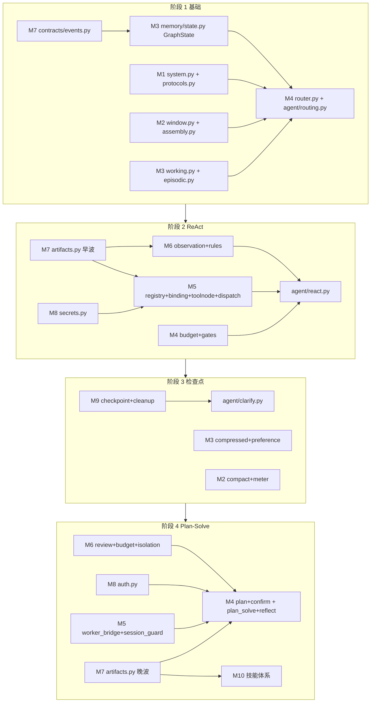

# AI 测试与评估平台 — Harness 团队开发与联调规划

| 项 | 内容 |
| :--- | :--- |
| 文档名称 | Harness 团队开发与联调规划 |
| 版本 | V1.2 |
| 审查日期 | 2026-08-23 |
| 文档性质 | 施工排期与协作规范（指导性文档） |
| 适用范围 | Harness 运行时阶段 1–4 的 2 人后端分工 + 前端联调任务、模块分配、联调时序与验收闸门 |
| 事实来源 | [`docs/AI测试与评估平台-Harness需求文档.md`](AI测试与评估平台-Harness需求文档.md) §9.3 文件生成清单 + 10 份模块设计文档（M1–M10） + [`docs/AI测试与评估平台-API.md`](AI测试与评估平台-API.md) V1.21 |

> **阅读关系**：本文是 Harness 需求文档 §9.3 施工蓝图的**团队协作落地版**，回答"谁在哪个阶段做哪些文件、何时联调、验收什么"；模块签名与红线以 10 份模块设计文档与 Harness 需求文档 §7 为准，本文不新增任何契约或字段。

> **V1.1 修订定位**：新增 §3「模块分配总表」，按"谁主导"汇总 A/B 两人各模块归属（M3/M4/M7 跨阶段分担处拆到子文件级），作为 §4 阶段分工明细的总览索引。不改需求范围，不新增对外字段。

> **V1.2 修订定位**：新增 §5「前端联调任务（按阶段）」—— 前端工作由 **陈东超** 独立负责（区别于 A/B 后端分工），按阶段 1–4 列出前端改动文件、对接契约（API.md V1.21）、验收点与阻塞依赖；§6 联调验收闸门补前端验收点；新增 §5.5「阶段 4 前置：补建 `backend/api/app/agent/defaults.py`」消除前后端确认卡默认值漂移。本次同步回写 API.md V1.21（clarify/plan 事件、tool_result/context_meter 扩展字段、clarify_reply 上行）。

---

## 1. 团队与约束

- **团队规模**：后端 2 人（下文记为 A、B，均不熟悉 LangGraph / LLM 提示词工程 / FastAPI WebSocket / PostgreSQL 检查点 / 工具沙箱安全）+ **前端联调负责人 1 人（陈东超）**，独立承担 `frontend/` 全部 Harness 联调改动。
- **角色边界**：A/B 只改 `backend/`（`app/harness/`、`app/agent/`、`app/routers/ws.py`、迁移、测试）；陈东超只改 `frontend/src/`（`views/Agent.vue`、`api/ws.ts`、`api/types.ts`、`components/agent/`、`agent/`、`schemas/`）。跨端契约以 API.md V1.21 为唯一真理，前端不臆造字段，后端不私扩事件。
- **施工基线**：阶段 0 已落地（`app/llm/` 双图 + `app/agent/graph.py` 单轮 Agent 图 + `app/routers/ws.py` 事件桥接 + `ws_events` 断线重放），从阶段 1 起填充 `app/harness/` 空包。
- **权威依据**：
  - [`docs/AI测试与评估平台-Harness需求文档.md`](AI测试与评估平台-Harness需求文档.md) §9.3 阶段 1–4 文件生成清单（施工蓝图）；
  - 10 份模块设计文档（M1 提示词工程层 … M10 技能体系），签名级 sketch + TDD 验收 + 裁决闭环；
  - [`docs/AI测试与评估平台-API.md`](AI测试与评估平台-API.md) V1.21（REST/WS 契约，含本次回写的 `clarify`/`plan`/`clarify_reply`）。
- **铁律**（继承 Harness 需求文档 §7 与 AGENTS.md）：
  - 每阶段独立 `feat/` 分支 + PR，阶段内禁"双 Agent 循环"并存；
  - 改 Model 必须配 Alembic 迁移，禁止跳迁移手改库；
  - GraphState 只放 JSON 可序列化值，`should_abort` 等回调走 `RunnableConfig` 不入 State；
  - `rag` 未接入必须失败（`VALIDATION`），禁止 mock `succeeded`；
  - 节点只返回纯数据，事件由收包循环统一 `_emit`，节点内禁持 WS 连接；
  - 前端 ContextMeter 只读 `GET /api/sessions/{id}/messages` 的 `context_meter`，自定义斜杠只打 `/api/slash-commands`，禁止 localStorage 冒充。

---

## 2. 模块依赖关系（决定并行可行性）

**依赖链一句话**：M7 契约先行 → M3 GraphState → M4 编排骨架 → M1/M2 注入 → 阶段 1 联调；阶段 2 由 M7 artifacts 早波解锁 M5/M6/M8；阶段 3 由 M9 检查点解锁 M3 派生/M2 compact/M4 clarify；阶段 4 由 M7 artifacts 晚波解锁 M4 plan/M10 + M5 worker_bridge/M8 auth/M6 review。

---

## 3. 模块分配总表（按主导人汇总）

> 下表按"谁主导"汇总 A/B 两人各模块归属。M3 / M4 / M7 跨阶段由两人分担，已拆到子文件级标注主写人。本表是 §4 阶段分工明细的总览索引。

| 模块 | 主导人 | 文件 | 阶段 |
| :--- | :--- | :--- | :--- |
| M1 提示词工程层 | **B** | `system.py` / `protocols.py` / `safety.py` | 1（system/protocols）→ 4（safety） |
| M2 上下文工程层 | **B** | `window.py` / `assembly.py` / `observation.py` / `compact.py` / `meter.py` | 1→2→3 |
| M3 记忆层 | **A + B** | `state.py`（A）· `working.py`/`episodic.py`（B）· `compressed.py`/`preference.py`（B） | 1→3 |
| M4 编排层 | **A 骨架 + B 扩展** | `router.py`/`routing.py`/`confirm.py`（A）· `budget.py`/`gates.py`/`react.py`/`clarify.py`/`plan.py`/`plan_solve.py`/`reflect.py`（B） | 1→2→3→4 |
| M5 执行层 | **A** | `registry.py` / `binding.py` / `toolnode.py` / `dispatch.py` / `worker_bridge.py` / `session_guard.py` | 2→4 |
| M6 反馈层 | **B** | `observation.py` / `rules.py` / `review.py` / `budget.py` / `isolation.py` | 2→4 |
| M7 跨层契约层 | **A** | `events.py` / `artifacts.py` 早波（A）· `artifacts.py` 晚波（B 主写） | 1→2→4 |
| M8 跨层安全 | **A** | `secrets.py` / `auth.py` | 2→4 |
| M9 运行时基础设施 | **A** | `checkpoint.py` / `cleanup.py` + Alembic | 3 |
| M10 技能体系 | **B** | `SKILL_KIND_MAP` + 4 评测域 SkillHint | 2→4 |
| **前端联调** | **陈东超** | `views/Agent.vue` / `api/ws.ts` / `api/types.ts` / `components/agent/*` / `agent/slashRegistry.ts` / `schemas/confirmCard.ts` | 1→2→3→4 |

**一句话分工**：

- **A（架构 + 执行 + 安全 + 运行时）**：M7 契约、M3 状态、M4 编排骨架、M5 执行、M8 安全、M9 运行时 —— 负责"骨架与底座"，先行为他人铺路。
- **B（提示词 + 上下文 + 反馈 + 技能 + 编排扩展）**：M1 提示词、M2 上下文、M6 反馈、M10 技能、M4 扩展节点 —— 负责"模型交互与业务能力"。
- **陈东超（前端联调负责人）**：`frontend/` 全部 Harness 联调改动 —— 负责"前后端契约对接与 UI 渲染"，依赖 API.md V1.21 契约与 A/B 后端阶段交付物。

**交接点**（A/B 间 3 处 + 前端 3 处，每日站会同步）：

| 交接模块 | A 负责 | B 负责 | 陈东超负责 | 同步时机 |
| :--- | :--- | :--- | :--- | :--- |
| M3 记忆 | `state.py`（GraphState 定义） | `working.py`/`episodic.py`/`compressed.py`/`preference.py` | — | 阶段 1 state.py 定稿后 |
| M4 编排 | `router.py`/`routing.py`/`confirm.py` | `budget.py`/`gates.py`/`react.py`/`clarify.py`/`plan.py`/`plan_solve.py`/`reflect.py` | — | 每阶段接入新节点前 |
| M7 契约 | `events.py` + `artifacts.py` 早波 | `artifacts.py` 晚波（PlanArtifact/SkillHint） | — | 阶段 2 早波定稿 / 阶段 4 晚波启动 |
| WS 事件契约 | — | — | 按 API.md §4.3 事件表渲染，发现字段缺失先回写 API.md 再实现 | 每阶段联调日前 |
| 确认卡默认值 | — | — | 以 `backend/api/app/agent/defaults.py`（阶段 4 前置补建）为唯一源，前端 `confirmCard.ts` 对齐 | 阶段 4 启动前 |
| 斜杠/技能展示 | — | — | `slashRegistry.ts` 注册 `/help`/`/cancel`/`/stress`，`skillLabels.ts` 对齐 M10 `SkillHint.summary` | 阶段 2/4 联调日 |

---

## 4. 2 人分工明细

### 4.1 阶段 1（基础攻坚，配对为主）

> 因技能不熟，前半程 A/B 配对攻克 M7 + M3 + M4 骨架（同坐或频繁 review），后半程分头。

| 人 | 模块 | 文件 | 依赖 |
| :--- | :--- | :--- | :--- |
| A | M7 跨层契约 | `app/harness/contracts/events.py` | 无（最先） |
| A | M3 记忆 | `app/harness/memory/state.py`（GraphState 可序列化） | M7 |
| A | M4 编排 | `app/harness/orchestration/router.py` + `app/agent/routing.py` + 改 `app/agent/graph.py` | M3 / M1 / M2 |
| B | M1 提示词 | `app/harness/prompts/system.py` + `protocols.py` | 无 |
| B | M2 上下文 | `app/harness/context/window.py` + `assembly.py` | M7 |
| B | M3 记忆 | `app/harness/memory/working.py` + 改 `episodic.py` | M3 state |
| 共同 | WS 桥接 | 改 `app/routers/ws.py`（图输出 → 统一 `_emit`） | M4 |

**联调点 M1**：StateGraph 跑通 Chat（无工具）+ Direct（斜杠）路径，事件桥接断言（节点不持 WS 连接、事件均经统一广播发出），`backend/api/tests/test_agent_graph.py` 路由断言绿色。

### 4.2 阶段 2（ReAct + 工具注册表，可并行）

| 人 | 模块 | 文件 |
| :--- | :--- | :--- |
| A | M5 执行 | `app/harness/execution/registry.py` + `binding.py` + `toolnode.py` + `dispatch.py` |
| A | M8 安全 | `app/harness/security/secrets.py`（递归脱敏） |
| B | M6 反馈 | `app/harness/feedback/observation.py` + `rules.py` |
| B | M4 编排 | `app/harness/orchestration/budget.py` + `gates.py` + `app/agent/react.py` + 改 `graph.py` |
| B | M2 上下文 | `app/harness/context/observation.py`（消费 M6 归一 + 调 M8 脱敏） |
| 共同 | M7 契约 | `app/harness/contracts/artifacts.py` 早波（ToolCall / ToolResult / Observation）—— A 主写，B 评审 |

**联调点 M2**：ReAct 循环跑通（agent → ToolNode → agent），每轮至多执行一个短工具（OR-4），预算 / 门禁拦截长工具（OR-6），脱敏断言（CX-3）。

### 4.3 阶段 3（Checkpointer + 澄清卡，可并行）

| 人 | 模块 | 文件 |
| :--- | :--- | :--- |
| A | M9 运行时 | `app/runtime/checkpoint.py`（PostgresSaver，`thread_id=session_id`）+ `cleanup.py` |
| A | 迁移 / 依赖 | Alembic 建检查点表 + `backend/api/requirements.txt` 加 `langgraph-checkpoint-postgres` |
| B | M3 记忆 | `app/harness/memory/compressed.py` + `preference.py` |
| B | M2 上下文 | `app/harness/context/compact.py` + `meter.py` |
| B | M4 编排 | `app/agent/clarify.py`（`interrupt()` / `Command(resume)`）+ 改 `graph.py` |

**联调点 M3**：断线重连按 `thread_id` 恢复图执行状态（检查点），澄清卡 `interrupt` → 暂停 → 用户回复 → `Command(resume)` 恢复，断言不建任务 / 不占回合预算；`/compact` 摘要 + ContextMeter 投影。

### 4.4 阶段 4（Plan-Solve + 确认卡 + Reflexion，可并行）

| 人 | 模块 | 文件 |
| :--- | :--- | :--- |
| A | M5 执行 | `app/harness/execution/worker_bridge.py`（长任务入队）+ `session_guard.py`（Worker 自管 Session） |
| A | M8 安全 | `app/harness/security/auth.py`（确认卡 owner 校验 + 行锁） |
| A | M4 编排 | `app/harness/orchestration/confirm.py`（`handle_confirm_ack`）+ 改 `ws.py` 接入 |
| B | M6 反馈 | `app/harness/feedback/review.py` + `budget.py` + `isolation.py` |
| B | M4 编排 | `app/harness/orchestration/plan.py` + `app/agent/plan_solve.py` + `app/agent/reflect.py` + 改 `graph.py` |
| B | M10 技能 | 技能体系（`SKILL_KIND_MAP` + 4 评测域 SkillHint） |
| B | M1 提示词 | `app/harness/prompts/safety.py`（注入测试） |
| 共同 | M7 契约 | `app/harness/contracts/artifacts.py` 晚波（PlanArtifact / SkillHint）—— B 主写 |

**联调点 M4**：Plan-and-Solve 执行子图跑通，确认卡 `confirm_ack` → 创建 `queued` Task → Worker 消费（先评后压），reflect 节点 pass / clarify / reject（模型核对只降级不放行），未实现 skill（`rag`）返回 `VALIDATION`。

---

## 5. 前端联调任务（按阶段）

> 本节由 **陈东超** 独立负责，与 §4 的 A/B 后端分工并行推进。所有前端改动以 API.md V1.21 契约为唯一真理，前端不臆造字段；发现契约缺失先回写 API.md 再实现。每阶段前端任务在对应后端阶段交付后启动联调，不阻塞后端开发。

### 5.1 阶段 1 前端（StateGraph Chat/Direct 路由）

| 任务 | 文件 | 对接契约 | 验收 |
| :--- | :--- | :--- | :--- |
| 补 `/help` `/cancel` `/stress` 系统斜杠注册（占位，命中由后端返回 `VALIDATION`） | `frontend/src/agent/slashRegistry.ts` | API.md §4.4 + M4 §3.6 | 面板可见三条命令；命中后 Toast 显示后端 `message` |
| 未知斜杠 `error` 事件文案对齐 | `frontend/src/api/types.ts` `ERROR_MESSAGES` | API.md §4.3 `error` | `error` 分支优先用 `payload.message`，`ERROR_MESSAGES` 仅作中性 fallback |
| `/stop` 在新图拓扑下中断流式回归验证 | — | API.md §4.4 `/stop` + M4 §3.4 | `/stop` 仍能中止 `assistant_delta` 流，不取消已 queued 任务 |

### 5.2 阶段 2 前端（ReAct 循环）

| 任务 | 文件 | 对接契约 | 验收 |
| :--- | :--- | :--- | :--- |
| `thought.stage='react'` + `skill_id` 渲染联调 | `frontend/src/components/agent/ThoughtCard.vue`、`frontend/src/agent/skillLabels.ts` | API.md §4.3 `thought` + M7 §3.6.1 | 思考卡显示「正在使用技能」/「已完成 ToolCall」；`skill_id` 与 `skillLabels.ts` 4 个 key 匹配 |
| `tool_call`/`tool_result` 字段对齐验证 | — | API.md §4.3 + M7 §3.6.2 | ToolCard pending→done 三态正常；`latency_ms` 展示 |
| `tool_result` 截断/脱敏徽标 | `frontend/src/components/agent/ToolCard.vue` | API.md §4.3 `tool_result`（V1.21 新增 `truncated`/`source`/`redacted`） | `truncated=true` 显示「结果已截断」徽标；`redacted=true` 显示「已脱敏」徽标 |
| `BUDGET_EXCEEDED` 文案修正 | `frontend/src/api/types.ts` | API.md §1.3 + M4 §3.9.5 `Budget` | fallback 文案改为中性（如「操作未完成，详见提示」），场景文案由后端 `message` 提供（预算为次数预算非美元） |

### 5.3 阶段 3 前端（Checkpointer + 澄清卡 + ContextMeter + /compact）

| 任务 | 文件 | 对接契约 | 验收 |
| :--- | :--- | :--- | :--- |
| **澄清卡 UI（独立 ClarifyCard 组件）** | 新增 `frontend/src/components/agent/ClarifyCard.vue`；改 `frontend/src/views/Agent.vue` `handleWsEvent` 加 `clarify` 分支；`frontend/src/api/types.ts` 加 `ClarifyEvent`/`ClarifyReply` 类型 | API.md §4.3 `clarify` + §4.4 `clarify_reply`（V1.21 新增）+ M4 §3.9.6 + M9 §3.5.1 | 澄清卡渲染 question/options；用户回复上行 `clarify_reply`；断线重连后由 `ws_events` 回放重建卡；不建任务、不写 `pending_confirm` |
| `clarify_reply` 上行实现 | `frontend/src/api/ws.ts` 加 `sendClarifyReply(id, answer)` | API.md §4.4 | `id` 匹配最近待回复澄清卡；不匹配时后端返回 `error(VALIDATION)`，前端 Toast |
| `/compact` owner 客户端预校验 + 执行后刷新 | `frontend/src/views/Agent.vue` `handleSlashSelect` | API.md §4.4 `/compact` owner 限制 + M2 §3.5 | 非 owner 提交时 Toast「仅会话 owner 可压缩」；执行后刷新 `currentCompactSummary` 与 `context_meter` |
| ContextMeter `compact_summary` 展示 | `frontend/src/components/agent/ContextMeter.vue` | API.md §3.4 `compact_summary` + M2 §3.5 | 摘要存在时显示压缩徽标/提示 |
| ContextMeter `compacted` 字段对接 | `frontend/src/components/agent/ContextMeter.vue` `ContextMeterData` | API.md §3.4 `context_meter.compacted`（V1.21 新增）+ M2 §3.7.5 | `compacted=true` 时展示「已压缩」状态徽标 |
| 检查点断线重连验证（前端无感） | — | M9 §3.2 + API.md §4.1 | `last_event_id` 补发仍生效；澄清卡 `interrupt()` 期间断线重连后能回放看到澄清卡 |

### 5.4 阶段 4 前端（Plan-Solve + 确认卡 confirm_ack + reflect + 技能）

| 任务 | 文件 | 对接契约 | 验收 |
| :--- | :--- | :--- | :--- |
| `harnessStage` 补 `plan_solve` 档 | `frontend/src/views/Agent.vue:878,884` | M4 §3.5 模式路由 + M7 `NodeEventKind` | stage 显示「Plan-Solve 执行中」 |
| **PlanArtifact 展示（完整可见）** | 新增 `frontend/src/components/agent/PlanCard.vue`；改 `Agent.vue` `handleWsEvent` 加 `plan` 分支；`api/types.ts` 加 `PlanEvent` 类型 | API.md §4.3 `plan`（V1.21 新增）+ M7 §3.6.2 `PlanArtifact` | PlanCard 展示 intent/skill_id/slots/tools_needed/budget/delivery/allows_replan；用户可查看无需 ack |
| `confirm_ack` 阶段 4 联调验证 | — | API.md §4.4 + M4 §3.9.5 `handle_confirm_ack` | `confirm_ack` 事件回执 `task_id` 被前端正确忽略（只读 `ok`） |
| 非 owner 确认 `UNAUTHORIZED` 文案对齐 | `frontend/src/api/types.ts` | M8 §3.6.2 `assert_confirm_owner` + API.md §1.3 | fallback 中性化，场景文案由后端 `message` 提供 |
| 并发确认 `CONCURRENCY` 场景化文案 | `frontend/src/api/types.ts` | M8 §3.6.2 + API.md §1.3 | 确认卡场景文案为「确认卡已被他人处理」，不与「平台并发已满」混淆 |
| `SkillHint.summary` 展示 | `frontend/src/agent/skillLabels.ts`、`frontend/src/components/agent/SkillBadge.vue`、`frontend/src/components/modals/SkillDetailModal.vue` | M7 §3.6.2 `SkillHint` + API.md §4.3 `thought.skill_id` | 技能徽标 hover/点击展示一句话 summary |
| `/api/slash-commands` 自定义命令对接 | `frontend/src/components/agent/SlashPalette.vue`、`frontend/src/api/http.ts` | API.md §3.4 | 调 `GET /api/slash-commands` 渲染下区「我的命令」；M1 桩返回 `VALIDATION` 时隐藏 |
| `/api/agent/prefs` 确认卡预填 | `frontend/src/views/Agent.vue` | API.md §3.4 | 新建会话首单预填上次选择 |
| reflect 进度展示验证 | — | M4 §3.9.6 `reflect_node` + API.md §4.3 `thought` | `thought.stage='reflect'` 显示「复核中」/「已复核」 |

### 5.5 阶段 4 前置：补建 `backend/api/app/agent/defaults.py`

> AGENTS.md §5.3.3 声明「确认卡默认值唯一来源在 `backend/api/app/agent/defaults.py`」，但该文件当前**不存在**，导致前端 `confirmCard.ts` `getDefaultRunConfig`（`sample_size=1000`）与后端 `schemas.py` `RunConfig`（`sample_size=None`）漂移。本项为阶段 4 启动前的硬前置，由 **A** 负责（属后端 M4 编排范畴）。

| 任务 | 文件 | 验收 |
| :--- | :--- | :--- |
| 新建 `defaults.py`，导出 `DEFAULT_TASK_SPEC`（含 `sample_size`/`with_stress`/`stress` 等所有确认卡字段默认值） | `backend/api/app/agent/defaults.py` | 字段与 `schemas.py` `RunConfig`/`TaskSpec` 对齐；`sample_size` 默认值明确（建议 `None`，由用户必填） |
| 后端 `schemas.py`/`harness.py` 引用 `defaults.py` | `backend/api/app/schemas.py`、`backend/api/app/agent/harness.py` | 确认卡下发时默认值来自 `defaults.py` 单一源 |
| 前端 `confirmCard.ts` 对齐 `defaults.py` | `frontend/src/schemas/confirmCard.ts` | 前端 `getDefaultRunConfig` 默认值与后端一致，消除 `sample_size=1000` 漂移 |

### 5.6 跨阶段共性任务

| 任务 | 文件 | 对接契约 | 验收 |
| :--- | :--- | :--- | :--- |
| 关闭码 4401 显式处理 + Toast | `frontend/src/api/ws.ts` `onclose` | API.md §4.1 | 4401 显式分支 + Toast「短票过期，重新连接中」+ 重新领票 |
| 关闭码 4404 UI 清理 | `frontend/src/api/ws.ts`、`frontend/src/views/Agent.vue` `onClosed` | API.md §4.1 | 4404 时 `currentSessionId=null` + 跳转会话列表 |
| 确认卡两套实现合并 | `frontend/src/views/Agent.vue`（内联卡）、`frontend/src/components/agent/ConfirmCard.vue` | API.md §5/§6 + `defaults.py` | 统一为一套，默认值以 `defaults.py` 为唯一源 |
| 错误码 fallback 文案中性化 | `frontend/src/api/types.ts` `ERROR_MESSAGES` | API.md §1.3 | 10 大码 fallback 改为中性（如「操作未完成，详见提示」），场景文案由后端 `message` 透传 |

---

## 6. 联调时序与验收闸门

每阶段末设统一联调日，A/B 合后端分支、陈东超合前端分支跑全链路。联调日禁止新功能合入，只修 bug。

| 闸门 | 时点 | 后端验收内容（A/B） | 前端验收内容（陈东超） | 阻塞条件（不通过即返工） |
| :--- | :--- | :--- | :--- | :--- |
| M1 | 阶段 1 末 | Chat / Direct 路由 + 事件桥接 + `test_agent_graph.py` 绿 | `/help`/`/cancel`/`/stress` 斜杠可见；未知斜杠 Toast 显示后端 `message` | 节点持 WS 连接 / 事件不经统一 `_emit` / 前端臆造字段 |
| M2 | 阶段 2 末 | ReAct 循环 + 工具注册表 + 脱敏 + 预算 / 门禁 | `thought.stage='react'` 思考卡正常；`tool_result` 截断/脱敏徽标；`BUDGET_EXCEEDED` 文案中性 | 长工具被同步执行 / 重复调用未抑制 / 前端展示美元预算 |
| M3 | 阶段 3 末 | Checkpointer 恢复 + 澄清卡 + compact / meter | 澄清卡 UI 渲染 + `clarify_reply` 上行；`/compact` owner 校验；ContextMeter `compact_summary`/`compacted` 展示 | 检查点表未走 Alembic / 澄清卡建任务 / `compacted` 字段未对接 |
| M4 | 阶段 4 末 | Plan-Solve + 确认卡入队 + reflect + 技能 | `plan_solve` stage 档；PlanCard 完整展示 PlanArtifact；`/api/slash-commands` 对接；`/api/agent/prefs` 预填；`defaults.py` 前置完成 | `rag` 被 mock 成功 / 确认卡无 owner 校验 / `defaults.py` 缺失致前后端默认值漂移 |

---

## 7. 分支与协作规范

- **分支模型**：每阶段开 1 条主干分支（如 `feat/agent-stage1`），A/B 在其下开个人子分支（`feat/agent-stage1-A` / `feat/agent-stage1-B`），陈东超开前端子分支（`feat/agent-stage1-frontend`），阶段末合到主干分支再提 1 个 PR 到 `main`。`main` 只接受已审查合并，禁止在 `main` 上直接开发。
- **契约同步**：每日站会同步依赖契约变更。M7（contracts）与 M3（state.py）的改动需 A/B 双方对齐后再合入，避免下游 ImportError；WS 事件契约变更需陈东超同步，前端发现字段缺失先回写 API.md 再实现。
- **联调纪律**：联调日禁止新功能合入，只修 bug；联调前各自跑通本地自检门禁。
- **本地自检门禁**（提交前强制）：
  - 后端 API：`cd backend/api && ruff check . ../shared && pytest`
  - 后端 Worker：`cd backend/worker && PYTHONPATH=.:.. pytest`（Windows 用 `set PYTHONPATH=.;..`）
  - 前端：`cd frontend && npm run typecheck && npm run build`
- **提交规范**：`<type>(<scope>): <中文描述>`，如 `feat(agent): 新增模式路由节点与条件边`、`feat(web): 新增澄清卡组件与 clarify_reply 上行`。

---

## 8. 修改代码文件与作用清单

| 文件 | 操作 | 作用 |
| :--- | :--- | :--- |
| `docs/AI测试与评估平台-API.md` | 修订 V1.20 → V1.21 | 配合 Harness 阶段 3/4 前端联调回写契约：§4.3 新增 `clarify`（澄清卡，不建任务/不写 pending_confirm）、`plan`（PlanArtifact 完整下发）事件，扩展 `tool_result` 加 `truncated`/`source`/`redacted` 三可选字段；§3.4 `context_meter` 加 `compacted` bool 并补说明；§4.4 新增 `clarify_reply` 上行事件并明确四类上行事件边界（`user_message`/`confirm_ack`/`cancel_task`/`clarify_reply`）。解除前端澄清卡/PlanArtifact/截断脱敏徽标实现的契约阻塞。 |
| `docs/AI测试与评估平台-Harness团队开发与联调规划.md` | 修订 V1.1 → V1.2 | V1.1 把 Harness 需求文档 §9.3 施工蓝图落地为 2 人团队的可执行排期。V1.2 新增 §5「前端联调任务（按阶段）」：前端工作由陈东超独立负责（区别于 A/B 后端分工），按阶段 1–4 列出前端改动文件、对接契约（API.md V1.21）、验收点与阻塞依赖；§6 联调验收闸门拆分后端/前端验收点；新增 §5.5「阶段 4 前置：补建 `backend/api/app/agent/defaults.py`」消除前后端确认卡默认值漂移；§7 分支规范补前端子分支与前端自检门禁。本次同步回写 API.md V1.21。本文不新增任何对外 REST/WS 字段（API.md 回写部分除外），模块签名以 10 份模块设计文档为准。 |

本次仅修订文档（API.md 契约回写 + 团队规划增补前端联调章节），不改变任何后端/前端/数据库运行代码。
