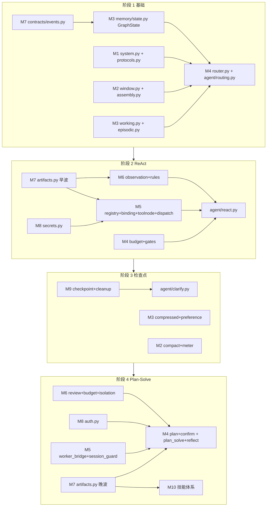

# AI 测试与评估平台 — Harness 团队开发与联调规划

| 项 | 内容 |
| :--- | :--- |
| 文档名称 | Harness 团队开发与联调规划 |
| 版本 | V1.1 |
| 审查日期 | 2026-08-23 |
| 文档性质 | 施工排期与协作规范（指导性文档） |
| 适用范围 | Harness 运行时阶段 1–4 的 2 人团队分工、模块分配、联调时序与验收闸门 |
| 事实来源 | [`docs/AI测试与评估平台-Harness需求文档.md`](AI测试与评估平台-Harness需求文档.md) §9.3 文件生成清单 + 10 份模块设计文档（M1–M10） |

> **阅读关系**：本文是 Harness 需求文档 §9.3 施工蓝图的**团队协作落地版**，回答"谁在哪个阶段做哪些文件、何时联调、验收什么"；模块签名与红线以 10 份模块设计文档与 Harness 需求文档 §7 为准，本文不新增任何契约或字段。

> **V1.1 修订定位**：新增 §3「模块分配总表」，按"谁主导"汇总 A/B 两人各模块归属（M3/M4/M7 跨阶段分担处拆到子文件级），作为 §4 阶段分工明细的总览索引。不改需求范围，不新增对外字段。

---

## 1. 团队与约束

- **团队规模**：2 人（下文记为 A、B），均不熟悉 LangGraph / LLM 提示词工程 / FastAPI WebSocket / PostgreSQL 检查点 / 工具沙箱安全。
- **施工基线**：阶段 0 已落地（`app/llm/` 双图 + `app/agent/graph.py` 单轮 Agent 图 + `app/routers/ws.py` 事件桥接 + `ws_events` 断线重放），从阶段 1 起填充 `app/harness/` 空包。
- **权威依据**：
  - [`docs/AI测试与评估平台-Harness需求文档.md`](AI测试与评估平台-Harness需求文档.md) §9.3 阶段 1–4 文件生成清单（施工蓝图）；
  - 10 份模块设计文档（M1 提示词工程层 … M10 技能体系），签名级 sketch + TDD 验收 + 裁决闭环。
- **铁律**（继承 Harness 需求文档 §7 与 AGENTS.md）：
  - 每阶段独立 `feat/` 分支 + PR，阶段内禁"双 Agent 循环"并存；
  - 改 Model 必须配 Alembic 迁移，禁止跳迁移手改库；
  - GraphState 只放 JSON 可序列化值，`should_abort` 等回调走 `RunnableConfig` 不入 State；
  - `rag` 未接入必须失败（`VALIDATION`），禁止 mock `succeeded`；
  - 节点只返回纯数据，事件由收包循环统一 `_emit`，节点内禁持 WS 连接。

---

## 2. 模块依赖关系（决定并行可行性）

**依赖链一句话**：M7 契约先行 → M3 GraphState → M4 编排骨架 → M1/M2 注入 → 阶段 1 联调；阶段 2 由 M7 artifacts 早波解锁 M5/M6/M8；阶段 3 由 M9 检查点解锁 M3 派生/M2 compact/M4 clarify；阶段 4 由 M7 artifacts 晚波解锁 M4 plan/M10 + M5 worker_bridge/M8 auth/M6 review。

---

## 3. 模块分配总表（按主导人汇总）

> 下表按"谁主导"汇总 A/B 两人各模块归属。M3 / M4 / M7 跨阶段由两人分担，已拆到子文件级标注主写人。本表是 §4 阶段分工明细的总览索引。

| 模块 | 主导人 | 文件 | 阶段 |
| :--- | :--- | :--- | :--- |
| M1 提示词工程层 | **B** | `system.py` / `protocols.py` / `safety.py` | 1（system/protocols）→ 4（safety） |
| M2 上下文工程层 | **B** | `window.py` / `assembly.py` / `observation.py` / `compact.py` / `meter.py` | 1→2→3 |
| M3 记忆层 | **A + B** | `state.py`（A）· `working.py`/`episodic.py`（B）· `compressed.py`/`preference.py`（B） | 1→3 |
| M4 编排层 | **A 骨架 + B 扩展** | `router.py`/`routing.py`/`confirm.py`（A）· `budget.py`/`gates.py`/`react.py`/`clarify.py`/`plan.py`/`plan_solve.py`/`reflect.py`（B） | 1→2→3→4 |
| M5 执行层 | **A** | `registry.py` / `binding.py` / `toolnode.py` / `dispatch.py` / `worker_bridge.py` / `session_guard.py` | 2→4 |
| M6 反馈层 | **B** | `observation.py` / `rules.py` / `review.py` / `budget.py` / `isolation.py` | 2→4 |
| M7 跨层契约层 | **A** | `events.py` / `artifacts.py` 早波（A）· `artifacts.py` 晚波（B 主写） | 1→2→4 |
| M8 跨层安全 | **A** | `secrets.py` / `auth.py` | 2→4 |
| M9 运行时基础设施 | **A** | `checkpoint.py` / `cleanup.py` + Alembic | 3 |
| M10 技能体系 | **B** | `SKILL_KIND_MAP` + 4 评测域 SkillHint | 2→4 |

**一句话分工**：

- **A（架构 + 执行 + 安全 + 运行时）**：M7 契约、M3 状态、M4 编排骨架、M5 执行、M8 安全、M9 运行时 —— 负责"骨架与底座"，先行为他人铺路。
- **B（提示词 + 上下文 + 反馈 + 技能 + 编排扩展）**：M1 提示词、M2 上下文、M6 反馈、M10 技能、M4 扩展节点 —— 负责"模型交互与业务能力"。

**交接点**（仅 3 处，每日站会同步）：

| 交接模块 | A 负责 | B 负责 | 同步时机 |
| :--- | :--- | :--- | :--- |
| M3 记忆 | `state.py`（GraphState 定义） | `working.py`/`episodic.py`/`compressed.py`/`preference.py` | 阶段 1 state.py 定稿后 |
| M4 编排 | `router.py`/`routing.py`/`confirm.py` | `budget.py`/`gates.py`/`react.py`/`clarify.py`/`plan.py`/`plan_solve.py`/`reflect.py` | 每阶段接入新节点前 |
| M7 契约 | `events.py` + `artifacts.py` 早波 | `artifacts.py` 晚波（PlanArtifact/SkillHint） | 阶段 2 早波定稿 / 阶段 4 晚波启动 |

---

## 4. 2 人分工明细

### 4.1 阶段 1（基础攻坚，配对为主）

> 因技能不熟，前半程 A/B 配对攻克 M7 + M3 + M4 骨架（同坐或频繁 review），后半程分头。

| 人 | 模块 | 文件 | 依赖 |
| :--- | :--- | :--- | :--- |
| A | M7 跨层契约 | `app/harness/contracts/events.py` | 无（最先） |
| A | M3 记忆 | `app/harness/memory/state.py`（GraphState 可序列化） | M7 |
| A | M4 编排 | `app/harness/orchestration/router.py` + `app/agent/routing.py` + 改 `app/agent/graph.py` | M3 / M1 / M2 |
| B | M1 提示词 | `app/harness/prompts/system.py` + `protocols.py` | 无 |
| B | M2 上下文 | `app/harness/context/window.py` + `assembly.py` | M7 |
| B | M3 记忆 | `app/harness/memory/working.py` + 改 `episodic.py` | M3 state |
| 共同 | WS 桥接 | 改 `app/routers/ws.py`（图输出 → 统一 `_emit`） | M4 |

**联调点 M1**：StateGraph 跑通 Chat（无工具）+ Direct（斜杠）路径，事件桥接断言（节点不持 WS 连接、事件均经统一广播发出），`backend/api/tests/test_agent_graph.py` 路由断言绿色。

### 4.2 阶段 2（ReAct + 工具注册表，可并行）

| 人 | 模块 | 文件 |
| :--- | :--- | :--- |
| A | M5 执行 | `app/harness/execution/registry.py` + `binding.py` + `toolnode.py` + `dispatch.py` |
| A | M8 安全 | `app/harness/security/secrets.py`（递归脱敏） |
| B | M6 反馈 | `app/harness/feedback/observation.py` + `rules.py` |
| B | M4 编排 | `app/harness/orchestration/budget.py` + `gates.py` + `app/agent/react.py` + 改 `graph.py` |
| B | M2 上下文 | `app/harness/context/observation.py`（消费 M6 归一 + 调 M8 脱敏） |
| 共同 | M7 契约 | `app/harness/contracts/artifacts.py` 早波（ToolCall / ToolResult / Observation）—— A 主写，B 评审 |

**联调点 M2**：ReAct 循环跑通（agent → ToolNode → agent），每轮至多执行一个短工具（OR-4），预算 / 门禁拦截长工具（OR-6），脱敏断言（CX-3）。

### 4.3 阶段 3（Checkpointer + 澄清卡，可并行）

| 人 | 模块 | 文件 |
| :--- | :--- | :--- |
| A | M9 运行时 | `app/runtime/checkpoint.py`（PostgresSaver，`thread_id=session_id`）+ `cleanup.py` |
| A | 迁移 / 依赖 | Alembic 建检查点表 + `backend/api/requirements.txt` 加 `langgraph-checkpoint-postgres` |
| B | M3 记忆 | `app/harness/memory/compressed.py` + `preference.py` |
| B | M2 上下文 | `app/harness/context/compact.py` + `meter.py` |
| B | M4 编排 | `app/agent/clarify.py`（`interrupt()` / `Command(resume)`）+ 改 `graph.py` |

**联调点 M3**：断线重连按 `thread_id` 恢复图执行状态（检查点），澄清卡 `interrupt` → 暂停 → 用户回复 → `Command(resume)` 恢复，断言不建任务 / 不占回合预算；`/compact` 摘要 + ContextMeter 投影。

### 4.4 阶段 4（Plan-Solve + 确认卡 + Reflexion，可并行）

| 人 | 模块 | 文件 |
| :--- | :--- | :--- |
| A | M5 执行 | `app/harness/execution/worker_bridge.py`（长任务入队）+ `session_guard.py`（Worker 自管 Session） |
| A | M8 安全 | `app/harness/security/auth.py`（确认卡 owner 校验 + 行锁） |
| A | M4 编排 | `app/harness/orchestration/confirm.py`（`handle_confirm_ack`）+ 改 `ws.py` 接入 |
| B | M6 反馈 | `app/harness/feedback/review.py` + `budget.py` + `isolation.py` |
| B | M4 编排 | `app/harness/orchestration/plan.py` + `app/agent/plan_solve.py` + `app/agent/reflect.py` + 改 `graph.py` |
| B | M10 技能 | 技能体系（`SKILL_KIND_MAP` + 4 评测域 SkillHint） |
| B | M1 提示词 | `app/harness/prompts/safety.py`（注入测试） |
| 共同 | M7 契约 | `app/harness/contracts/artifacts.py` 晚波（PlanArtifact / SkillHint）—— B 主写 |

**联调点 M4**：Plan-and-Solve 执行子图跑通，确认卡 `confirm_ack` → 创建 `queued` Task → Worker 消费（先评后压），reflect 节点 pass / clarify / reject（模型核对只降级不放行），未实现 skill（`rag`）返回 `VALIDATION`。

---

## 5. 联调时序与验收闸门

每阶段末设统一联调日，2 人合分支跑全链路。联调日禁止新功能合入，只修 bug。

| 闸门 | 时点 | 验收内容 | 阻塞条件（不通过即返工） |
| :--- | :--- | :--- | :--- |
| M1 | 阶段 1 末 | Chat / Direct 路由 + 事件桥接 + `test_agent_graph.py` 绿 | 节点持 WS 连接 / 事件不经统一 `_emit` |
| M2 | 阶段 2 末 | ReAct 循环 + 工具注册表 + 脱敏 + 预算 / 门禁 | 长工具被同步执行 / 重复调用未抑制 |
| M3 | 阶段 3 末 | Checkpointer 恢复 + 澄清卡 + compact / meter | 检查点表未走 Alembic / 澄清卡建任务 |
| M4 | 阶段 4 末 | Plan-Solve + 确认卡入队 + reflect + 技能 | `rag` 被 mock 成功 / 确认卡无 owner 校验 |

---

## 6. 分支与协作规范

- **分支模型**：每阶段开 1 条主干分支（如 `feat/agent-stage1`），2 人在其下开个人子分支（`feat/agent-stage1-A` / `feat/agent-stage1-B`），阶段末合到主干分支再提 1 个 PR 到 `main`。`main` 只接受已审查合并，禁止在 `main` 上直接开发。
- **契约同步**：每日站会同步依赖契约变更。M7（contracts）与 M3（state.py）的改动需 A/B 双方对齐后再合入，避免下游 ImportError。
- **联调纪律**：联调日禁止新功能合入，只修 bug；联调前各自跑通本地自检门禁。
- **本地自检门禁**（提交前强制）：
  - 后端 API：`cd backend/api && ruff check . ../shared && pytest`
  - 后端 Worker：`cd backend/worker && PYTHONPATH=.:.. pytest`（Windows 用 `set PYTHONPATH=.;..`）
- **提交规范**：`<type>(<scope>): <中文描述>`，如 `feat(agent): 新增模式路由节点与条件边`。

---

## 7. 修改代码文件与作用清单

| 文件 | 操作 | 作用 |
| :--- | :--- | :--- |
| `docs/AI测试与评估平台-Harness团队开发与联调规划.md` | 新增（V1.0）→ 修订 V1.1 | V1.0 把 Harness 需求文档 §9.3 施工蓝图落地为 2 人团队的可执行排期：模块依赖图、阶段内 A/B 分工明细、4 个联调验收闸门、分支与协作规范。V1.1 新增 §3「模块分配总表」：按"谁主导"汇总 A/B 各模块归属（M3/M4/M7 跨阶段分担处拆到子文件级），并给出 3 处交接点同步时机，作为 §4 阶段分工明细的总览索引。本文不新增任何对外 REST/WS 字段，不改变已落地基线，模块签名以 10 份模块设计文档为准。 |

本次仅新增排期文档，不改变任何 API、数据库、前端或 Agent 运行代码。
