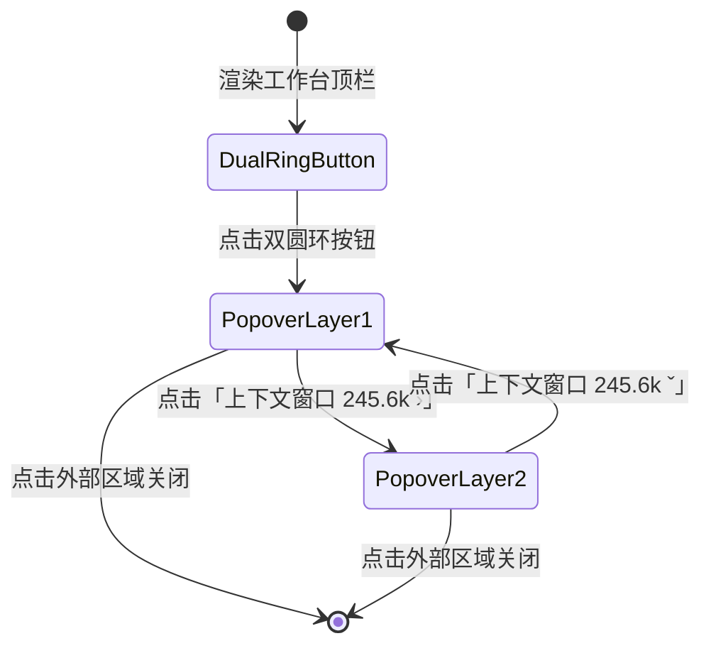

# AI 测试与评估平台 — 上下文双圆环与容量度量技术方案 (V1.0)

> **版本**：V1.0  
> **审查日期**：2026-08-20  
> **状态**：方案制定中（待确认后实施）

---

## 1. 需求背景与目标拆解 (Requirement Analysis)

用户要求对智能体对话工作台顶栏的上下文指示器进行全面视觉与交互重构：

1. **删除旧版文本胶囊**：
   - 彻底移除原有的旧版文本卡片 `[● 上下文 消息 4 · 技能 0 · 摘要 0 · 余量 16 / 20]`。
2. **引入双圆环环形进度条（SVG Dual-Ring Meter）**：
   - **底层背景环**：浅灰色 `#E5E7EB` / `rgba(255,255,255,0.12)`，表示当前模型上下文容量上限（100%）。
   - **上层进度环**：动态环形进度条（SVG `stroke-dasharray` / `stroke-dashoffset`），精准展示当前已消耗 Token 的百分比。
   - **三色健康度阶梯**：
     - **$< 50\%$（充裕）**：蓝色 `#2F8DEA`
     - **$50\% \sim 80\%$（适中）**：橙色 `#EA9B2C`
     - **$\ge 80\%$（紧缺/告警）**：红色 `#D03B3B`
     - 圆环颜色与弹窗进度条颜色严格联动。
3. **分层弹窗交互（Popover Layer 1 & Layer 2）**：
   - **第 1 层视图（折叠概览，参考图片 1）**：
     - 标题展示「上下文窗口」，右侧展示已用 Token 总量及右箭头（如 `245.6k ›`）；
     - 下方横向彩色线性进度条（颜色与百分比阶梯对齐）；
     - 点击卡片整体或右箭头，平滑展开进入第 2 层。
   - **第 2 层视图（展开细分明细，参考图片 2）**：
     - 标题展示「上下文窗口」，右侧展示 `245.6k ˇ`（向下箭头，点击可折叠回第 1 层）；
     - 横向彩色线性进度条；
     - 细分指标列表：
       - ■ `Messages`（消息 Token 数 / 占比，例如 `198.0k 99.0%`）
       - ■ `Skills`（技能 Token 数 / 占比，例如 `2.0k 1.0%`）
       - ▢ `Free space`（剩余可用空间 / 占比，例如 `0 0.0%`）
       - › `MCP工具`（已挂载工具数 / 上限，例如 `0 / 28`）
       - › `记忆文件`（记忆文件数 / 上限，例如 `0 / 1`）
4. **模型协议档上下文窗口长度配置（Profile Settings）**：
   - 在模型协议档管理（`AdminProfiles.vue` / `ProfileModal.vue`）中增加上下文窗口配置项；
   - 默认选项：`200k`（200,000 Tokens）；
   - 备选项：`200k`、`256k`、`500k`、`1M`（1,000,000 Tokens）；
   - 交互样式：单选勾选框（Radio / Checkbox Group）。

---

## 2. 交互与视觉架构设计 (UI/UX Architecture)

### 2.1 状态流转图


### 2.2 双圆环 SVG 参数设计
- **SVG 尺寸**：`viewBox="0 0 36 36"`，直径 `28px`；
- **圆心与半径**：`cx="18" cy="18" r="14"`；
- **周长计算**：$C = 2 \times \pi \times 14 \approx 87.9646$；
- **底层背景环**：`stroke="#E5E7EB"`（深色模式 `rgba(255,255,255,0.12)`），`stroke-width="3.2"`；
- **上层动态环**：
  - `stroke-dasharray="87.96 87.96"`；
  - `stroke-dashoffset = 87.96 * (1 - used_ratio)`；
  - `transform="rotate(-90 18 18)"`（从 12 点钟方向顺时针绘制）；
  - `stroke-linecap="round"`；
  - 动态过渡：`transition: stroke-dashoffset 0.4s ease, stroke 0.3s ease`。

### 2.3 颜色阶梯对照表
| 使用率区间 | 视觉等级 | 状态色 | 色值十六进制 | 语义说明 |
| :--- | :---: | :---: | :---: | :--- |
| $0\% \le \text{ratio} < 50\%$ | 充裕 (Normal) | 蓝色 | `#2F8DEA` | 上下文充足，对话与记忆安全 |
| $50\% \le \text{ratio} < 80\%$ | 适中 (Moderate) | 橙色 | `#EA9B2C` | 已进入半程，建议关注上下文利用 |
| $80\% \le \text{ratio} \le 100\%$ | 告警 (Tight) | 红色 | `#D03B3B` | 接近上限，即将触发自动压缩/淘汰 |

---

## 3. 前后端数据结构设计 (Data Schema)

### 3.1 协议档模型扩展 (`Profile`)
在 `models.py` 与 `schemas.py` 中为协议档增加 `context_window` 字段（单位为 Tokens 整数）：

```python
# models.py
class Profile(Base):
    ...
    context_window = Column(Integer, nullable=False, default=200_000)  # 200k, 256k, 500k, 1M
```

| 选项标识 | Token 数值 (int) | 显示文案 | 适用典型模型 |
| :--- | :---: | :--- | :--- |
| `200k` (默认) | `200_000` | `200k (默认)` | Claude 3.5 / GPT-4o / DeepSeek-V3 |
| `256k` | `256_000` | `256k` | Qwen 2.5 32B/72B |
| `500k` | `500_000` | `500k` | GLM-4 Long / Moonshot |
| `1M` | `1_000_000` | `1M` | Gemini 1.5 Pro / Kimi 1M |

### 3.2 上下文度量接口响应扩展 (`ContextMeterData`)
后端 `GET /api/sessions/{id}/messages` 返回的 `context_meter` 扩展字段定义：

```typescript
export interface ContextMeterData {
  // Token 绝对数量
  total_tokens?: number        // 已使用总 Token 数（例如 245600）
  max_tokens?: number          // 最大上下文窗口（例如 256000，取自当前 Profile）
  messages_tokens?: number     // 消息占用 Token 数（例如 198000）
  skills_tokens?: number       // 技能占用 Token 数（例如 2000）
  free_tokens?: number         // 剩余可用 Token 数（例如 0）

  // 百分比与占比
  used_percent?: number        // 总已用百分比（0 ~ 100，如 96.0）
  messages_percent?: number    // 消息占比（如 99.0）
  skills_percent?: number      // 技能占比（如 1.0）
  free_percent?: number        // 剩余占比（如 0.0）

  // 工具与记忆资源项
  mcp_tools_count?: number     // 当前已加载 MCP 工具数（如 0）
  mcp_tools_max?: number       // MCP 工具上限（如 28）
  memory_files_count?: number  // 当前记忆文件数（如 0）
  memory_files_max?: number    // 记忆文件上限（如 1）

  // 兼容旧版消息条数度量（若有）
  messages?: number
  skills?: number
  summary?: number
  headroom?: number
  window?: number
}
```

---

## 4. 前端组件实现方案 (Frontend Implementation)

### 4.1 组件重构：`frontend/src/components/agent/ContextMeter.vue`
- **触发器模板**：
  ```html
  <n-popover trigger="click" placement="bottom-end" :width="300" raw :show-arrow="false">
    <template #trigger>
      <button class="context-ring-btn" :title="`上下文窗口已使用 ${usedRatioText}`">
        <svg class="ring-svg" viewBox="0 0 36 36">
          <!-- 底层浅灰背景环 -->
          <circle class="ring-bg" cx="18" cy="18" r="14" />
          <!-- 上层动态彩色进度环 -->
          <circle
            class="ring-fill"
            cx="18"
            cy="18"
            r="14"
            :stroke="activeColor"
            :stroke-dasharray="strokeDasharray"
            :stroke-dashoffset="strokeDashoffset"
          />
        </svg>
        <span class="ring-percent mono" :style="{ color: activeColor }">{{ usedPercentText }}</span>
      </button>
    </template>

    <!-- 弹窗容器 -->
    <div class="context-card-popover">
      <!-- 头部：上下文窗口与已用量 -->
      <div class="context-card-header" @click="isExpanded = !isExpanded">
        <div class="header-left">上下文窗口</div>
        <div class="header-right">
          <span class="tokens-num mono">{{ formattedTotalTokens }}</span>
          <svg class="chevron-icon" :class="{ expanded: isExpanded }" width="12" height="12" viewBox="0 0 24 24">
            <polyline points="9 18 15 12 9 6" />
          </svg>
        </div>
      </div>

      <!-- 横向彩色进度条 -->
      <div class="progress-track">
        <div class="progress-fill" :style="{ width: `${clampedPercent}%`, background: activeColor }"></div>
      </div>

      <!-- 第 2 层展开明细列表 -->
      <transition name="expand">
        <div v-if="isExpanded" class="context-detail-list">
          <div class="detail-row">
            <div class="row-label"><span class="color-dot" :style="{ background: activeColor }"></span>Messages</div>
            <div class="row-value mono">{{ formattedMessagesTokens }} <span class="percent">{{ formattedMessagesPercent }}</span></div>
          </div>
          <div class="detail-row">
            <div class="row-label"><span class="color-dot" :style="{ background: activeColor }"></span>Skills</div>
            <div class="row-value mono">{{ formattedSkillsTokens }} <span class="percent">{{ formattedSkillsPercent }}</span></div>
          </div>
          <div class="detail-row">
            <div class="row-label"><span class="color-dot dot-empty"></span>Free space</div>
            <div class="row-value mono">{{ formattedFreeTokens }} <span class="percent">{{ formattedFreePercent }}</span></div>
          </div>
          <div class="detail-row sub-row">
            <div class="row-label text-muted">› MCP工具</div>
            <div class="row-value mono text-muted">{{ mcpCount }} <span class="sep">/</span> {{ mcpMax }}</div>
          </div>
          <div class="detail-row sub-row">
            <div class="row-label text-muted">› 记忆文件</div>
            <div class="row-value mono text-muted">{{ memoryCount }} <span class="sep">/</span> {{ memoryMax }}</div>
          </div>
        </div>
      </transition>
    </div>
  </n-popover>
  ```

### 4.2 弹窗表单改造：`frontend/src/components/modals/ProfileModal.vue`
在模型协议档新增/编辑表单中增加上下文窗口单选框组：
```html
<div class="field">
  <label class="field-label">上下文窗口大小 (Context Window)</label>
  <n-radio-group v-model:value="form.context_window" name="context_window_group">
    <n-space>
      <n-radio-button :value="200000">200k (默认)</n-radio-button>
      <n-radio-button :value="256000">256k</n-radio-button>
      <n-radio-button :value="500000">500k</n-radio-button>
      <n-radio-button :value="1000000">1M</n-radio-button>
    </n-space>
  </n-radio-group>
</div>
```

---

## 5. 实施与验证步骤 (Execution Steps)

1. **后端数据库与 Schema 扩展**：
   - 在 `models.py` 的 `Profile` 增加 `context_window` 字段；
   - 生成 Alembic 迁移脚本并升级本地数据库；
   - 在 `schemas.py` 补齐 `context_window` 请求与响应字段；
   - 在 `routers/sessions.py` 中更新 `context_meter` 的 Token 与资源计算输出。
2. **前端协议档编辑弹窗升级**：
   - 在 `ProfileModal.vue` 中添加 `200k / 256k / 500k / 1M` 单选按钮组，在创建与编辑时双向同步；
   - 在 `AdminProfiles.vue` 列表与卡片中展示上下文窗口规格。
3. **前端 ContextMeter 重构**：
   - 彻底删除旧版文字卡片样式；
   - 实现双圆环 SVG 按钮与平滑动画；
   - 实现两层折叠与展开的 Popover 交互与三色阶梯过渡；
   - 适配浅色模式与深色模式令牌。
4. **验证与测试**：
   - 运行前端 `npm run typecheck` 与 `npm run build`；
   - 运行后端 `pytest backend/api/tests`；
   - 通过浏览器验证实际渲染效果与交互流转。

---

## 6. 修改代码文件与作用清单 (File Manifest)

| 文件路径 | 模块 | 修改作用说明 |
| :--- | :--- | :--- |
| `backend/api/app/models.py` | 后端模型 | `Profile` 模型增加 `context_window` 字段 |
| `backend/api/app/schemas.py` | 后端契约 | `ProfileCreate` / `ProfileUpdate` / `ProfileOut` 增加 `context_window` |
| `backend/api/app/routers/sessions.py` | 后端路由 | 聚合当前会话的 Token 统计与上下文容量百分比 |
| `backend/api/migrations/versions/*_add_profile_context_window.py` | 数据库迁移 | Alembic 新增 `context_window` 字段迁移脚本 |
| `frontend/src/api/types.ts` | 前端类型 | 更新 `Profile` 与 `ContextMeterData` 类型定义 |
| `frontend/src/components/modals/ProfileModal.vue` | 前端组件 | 增加 `200k/256k/500k/1M` 上下文单选勾选框组 |
| `frontend/src/components/agent/ContextMeter.vue` | 前端组件 | 重构为双圆环进度条 + 2 层展开折叠 Popover |
| `frontend/src/views/Agent.vue` | 前端视图 | 挂载最新 ContextMeter 并绑定上下文状态 |
