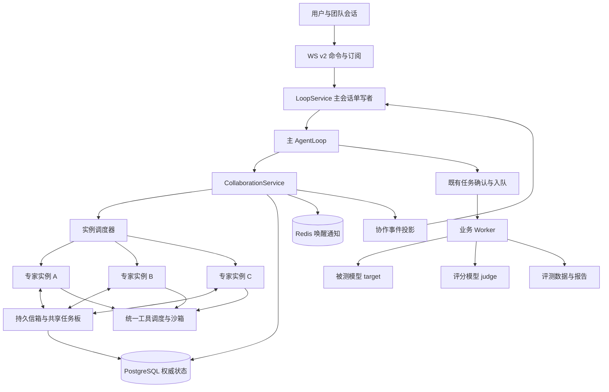
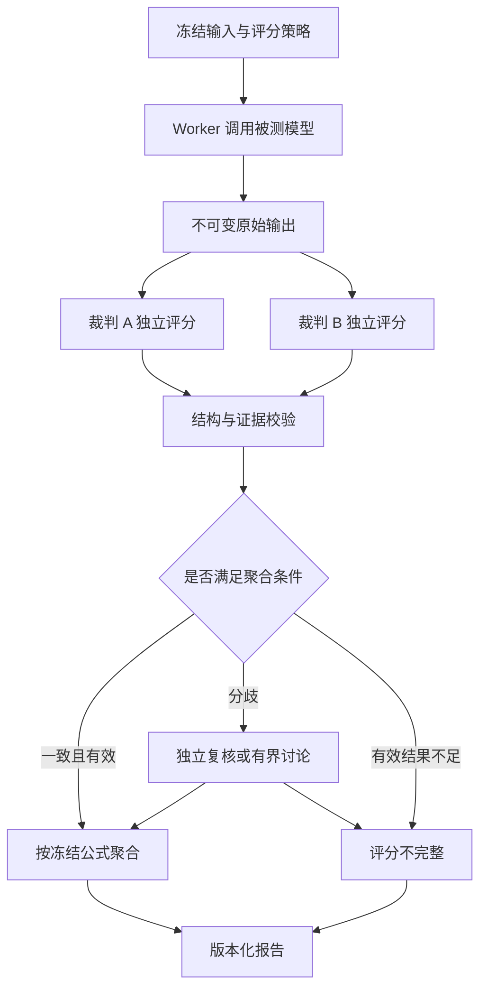

# AI 测试与评估平台 — 专家 Subagent 与多 Agent 协作技术方案

> 版本：V0.9.1 ｜ 审查日期：2026-09-16 ｜ 状态：P1 与准备阶段首批已实现，新增三类准备专家、严格草稿验收和受控引用；完整修订链、资产/报告引用、计划交接、真实模型试点和 P2/P3 仍待完成。
>
> 用户目标：将平台专家升级为能够独立运行、自由调度、相互通讯和协作的 subagent，并适配现有被测模型、Agent 模型和评分模型。
>
> 本次实施基线：`c29de49`，增量契约 PRD V1.31、API V2.9；新会话使用 AgentLoop v2。最初设计调研基线为 `3ac0ce738f4b551510fa5a9212ab0164239390ef`。本批验收使用可控模型替身，未核验生产部署或调用真实供应商。
>
> 契约声明：P1 已落地的六个 `agent.*` 工具、五类持久表和协作查询/停止 REST 及审查修复已登记 PRD V1.29 / API V2.7；`agent.send`、工作项、WS 协作命令、主流 outbox 投影、跨进程租约与后台恢复仍为拟议设计。历史文档与当前实现不一致的地方，以权威文档最新修订为准。
>
> V0.8 设计登记：评测协作目标与待实现交付契约登记在 PRD V1.30 / API V2.8 的“拟议”章节，不代表已有接口可接受这些字段。运行时分工以本文 §13.7–§13.11 为准；交付字段以 API V2.8 为准；计划执行、统计与入榜规则以[基准测试方案 V0.5](AI测试与评估平台-大模型基准测试方法与榜单建设方案.md)为准。

> V0.9 实施补充：API V2.9 已开放准备阶段的 `input_refs` 与三类结构化交付。V2.8 的其余字段仍为设计；完整目标与本批实际能力以 §13.8、§13.11 的增量边界区分。

**阅读建议：** 产品与架构决策看第 1–7 节；通讯、数据和恢复实现看第 8–12 节；被测/评分模型适配看第 13 节；接口、上线与验收看第 14–19 节。第 20 节为来源，第 21 节区分本次实际变更与未来改造范围。

## 1. 方案摘要

采用“主 Agent 协调 + 专家独立运行 + 异步信箱 + 共享任务板”的混合架构。

- 主 Agent 根据任务动态选择专家、拆分工作、安排依赖、追加指令并汇总成果。
- 专家拥有独立上下文、模型配置、工具范围、运行状态和成果，可以向同组专家发送消息，也可以在授权范围内继续委派。
- 平台协作运行时负责真实的创建、调度、消息投递、并发限制、取消、预算和持久化；模型不能靠文本声明绕过这些机制。
- 被测模型调用、批量评测、评分与压测继续由业务 Worker 执行。专家参与分析和组织，不在 API 进程内跑长评测。
- 普通专家可相互讨论；正式评分先独立提交，再按冻结规则处理分歧。被测模型无法读取裁判材料、参考答案或专家私有信箱。
- 单模型评测与多 Agent 系统评测分开记录，分别报告质量、延迟、资源与成本。

首期复用现有 AgentLoop 的循环、模型适配器和工具执行边界，增加实例级事实存储和协作服务；不直接更换为另一套 Agent 框架。首期前台协作不跨用户回合存活；后台持续执行、自动恢复与跨服务互操作分阶段交付。

## 2. 目标、范围与术语

### 2.1 产品目标

用户可以提出“根据需求文档设计用例，找专家检查覆盖率并整理交付”，无需手工指定固定流程。主 Agent 可以：

1. 并行委派需求分析、正常用例、异常用例。
2. 让用例专家向需求专家询问不明确的规则。
3. 根据中间结果新增性能或安全专家，调整尚未完成的任务。
4. 让专家互相复核，发现遗漏后定向返工。
5. 对合并后的成果负责，说明未解决的问题和实际完成范围。

简单任务允许直接完成；多 Agent 不是每轮必经步骤。固定评测流程和动态专家协作可以共同存在。

### 2.2 范围

| 范围 | 本方案处理方式 |
| --- | --- |
| 内置专家作为 subagent | 核心范围，复用现有专家目录及受控提示词覆盖层 |
| 多实例、异步结果、专家间消息 | 核心范围 |
| 专家继续委派、自主领取任务 | 在深度、能力、预算与归属约束下支持 |
| 多裁判评分与复核 | 独立阶段，扩展现有 Worker 评分能力 |
| 人类用户参与协作 | 沿用现有团队会话可见性和交互权限；不新增人类聊天系统 |
| 动态创建任意角色、任意工具、任意端点 | 不在首期范围；专家目录仍由受控配置发布 |
| 外部 A2A 专家 | 后续扩展，不作为内部协作前置条件 |
| 多租户、跨团队共享 | 不引入，延续单一内部团队定位 |
| 修改已有任务状态机以承载专家 | 不采用；协作状态使用独立模型 |

### 2.3 术语与身份

| 名称 | 定义 | 生命周期 |
| --- | --- | --- |
| 专家定义 `expert_id` | 提示词、能力、工具和模型选择策略的版本化配置 | 随受控发布演进 |
| 协作 `collaboration_id` | 一次用户目标下的专家组织及总预算 | 从创建至完成、失败或取消 |
| 专家实例 `instance_id` | 某个专家在本次协作中的独立上下文与信箱 | 可执行多个顺序运行 |
| 专家运行 `run_id` | 实例接受一次任务或续跑的一次执行 | 有且只有一个终态 |
| 工作项 `work_item_id` | 可领取、有依赖和验收条件的协作任务 | 独立于运行；可经历多次尝试 |
| 业务任务 `task_id` | 现有 benchmark/rag/testcase/stress 任务 | 沿用现有任务状态机 |
| 消息 `message_id` | 发送者到接收者的一次不可变消息 | 持久记录，单独跟踪消费状态 |
| 成果 `artifact_id` | 文件、结构化结果或证据集合的不可变版本 | 可引用、可追溯、受权限控制 |

专家角色、模型和运行实例相互独立。一个用例专家可以启动多个实例；多个不同专家也可以使用同一模型。实例不能通过显示名称寻址，所有写操作必须使用不可重用的 ID。

## 3. 当前实现与差距

### 3.1 本地核对结果

| 模块 | 已有实现 | 本次需要补齐 |
| --- | --- | --- |
| `agent/experts.py` | `general` 与 `testcase-agent`；专家提示词及工具范围 | 能力发现、委派策略、角色版本及实例配置 |
| `expert_prompt_settings.py` | 专家提示词覆盖、修订冲突与审计 | 每次协作冻结有效提示词版本 |
| `agent/loop_wiring.py` | 按回合解析专家、授权协议档、装配工具 | 实例级依赖装配，禁止借用主 Agent 身份或权限 |
| `agent/loop.py` | 七节点循环、模型/工具交替、重试和终态 | 适配实例日志端口，保持一套循环实现 |
| `agent/loop_service.py` | 会话活动回合互斥、控制连接、断连取消与恢复处理 | 协作生命周期、专家状态投影及交互汇聚 |
| `harness/memory/agent_events.py` | 会话事实、投影、PG advisory writer lock | 独立专家事实流，不能直接复用主会话的序号与幂等键 |
| `harness/execution/scheduler.py` | 工具调度、结果提交、取消结算 | 调度类工具注册、实例执行上下文和并发容量控制 |
| `harness/orchestration/agents.py` | 同一旧图内的能力配置；不是独立 Agent 循环 | 只迁移有用元数据，不把旧注册表误当 subagent 运行时 |
| `harness/execution/session_board.py` | 会话拆解清单 | 保留原语义，新增可领取的协作工作项 |
| `shared/models.py` | 协议档、会话、任务、事实、报告 | 协作、实例、运行、消息、成果和评分明细 |
| `worker/app/benchmark.py`、`judge.py` | 被测调用和单裁判逐样本评分 | 多裁判轮次、冻结评分策略与分歧复核 |

具体证据：现有 `task` 工具的 `subagent_type` 明确为“仅展示，不启子代理”；现有 `AgentDef` 说明其为同图 Worker 配置；新会话默认 `agent_loop_v2`。不能以旧 Harness 图、legacy WS 事件或工具名称推断已经支持多 Agent。

### 3.2 必须保留的架构边界

1. WS 收包循环不等待专家或评测完成，只接收命令、提交回执与推送观察。
2. 主会话仍只有一个活动回合和一个合法事实写者；协作者不能抢占控制连接。
3. `tasks` 的会话活动任务唯一约束保留；专家并发不通过创建多个同会话业务任务实现。
4. 主模型与专家调用复用受控模型适配层；不在专家代码里手写供应商 SDK 调用。
5. 被测与评分长调用仍由 Worker 消费；API 不同步轮询等待任务终态。
6. 权限、目录解析、bwrap 沙箱、凭据保护和统一错误码继续生效。
7. 表结构变化通过共享模型和 Alembic 自动生成迁移，不新增 API/Worker 双份模型定义。

## 4. 协作模式与技术选择

### 4.1 可组合的模式

| 模式 | 调度/通讯 | 推荐用途 | 约束 |
| --- | --- | --- | --- |
| 主从委派 | 主 Agent 发任务，专家回结果 | 默认执行方式 | 主 Agent 负责总体交付 |
| 并行汇总 | 多个实例独立执行，按依赖合并 | 多角度分析、覆盖检查 | 限制重复工作及并发成本 |
| 定向协作 | 专家信箱点对点消息 | 需求澄清、证据核对 | 仅允许本协作内授权通讯 |
| 共享任务板 | 原子领取与依赖解锁 | 多阶段持续工作 | 一个工作项只有一个当前执行者 |
| 交接 | 转移工作项负责者或对话焦点 | 某领域连续处理 | 不自动转移用户控制权或审批权 |
| 有界讨论 | 主持者选发言者，按轮次收敛 | 方案讨论、分歧复核 | 有轮次、时限和终止条件 |
| A2A | 远程能力发现、任务与消息协议 | 后续外部专家服务 | 另行接入授权和协议版本适配 |

### 4.2 资料借鉴与选择理由

- LangChain Subagents 提供主 Agent 工具式委派、上下文隔离和后台任务思路；采用其抽象，运行实现继续使用本项目 AgentLoop。[官方文档](https://docs.langchain.com/oss/python/langchain/multi-agent/subagents)
- Claude Code Agent Teams 使用负责人、成员、任务清单与信箱；借鉴组织与消息模型，平台存储采用 PostgreSQL，避免照搬本地文件信箱。[官方文档](https://code.claude.com/docs/en/agent-teams)
- AutoGen SelectorGroupChat 通过模型选择下一位发言者；将其作为有界讨论的参考，不让全体共享完整聊天成为默认方式。[官方文档](https://microsoft.github.io/autogen/stable/user-guide/agentchat-user-guide/selector-group-chat.html)
- Handoff 适合连续转交处理；本方案区分工作项交接与用户对话控制权，后者仍由平台会话规则管理。[官方文档](https://docs.langchain.com/oss/python/langchain/multi-agent/handoffs)
- A2A 提供跨系统能力发现、消息、任务和成果语义；它不是调度算法，也不会自动解决预算、业务审批或评分隔离。[协议规范](https://a2a-protocol.org/latest/specification/)

采用上述机制不要求安装全部框架。当前循环和工具边界已有大量平台约束，整体替换会引入双重重试、重复状态机和不同授权入口，收益尚未获得验证。

## 5. 总体架构



### 5.1 责任分配

| 组件 | 负责 | 不承担 |
| --- | --- | --- |
| 主 AgentLoop | 目标理解、动态分工、汇总和解释 | 数据库事务、权限裁决 |
| CollaborationService | 协作授权、生命周期、幂等命令和状态聚合 | 直接替模型思考业务内容 |
| 实例调度器 | 容量、租约、运行唤醒、公平排队 | 绕过工具边界执行副作用 |
| 专家 AgentLoop | 独立模型/工具循环、证据与成果生成 | 直接修改他人历史或正式评分 |
| 信箱服务 | 定向投递、消费游标、消息去重 | 将专家消息提升为系统指令 |
| 工作项服务 | 任务归属、依赖、领取、验收状态 | 改写现有 `tasks` 状态机 |
| 成果服务 | 不可变版本、引用和权限检查 | 允许任意绝对路径穿透沙箱 |
| 业务 Worker | 被测调用、评分、报告和压测 | 接管浏览器控制连接 |

### 5.2 部署形态

**阶段 P1/P2：** API 进程内运行有界、异步的专家 AgentLoop，PG 保存事实。专家仅做对话、工具调用与分析；批量评测继续走 Worker。所有专家与主回合绑定，主回合结束前必须完成或结算，不能宣称支持跨重启无缝续跑。

**阶段 P3：** 若需要关页面后继续工作，引入独立 `agent-runtime` 服务消费专家运行队列。先将现有循环与授权配置装配中可复用的部分抽成内部公共包，API 与运行服务使用同一实现；模型密钥只在授权执行边界解析。业务 Worker 保留原队列，不让专家循环挤占长评测领取槽位。

新服务是目标设计，不存在于当前 Compose。实施时补充健康检查、资源限制、镜像输入与 `deploy/plan_services.py` 发现验证；不能仅靠后台 `asyncio.Task` 宣称已交付可靠后台服务。

### 5.3 主会话与专家事实隔离

现有 `SessionLog` 的唯一性依赖 `session_id + turn/step/call_id` 等身份，专家不能全部写入主会话同一事实序列。

设计为：

- 主会话继续使用现有 `SessionLog` 和 writer lock。
- 专家使用独立 `SubagentLog`，按 `run_id + seq` 保存与循环兼容的事实。
- 从现有循环中提取最小日志端口，新增适配器；不复制另一套模型—工具循环。
- 执行上下文同时带业务 `session_id` 与 `instance_id/run_id`：前者用于会话可见性和工作区解析，后者用于模型历史、工具调用归属和幂等。
- 子事实先写自身存储；需要展示的摘要通过 outbox 交给主会话合法写者投影，专家不直接推进 `session_stream` 游标。
- 每条投影按源 `event_id` 去重；主会话暂时没有写者时保留积压，重新获取 writer 后再投影。
- 父回合只产生一个自己的终态；子运行终态使用独立事件，不能伪造额外父回合完成。

## 6. 专家定义、发现与模型绑定

### 6.1 专家定义建议字段

| 字段 | 含义 |
| --- | --- |
| `expert_id / version` | 稳定 ID 与发布版本 |
| `name / description / capabilities` | 展示、调度说明与能力标签 |
| `prompt_revision / prompt_hash` | 本次冻结的有效专家提示词标识 |
| `allowed_tools / permission_ceiling` | 专家允许工具与权限上限 |
| `model_policy` | 可选协议档、默认档或继承规则 |
| `delegation_policy` | 是否可委派、可委派角色与最大深度 |
| `communication_policy` | 可发送对象及允许的消息类型 |
| `output_contract` | 结果格式、证据要求和成果类型 |
| `limits` | 模型调用、工具次数、时限、输出大小上限 |

发布的专家定义继续受控；模型不能提交任意系统提示词创建新角色。委派任务正文只能补充目标与范围，不能覆盖平台核心约束。现有提示词管理功能继续使用，运行时冻结修订，配置变更只影响新运行。

### 6.2 首批角色

| 专家 | 实现状态 | 建议职责与交付 |
| --- | --- | --- |
| 通用助手 `general` | 已有 | 主协调、目标澄清、专家调度；当前成果为文本，计划汇编待实现 |
| 测试用例设计专家 `testcase-agent` | 已有 | 根据需求生成候选用例；不等于数据已验真、已发布或基准可执行 |
| 基准设计专家 | 拟新增 | 合并需求分析与场景设计职责，交付测试蓝图、能力要求和验收条件 |
| 数据专家 | 拟新增 | 核对来源、候选、来源组与覆盖，交付候选 manifest；不代替数据审核发布 |
| 评分设计专家 | 拟新增 | 设计程序判定或 rubric、校准与复核策略，交付评分策略草案 |
| 结果分析专家 | 拟新增 | 依据版本化报告分析错误、分歧、质量和成本；评分复核意见另留证据，不直接改分 |

拟新增名称是职责定义，尚未分配可调用 `expert_id`。首批不另设功能重复的“需求分析/报告/复核”独立角色；可以按任务将这些职责拆成不同实例。角色发布前登记稳定 ID、有效提示词版本、工具上限和能力探测。

P1 先用已有两个角色验证真实委派，必要时同一用例专家启动多个实例。正式裁判不是上述自由调度角色：它是 Worker 使用 `judge` 用途配置发起的受限评分调用。两者即使复用底层模型，也必须隔离历史、输入、权限和评分记录。

### 6.3 模型选择顺序

1. 用户在本次协作明确指定且被允许的协议档。
2. 专家配置中的默认协议档。
3. 专家允许继承时，使用主 Agent 本次冻结的协议档。
4. 无可用档则返回 `VALIDATION`，不偷偷换模型。

运行记录冻结 `profile_id`、配置版本、协议、模型标识、思考模板及档位、上下文容量、输出上限。凭据不写入消息、事件、计划或成果；运行前、关键副作用前复验权限和配置有效性。凭据轮换通过受控配置服务解析，撤销的档不能因已有快照继续启动调用。

### 6.4 能力验证

当前数据库与适配器支持 `openai_chat` 和 `anthropic_messages`，不因上游名称类似就认定支持全部能力。

| 执行角色 | 最低验证要求 |
| --- | --- |
| 主 Agent | 正确发出工具调用、接收结果后继续执行、正确结束 |
| 工具型专家 | 本角色工具 JSON、取消、超时与上下文限制 |
| 纯文本专家 | 完成文本任务与输出校验；不向其宣称可自主调工具 |
| 被测模型 | 按评测定义验证所需协议能力；工具能力不足本身可以是评测结果 |
| 裁判模型 | 能生成可解析评分结果；不要求原生工具调用 |

思考模板探测与工具能力探测分别记录，前者通过不能推断后者通过。跨模型只传可移植文本、结构化任务和成果引用，不转发其他供应商的 opaque 状态、签名思考块或不兼容工具历史。

## 7. 调度机制与自由度

### 7.1 模型决策与平台裁决

模型决定任务拆分、专家选择、依赖与交流内容；平台验证所有计划中的实例 ID、工具、角色、资源、预算和用户权限。

工具权限取以下交集：平台允许范围、用户/会话实际授权、专家上限、此次委派范围。读权限的专家不能通过委派一个写专家扩大权限；确需更高权限时，由主会话向真实用户请求对应审批。

根协调者可以为不同专家授予不同但不超过用户权限的能力。子 Agent 的消息或“同意”不具有用户审批效力。

### 7.2 拟议模型工具

| 工具 | 关键输入 | 结果/语义 |
| --- | --- | --- |
| `agent.list` | 能力筛选，可选分页 | 仅返回可调度角色与安全能力摘要 |
| `agent.spawn` | 专家 ID、目标、输入引用、输出要求、可选模型档 | 原子创建实例与首次运行，立即返回 ID |
| `agent.send` | 目标实例、消息类型、正文/引用、是否请求续跑 | 写信箱，返回已持久化回执 |
| `agent.status` | 实例/运行 ID 列表 | 状态、更新时间、简要进度及结果可用性 |
| `agent.wait` | 运行 ID、游标、`any/all`、有界超时 | 返回新事件或状态；不占模型调用槽 |
| `agent.result` | 运行 ID，可选成果分页 | 已提交结果与覆盖范围，部分结果显式标注 |
| `agent.cancel` | 实例/运行 ID、原因 | 写取消请求，返回处理中或已终止 |
| `work.create` | 目标、依赖、验收条件、能力要求 | 新建工作项 |
| `work.claim` | 工作项 ID、预期版本 | 原子领取并返回租约 |
| `work.update` | 工作项 ID、预期版本、进度或成果 | 更新当前执行尝试；不代替验收 |
| `work.review` | 工作项 ID、提交版本、验收结果和证据 | 由指定验收者接受或退回，作者不能自行验收 |
| `work.reassign` | 工作项 ID、预期版本、新负责者和原因 | 协调者撤销旧租约后改派，保留历史尝试 |
| `work.list` | 状态/能力筛选 | 可领取工作和本人工作 |

所有变更工具由运行时从 `run_id + call_id` 派生幂等键；模型不能自行指定身份。重复调用返回同一回执。同一幂等键携带不同参数返回 `CONCURRENCY`。

`agent.spawn` 的目标与输出契约必须清楚描述本次边界，不能只有“去做研究”。已有 `task/TaskCreate` 保留原语义，不把旧 `subagent_type` 直接改成启动开关。

### 7.3 调度规则

- 专家就绪队列采用按协作轮转的公平调度，避免单个团队耗尽全部模型连接。
- 独立任务并行；依赖未完成的工作不分配运行槽位。
- 同一个实例最多一个非终态运行；追加消息合并进入下一次输入边界，不并发修改该实例历史。
- 深度从主 Agent 为 0 开始计算；子委派需要明确能力且不能超过上限。
- 实例树必须无环；工作项依赖图必须无环；等待关系也检查循环依赖。
- 子实例共享协作总预算，不能通过嵌套委派扩大调用限额。
- `agent.wait` 挂起时释放执行容量，避免所有槽位都被等待父 Agent 占据。
- 普通消息不自动产生无限回复：记录触发链、消息数和无进展次数；达到上限后停止自动唤醒并通知协调者。
- 完成判定以结果契约和工作项验收为准；一句“完成了”不能自动把未交付工作标为通过。

工作项创建时固定验收方式：可自动校验的结构/文件条件由平台校验；语义质量由指定协调者或复核专家验收，执行者不能自行通过自己的提交。改派必须提升工作项 epoch 并撤销旧执行权，旧实例的迟到成果可留档但不覆盖新负责者提交。无进展依据新成果、证据、已验收工作或已解决阻塞衡量，普通“继续处理中”消息不刷新进展计时。

### 7.4 首轮容量建议

以下是压测前的保守起点，不是生产性能结论；均需配置化并记录到协作快照。

本表是完整架构的后续容量建议，不能当作 P1 现值：当前 P1 每回合共享模型流并发为 3（包含主 Agent），最大委派深度为 1；未实现全局公平调度、专家墙钟硬限时和信箱额度。当前已实现硬调用限制与停止语义见 §22.6–§22.7。

| 参数 | 建议初值 |
| --- | --- |
| 每协作同时运行的专家数 | 3，另为主 Agent 保留推进容量 |
| 全局专家模型请求并发 | 6，同时受供应商/协议档配额约束 |
| 每协作累计实例数 | 8 |
| 最大委派深度 | 2 |
| 每专家运行模型调用数 | 20 |
| 每协作总模型调用数 | 80，包含主 Agent、子 Agent 和重试 |
| 专家单次运行墙钟时限 | 10 分钟；用户交互等待单独计时 |
| 消息正文上限 | 8 KiB；较长内容提交成果引用 |
| 每协作消息总数 | 200 |
| 连续无进展轮数 | 3 |
| 有界讨论上限 | 2 轮，结束后允许明确保留分歧 |

上述额度不等于免费预算。进入评测执行时，Worker 业务预算和协作预算各有明细，总报告按唯一调用 ID 汇总，不能重复累计或漏算。

## 8. 通讯协议

### 8.1 消息信封

以下为内部结构示意，不是现有 WS 上行格式。身份、序号和时间由服务端生成。

```json
{
  "schema_version": 1,
  "message_id": "msg-example-001",
  "collaboration_id": "collab-example",
  "sender_instance_id": "inst-case",
  "recipient_instance_id": "inst-requirement",
  "sender_run_id": "run-case-01",
  "work_item_id": "work-case-boundary",
  "reply_to": null,
  "type": "question",
  "body": "请核对需求中重复提交的处理规则，并提供原文依据。",
  "artifact_refs": [],
  "recipient_seq": 12,
  "created_at": "2026-09-15T08:00:00Z"
}
```

| 类型 | 用途 | 是否可改变任务方向 |
| --- | --- | --- |
| `assignment` | 根协调者或获授权委派者布置工作 | 在已授权工作范围内可以 |
| `instruction` | 有调度权限者修订目标或优先级 | 可以，关键变更生成任务新修订 |
| `question / answer` | 专家间询问与回答 | 只作为任务资料 |
| `finding` | 中间发现和证据 | 只作为任务资料 |
| `review_request / review_result` | 请求复核与返回意见 | 不自动验收工作项 |
| `result` | 运行提交的成果摘要 | 由运行服务生成并关联终态 |
| `blocked` | 无法推进及缺失条件 | 通知协调者，不伪装完成 |

取消、审批和领取不是普通文本消息，而是独立授权命令。发送者写“请停止”可以被模型理解，但只有真实取消命令才能保证调度器停止派发。

### 8.2 投递与消费

1. 在同一事务中写消息、接收方序号、唤醒 outbox 和回执。
2. 提交成功后才返回“已送达”；数据库不可用时不得返回成功。
3. outbox 通过 Redis 或本地通知触发调度；轮询 PG 补偿通知丢失。
4. 接收方在下一次模型调用前读取未处理消息，按接收方序号排序。
5. 消息选入模型请求时，记录请求与消息关联；收到有效模型结果并提交对应处理事实后推进消费状态。
6. 若发生重试，允许同一输入再次调用模型，但业务副作用依赖工具幂等键避免重复。

交付承诺是“持久消息 + 至少一次唤醒 + 幂等处理”，不是网络与模型调用端到端恰好一次。UI 分别展示 `accepted`、`included`、`handled` 或失败状态；输入包含某消息不等于模型已经解决该问题。

### 8.3 续跑与终态

- 运行中的实例：消息在安全边界消费，不能打断数据库提交或修改进行中的模型请求。
- 已完成/失败实例：只有显式 `resume=true` 且发送者有权时，才能创建新 `run_id`；旧运行终态不可修改。
- 已被用户取消的实例：自动唤醒禁止；只有用户明确恢复后才允许新运行。
- 协作已结束：拒绝续跑，要求新建协作或用户显式重开；新执行保留来源关联。
- 未知或无权限的实例：统一返回安全的 `NOT_FOUND`，不泄露其他协作存在性。

### 8.4 通讯权限与广播

默认支持同协作内、符合角色策略的定向消息。广播只允许协调者发范围调整或取消通知，按接收方生成独立投递记录，不把全体聊天自动灌入每个上下文。

独立评分阶段禁止裁判互发评分消息，禁止向被测执行实例发送标准答案。此限制由服务端策略控制，不能只依赖提示词。

## 9. 上下文、成果与工作区

### 9.1 输入装配

专家模型输入顺序：平台核心规则 → 冻结专家提示词 → 经校验的协议档补充 → 本次任务及约束 → 授权输入/成果 → 必要历史摘要 → 待处理消息。

独立上下文默认只带任务所需内容；不复制主会话所有历史。可继承的是明确授权的材料和摘要，不是父 Agent 的隐藏状态。任务正文、工具结果和其他专家发来的内容均标注来源。

### 9.2 结果契约

```json
{
  "schema_version": 1,
  "run_id": "run-case-01",
  "outcome": "succeeded",
  "summary": "已完成异常用例设计和需求覆盖映射。",
  "artifact_refs": ["artifact-cases-v1"],
  "evidence_refs": ["artifact-requirements-v2"],
  "unresolved": [],
  "coverage": {"work_item_ids": ["work-case-boundary"]}
}
```

`outcome` 使用运行终态枚举：`succeeded / partial / failed / cancelled / interrupted`，必须与对应 `run_id` 的服务端终态一致。`completed` 仅用于协作整体状态，不是运行结果的合法值，不做隐式转换。模型只提供候选内容；服务端校验成果存在、可读取、版本一致和结构合格后，在同一事务内确定运行终态并生成最终结果。部分完成记录实际覆盖与遗漏；不得把失败运行的文本结果当作完整交付。

### 9.3 工作区隔离

仅使用现有授权工作区/会话沙箱根，子目录由服务端解析，不接受模型指定根目录。

- 输入：为实例挂载本次批准的材料快照，只读。
- 输出：每个实例使用独立输出 scope，例如 `collaborations/<id>/instances/<id>/output`。
- 共享成果：上传为不可变版本，其他专家经成果服务读取；共享目录不能作为绕过裁判隔离的通道。
- 合并：协调者或指定汇总实例从成果引用生成最终文件；覆盖用户已有文件仍走原工具策略。
- 对同一真实路径及父子范围的并发写继续执行范围冲突检查，不能用不同字符串路径绕过。

实例级沙箱解析器须以当前 `resolve_session_sandbox` 的授权结果为根，继续做段级、realpath、符号链接和目录归属检查。对已有 `WorkspaceExecutionGuard` 的粒度扩展需要单独验证：不能仅为了让多个专家并行而删除父子目录冲突保护。

### 9.4 成果与历史保留

每个成果保存 hash、大小、媒体类型、生产实例、输入版本和时间。文件引用必须经属主/会话可见性检查；不能把模型返回的文件路径直接当下载链接。

摘要不替代原始评测输出；原始输出、评分记录、最终报告按照各自版本保留。删除协作需要先结束活动运行，成果被正式报告引用时按保留策略禁止物理清理。

## 10. 数据模型与一致性

### 10.1 拟新增存储

表名为候选，迁移前根据仓库命名规范定稿。

| 表 | 关键字段 | 约束/用途 |
| --- | --- | --- |
| `agent_collaborations` | ID、session_id、actor_id、root_turn、模式、状态、版本、目标快照、预算快照 | 一协作一授权范围；非终态协作限制按阶段处理 |
| `agent_instances` | ID、collaboration_id、parent_instance_id、expert_id/version、权限快照、模型策略、取消锁存 | 父子必须同协作；实例树无环 |
| `agent_runs` | ID、instance_id、trigger_message_id、状态、配置快照、开始/结束时间、lease_owner、lease_until、epoch | 一个实例最多一个非终态运行 |
| `agent_run_events` | ID、run_id、seq、类型、数据、schema_version、dedup_key | `(run_id, seq)` 唯一；可幂等事件的键唯一 |
| `agent_messages` | 信封字段、接收序号、幂等键、有效期 | 同接收实例序号唯一；正文不可覆盖 |
| `agent_message_receipts` | message_id、消费 run_id、请求 ID、状态 | 区分输入包含与已处理，重试可审计 |
| `agent_work_items` | ID、协作、目标、状态、assignee、lease、attempt、version、验收条件 | CAS 版本更新；到期执行者不可继续提交 |
| `agent_work_dependencies` | work_item_id、depends_on_id | 唯一边、同协作、禁止环 |
| `agent_artifacts` | ID、存储引用、hash、生产 run_id、访问分类、版本 | 不可变内容；跨协作引用显式授权 |
| `agent_outbox` | ID、源事件、接收方、重试时间、投递状态 | 与源变更同事务写入；重复通知安全 |
| `agent_effect_commands` | command_id、来源 run/call、资源范围、运行/工作项 epoch、参数 hash、执行端、接收/执行/停止证据 | 接收与代次变更串行化；同 ID 同参数返回原回执，异参数拒绝；未知执行保留隔离 |
| `agent_model_calls` | call_id、协作/运行/业务任务、profile/version、用途、预算模式、上界依据/版本、预留额、tokens、费用、结算状态 | 调用 ID 唯一；预留与结算原子更新，总预算与报告去重 |
| `agent_interactions` | interaction_id、协作/run、类型、请求摘要、状态、响应者、到期时间 | 排队映射到现有主会话交互槽 |
| `agent_task_links` | collaboration_id、task_id、来源工作项、取消策略 | 关联既有业务任务，不改其归属和状态含义 |

多裁判阶段新增 `eval_judge_runs` 与 `eval_judge_results`：记录评分执行、样本、裁判槽位、轮次、尝试、rubric/转换/聚合版本、原始输出、各维度原始分/标准分和有效性。逻辑评分键 `(evaluation, sample, judge_slot, round)` 只有一个被采纳结果，失败重试作为独立 attempt 保存。

### 10.2 事务边界

| 操作 | 同事务提交 |
| --- | --- |
| 创建实例 | 实例 + 首次运行 + 调用幂等回执 + outbox |
| 发消息 | 消息 + 接收方序号 + 回执 + outbox |
| 领取工作 | 版本检查 + assignee/lease/epoch + 领取事实 |
| 执行端接收副作用命令 | 当前授权/租约/epoch 检查 + command_id 幂等回执 + 资源 guard + 持久执行意图；与撤销/改派锁定同一权威记录 |
| 完成运行 | 终态 + 已验证结果引用 + usage 结算 + 通知 outbox |
| 取消 | 取消锁存 + 受影响实例标记 + 调度通知 |
| 投影 | 主会话事件/游标 + 已投影源 ID |

事务保持短小，模型请求、文件 IO 和网络调用不放在持锁事务内。API/Worker/运行服务传递 ID 和数据快照，不跨数据库 Session 传 ORM 对象。

### 10.3 租约与陈旧执行者隔离

工作领取使用 PG 行锁或条件更新；全局容量需要事务性预留，不能只用进程内 semaphore 代表全局限制。事实提交必须在写入事务内同时验证当前授权、未过期租约和 epoch，不能先查后写。运行 epoch 与工作项 epoch 分别记录，涉及工作项的命令必须同时匹配。

**派发前检查只是快速拒绝，执行端的命令接收才是副作用授权边界。** 旧执行者可能在通过检查后暂停，待租约过期、发生改派后再恢复发送请求。因此采用以下接收与交接协议：

1. 副作用命令先获得持久 `command_id`，关联来源 run/call、资源范围、运行/工作项 epoch 和参数 hash。传输重试及恢复核对沿用原 ID，不通过生成新 ID 重做同一已提交动作。
2. 受控执行端在短事务内锁定与改派/撤销相同的权威记录，检查当前授权、租约、epoch 和资源 guard，并原子写入命令接收回执及执行意图。不得用执行端缓存的旧 epoch 授权。重复 ID 只返回原回执，参数不同则拒绝；查询旧回执不代表获得再次执行权。
3. 接收事务与 epoch 递增有明确先后顺序：递增先提交，则旧 epoch 命令不得被新接收；命令先被接收，则计入已有在途执行，不能因租约到期而当成“未执行”。文件写入、bash、MCP 等所有副作用路径都须经过此边界，禁止专家绕过执行端直接持有下游执行凭据。
4. 交接先关闭旧 epoch 的新接收，再取消或排空已接收命令。未派发命令须取得不可再启动的持久取消回执；已派发命令须取得停止/完成证据。证据齐全前保留相关资源 guard，新负责者可以规划，但不得启动冲突副作用。租约过期本身不释放 guard。
5. 网络/进程执行放在接收事务之外。接收后、执行前崩溃的命令也属于待核对在途命令；恢复通过原 command_id 查询或取消。执行端重启、存储不可用或无法证明停止时保持隔离，不重新生成命令继续执行。
6. 无法校验 epoch 的外部服务通过受控适配器接收命令；适配器仍必须遵守上述协议。下游若既不能幂等查询又不能证明停止，则未知副作用阻塞该资源的自动交接，不能仅增加一次 HTTP 前的数据库检查就宣称安全恢复。

保证范围是“旧代次命令不能在撤销后被新接收，已接收工作在交接前得到核对或隔离”。不能保证旧进程不再发送网络字节，也不能撤销已发生的外部费用或副作用。当前 Runner 的执行 ID/启动代次与 WorkspaceExecutionGuard 可作为基础，但并未实现上述协作 epoch 接收协议；P3 开放相关副作用恢复前必须完成适配与竞态验收。

## 11. 生命周期、取消与恢复

### 11.1 状态机

**协作状态：** `queued → running ↔ waiting_user → completed / partial / failed / cancelled / interrupted`；取消过程中使用 `cancelling`。`partial` 表示有可用成果但未满足全部交付条件，不能等同成功。

**运行状态：** `queued → running ↔ waiting_message / waiting_user / waiting_capacity → succeeded / partial / failed / cancelled / interrupted`；取消请求后进入 `cancelling`。每次运行一条终态，恢复通过新运行关联旧运行。

**工作项状态：** `pending → ready → claimed → submitted → accepted`，另有 `blocked / failed / cancelled`。`submitted` 只表示交付待验收；验收失败回到新尝试的 `ready`，保留旧提交。

主协调者结束前核对必需工作项、未处理交互、活跃专家和待提交成果。P1/P2 主回合不能结束后遗留无归属专家；P3 后台协作由独立生命周期管理，主回合结束不代表协作完成。

### 11.2 取消语义

- 停止某专家：默认取消该实例及其委派子树，其他专家继续；依赖它的工作进入 `blocked`。
- 停止整个协作：先持久取消锁存，停止新派发，再取消模型与工具并等待有界 drain。
- 模型连接关闭不等于上游无计费；调用记录保留已观测 usage 与未知成本状态。
- 已发送工具、Runner 或外部服务结果不能确认时，记录 `outcome_unknown`；不伪装成功或直接重试。
- 专家只提交取消申请；只有授权者可取消不属于其子树的实例。
- 现有 `turn.cancel` 与 `task.cancel` 含义不偷换。P1/P2 主回合取消级联专家；已经入队的业务任务是否继续，按既有规则执行。新增“停止协作并取消关联业务任务”是显式操作，逐任务鉴权和回执，压测使用原立即停发机制。

### 11.3 恢复矩阵

| 故障点 | 处理 |
| --- | --- |
| 消息落库后通知丢失 | outbox 重试或扫描唤醒，无需再次生成消息 |
| 专家结果落库后主会话未展示 | 源事件去重投影 |
| 模型调用前崩溃 | 未派发请求可创建新 attempt |
| 模型请求已发、结果未落库 | 标记未知，重试产生新 attempt 并计成本；评测原输出不被静默替换 |
| 有副作用工具执行中崩溃 | 按工具幂等能力或状态查询核对；无法核对则阻塞恢复 |
| 主 Agent 退出、子实例仍运行 | P1/P2 统一取消/中断结算；P3 由协作租约与独立协调唤醒处理 |
| Redis 不可用 | PG 继续保存任务与消息；降级扫描，增加延迟并告警 |
| PostgreSQL 不可用 | 停止新派发，取消可取消调用；不在内存里继续推进权威状态 |
| 用户权限或工作区失效 | 拒绝后续执行，隔离已有成果，返回安全错误 |

P1/P2 复用当前“识别中断并结算”原则，不承诺自动重放全部专家。P3 自动恢复仅针对已验证的可重试边界；审批、未知副作用和配置变化需要重新校验。现有 AgentLoop 恢复行为不能直接推导为多 Agent 跨重启恢复已完成。

### 11.4 前台与后台语义

P1/P2 使用现有控制连接和断连宽限，连接长期中断后取消所属协作。运行期间用户补充通过拟议 `collaboration.message` 命令送到主协调者，不重复 `turn.submit` 绕过“已有活动回合”限制。

P3 才引入显式后台模式：授权范围和预算在启动时冻结，断开浏览器不撤销后台执行；取消仍须持久处理。新增用户回合与协调唤醒统一排队、使用同一会话 writer，不并发写主会话。每个会话首版只允许一个非终态协作，其他请求可作为补充或排队；多协作并发另行验证。

## 12. 用户交互与权限

### 12.1 多专家澄清和审批

多个专家不能直接占用 `sessions.pending_confirm`。专家将交互写入 `agent_interactions`，主会话交互协调器逐项映射到现有单槽。

- 同类澄清可合并，但必须保留每个问题到原实例的映射。
- 有副作用的审批不得随意合并为“允许全部”，必须对应冻结参数摘要、工具与权限范围。
- 用户响应校验原发起身份、interaction ID、修订与到期时间，响应只回到关联实例。
- 专家取消或工作项修订后，关联旧交互失效；迟到响应不得恢复旧动作。
- 拒绝/到期使用原交互契约映射，专家收到明确状态并停止依赖动作。

### 12.2 授权规则

协作继承所属会话可见性；团队成员是否可发指令沿用当前交互权限，而非仅凭可见即可控制。根发起用户是执行授权主体，专家 ID 不是用户 ID。

当前协议档使用遵循平台单团队既有策略，不能自行把 `created_by` 改成私有使用 ACL。模型档用途、凭据可用性与受控工具范围每次仍须验证。

会话收回共享、用户禁用、工作区注销和会话删除继续检查活跃协作；不得让后台专家持有已撤销授权继续运行。内部材料、标准答案和裁判输入增加用途标签，读取接口与沙箱挂载都检查，避免只在 UI 隐藏。

## 13. 被测模型、评分模型与评测可信度

### 13.1 三类用途

| 用途 | 职责 | 运行入口 |
| --- | --- | --- |
| `agent` | 主协调、专家分析、工具选择、复核组织 | 已授权 AgentLoop 适配器 |
| `target` | 接收评测输入，产生被测输出或轨迹 | 业务 Worker 的协议调用器 |
| `judge` | 按冻结规则生成评分 | Worker 受限评分执行器 |

现有 Agent `authorized_profile` 要求协议档含 `agent`；仅有 `judge` 的配置不能直接作为带工具的专家。若同一配置被显式标注多个用途，仍按调用目的隔离上下文与数据。

当前 Agent 与 Worker 协议实现存在独立代码路径；本方案不声称修改一侧即可自动覆盖另一侧。新供应商或思考参数须分别验证被测、评分和 Agent 调用；抽共享适配包应独立评估，不能在多 Agent 改造时无范围重写。

### 13.2 两种评测对象

**单模型评测：** 专家准备数据和规则，Worker 给被测模型发送冻结输入；被测输出原样保存。不得将专家补写、纠错或重试择优后的答案算作原始模型成绩。

**多 Agent 系统评测：** 被测对象是完整团队。需要固定角色版本、模型组合、调度策略、通讯规则、工具权限、输入版本、最大预算和终止条件。报告将结果标为系统成绩，并同时记录各组成模型和总体成本。

两种模式使用不同评测配置与报告标识，不直接混排同一排行榜。增加系统评测是否使用新任务种类需要先修改 PRD/API 与任务约束，不能私自向当前 `tasks.kind` 填入新字符串。首个正式多裁判版本仅扩展现有 benchmark；RAG、testcase 的指标与流程分别设计后接入。

RAG 的后续证据分类策略见[采集方案 V2.4 第 5 节](AI测试与评估平台-测试数据集与黄金集采集技术方案.md)：evidence_policy.v1 使用实际模型上下文核对主张，黄金证据供正确性和检索评价；分类票决不套用本篇 judge_policy.v2 的数值均值/中位数。只读裁判调用可由 Worker 固定编排，不依赖专家团队全部上线；同源核对、初评隔离、有界复核及预算仍须一致。当前 RAG 检索指标不是已完成回答忠实度评测。

### 13.3 冻结评测输入

确认入队前固定：数据集及黄金集版本、采样种子/样本列表、目标协议档快照、裁判槽位与模型快照、rubric 与原始分档/类型、分数转换版本、各维度权重、聚合版本、缺失处理、分歧阈值及单位和复核预算。

主 Agent 生成的评分规则必须经过现有确认链路。任务运行中修改规则只能创建新评测修订，不覆盖旧评分记录。系统评测也冻结可变拓扑的调度策略与预算，实际产生的实例树作为运行轨迹保存。

### 13.4 多裁判评分流程



初始评分只向每个裁判提供允许的背景、问题、参考答案、被测输出及评分规则。裁判看不到其他裁判的分数、主 Agent 的期待结论和被测模型身份标签。

被测内容作为待评数据封装，不能执行其中“忽略评分规则”等指令。正式裁判默认无工作区写入、任意网络或专家信箱权限；需要补充检索证据时，先定义检索范围和证据版本，不能临时放开所有工具。

### 13.5 聚合、复核与失败

- 每维度按预先冻结的权重聚合，所有权重和参与裁判数写入报告。
- 建议首个试点采用 2 个独立裁判；分歧阈值是待校准参数，例如总分差大于 15/100 触发复核，不当作已验证标准。
- 第三裁判可先盲评，再接收争议证据；讨论结果另存复核轮次，初始分数保留。
- 达到有效裁判数门槛才产生正式聚合分；缺失评分保持 `null` 和失败原因，不能填 0，也不能无标注降低分母。
- 允许不完整报告时必须显式展示覆盖率和评分不完整状态；若评分是成功门禁，则沿用既有任务错误处理，不能仅因报告文件存在就宣告任务成功。
- 所有必需评分结束、质量任务按现有规则 `succeeded` 后，才可派生压测；不完整状态不得意外绕过先评后压门禁。
- 评分输出采用版本化结构校验；现有数字回退解析只保留在旧评分模式，多裁判模式不从任意文本中抓一个数字当有效分数。
- `temperature=0` 只减少一种随机性，不保证确定复现；记录模型版本、输入与参数，并通过重复样本测量稳定性。

LLM 裁判可能存在位置、篇幅和自偏好等偏差。盲化模型身份、成对交换顺序、不同模型来源与人工校准用于降低偏差，但不能保证完全消除。[研究论文](https://arxiv.org/abs/2306.05685)

#### 首个试点的完整聚合规则

下列规则是候选策略 `judge_policy.v2`，上线前须通过黄金样本校准并随确认规格冻结。V0.1 文稿中的 `judge_policy.v1` 仅约定 0–100 维度输入；v2 明确增加原始分档到标准分的转换，不静默重解释旧策略或既有报告。

1. 两个独立裁判使用相同 rubric 版本、维度语义和评分锚点。冻结每维度的原始范围、整数/连续类型、越高越好方向、转换版本及权重；权重之和为 1。缺失维度不按 0 处理，维度语义不同不能计算裁判分歧。
2. 服务端先校验原始分，再按 `score_normalization.v1` 转为 0–100 标准分：对声明线性映射且 `max > min` 的维度，`z = 100 × (raw - min) / (max - min)`。本策略只接受越高越好的维度；其他方向或非线性锚点需另行定义转换版本。越界、缺失、非有限数、类型不符或没有合法转换配置均判为评分无效，不截断到边界、不猜量纲。对样本 i、裁判 j，`T(i,j) = Σ[维度权重(k) × z(i,j,k)]`；保留原始分、标准分、转换版本、证据和解释。
3. 初评两个裁判均有效，且总分差和每个维度标准分差都不超过各自阈值时，样本各维度取两裁判标准分均值，再按冻结权重计算样本总分。所有分差阈值以 0–100 标准分的“分”为单位；阈值 15 不是相对百分比，也不是原始 0–4 分档上的 15 分。
4. 任一分差超阈值则请求第三裁判独立评分；第三裁判使用相同 rubric 和转换配置，不接收前两人的分数。三个结果全部有效后，各维度取三者标准分中位数，再计算样本总分，报告标明发生复核。
5. 每个裁判槽位最多额外重试 1 次，只针对超时、上游暂时错误或结构无效；按预定尝试顺序采纳第一个有效结果，不能选择最高分。重试仍失败时，该样本评分不完整，不自动换裁判模型。
6. 需要第三裁判而复核预算不足时，该样本保持评分不完整。人工裁决或讨论后的分数作为独立修订，不覆盖上述自动聚合值。
7. 默认正式汇总要求计划评分样本全部具有最终有效分数。有效子集均分可展示为诊断值，并同时展示 `有效样本数/计划样本数`；只有确认规格事先允许较低覆盖率时，才能按该规则给出带覆盖标识的正式汇总。
8. 数据集若采用分层权重，样本和层权重也需冻结；不能因某层裁判失败就临时重新分配权重。所有显示舍入在最终展示时执行，中间计算保留精度。

“不同维度由不同专业裁判负责”属于另一种策略版本：每个维度分别定义裁判槽位和聚合规则，不能把负责正确性和负责风格的两位专家当作同维度重复评分。

与[基准测试方法方案](AI测试与评估平台-大模型基准测试方法与榜单建设方案.md)的 `doc_qa_rubric.v1` 对接时，原始整数 0–4 映射为 0、25、50、75、100。示例维度 `[4,3,4,4,3]`、权重 `[0.40,0.25,0.20,0.10,0.05]` 得 92.5 分；单维度 3 与 4 的分差为 25，若该维度阈值冻结为 15 则触发复核。rubric、转换和聚合三个版本均写入评分配置快照，后续聚合不得再次归一化。

### 13.6 同源模型与指标

不同 `profile_id` 可能指向同一个模型或网关；独立性不能只比较协议档 ID。记录实际供应商、模型版本和可知的部署标识，在报告中标注已知同源情况，未知来源也明确标注。正式独立评分默认排除与目标同一已知模型身份；研究自评须显式模式并单列。

指标至少包括：

- 单模型质量、有效评分样本数和评分覆盖率。
- 多裁判一致率、分歧率、复核率及人工校准误差。
- 团队完成率、工作项验收率、重复工作率、无效通讯量。
- 全流程墙钟时间、关键路径耗时、各模型 tokens 与费用。
- 超时、失败、取消、未知副作用及恢复次数。

评估多 Agent 价值时，同时比较单专家基线与固定流程基线。相同数据和质量标准下比较耗时/成本，另做相同预算下质量比较；不能只选择对多 Agent 有利的一种口径。

### 13.7 评测协作层与执行层的交接（拟议）

推荐采用“主 Agent 组织、专家并行准备、服务端校验并冻结计划、Worker 执行、独立裁判评分、专家分析事实”的链路。调度灵活性止于已授权任务范围；数据发布、用户确认、正式评分与统计使用受控代码和独立权限。

| 环节 | 主责 | 输入与交付 | 放行条件 |
| --- | --- | --- | --- |
| 明确目标 | 主 Agent | 用户需求 → 场景、被测对象、预算与验收目标 | 缺失的必需条件经主会话澄清，专家不能代答 |
| 设计与盘点 | 基准设计专家、数据专家并行 | 需求及获准材料 → 蓝图草案、候选来源与覆盖清单 | 允许相互不依赖的草案并行；最终交付须引用匹配的蓝图版本 |
| 设计评分 | 评分设计专家 | 已对齐蓝图、题型及获准判定依据 → 评分策略草案 | 程序评分优先；开放题有分档锚点、输出 schema 和校准方案 |
| 验真与发布 | 数据服务及授权审核者 | 候选 → 发布资产 manifest | 沿用采集方案的独立验真与审核，模型的“通过”不能替代审批记录 |
| 汇编与确认 | 主 Agent 提议，API 校验，用户确认 | 有效交付与发布资产 → 冻结评测计划 | 引用/hash、场景能力、预算和标准校验通过；用户批准确切版本 |
| 目标执行与评分 | Worker、程序评分器、受限裁判 | 冻结计划 → 原始尝试、独立评分和统计事实 | 专家不得补写目标输出、挑最好答案或改权重 |
| 分析与报告 | 结果分析专家、主 Agent | 报告修订与获准样本 → 证据化解释 | 数字来自程序；分析意见不覆盖原始成绩、报告或榜单快照 |

主 Agent 可以决定需要哪些专家、哪些子任务并行以及是否请求返工，但不能绕过数据发布、计划确认或适配器准入。直接文档问答不自动要求 RAG；只有测试检索系统时才增加相应黄金证据、索引和检索快照。

### 13.8 专家结构化交付物与受控材料（部分实现）

完整目标使用 `expert_deliverable.v1`，拟议字段来源为 [API V2.8，首批实际契约见 V2.9](AI测试与评估平台-API.md)。它属于评测准备/分析制品，首批作为 `AgentRun.result.deliverable` 增量嵌入，不替换 §8 消息信封或整个运行结果，也不把 `run_id` 当作 `task_id`。下表为完整目标；首批数据正文包含独立验证计划、评分正文包含校准计划，尚不接收独立验证/校准完成记录。

| kind | 必需正文内容 | 验收方式 |
| --- | --- | --- |
| `benchmark_blueprint` | 测量目标、`evaluation_mode`、场景与覆盖、执行能力、指标候选、预算范围、排除项 | 主协调核对用户目标；服务端检查场景与指标定义，未定项阻塞冻结 |
| `data_manifest_candidate` | 蓝图引用、来源/许可/用途、候选条目与来源组、查重/独立验证记录、覆盖与缺口 | 数据模块和授权审核者发布；交付本身不具有发布权 |
| `scoring_policy_draft` | 蓝图与资产引用、评分器/rubric 版本、分档与转换、证据要求、缺失与复核策略、校准记录 | 程序校验加独立审核；沿用 judge_policy.v2 等对应场景规则，未校准策略不能冒充正式成绩 |
| `report_analysis` | 明确的报告修订、逐项指标/样本引用、错误分类、条件化结论、补测建议 | 每个数字可定位统计事实；无证据内容标为假设，不能写入正式分数 |

通用信封记录稳定交付 ID/修订、生产者协作与运行身份、上游精确引用、受控正文引用/hash、适用场景和服务端验证状态。作者不能自填“已验收”。缺字段、引用失效、版本/hash 不符或缺关键证据时退回；返工产生新修订，旧内容保留。正文 schema 与存储/传输上限需要随接口实现冻结。

**当前 V0.9 实际边界：** 新增 `benchmark-designer`、`benchmark-data-curator`、`benchmark-scoring-designer`。`agent.spawn.input_refs` 仅接受当前会话三类已校验准备草稿，最多 4 份、合计 64 KiB；数据与评分专家必须引用蓝图。最终 JSON 经严格分型 schema 和来源/场景/锚点校验，服务器生成交付身份、hash 与验证状态。`validated` 仅表示草稿结构和内部引用完整，不代表来源事实、许可、独立验证、校准、发布或审批。`output_contract` 仍是提示文本，普通专家仍返回自由文本。每次运行产生独立交付 ID、第 1 版，返工新建运行和 ID；同 ID 递增修订尚未实现。

**首批材料交接：** 服务端在派发、消费与终态验收时复验会话访问、用途、版本和 hash，将完整获准正文投影为子运行独立消息；内部创建事件持久化引用与冻结专家提示词，公开事件不展示提示正文。工作区边界不变，不接受父/兄弟目录路径、正式资产或报告作为引用。后续增加正式资产/报告的投影、独立审核和修订链；不得为便利复制隐藏答案到通用共享目录。

沿用[采集方案 §6.4](AI测试与评估平台-测试数据集与黄金集采集技术方案.md)的 `evaluation_asset_manifest.v1` 作为正式资产交接。候选交付不得重命名成发布 manifest，数据通过审核也不自动通过执行能力、评分或入榜校验。

### 13.9 通讯、返工与前台生命周期

第一步采用主 Agent 中转成果的受控协作，不以前置实现信箱和工作项为条件：主 Agent 调用 `agent.wait/result` 后，只向后续专家提供完成当前任务必需的信息。P2 再增加 `agent.send`、工作项版本和依赖就绪检查，不能在现有 P1 参数中提前传这些字段。

- 数据盘点与蓝图初稿可并行；评分策略须对齐最终题型与判定依据；计划冻结等待所有必需成果通过校验。
- 专家失败/取消时保留状态与原因，依赖成果的步骤停止推进。主 Agent 可在预算内重新委派新运行，但不能把旧失败改为成功；整组取消后不再新建该组运行。
- 专家之间有歧义时，P1 由主 Agent 收集并向用户提出问题；没有子运行交互通道，不让专家直接等待不存在的审批卡。返工次数与总调用预算共同限制循环，必要成果仍缺失时明确报告阻塞。
- 候选数据的长下载、批量生成、验证和模型评测使用相应受控服务/Worker；专家只能提交所需配置或获准操作请求，API 不同步轮询至长任务完成。
- **入队后本次准备回合收尾。** 不让 `agent.wait` 等待 benchmark 业务任务。Worker 继续按原生命周期执行，任务事件/报告进入既有页面；当前用户可在后续回合请求报告分析，再创建新的专家协作。
- 报告分析可以引用同一任务的报告修订，但不复活已结束的前台专家。自动唤醒、跨会话后台续跑须另行落实 P3 权限、队列和恢复契约，不从“任务完成事件存在”推导已支持。
- 停止专家协作不等于停止已入队业务任务。用户明确取消跑测时，走原 `task.cancel` 鉴权和回执；质量任务成功且满足压测条件后才可派生 stress。

协作准备与结果分析、目标推理、模型评分、工具/检索、压测分别记录资源消耗。P1 的 80 次调用账本只覆盖该主回合及其子运行，不能当作全评测预算；跨阶段总费用须有可去重账本和未知费用标记，未实现前按可获得明细分别披露。

### 13.10 评分与数据用途隔离

| 消费者 | 可见材料 | 禁止材料/能力 |
| --- | --- | --- |
| 被测模型/被测团队 | 冻结的公开输入、被允许的上下文和工具 | 隐藏参考、私有测试、裁判意见、其他参赛输出和评测组织者的私有历史 |
| 基准/数据/评分设计专家 | 当前职责获准的开发、候选、校准和标准材料 | 无依据放开整套隐藏正式测试集；以正式测试反馈调参后回写同一版本 |
| 正式裁判 | 原始回答、题目、允许的参考/证据和固定标准 | 模型品牌、主 Agent 期待、其他裁判初评分、通用写入/任意网络/信箱权限 |
| 结果分析专家 | 已完成报告、必要的授权错误样本和可见评分证据 | 修改原始回答、分数、分母、冻结规则和榜单资格 |

评分设计专家制定规则不代表具有正式评分权。主 Agent 与裁判可使用同一底层模型，但必须使用独立调用上下文、用途配置和权限；与目标或生成器同源的关系仍按 §13.6 记录和处理，不能将“不同实例”称为来源独立。

待评回答中的命令视为不可信数据；安全不只靠一段提示词，而由裁判工具权限、输入投影、输出 schema、证据核验与抽查共同约束。初评完成后才按冻结策略组织分歧复核，复核意见、复核分与原始分分别保存。客观评分器可判定的题不为展示多 Agent 而引入裁判投票。

### 13.11 基准连接批次与验收（J0/J1 部分实现）

J 编号仅表示评测协作连接工作包，不是新增运行模式、任务种类或 P 阶段重编号。B 阶段定义见[基准测试方案 §16](AI测试与评估平台-大模型基准测试方法与榜单建设方案.md)。

V0.9 已完成三类准备角色、提示词快照、三类正文 schema、同会话固定引用、草稿成果验收和页面展示。J0 尚缺真实供应商试点；J1 尚缺稳定交付 ID 的递增修订、正式资产/报告等引用及独立验真；J2/J3 尚未开始。下表仍列完整退出条件，不能将本批本地测试视为所有工作包完成。

| 工作包 | 前置与交付 | 退出证据 |
| --- | --- | --- |
| J0 角色与最小试点 | P1 真实委派验收；发布受控专家定义、工具上限与开发样本；对应 B0 | 已有/新增角色 ID 与提示版本可查；两个专家完成独立任务并被正确汇总，不宣称正式榜单 |
| J1 受控交付与材料 | `expert_deliverable.v1`、引用访问校验、正文 schema、服务端验证与返工修订；对应 B0/B1 | 越权引用、hash 不符、作者伪造验收、缺失上游均拒绝；允许材料可跨独立目录安全交接 |
| J2 计划冻结与 Worker | `evaluation_plan.v1`、资产准入、确切版本确认、任务编译和幂等入队；依赖 B1，开放评分另依赖 B2 | 方案 §13.7 全链路可追溯；修改版本后旧确认失效，重复确认只入队一次，不支持能力拒绝执行 |
| J3 报告分析闭环 | 获准报告读取与后续用户回合专家分析；依赖统计/报告事实，正式排名还依赖 B3 | 分数/区间逐项溯源；分析不改变成绩，数据权限撤销后读取拒绝；准备协作关闭不影响合法 Worker 任务 |

J0–J3 不依赖 P2 信箱或 P3 后台服务全部完成。单裁判/程序评分按 B1/B2 推进；P4 多裁判属于独立增强，可以在 Worker 侧固定编排，不必等待后台专家系统。多 Agent 系统作为被测对象仍须 B4 的环境、隔离、预算和独立赛道验收。

## 14. 对外接口与前端体验

### 14.1 契约登记清单

API V2.6 已登记 P1 查询/停止 REST；下表未标“P1 已实现”的条目仍为拟议契约。

| 接口/命令 | 用途 | 关键约束 |
| --- | --- | --- |
| `turn.submit.data.collaboration` | 可选开启前台协作，选择专家和预算档 | 服务端重新解析；旧客户端缺省仍为原单专家行为 |
| `GET /api/sessions/{id}/collaborations` | 列出会话协作（P1 已实现） | 沿用会话可见性，`limit` 分页上限 |
| `GET /api/collaborations/{id}` | 获取状态、实例和预算（P1 已实现） | 不暴露凭据和系统提示词；工作项待 P2 |
| `GET /api/agent-runs/{id}/events` | 查看独立运行事实（P1 已实现） | 沿用父会话可见性，按 seq 分页 |
| `POST /api/collaborations/{id}/cancel` | 停止整组（P1 已实现） | 仅会话创建者；前台同进程立即取消 |
| `POST /api/agent-runs/{id}/cancel` | 停止单个专家（P1 已实现） | 仅会话创建者；终态幂等 |
| `GET /api/collaborations/{id}/messages` | 查看授权通讯记录 | 分页、来源标记、评分阶段隔离 |
| `GET /api/collaborations/{id}/artifacts` | 查看成果版本 | 逐引用检查权限 |
| WS `collaboration.message` | 用户补充任务或回答普通协调问题 | 有 request_id/修订；不是审批回执 |
| WS `collaboration.cancel` | 停止整个协作 | 明确是否请求取消关联业务任务 |
| WS `agent.cancel` | 用户停止指定专家 | 协作及控制权限校验 |
| WS `collaboration.resume` | P3 恢复中断/显式取消后的工作 | 重验权限、预算和未知副作用 |

写命令使用现有 v2 回执纪律，避免 REST 与 WS 各实现一套变更逻辑。旧 `turn.submit.agent_id` 保持专家选择原意；自动协作模式由新的明确字段表达，未知专家不能因旧兼容回落而默默变成默认执行者。

### 14.2 事件与投影

拟议可见事件类别：`collaboration.started/updated/finished`、`agent.started/progress/finished`、`agent.message`、`work.updated`、`artifact.published`、`collaboration.interaction`。准确类型名、字段与版本在 API.md 登记后才能注册。

事件带 `collaboration_id / instance_id / run_id / work_item_id` 中适用字段，身份由服务端生成。子事件目录与主会话可见投影的映射必须明确，更新当前 v2 事实目录及 WS 目录；不能只更新 legacy `event_vocab.py` 就认为 v2 完成接入。

持久状态变化可回放，token 增量按当前瞬态原则处理。前端按真实子运行状态展示，专家完成不会触发主会话结束。重连从主会话 cursor 补齐摘要，需要详细轨迹再按 run 分页读取。

### 14.3 页面设计

在现有 Agent 页增加折叠的“专家协作”区域：

- 顶部：目标、当前阶段、总预算、整体停止按钮。
- 实例列表：专家名称、任务、模型、状态、耗时、成果、停止/查看记录。
- 任务板：待领取、执行中、待验收、完成和阻塞；默认只展示必要状态。
- 通讯记录：发给谁、关于哪个工作项、消息摘要与证据引用。
- 成果区：文件、版本、来源专家和最终汇总标识。
- 交互卡：继续使用现有澄清/审批组件，通过排队协调单槽。

不展示原始思考链；使用事实进度、工具结果摘要和成果。后台模式在 P3 才出现，UI 明确关闭页面后是否继续执行。团队协作者可见信息受会话权限约束，不能因共享会话而看到评分阶段禁止公开的数据。

## 15. 预算、可观测性与错误

### 15.1 预算结算

预算模式按受限资源分别冻结为 `soft`（估算预算）或 `hard`（有上界保证的预算），不可把一个调用次数硬限制称为费用硬限制。预算包含重试、续跑、嵌套专家、讨论与汇总。

| 模式 | 派发前依据 | 可以承诺的范围 |
| --- | --- | --- |
| `soft` | 按输入估计量、输出上限与可用价格预留 | 达阈值停止后续派发并报告超额；估算误差和在途调用可能导致超支 |
| `hard` | 对实际请求、全部计量类别和执行约束给出有依据的保守上界 | 仅在声明的计量/价格及执行端约束成立时，保证该资源不超过预算 |

硬预算须先验证并冻结上界依据与适用版本：完整请求的输入计量（含消息/工具封装、媒体等）、执行端可强制的输出/思考额度，以及适用的缓存、工具和其他费用。计量类别按供应商口径去重，不能把已包含在输出中的思考量重复收费。输入估算加一个经验百分比不构成可证明上界；价格已知也不等于请求消耗有界。无法形成上界时，该资源的硬预算配置返回 `VALIDATION`，用户可明确改用软预算，不能运行中静默降级。

对每个硬预算资源额度，派发前在同一事务内检查 `已结算消耗 + 全部未结算预留 + 本次上界 ≤ 总额度`，满足后才写入唯一调用 ID 的预留；额度不足返回 `BUDGET_EXCEEDED`，不派发。软预算使用估算预留执行相同的并发记账，但不获得上界保证。并发调用共享该账本，工具内部重试不得绕过预留；正式重试是新 attempt，另行占用额度。收到可信实际 usage 后幂等结算并释放差额。

已发送、接收状态不明或 usage 未返回的调用继续占用完整预留；超时、取消请求、租约失效和 TTL 都不能作为释放依据。仅确认未执行/无费用，或核对最终用量后才释放；无法核对时可按冻结政策以完整上界保守计入消耗，并标记实际费用未知，不能当作真实账单。若实际消耗超过声明上界，记录预算保证失效并停止相关新调用，核对供应商与适配器；不能声称既有超额可由事后结算消除。

价格未知显示 `cost_unknown`，不填零，也不提供货币硬预算。可独立限制可强制的调用次数、截止时间，以及确有上界的 token 类别；截止时间只约束派发和取消行为，不保证远端在截止后不计费。确认卡与报告分别展示预算模式、计量范围、上界依据、实际/估算消耗、未结算预留及超额状态。

协作组织成本、目标调用成本和裁判成本分别记账，以唯一调用 ID 汇总总成本。保留现有 `UsageLedger` 的原口径，新明细与旧账本关联，不重复加总。

### 15.2 指标与日志

跟踪队列等待时间、消息投递延迟、模型/工具耗时、活跃实例、租约过期、outbox 积压、投影延迟、预算预留与实际量、取消 drain 时间。

日志只记录必要 ID、协议、模型、安全错误分类和耗时；不得记录密钥、完整提示词、Cookie 或原始供应商异常。任务正文和成果属于受控存储内容，不因排障直接打印。

告警阈值在试点数据上设定。单实例故障不导致全部实例无限重试；协作根失败按生命周期统一结算，报告明确尚未完成的工作。

### 15.3 错误映射

| 情况 | 现有错误码 |
| --- | --- |
| 专家/协议档配置无效、深度超限、非法依赖 | `VALIDATION` |
| 目标不可见或不存在 | 对资源查询使用安全的 `NOT_FOUND` |
| 用户或会话授权失效 | `UNAUTHORIZED` |
| 实例忙、版本过期、幂等参数冲突 | `CONCURRENCY` |
| 预算或额度耗尽 | `BUDGET_EXCEEDED` |
| 需要真实用户批准的动作 | `NEED_APPROVAL`，通过现有交互链路 |
| 上游调用失败 | `UPSTREAM` |
| 运行或外部调用超时 | `TIMEOUT` |
| 持久化/调度内部故障 | `INTERNAL`，安全摘要 |

网络白名单错误仍使用 `WHITELIST`。不新增第十一种对外错误码；内部详细原因可作为受控枚举映射，不把原始异常发到浏览器。

## 16. 实施计划与交付门槛

### 16.1 P0：契约和运行时接缝验证

- 将协作范围、模式和用户操作登记 PRD；将确切工具/接口/事件登记 API。
- 明确专家事实日志端口、主会话单写者投影和实例身份。
- 设计共享模型，使用 Alembic 自动生成迁移并检查索引和降级路径。
- 用可控假模型验证多个实例使用同一循环实现、隔离历史且不抢主会话 writer。
- 固定试点协议档与能力探测，不依赖生产管理员账号跑测。

**退出条件：** 接口、数据与权限边界定稿；日志适配和取消结算验证通过。

### 16.2 P1：可调度的专家

- 现有角色支持独立实例、`list/spawn/status/wait/result/cancel`。
- 前台运行、并行汇总、独立成果、总预算与子树取消。
- 最小协作 UI 与重连回放；中断诚实结算。
- 单裁判评测流程保持原义，不提前开放评分互聊。

**退出条件：** 两个真实专家实例并行完成不同任务；成果可追溯；超限、停止与重连不产生重复工具执行。

### 16.3 P2：可通讯的专家团队

- 信箱、显式续跑、共享工作项、原子领取与依赖检查。
- 受控子委派、定向复核、主 Agent 动态改派。
- 多专家用户交互排队，工作区输出隔离和合并。
- 防循环消息、无进展终止与失败依赖反馈。

**退出条件：** 完成“需求专家回答用例专家问题 → 定向返工 → 汇总”端到端用例；并发抢任务只有一位成功。

### 16.4 P3：持续运行与恢复

- 独立 `agent-runtime` 服务、共享循环包、全局容量与租约。
- 显式后台授权、关闭页面持续执行、主会话协调唤醒串行化。
- 已验证边界自动恢复；未知副作用阻塞核对。
- 部署、资源、故障演练和运维回退。

**退出条件：** API/运行服务分别重启、Redis 中断、PG 短暂不可用的演练通过；旧执行者的事实写入与新副作用命令接收被拒绝，已接收命令核对或隔离完成前不释放冲突资源。

### 16.5 P4：多裁判与系统评测

本阶段编号是能力分类，不要求先完成 P2/P3 才能建设基准评分。基础评测接入优先按 §13.11 的 J0–J3 与 B0–B3 推进；Worker 固定多裁判可独立实现，团队系统评测另满足 B4。

- 先扩展 benchmark 多裁判评分、结构校验、聚合与复核记录。
- 人工黄金样本校准；对比单裁判与多裁判费用和稳定性。
- 独立制定系统评测产品契约、任务承载和报告，避免与单模型分数混用。
- RAG/testcase 的多评分维度后续按各自契约扩展。

**退出条件：** 输入冻结、评分隔离、分歧和缺失处理、成本明细以及先评后压门禁全部通过。

### 16.6 P5：外部专家互操作（可选）

当确有独立外部 Agent 服务接入需求时，引入 A2A 适配器。固定协议版本，映射能力发现、消息、任务取消、成果和身份；远端 Task ID 不直接代替本地业务 `task_id`。外部发现不自动授权，远端结果仍视为待验证输入。

不把 P5 列入首期上线阻塞项。

## 17. 验收矩阵

以下均为待执行验收，不代表已通过。

| 编号 | 场景 | 必须观察到的结果 | 阶段 |
| --- | --- | --- | --- |
| A01 | 同专家启动两个实例 | 历史、工具 ID、结果隔离 | P1 |
| A02 | 重复 spawn 请求 | 只创建一个实例/运行 | P1 |
| A03 | 主会话多个子实例并行 | 主 cursor 不乱序，父回合只有一个终态 | P1 |
| A04 | 角色权限高于委派范围 | 取交集，越权动作不派发 | P1 |
| A05 | 工具型模型不支持工具 | 启动前或探测阶段拒绝，不假装协作成功 | P1 |
| A06 | 达到预算或并发上限 | 停止派发或排队，嵌套不扩大额度 | P1 |
| A07 | 停止主回合/专家子树 | 有界 drain，未启动和未知结果明确结算 | P1 |
| A08 | 前台断连并重连 | 宽限内恢复订阅，超时后取消符合契约 | P1 |
| A09 | 其他用户读取不可见协作 | 安全错误，无数据或存在性泄露 | P1 |
| A10 | 结果存在但验收不合格 | 工作项不被标记 accepted | P2 |
| A11 | 消息提交后通知丢失 | 扫描补偿，消息不丢且不重复提交副作用 | P2 |
| A12 | 正在调用模型时收到补充 | 下一安全边界消费，当前输入可重建 | P2 |
| A13 | 两个专家同时领取 | 只有一个有效租约 | P2 |
| A14 | 循环任务依赖/相互等待 | 拒绝循环或解除等待，不耗尽运行槽 | P2 |
| A15 | 已完成专家收到续跑 | 新 run_id，旧终态不改写 | P2 |
| A16 | 用户取消后迟到消息 | 不自动复活 | P2 |
| A17 | 两专家同时澄清/审批 | 排队对应原实例，用户答复不串卡 | P2 |
| A18 | 工作区越界/符号链接/重叠写 | 原安全保护仍生效 | P2 |
| A19 | 主运行崩溃后 outbox 未投影 | 重新取得 writer 后去重补发 | P3 |
| A20 | 旧执行者通过前置检查后暂停，改派递增 epoch，再恢复发送 | 执行端拒绝旧代次的新接收；若命令在递增前已接收，则先核对/停止，证据不足保留 guard，禁止新执行者冲突执行 | P3 |
| A21 | 外部副作用后硬重启 | 核对或标记未知，不盲目重放 | P3 |
| A22 | PG 不可用 | 不再派发新的有副作用工作 | P3 |
| A23 | 后台期间用户/工作区失效 | 撤销后续执行，成果读取重新鉴权 | P3 |
| A24 | 两裁判初始评分 | 无法读取对方分数或向目标泄漏资料 | P4 |
| A25 | 裁判非法 JSON/超时 | 分数为 null，失败保留，不填零 | P4 |
| A26 | 同模型不同协议档 | 识别已知同源并按模式限制/标注 | P4 |
| A27 | 分歧复核 | 初始与复核记录同时存在，规则版本冻结 | P4 |
| A28 | 评分未完成、请求压测 | 不提前派生压测 | P4 |
| A29 | 单模型与团队评测 | 分开标记，完整列出团队模型与总成本 | P4 |
| A30 | 单专家/固定流程/动态协作对比 | 报告相同数据与预算口径的质量、耗时和成本 | P4 |
| A31 | 成功/部分/失败运行生成结果，或模型提供 completed | 结果 outcome 与运行终态相同；completed 不通过运行结果 schema；协作 completed 仍合法 | P1 |
| A32 | 两次并发预留、输入估算偏低、缺少上界、usage 丢失、取消后仍计费 | 硬预算无上界拒绝配置；所有在途预留计入额度且不因超时释放；软预算如实记录超额 | P1 |
| A33 | 0–4 裁判原始分接入多裁判聚合 | 示例总分 92.5；3/4 分差为 25，阈值 15 触发复核；非法原始分被拒绝；不重复归一化 | P4 |
| A34 | 执行端接收后崩溃或外部调用无法核对 | 原 command_id 查询/取消；执行端重启不遗忘撤销和隔离责任；未知副作用阻塞冲突资源自动交接 | P3 |
| A35 | 专家提交格式正确但证据缺失/自称已批准 | 服务端验证拒绝，数据不发布、计划不冻结 | J1 |
| A36 | 父/兄弟目录材料、隐藏答案或越权制品引用 | 按用途和阶段拒绝；允许材料经受控投影可被正确消费 | J1 |
| A37 | 计划修订后旧确认、同版本重复确认 | 旧确认拒绝；同版本只有一个任务和持久回执 | J2 |
| A38 | 计划要求平台尚未支持的采样/评分/模式 | 明确 VALIDATION，不默认降级并继续执行 | J2 |
| A39 | 准备协作关闭后 Worker 完成、用户再请求分析 | 业务任务正常独立推进，创建新的分析协作，刷新不重复执行 | J3 |
| A40 | 分析报告引用过期版本或编造指标 | 版本不符拒绝读取，数字无法溯源则不接受为事实或排名 | J3 |

测试分层：纯状态机与契约单测、PG 并发与事务测试、假模型端到端测试、两类协议真实模型小样本、Linux/bwrap 与部署恢复演练。真实平台跑测使用 `qa-test`，不使用 admin 污染业务数据；凭据线下提供并不写入文档。

代码提交前按 AGENTS.md 执行 API lint/测试、Worker 测试、前端 typecheck/build；新增运行服务补充对应检查。本次仅说明文档，不运行应用构建和测试，只做内容、链接与 diff 检查。

## 18. 上线、回退与风险

### 18.1 分级启用

拟议能力开关分别控制基础委派、点对点通讯、子委派、后台运行、多裁判。开关缺省关闭，按专家/协议档试点；配置名称在实施阶段定稿。

关闭开关只禁止新建相关运行；已有运行按明确策略 drain 或取消，不能删除记录。数据库采取增量迁移，回退应用前先停止新协作并结算全部活动运行；旧应用无法解释新交互时不能直接启动接管。

发布沿用功能分支、PR、本地门禁和 main 部署流程。文档本身不触发构建部署；新增服务上线前验证增量部署计划和镜像来源，避免误复用不兼容镜像。

### 18.2 风险与处理

| 风险 | 处理与验证 |
| --- | --- |
| 专家相互复制工作，成本上升 | 明确目标边界、任务归属、重复工作指标；与单专家基线比较 |
| 通讯淹没上下文 | 定向投递、摘要、引用、消息数和无进展上限 |
| 父子等待耗尽并发 | 等待释放容量、等待图检查、根推进容量 |
| 双写和重复执行 | 实例事实隔离、幂等命令、outbox、fencing |
| 跨专家权限扩大 | 身份服务端注入、权限交集、沙箱及审批复验 |
| 裁判互相影响 | 初评隔离、冻结分数、复核单独记录 |
| 只比 profile ID 导致假独立 | 记录供应商/实际模型身份并标注未知来源 |
| 配置漂移破坏可追溯性 | 冻结提示词/模型/规则版本，运行前检查撤销 |
| 背景任务占用评测资源 | 分队列、全局容量和服务资源限制 |
| 跨重启执行未知副作用 | 不盲目恢复，保留未知状态和核对入口 |
| 框架更新导致协议语义变化 | 固定依赖与协议版本，升级重新跑契约与恢复测试 |

## 19. 设计决策与待校准项

### 19.1 本提案采用的决策

1. 主 Agent 为默认协调者，同时允许专家定向通讯和受控子委派。
2. 专家定义、实例、运行、工作项和业务任务分别建模。
3. 复用一套 AgentLoop，子事实独立存储，不突破主会话单写者。
4. PostgreSQL 是消息与状态权威，Redis 只承担可丢失的唤醒通知。
5. 业务长评测仍在 Worker；裁判与被测执行采用用途隔离。
6. 初次评分独立，复核保留原始记录；单模型与系统评测分开。
7. P1/P2 交付前台协作，P3 才交付持续后台运行和受限自动恢复。
8. 新接口先登记权威契约；旧 task 工具和既有任务状态机保持原含义。

### 19.2 实施前用实验确定

- 哪些真实模型档适合主调度、工具型专家和裁判；思考档位与工具能力分别探测。
- 专家并发、模型调用上限、消息上限与预算初值是否适合当前服务器。
- 首批新增角色是否明显提高用例覆盖和交付质量。
- 多裁判有效数量、权重、分歧阈值及人工复核策略。
- 后台服务所需的共享包抽取范围与资源预算。
- 成果保留时长、最大文件量和报告引用清理策略。

这些参数不阻塞撰写或阅读方案；达到对应实施阶段时，通过试点数据定稿，不能把建议初值直接写成已经验证的生产指标。

## 20. 参考资料与文档关系

### 20.1 项目权威与关联文档

- [产品需求 PRD](AI测试与评估平台-PRD.md)：产品范围与状态语义。
- [API 契约](AI测试与评估平台-API.md)：REST/WS/工具与事件字段唯一权威。
- [Agent 开发文档](AI测试与评估平台-Agent开发文档.md)：当前 Agent 接线与历史实施记录。
- [AgentLoop 后端架构设计](AI测试与评估平台-AgentLoop后端架构设计.md)：循环、模型适配、单写者和恢复基础。
- [AgentLoop 后端实施记录](AI测试与评估平台-AgentLoop后端实施记录.md)：已有落地与验证边界。
- [项目工程规范](../AGENTS.md)：分支、迁移、本地门禁和部署要求。

### 20.2 外部资料

查阅日期：2026-09-15。官方在线文档会变化，实施时固定所采用的框架/协议版本；资料中的厂商具体实现不等于本项目已经拥有该能力。

| 来源 | 借鉴点 |
| --- | --- |
| [LangChain Subagents](https://docs.langchain.com/oss/python/langchain/multi-agent/subagents) | 委派、隔离上下文、异步任务与结果 |
| [LangChain Handoffs](https://docs.langchain.com/oss/python/langchain/multi-agent/handoffs) | 工作流与处理权交接 |
| [Claude Code Subagents](https://code.claude.com/docs/en/sub-agents) | 独立实例、受控工具、消息与续跑 |
| [Claude Code Agent Teams](https://code.claude.com/docs/en/agent-teams) | 共享任务板、信箱、任务领取与协调 |
| [Anthropic 多 Agent 研究系统工程实践](https://www.anthropic.com/engineering/multi-agent-research-system) | 委派任务应说明目标、输出和边界；规模按任务复杂度调整 |
| [AutoGen SelectorGroupChat](https://microsoft.github.io/autogen/stable/user-guide/agentchat-user-guide/selector-group-chat.html) | 模型选择发言者的讨论机制 |
| [A2A 规范](https://a2a-protocol.org/latest/specification/) | 跨服务 Agent 能力、消息、任务和成果互操作 |
| [Judging LLM-as-a-Judge with MT-Bench and Chatbot Arena](https://arxiv.org/abs/2306.05685) | 裁判偏差与评测校准依据 |

## 21. 修改代码文件与作用清单

### 21.1 V0.1–V0.3 设计阶段变更

| 文件 | 作用 |
| --- | --- |
| `docs/AI测试与评估平台-专家Subagent与多Agent协作技术方案.md` | 完整设计提案；V0.2 修复执行端接收与交接、运行结果枚举、评分转换及硬预算边界，补齐验收 |
| `docs/AI测试与评估平台-大模型基准测试方法与榜单建设方案.md` | 同步裁判量纲、策略版本、预算口径与验收引用 |
| `docs/AI测试与评估平台-测试数据集与黄金集采集技术方案.md` | V2.4 同步来源、黄金和实际上下文证据；本篇 V0.3 明确 RAG 分类评分与 benchmark 数值评分的接入边界 |

V0.1–V0.3 没有修改业务代码、数据库模型、迁移、PRD、API 或部署配置。V0.4 首批实施与未完成项见 §22，仍未上线多 Agent 功能。

### 21.2 后续预计涉及的代码（完整规划，实际状态以 §22 为准）

| 文件/目录 | 预计作用 |
| --- | --- |
| `backend/api/app/agent/experts.py` | 扩展专家受控定义与发现 |
| `backend/api/app/expert_prompt_settings.py` | 提供可冻结的有效提示词修订 |
| `backend/api/app/agent/loop.py` | 适配实例日志端口，保留一套循环 |
| `backend/api/app/agent/loop_wiring.py` | 专家模型、权限、工作区与工具依赖装配 |
| `backend/api/app/agent/loop_service.py` | 前台协作生命周期、主会话投影、交互协调 |
| `backend/api/app/agent/collaboration/`（拟新增） | 协作服务、调度、信箱、工作项与状态机 |
| `backend/api/app/harness/memory/` | 独立专家事实适配与去重投影 |
| `backend/api/app/harness/execution/` | 调度工具、实例上下文、取消与审批接线 |
| `backend/runner/` 及受控 MCP 适配器（P3） | 协作代次接收、持久命令核对与停止证据；接入资源隔离，禁止绕过执行边界 |
| `backend/api/app/harness/contracts/loop_events.py`、`agent/events.py` | 子运行事实和 WS v2 可见投影版本 |
| `backend/api/app/routers/ws_v2.py`、`schemas.py` | 新协作命令和严格字段校验 |
| `backend/shared/models.py`、`backend/api/migrations/` | 共享数据模型和 Alembic 迁移 |
| `backend/worker/app/benchmark.py`、`judge.py` | 多裁判执行、结果校验、聚合和复核 |
| `frontend/src/views/Agent.vue` 及相关组件/API 类型 | 专家面板、通讯、成果、停止与状态回放 |
| `backend/agent_runtime/`（P3 拟新增） | 独立运行服务；依赖共用循环包，不复制 API 循环 |
| `docker-compose.yml`、`deploy/`（P3） | 新服务资源与增量部署验证 |
| 对应 API/Worker/前端/运行服务测试 | 状态、事务、协议、隔离与恢复验收 |

### 21.3 修订记录

| 版本 | 日期 | 内容 |
| --- | --- | --- |
| V0.1 | 2026-09-15 | 首稿：定义可调度、可通讯专家架构及模型用途隔离，区分前台/后台交付阶段和正式评测边界 |
| V0.2 | 2026-09-15 | 修复审查四项：执行端原子接收与在途隔离、统一运行成功枚举、judge_policy.v2 标准分转换、软/硬预算上界和未知消耗预留；新增 A31–A34 并强化 A20 |
| V0.3 | 2026-09-15 | 对齐采集方案 V2.4 的 RAG 证据分类策略、实际模型上下文和静态裁判接入边界，保留 benchmark 数值策略独立版本 |
| V0.4 | 2026-09-15 | 开始 P0：日志端口、执行域隔离、前台子任务收拢、共享调用预算；登记 PRD V1.27/API V2.5，生产持久化和调度入口继续待办 |
| V0.5 | 2026-09-15 | 修复两项审查问题：主收尾不重发子任务取消；首次调度前取消的恢复入口先收拢子任务并保留 cancelled 终态；补充回归测试 |
| V0.6 | 2026-09-16 | 实现 P1 前台闭环：生产 SubagentLog、协作/实例/运行/事件/回执表、六个调度工具、共享调用预算、独立子目录、查询/停止 API 与 Agent 页协作面板；P2/P3 和真实模型试点保持未完成 |
| V0.7 | 2026-09-16 | 修复关闭开关导致默认助手装配失败、整组取消后继续派发、分批调度总状态过期、最后一次主模型调用未持久结算；新增失败复现与回归 |
| V0.8 | 2026-09-16 | 仅文档：补齐评测专家职责、受控结构化交付、计划/Worker 交接、用途隔离、前台报告分析和 J0–J3 验收；同步 PRD V1.30/API V2.8 拟议登记 |

## 22. 实施记录与下一批门槛

### 22.1 本批完成：P0 运行时基础接缝

复用同一原生七节点图，未增加第二套 Agent 循环。图/Runtime/工具调度器依赖最小事实日志端口；主 `SessionLog` 的 PG 单写者和主事件投影实现保留。子运行使用独立日志的实验已通过，**实验中的 `RunLog` 仅是测试替身，不是生产 SubagentLog**。

执行域按授权会话与 `run_id` 区分，解决运行缓存碰撞、审批路由互相覆盖和关闭专家清除主审批的问题。工具绑定增加内部运行身份，ACL 继续依据真实 `session_id`。本批未完成独立工作区与执行端命令隔离，因此不能直接把完整工具集装配给生产子运行。

新增回合所有权对象，主回合正常完成、取消（含首次调度前取消）和图异常均在子任务清理后写唯一终态。关闭期间拒绝新子任务，累计创建额度不返还。子任务若未停止，不能提前发布“已完成”；持久停止证据和跨进程失联处理属于后续阶段。

共享模型预算包装既有适配器，限制累计调用、单运行调用及模型流并发，网络重试计入总额度。等待槽位不扣调用数，已派发失败/取消不返还调用数。它是待协调器装配的内部组件，**尚未对现有生产会话启用，也不提供金额或 token 硬预算及进程重启恢复**。

### 22.2 修改代码文件与作用清单

| 文件 | 实际作用 |
| --- | --- |
| `backend/api/app/harness/contracts/fact_log.py` | `FactLog/RuntimeLog` 端口、子运行身份校验和独立执行键 |
| `backend/api/app/agent/loop.py` | 使用日志端口，正常主终态前收拢子任务 |
| `backend/api/app/agent/runtime.py` | 日志与运行缓存隔离、审批生命周期隔离、异常及取消的子任务收尾 |
| `backend/api/app/agent/collaboration_scope.py` | `TurnChildren` 前台回合所有权、累计上限与幂等清理 |
| `backend/api/app/agent/model_budget.py` | `ModelCallBudget/BudgetedAdapter` 同进程共享限额 |
| `backend/api/app/harness/execution/scheduler.py` | 日志端口、工具绑定 run_id、独立审批域 |
| `backend/api/app/harness/execution/approval.py` | 授权 session_id 与执行路由键分离 |
| `backend/api/tests/test_subagent_foundations.py` | 真实图下的并发、上下文、审批、取消与预算实验 |
| `docs/AI测试与评估平台-PRD.md`、`docs/AI测试与评估平台-API.md` | 产品实施范围和内部接缝登记 |

### 22.3 验证记录

- 首轮聚焦验证：新增 P0 实验与既有 Runtime 测试共 45 项通过；模型适配器为确定性替身，未宣称真实模型验收通过。
- API 全量回归：`python -m pytest -q --disable-warnings --tb=short -p no:cacheprovider --basetemp <项目内全新隔离目录>`，**1,587 passed / 78 skipped / 0 failed**；随后新增真实 Scheduler 绑定身份实验，P0 专项 **16 passed**。`python -m ruff check . ../shared` 通过。
- 第一次全量运行受到 Windows 默认 pytest 临时目录访问权限影响；改用项目内全新隔离目录后通过。78 项跳过包含未配置的真实 PostgreSQL/外部服务及平台条件限制，不能据此宣称 PG 持久集成、真实模型或 Linux 沙箱验收通过。
- 本批没有修改前端、Worker 或数据库 schema；未部署、未调用真实模型，未运行前端构建。文档新增引用与 `git diff --check` 校验通过。

### 22.4 未完成项与推进顺序

1. **P1 真实模型退出验收**：在隔离测试账号上让两个真实专家并行执行不同目标，验证实际模型调用、成果可追溯、共享额度、停止和页面刷新恢复；未完成该试点前，代码实现不能等同生产效果验收。
2. **补主流 outbox 投影**：P1 页面已通过持久 REST 恢复；方案目标中的主会话 cursor 摘要投影仍未实现。补齐 outbox 后，WS 可即时唤醒，REST 继续作为详情和通知丢失补偿。此项可独立推进，不阻塞基于持久查询的 J0–J3。
3. **优先建设 J0–J3 评测连接**：角色、受控交付、计划确认入队和后续报告分析与基准 B0–B3 配合推进；基础闭环无需先交付信箱/后台运行。不能使用专家协作开发测试结果发布榜单。
4. **P2/P3 与 P4 分别增强**：按需求实现信箱/工作项/续跑、后台租约恢复和多裁判/系统评测。P1 同进程任务组不得被当作后台恢复能力；多裁判质量由校准和费用对照验证。

### 22.5 V0.5 审查修复与修改代码文件清单

| 文件 | 问题与修复 |
| --- | --- |
| `backend/api/app/agent/collaboration_scope.py` | 子任务已收到取消请求、正在异步清理时，主回合原先再次 `cancel()` 会中断清理；现检查任务是否已收到取消请求，对已取消中的任务只等待完成 |
| `backend/api/app/agent/runtime.py` | 首次调度前取消后，`recover()` 原先因 `running=false` 提前写 `interrupted`；现优先复用取消结算入口，等待子任务清理后提交唯一 `cancelled`，并返回实际提交的恢复事实 |
| `backend/api/tests/test_subagent_foundations.py` | 新增两项复现回归：单独取消专家后主收尾不能打断清理；取消后立即恢复不能提前发布主终态，也不能改变取消原因；校验重复恢复无新增事实 |

两项新增用例在修复前均复现失败；修复后，P0 专项与 Runtime/恢复测试合计 **64 项通过**。取消中的子任务仍须遵循协程取消契约，完成清理后退出；本修复不会强制跳过清理或把仍未结束的子任务标为已完成。产品范围与 PRD V1.27/API V2.5 保持一致，未新增接口或数据库迁移。

最终 API 全量回归 **1,590 passed / 78 skipped / 0 failed**，使用项目内全新隔离临时目录；`ruff check . ../shared`、文档链接/编码检查和 `git diff --check` 均通过。跳过项的环境限制仍按 §22.3 说明，不代表真实模型或生产部署验收。

2026-09-15 合入前补齐工程门禁：Worker **50 项通过**，前端 `npm run typecheck` 与 `npm run build` 通过（保留现有大资源包警告）。前端首次构建因沙箱读取上级目录受限失败，取得执行权限后重新构建通过；未调整业务代码或构建配置。

### 22.6 V0.6 / P1 实施结果（2026-09-16）

本批实现 `AgentCollaboration → AgentInstance → AgentRun → AgentRunEvent` 持久链路和 `AgentCommandReceipt` 幂等收据。迁移 `f70e5a53bd54` 由 Alembic autogenerate 生成并通过 PostgreSQL 离线升级编译。`SubagentLog` 以 `AgentRun` 行锁分配运行内 seq；不同运行各自从 0 排序，主会话历史不混入子历史。

主 `general` Agent 在开关启用时获得 `agent.list/spawn/status/wait/result/cancel`。`spawn/cancel` 用服务端注入的调用身份去重；两个子实例进入同一个 `TurnChildren` 并行运行。模型适配器共享 80 次调用/3 并发/单运行 20 次的硬调用次数账本。子运行只获得权限交集内、当前档位可自动执行的工具，使用 `.subagents/<run_id>` 独立目录；P1 不注入人工交互、Worker 任务、bash 或继续委派。

Agent 页新增持久“专家协作”面板。页面按父会话读取最近协作，活动期短轮询，展示目标、根回合、总状态、调用预算、专家、模型、交付契约、成果和错误；会话创建者可停止单个运行或整组。刷新与 WS 重连不会创建新运行。当前即时状态通过 REST 投影恢复，主 `session_stream` outbox 摘要仍列为下一项，不在本批伪装成已交付。

收尾一致性：子运行先关闭运行时与依赖资源，再发布终态；重复取消不会打断清理。首次执行前取消和图构造失败均能持久结算，取消成果标记 `complete=false`。停止接口保留既有协作终态；无本地运行时停止最后一位专家时同步整组状态。前端后台页跳过请求但保留调度，返回页面后恢复刷新，会话切换丢弃旧请求结果。

| 文件 | 实际作用 |
| --- | --- |
| `backend/shared/models.py`、`backend/api/migrations/versions/f70e5a53bd54_新增专家协作与子运行事实表.py` | 五类实体、约束、索引与迁移 |
| `backend/api/app/agent/collaboration.py` | 持久协调、并行启动、wait/result/status/cancel、预算快照和终态聚合 |
| `backend/api/app/agent/subagent_log.py` | PostgreSQL 独立运行事实日志 |
| `backend/api/app/agent/subagent_tools.py` | 六个 P1 模型工具唯一参数契约 |
| `backend/api/app/agent/loop_wiring.py`、`model_budget.py`、`collaboration_scope.py` | 主子依赖装配、共享调用预算、回合生命周期 |
| `backend/api/app/harness/execution/loop_bridge.py` | agent 工具回调路由，模型不能选择执行通道 |
| `backend/api/app/routers/collaborations.py` | 持久查询、事实分页、整组与单运行停止 |
| `frontend/src/components/agent/loop/CollaborationPanel.vue`、`AgentWorkspace.vue` | Agent 页协作可视化与控制 |
| `backend/api/tests/test_subagent_collaboration.py` | 六工具目录、运行日志隔离、并行与幂等、清理与取消竞态、初始化失败、停止终态保护回归 |

专项验证：新增 P1 测试 **11 passed**（含浏览器记录脱敏与上述收尾边界）；既有 Wiring/Runtime/专家目录回归 **93 passed**。全量 API **1,601 passed / 78 skipped / 0 failed**，Worker **50 passed**；API ruff、前端 typecheck/build、Alembic 单一 head 与 PostgreSQL 离线升级编译均通过。前端 build 保留现有大 chunk 警告。跳过项仍包含未配置的真实 PostgreSQL/外部服务，且尚未调用真实供应商模型，因此 P1 的真实模型试点门槛保持未完成。

### 22.7 V0.7 / P1 审查修复（2026-09-16）

1. 开关关闭时同步过滤 `agent.*` 工具白名单，默认助手保留既有工具和普通对话能力。
2. `spawn` 与整组停止锁定同一协作行；旧请求优先返回原回执，新请求在取消锁存或主回合资源关闭后返回 `CONCURRENCY`，不创建实例。单个专家停止不等于整组取消锁存。
3. P1 协作状态表示当前已创建运行的汇总，不代替父回合终态。同一主回合未被整组停止时可继续分批调度：新运行与协作 `running/finished_at=null` 在同一事务中提交；有活动运行时汇总保持 `running`。这保证页面状态、轮询频率和整组停止入口一致。
4. 协调器作为当前主回合持有的资源关闭；正常、取消及异常路径在运行时 drain 后冻结新调用，并保存最后一次主模型汇总消耗。进程强杀和数据库失联后的持久预算恢复仍属后续阶段。

| 修改代码文件 | 作用 |
| --- | --- |
| `backend/api/app/agent/loop_wiring.py` | 开关同步过滤白名单，协调器加入本回合资源生命周期 |
| `backend/api/app/agent/collaboration.py` | 协作行锁与取消拒绝、分批运行状态恢复、收尾预算持久化 |
| `backend/api/tests/test_loop_wiring.py` | 开关开/关的真实依赖装配与资源归属回归 |
| `backend/api/tests/test_subagent_collaboration.py` | 取消后派发与回执、分批调度 REST 停止、正常/取消主回合预算结算回归 |

验证：新增六个参数化场景在修复前全部失败，修复后协作与 Wiring 专项 **54 passed**。模型调用为替身、持久状态为独立内存 SQLite；未将这些结果等同真实 PostgreSQL 并发或供应商模型验收。

全量门禁：API **1,607 passed / 78 skipped / 0 failed**，Worker **50 passed**，Ruff、前端 typecheck/build 和 `git diff --check` 均通过；构建保留既有大资源包警告。本次未改表，无新增迁移。

### 22.8 V0.8 文档优化与修改代码文件清单（2026-09-16）

| 文件 | 本次实际变更 |
| --- | --- |
| `docs/AI测试与评估平台-专家Subagent与多Agent协作技术方案.md` | 明确真实角色目录与拟新增职责，新增 §13.7–§13.11、A35–A40，调整实施依赖 |
| `docs/AI测试与评估平台-大模型基准测试方法与榜单建设方案.md` | 补组织流程、计划编译、前端交接及 T25–T31、B/J 阶段对应 |
| `docs/AI测试与评估平台-PRD.md` | 登记 V1.30 目标范围，明确拟议状态 |
| `docs/AI测试与评估平台-API.md` | 登记 V2.8 制品/计划拟议字段及版本确认、幂等、权限与执行语义 |

只做文档内容、相互引用/本地链接及差异检查，未运行应用构建或测试；前文 V0.7 的测试数字为历史代码验证记录。本次未修改运行时、提示词、接口或数据库，也未调用真实模型或声称新增验收已通过。

### V0.9 修改代码文件与作用清单（2026-09-16）

| 文件 | 作用 |
| --- | --- |
| `backend/api/app/agent/experts.py`、`expert_prompts/benchmark_*.md` | 注册三类准备角色与最小工具视野；报告角色尚未注册 |
| `backend/api/app/agent/preparation.py` | 严格分型正文、输入范围、同会话授权、摘要和不可覆盖的第 1 版交付 |
| `backend/api/app/agent/collaboration.py`、`subagent_tools.py`、`loop_wiring.py` | 原子保存派发快照、受控材料消息、冻结角色提示、正常终态后的成果验收 |
| `frontend/src/api/types.ts`、`components/agent/loop/CollaborationPanel.vue` | 草稿验证结果、问题路径、身份及引用展示 |
| `backend/api/tests/test_benchmark_preparation.py`、`test_agent_experts.py`、`test_loop_wiring.py` | 成功闭环、越权/篡改/伪造拒绝、取消、幂等和真实装配测试 |
| PRD V1.31 / API V2.9 / 基准方案 V0.6 | 同步首批实际能力、限制和未交付项 |

既有事件表与结果 JSON 承载增量，不改共享 Model，不需要数据库迁移；未改 Worker、冻结确认、正式评分、报告和榜单。

本批本地验证：API `ruff check . ../shared` 通过，API 测试 **1637 passed / 78 skipped**，Worker **50 passed**，前端 `typecheck/build` 通过（保留既有大 chunk 提示）；四份文档编码、代码围栏及 45 个本地链接检查通过。API 跳过项包含外部 PostgreSQL/真实服务/平台条件测试，不表示真实供应商、生产 PostgreSQL 或浏览器人工联调已验收。

### V0.9.1 修改代码文件与作用清单（2026-09-16）

合并后 CI 发现 `CollaborationPanel.vue` 的成果展开切换使用三元表达式执行副作用，触发 `@typescript-eslint/no-unused-expressions`。改为显式 `if/else`，保持展开/收起行为。前期本地门禁遗漏 ESLint；本次按锁文件安装依赖后补跑 lint，并复验类型、构建及测试。不改变 API、数据结构或专家权限。

V0.9.1 本地复验：ESLint 无 error，前端 typecheck/build 通过，前端单测 97 passed；浏览器首轮 28 passed、1 项页面加载超时，停止并行构建后对失败项单独复测 1 passed。API Ruff 通过、1637 passed / 78 skipped，Worker 50 passed。未调整测试超时或关闭静态检查规则。
