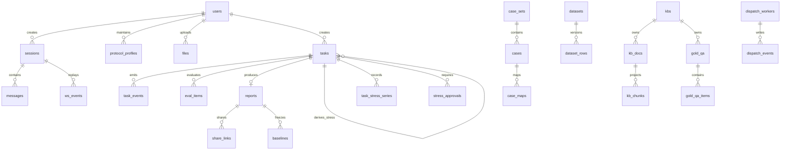

# AI 测试与评估平台数据库设计

| 项目 | 内容 |
| --- | --- |
| 文档版本 | V1.0-Draft |
| 状态 | 目标数据模型，待按里程碑以 Alembic 落地 |
| 数据库 | PostgreSQL 16 |
| 最近修订 | 2026-08-18 |
| 适用范围 | 平台 V1.0 |

## 1. 文档定位与裁决

本文是数据库实现的设计基线，不替代产品和接口契约。发生冲突时，按以下优先级裁决：

1. [`AI测试与评估平台-PRD.md`](AI测试与评估平台-PRD.md)：功能范围、任务状态机、确认卡字段和权限口径。
2. [`AI测试与评估平台-API.md`](AI测试与评估平台-API.md)：资源字段、REST/WS 契约和 TaskSpec。
3. [`AI测试与评估平台-后端开发计划.md`](AI测试与评估平台-后端开发计划.md)：表的最早交付批次和实现顺序。
4. 本文：将上述契约映射为 PostgreSQL 表、关系、约束、索引和迁移要求。

本文不新增 PRD V1.0 外的业务能力。`dataset_folders`、`case_folders`、`kb_chunks`、`gold_qa_items`、`dispatch_workers`、`dispatch_events`、`stress_whitelist`、`stress_approvals` 和 `task_stress_series` 是 API/开发计划已明确的持久化需求；它们用于规范化既有页面和接口，不是产品扩范围。

## 2. 设计原则

| 主题 | 设计决定 |
| --- | --- |
| 主键 | 业务实体 ID 使用 `varchar(36)`，保存 UUID 标准字符串，以兼容当前 `0001_initial` 迁移；事件流水使用 `bigint generated`。 |
| 时间 | 所有时间使用 `timestamptz`，以 UTC 写入；字段统一使用 `created_at`、`updated_at`、`ts` 或明确的 `*_at` 后缀。 |
| 结构化字段 | 可筛选、关联、约束的事实数据单列保存；TaskSpec 快照、指标分段、自定义列、上游原始报文等半结构化内容才使用 `jsonb`。 |
| 版本 | 数据集、黄金 QA、用例映射和任务均保存版本/快照。编辑当前资产不改变已经创建的任务和报告。 |
| 删除 | 历史任务、报告、审计、用量和事件不级联删除。资产删除后，历史快照继续可读；运行中任务引用的资产禁止删除。 |
| 安全 | 密码只存不可逆哈希；协议 Key 和通知密钥只存 Fernet 密文；分享令牌只存哈希；日志、事件、原始报文不得含密码、Cookie 或 API Key。 |
| 写入边界 | API/Agent 仅创建控制面数据和事件；Worker 写任务状态、样本、报告和用量；stress 容器的曲线由 Worker 回写平台库。 |
| 事务 | 影响状态机、版本、映射、会签、预算或审计的写操作必须同事务提交；任一步失败即整体回滚。 |

`sessions` 是 Agent 对话会话，不是浏览器登录会话。浏览器认证使用 HttpOnly Cookie；V1.0 不在数据库保存明文 Cookie 或 WS ticket。改密/停用通过用户认证版本或服务端会话失效策略统一处理；若以后必须持久化一次性短票，只能保存其哈希及过期时间，并另行更新接口契约。

## 3. 逻辑关系



## 4. 数据表设计

### 4.1 身份、配置、文件与审计

| 表 | 主要字段 | 约束与说明 | 最早批次 |
| --- | --- | --- | --- |
| `users` | `id`、`username`、`display_name`、`email`、`password_hash`、`role`、`must_change_password`、`disabled`、`last_login_at`、`last_login_ip`、`auth_version`、`created_at`、`updated_at` | `username` 唯一；`email` 非空时唯一；`role` 固定为 `member`，不再使用旧多角色含义；停用最后一个正常账号须由服务层在事务内拒绝。`auth_version` 用于改密或停用后统一失效旧登录态。 | B1 |
| `protocol_profiles` | `id`、`name`、`protocol`、`base_url`、`model`、`usages`、`anthropic_version`、`encrypted_key`、`created_by`、`created_at`、`updated_at` | `protocol` 限定 `openai_chat`、`openai_responses`、`anthropic_messages`；`usages` 为 `jsonb` 数组，如 `target`、`judge`、`agent`；`encrypted_key` 仅写入、不在任何 GET 返回。 | B1 |
| `settings` | `key`、`value`、`encrypted_value`、`updated_by`、`updated_at` | `key` 主键；`value` 存非敏感配置，如并发、预算、Agent profile、通知开关和阈值；`encrypted_value` 仅存 Webhook token 等写入型敏感项。白名单使用独立表，不塞入本表。 | B1/B5 |
| `files` | `id`、`filename`、`content_type`、`size_bytes`、`sha256`、`storage_path`、`kind`、`uploaded_by`、`created_at` | 文件二进制位于 `./data/files/{id}`，数据库只存元数据和路径；`sha256` 建普通索引用于去重核验，不以文件名判断同一内容。 | B1 |
| `audit_logs` | `id`、`actor_id`、`action`、`target_type`、`target_id`、`detail`、`ip`、`ts` | 追加写入，不更新、不删除；`detail` 必须经脱敏。至少覆盖登录失败、Key 变更、基线冻结/解冻、白名单变更、`prod` 会签/发压、账号状态变更。 | B1 |

`users.role` 当前骨架迁移仍使用 `engineer/admin/readonly` 旧注释和默认值。目标模型以 API 的单一 `member` 角色为准；实施该对齐时必须提交数据修复和 Alembic 迁移，不能只改 ORM 默认值。

### 4.2 Agent 会话与事件回放

| 表 | 主要字段 | 约束与说明 | 最早批次 |
| --- | --- | --- | --- |
| `sessions` | `id`、`user_id`、`title`、`created_at`、`updated_at` | `user_id -> users.id`；会话不提供 V1.0 删除接口。`updated_at` 在新消息、会话标题变更或关联活动任务变动时更新。 | B2 |
| `messages` | `id`、`session_id`、`role`、`content`、`attachments`、`created_at` | `role` 限定 `user`、`assistant`、`system`；`attachments` 为文件 ID 数组 JSONB，服务层验证每个 ID 可访问。按 `(session_id, created_at, id)` 回放。 | B2 |
| `ws_events` | `id`、`session_id`、`task_id`、`event_id`、`event`、`payload`、`ts` | 唯一约束 `(session_id, event_id)`；`event_id` 在单个会话内严格递增。仅允许 API 契约中定义的事件名；`payload` 不含 Key、Cookie 或隐私凭据。 | B2 |

建议索引：`sessions(user_id, updated_at desc)`、`messages(session_id, created_at, id)`、`ws_events(session_id, event_id)`。后者是断线用 `last_event_id` 补发的唯一读取路径。

### 4.3 数据集与用例资产

| 表 | 主要字段 | 约束与说明 | 最早批次 |
| --- | --- | --- | --- |
| `dataset_folders` | `id`、`name`、`parent_id`、`sort_order`、`created_by`、`created_at` | `parent_id` 自关联；删除非空目录前由服务层校验。树循环在写入时校验，不由前端保证。 | B3 |
| `datasets` | `id`、`name`、`folder_id`、`version`、`metric`、`column_schema`、`row_count`、`pending_complete_count`、`owner_id`、`created_at`、`updated_at` | `metric` 限定 `exact`、`contain`、`regex`、`rouge_l`、`bleu`；`column_schema` 是自定义列定义。版本只递增；任务直接保存所用版本。 | B3 |
| `dataset_rows` | `id`、`dataset_id`、`dataset_version`、`row_no`、`question`、`reference`、`context`、`data`、`pending_complete`、`source_case_id`、`source_case_version`、`created_at` | 唯一 `(dataset_id, dataset_version, row_no)`；`data` 保存自定义列。每次覆盖上传或批量保存创建新版本行，评测按 TaskSpec 快照的版本读取；待补全行不进入评分分母。 | B3 |
| `case_folders` | `id`、`name`、`parent_id`、`sort_order`、`created_by`、`created_at` | 规则同 `dataset_folders`。 | B3 |
| `case_sets` | `id`、`task_id`、`name`、`folder_id`、`status`、`version`、`column_schema`、`checks`、`generated_count`、`confirmed_count`、`expires_at`、`created_by`、`created_at`、`updated_at` | `task_id` 可空，允许手工建集；`status` 限定 `generated`、`confirmed`、`cancelled`。确认后不可修改策略、检查结果和映射；`expires_at` 是等待确认起 72 小时。 | B3 |
| `cases` | `id`、`case_set_id`、`case_version`、`strategy`、`priority`、`module`、`name`、`precondition`、`steps`、`expected`、`test_type`、`data`、`pending_complete`、`created_at`、`updated_at` | `strategy` 取六类生成策略；`data` 保存自定义列。修改未确认用例时递增 `case_version`，保证映射可追溯。 | B3 |
| `case_maps` | `id`、`case_id`、`source_case_version`、`target_type`、`target_id`、`target_version`、`target_item_id`、`created_by`、`created_at` | `target_type` 限定 `dataset`、`gold_qa`；保存来源用例版本和目标资产版本。`target_item_id` 指向生成后的行/QA 项；映射和目标版本写入须在同一事务。 | B3 |

数据集与用例目录均属于业务数据，不能降级为浏览器偏好。`dataset_rows` 的版本化副本使“上传/编辑后递增版本”与“历史报告可复算”同时成立；大批量覆盖前须先完成文件校验，避免创建半个版本。

### 4.4 知识库、文档与黄金 QA

| 表 | 主要字段 | 约束与说明 | 最早批次 |
| --- | --- | --- | --- |
| `kbs` | `id`、`name`、`kind`、`is_core`、`capabilities`、`owner_id`、`created_at`、`updated_at` | `kind` 限定 `lightrag`、`external_chat`；`capabilities` 在 V1.0 固定返回 `projection=false`、`rerank_compare=false`。核心库变更写审计。 | B4 |
| `kb_docs` | `id`、`kb_id`、`file_id`、`filename`、`size_bytes`、`sha256`、`status`、`index_version`、`error_message`、`created_by`、`created_at`、`indexed_at` | `status` 限定 `indexing`、`indexed`、`failed`；`id` 同时作为写进 LightRAG metadata 的 `doc_id`。删除文档必须协调删除 LightRAG 索引。 | B4 |
| `kb_chunks` | `id`、`kb_id`、`kb_doc_id`、`index_version`、`source_chunk_id`、`seq_no`、`token_count`、`text`、`created_at` | 唯一 `(kb_doc_id, index_version, source_chunk_id)`；这是从 LightRAG 索引同步的可追溯读模型/预览缓存，不保存向量，也不作为检索引擎。 | B4 |
| `gold_qa` | `id`、`kb_id`、`name`、`version`、`item_count`、`owner_id`、`created_at`、`updated_at` | 代表可被 TaskSpec 的 `gold_qa_id` 引用的一组黄金 QA；覆盖上传后版本递增。 | B4 |
| `gold_qa_items` | `id`、`gold_qa_id`、`gold_qa_version`、`row_no`、`question`、`reference`、`expected_doc_ids`、`source_case_id`、`source_case_version`、`created_at` | 唯一 `(gold_qa_id, gold_qa_version, row_no)`；`expected_doc_ids` 是 UUID 数组 JSONB。为空的样本可参与答案 contain，但不进入 Hit Rate/MRR/Recall 分母。 | B4 |

`kb_docs` 与 `kb_chunks` 的索引状态和版本必须从 LightRAG 同步而来，不能为填充页面自行生成样本文本。外部 RAG 的服务地址和认证仍使用 `protocol_profiles`，不把它伪装成 LightRAG 文档库。

### 4.5 任务队列、报告和评测结果

| 表 | 主要字段 | 约束与说明 | 最早批次 |
| --- | --- | --- | --- |
| `tasks` | `id`、`session_id`、`parent_task_id`、`kind`、`status`、`dataset_id`、`dataset_version`、`kb_id`、`gold_qa_id`、`gold_qa_version`、`config`、`progress`、`result_summary`、`created_by`、`claimed_by_worker_id`、`claim_expires_at`、`attempt`、`cancel_requested_at`、`started_at`、`finished_at`、`created_at`、`updated_at` | `kind` 限定 `benchmark`、`rag`、`testcase`、`stress`；`config` 为完整、已校验的 TaskSpec 快照。`parent_task_id` 仅允许质量任务到 `stress` 子任务的关系；资产软/物理删除后，快照和版本仍为报告事实来源。 | B2/B5 |
| `task_events` | `id`、`task_id`、`event`、`level`、`message`、`payload`、`ts` | 追加式时间线；`event` 表示状态/执行事件，`level` 供详情页显示。进度曲线不写到此表，避免冒充 WS `progress`。 | B2 |
| `eval_items` | `id`、`task_id`、`report_id`、`profile_id`、`mode`、`source_item_id`、`source_row_no`、`status`、`score`、`latency_ms`、`usage`、`answer`、`contexts`、`judge`、`error_code`、`error_message`、`raw_request`、`raw_response`、`created_at` | 样本级输出与错误。`raw_*` 脱敏并截断至 32KB；不存 API Key。`mode` 用于 LightRAG 多模式并排结果。 | B3/B4 |
| `reports` | `id`、`task_id`、`kind`、`title`、`snapshot`、`metrics`、`sections`、`degraded`、`created_at` | `task_id` 唯一；`snapshot` 固化数据集/KB/黄金 QA 版本、指标和 profile；`metrics`、`sections` 承载 benchmark、rag、stress 的差异化报告段。 | B3/B4/B5 |
| `share_links` | `id`、`report_id`、`token_hash`、`expires_at`、`created_by`、`revoked_at`、`created_at` | `token_hash` 唯一，绝不存或回读明文 token；默认 7 天，读取时验证未撤销且未过期。 | B3 |
| `baselines` | `id`、`report_id`、`kind`、`scope_key`、`frozen_by`、`frozen_at`、`unfrozen_at` | `scope_key` 对 Benchmark 由数据集 ID、版本和主指标组成，对 RAG 由 KB、黄金 QA 版本组成；同一有效范围至多一个有效基线，使用 `unfrozen_at is null` 的部分唯一索引。 | B3/B4 |
| `usage_ledger` | `id`、`task_id`、`eval_item_id`、`profile_id`、`phase`、`prompt_tokens`、`completion_tokens`、`cost_usd`、`ts` | `phase` 区分被测、Judge、压测估算等；`cost_usd` 使用 `numeric(14,6)`。单任务累计值用于预算硬停，不能只在报告完成后汇总。 | B3/B5 |

任务和报告之间以 `reports.task_id` 为主关系；若 `tasks` 保留 `report_id` 作为列表优化字段，它是冗余回填列，必须与报告创建在同一事务更新，不可成为第二份事实来源。

### 4.6 压测治理与调度

| 表 | 主要字段 | 约束与说明 | 最早批次 |
| --- | --- | --- | --- |
| `stress_whitelist` | `id`、`host`、`port`、`scopes`、`enabled`、`created_by`、`created_at`、`updated_at` | `scopes` 为 `dev/test/staging/prod` 数组；使用规范化后的 host、port、scope 做有效唯一约束。不存在匹配项时压测任务不得进入 `running`。 | B5 |
| `stress_approvals` | `id`、`task_id`、`approver_id`、`decision`、`comment`、`created_at` | `decision` 限定 `approved`、`rejected`；唯一 `(task_id, approver_id)`；服务层拒绝创建者会签本人。只有 `prod` 子任务需要有效 `approved` 记录。 | B5 |
| `task_stress_series` | `id`、`task_id`、`ts`、`qps`、`rt_ms`、`p99_ms`、`error_rate`、`ttft_ms`、`tpot_ms`、`tokens_per_s`、`created_at` | 唯一 `(task_id, ts)`；供 `GET /tasks/{id}/stress-series`，不是 WS 事件载荷。非流式 RAG 可为空 `ttft_ms/tpot_ms/tokens_per_s`。 | B5 |
| `dispatch_workers` | `id`、`name`、`caps`、`state`、`weight`、`load_percent`、`last_heartbeat_at`、`current_task_id`、`created_at`、`updated_at` | `state` 限定 `online`、`busy`、`draining`、`offline`；Worker 注册和治理写入审计。`current_task_id` 是运行态快照，最终执行事实仍在 `tasks`。 | B2 |
| `dispatch_events` | `id`、`task_id`、`worker_id`、`event`、`message`、`detail`、`ts` | 单调 `id` 支持 `after_id` 增量读取；仅调度器/Worker 可写，浏览器只读。 | B2 |

建议索引：`stress_whitelist(host, port, enabled)`、`stress_approvals(task_id, decision)`、`task_stress_series(task_id, ts)`、`dispatch_workers(state, last_heartbeat_at)`、`dispatch_events(id)` 和 `dispatch_events(task_id, ts)`。

## 5. 关键约束与索引

### 5.1 任务状态和会话槽位

`tasks.status` 仅允许：`queued`、`running`、`awaiting_case_confirm`、`succeeded`、`failed`、`cancelled`。数据库迁移应包含检查约束；状态迁移规则仍由具有业务上下文的服务层执行：

```text
queued -> running -> succeeded | failed | cancelled
                  -> awaiting_case_confirm -> succeeded | cancelled
```

会话内只能有一个非终态任务（压测子任务同样占槽）。使用以下部分唯一索引作为最终兜底：

```sql
CREATE UNIQUE INDEX uq_tasks_active_session
    ON tasks (session_id)
    WHERE session_id IS NOT NULL
      AND status IN ('queued', 'running', 'awaiting_case_confirm');
```

Worker 将质量任务从 `running` 置为 `succeeded` 且需要压测时，必须在同一事务创建子任务，使父任务释放槽位与子任务占用槽位之间没有间隙。`prod` 未会签时子任务保持 `queued`，不得被 claim。

队列读取索引为 `tasks(status, created_at)`；Worker claim 使用 `FOR UPDATE SKIP LOCKED`，并写入 `claimed_by_worker_id`、`claim_expires_at`。过期租约由恢复逻辑回收，避免 Worker 异常退出造成永久 `running`。

### 5.2 版本和基线约束

1. 创建 Benchmark 任务时，`datasets.version` 写入 `tasks.dataset_version` 和 `config`；Worker 只读取该版本的 `dataset_rows`。
2. 创建 RAG 任务时，`gold_qa.version` 写入 `tasks.gold_qa_version` 和 `config`；无 `expected_doc_ids` 的项目不计入检索侧分母。
3. 用例映射将 `source_case_version`、目标资产版本和生成目标项 ID 一并保存；映射写入失败不得留下半完成目标行。
4. 报告的 `snapshot` 是展示和比较的不可变依据；`baselines` 只能冻结 `succeeded` 任务的报告。
5. 基线比较前检查 `scope_key` 相同。Benchmark 不跨数据集版本或主指标比较；RAG 不跨 KB 或黄金 QA 版本比较。

### 5.3 关系删除策略

| 被引用资源 | 运行中任务 | 历史任务/报告 | 目录/子项 |
| --- | --- | --- | --- |
| 数据集、KB、黄金 QA、协议档 | 拒绝删除，返回 `VALIDATION` | 可删除当前资产；任务/报告依靠版本和快照保留事实 | 行/文档使用资产删除流程，不能绕过版本核验 |
| 数据集/用例目录 | 目录非空时拒绝删除 | 不影响历史资产快照 | 先移动或删除直属资产 |
| 用户 | V1.0 不物理删除账号 | 审计中的 `actor_id` 保留 | 停用账号而非删除 |
| 报告 | 有效分享链接或基线时拒绝删除 | 不允许通过删除掩盖审计 | 先显式撤销分享/解冻 |

## 6. 安全和数据保留

| 数据 | 存储要求 |
| --- | --- |
| 密码 | 使用安全密码哈希；禁止写入 `audit_logs`、`task_events`、异常详情或 Worker 日志。 |
| API Key / 通知凭据 | Fernet 密文列保存；所有 GET、报告、WS 和审计只返回 `has_api_key`、开关或掩码。 |
| 分享链接 | 仅保存随机 token 的哈希；原 token 只在创建响应中返回一次。 |
| 上游原始报文 | 仅在 `eval_items.raw_request/raw_response` 脱敏、截断（最大 32KB）后保存；移除 Authorization、Cookie 和 Key 形态字段。 |
| 文件 | 本地卷保存，数据库保存路径和 SHA-256；上传大小、扩展名和访问权限均在落盘前校验。 |
| 审计与事件 | V1.0 不设自动物理清除策略。后续若增加保留期，必须先修改 PRD/API，并验证不会影响 7 天分享、任务重放、报告追溯和成本核对。 |

## 7. 现有迁移差异与实施顺序

当前 [`0001_initial.py`](../backend/api/migrations/versions/0001_initial.py) 已创建 `users`、`sessions`、`messages`、`ws_events`、`protocol_profiles`、`datasets`、`tasks`、`task_events`、`reports`、`settings` 和 `audit_logs` 的最小骨架。它尚不代表本文的完整目标模型，主要差异如下：

| 域 | 当前骨架 | 目标补齐 |
| --- | --- | --- |
| 成员 | 缺显示名、邮箱、首改密、登录字段和认证版本；角色仍为旧模型 | 对齐单一 `member` 角色与 API 用户字段 |
| 会话 | 缺 `updated_at`、消息附件、事件任务关联及唯一事件号约束 | 支持 REST 历史回放和 WS 不重不漏补发 |
| 协议档/文件 | 协议档缺用途、Anthropic 版本、更新时间；`files` 缺失 | 完成 Key 写入保护和文件元数据 |
| 资产 | 仅有最小 `datasets`，缺目录、版本行、用例、KB、黄金 QA | 按 B3/B4 建立版本化资产链 |
| 任务/报告 | 任务缺 TaskSpec 查询列、claim/取消字段；报告和事件过于简化 | 支持状态机、报告快照、样本、分享、基线和用量 |
| 治理 | 缺 Worker、调度事件、白名单、会签和压测曲线 | 按 B2/B5 补齐控制面与时序数据 |

推荐 Alembic 顺序如下。每次变更 `models.py` 后，必须先执行 `alembic revision --autogenerate -m "中文说明"`，审阅自动生成脚本，再和模型、接口测试一同提交。

1. `0002`（B1）：补齐用户、协议档、设置加密列、文件和审计索引；执行旧角色到 `member` 的数据修复。
2. `0003`（B2）：扩展会话/消息/WS 事件，扩展任务队列表，并创建 `dispatch_workers`、`dispatch_events` 和任务状态/会话槽位索引。
3. `0004`（B3）：创建数据集/用例目录、版本行、报告样本、分享、基线和用量表；先落版本表，再开放上传和映射接口。
4. `0005`（B4）：创建 KB 文档、切块读模型、黄金 QA 集及项目表；LightRAG 索引状态回写在同批完成。
5. `0006`（B5）：创建白名单、会签、压测时序表，补齐压测专用任务约束和成本聚合索引。

迁移不得手工改生产库。数据量较大的数据集版本回填采用可恢复的分批迁移；结构迁移完成前不切换 API 写入路径，防止新旧代码同时写出两种数据语义。

## 8. 数据库验收清单

- `ws_events(session_id, event_id)` 唯一，断线补发无重复、无遗漏。
- 同一会话并发创建两个非终态任务时，仅一条成功；质量成功派生压测子任务时槽位连续。
- 覆盖上传数据集/黄金 QA 后版本递增，旧任务和旧报告仍从其快照版本读取。
- 用例确认、映射和目标行生成全部事务化；失败后不残留半完成映射。
- 未在白名单、未会签的 `prod` 压测都无法进入 `running`；取消压测后不再写新的发压点。
- 当前任务预算累计到上限后原子地停止后续调用，`usage_ledger` 与报告成本一致。
- 所有协议 Key、密码、Cookie、WS ticket 和明文分享 token 均不能从数据库查询结果、API、WS 事件、审计或原始报文中回显。
- 每个表的写入后都有重新读取的集成测试；涉及迁移的表有 upgrade/downgrade 验证。
