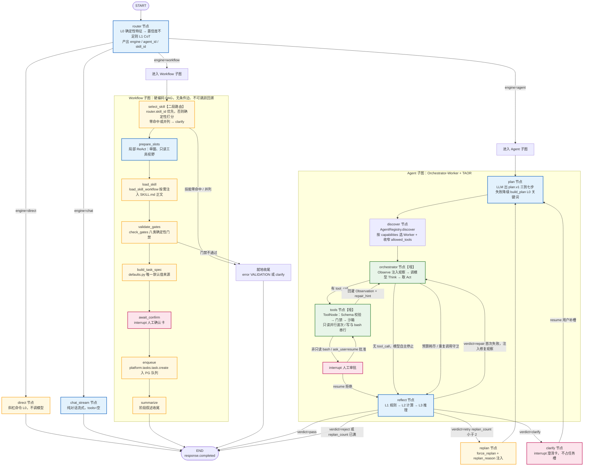
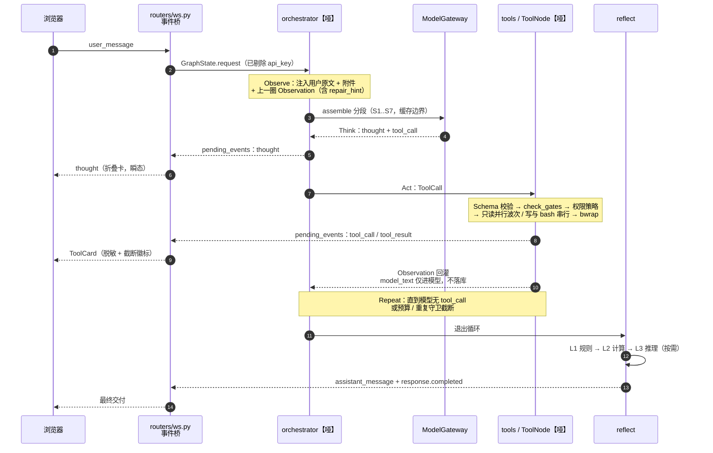
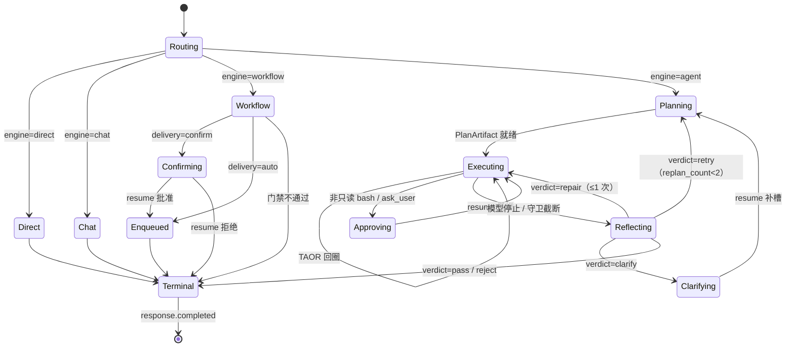
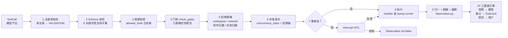

# AI 测试与评估平台 — 混合驱动引擎（Hybrid Agent Engine）架构需求文档

| 项 | 内容 |
| :--- | :--- |
| 文档名称 | 混合驱动引擎（Hybrid Agent Engine）架构需求 |
| 版本 | V1.2 |
| 审查日期 | 2026-09-02 |
| 文档性质 | 架构需求 + ADR + 分阶段落地契约（**本版不改对外契约，契约变更逐阶段先改 API.md**） |
| 适用范围 | `/agent` 对话智能体全链路：LangGraph 双引擎图、Harness 九层、WebSocket 事件桥、短工具与长任务分离 |
| 前置输入 | [`docs/AI测试与评估平台-混合驱动引擎环境审计.md`](./AI测试与评估平台-混合驱动引擎环境审计.md) V1.0（只读审计与 9 项阻塞矛盾） |
| 上游权威 | `docs/AI测试与评估平台-PRD.md`（产品范围）＞ `docs/AI测试与评估平台-API.md`（REST/WS 字段唯一真理）＞ `docs/AI测试与评估平台-Agent开发文档.md`（当前链路）＞ 本文 |
| 事实来源 | `backend/api/app/{agent,harness,llm}/`、`app/routers/{ws,tasks,mcp}.py`、`backend/worker/app/`、`frontend/src/{views/Agent.vue,api/types.ts}` |
| 参考实现 | Claude Code Harness（TAOR 循环、两层状态、原子工具、Skills 渐进披露、Prompt Cache 边界）；LangGraph Plan-and-Execute / Reflexion；Anthropic Orchestrator-Worker |
| 前身文档 | `docs/AI测试与评估平台-Agent混合范式与架构完善.md` V0.3.3（本文是其**继任者**，在骨架化后重建并升级为双引擎） |

> **裁决铁律**：本文与 PRD 冲突以 PRD 为准；与 API.md 冲突以 API.md 为准。本文**不新增** REST/WS 字段；任何新事件必须先回写 API.md 再改代码（`AGENTS.md` 红线第 1 条）。
>
> **一句话目标**：把已被骨架化的编排层，重建为「**顶层 Router 双引擎分流 + Agent 子图 TAOR 自主循环 + Workflow 子图确定性 DAG**」的单张 LangGraph 图，并补齐 Agent Registry、上下文缓存边界、HITL 审批三处真实空白。

---

## 1. Project Overview & Context

### 1.1 项目现状（摘自审计）

本平台是面向单一研发/评测团队的内部 AI 测试与评估平台：对话驱动任务入队，质量评测成功后按「先评后压」自动派生共享压测。服务拓扑为 `web / api / worker / postgres / redis / lightrag / stress / runner` 八件套。

[`docs/AI测试与评估平台-混合驱动引擎环境审计.md`](./AI测试与评估平台-混合驱动引擎环境审计.md) 的核心发现，直接决定本文的设计路线：

| 审计发现 | 数据 | 对架构的约束 |
| :--- | :--- | :--- |
| 生产 Agent 图已被骨架化 | **1 节点 / 2 无条件边 / 0 条件边 / 0 工具 / 0 interrupt** | 编排层是唯一断点，必须重建 |
| `GraphState` 为完整混合图设计 | **24 字段，骨架图仅用 3 个**；含 `replan_count` / `force_replan` / `verdict="repair"` / `step_fail_count` | Plan/Reflect/Replan 曾运行过，State 无需重设计，只需扩展 |
| Harness 基础设施完整但「死连」 | `registry.py` 1256 行、`dispatch.py` 1264 行、`toolnode.py` 544 行、`checkpoint.py` 488 行，均**零生产调用** | 路线必须是「恢复接线 + 增量升级」，禁止重写（红线第 5 条） |
| 工具元数据粒度超出需求预期 | `ToolDef` 19 字段，含 `risk_level` / `execution_mode` / `concurrency_class`（四档）/ `permission_policy` / `recovery_policy` | Claude Code 的 `isReadOnly/isDestructive/isConcurrencySafe` **已满足**，无需新建 |
| 上下文缓存边界完全缺失 | 全 `backend/api` 无 `cache_control`；`assemble()` 把静态段与动态段 `"\n\n".join` 成单块 | 真实新建项之一 |
| Agent Registry 完全缺失 | 无 `AgentRegistry`；`task` 工具的 `subagent_type` 标注「仅展示，不启子代理」 | 真实新建项之二 |
| Workflow DAG 完全缺失 | 无任何硬编码 DAG 子图 | 真实新建项之三 |
| LangGraph 已固定安装 | `langgraph==1.2.10`（api + worker），8 处真实 import；**无 langchain 主包 / 无 langsmith / 无官方 mcp 包 / 无 langgraph.json** | 依赖新增须保守（Python 3.14 wheel 风险） |
| 断点续跑与 HITL 事实不可用 | `agent_checkpointer=memory`；`ahas_pending_interrupt` 恒 `False`；`ws.py` 无 `resume` 调用 | HITL 阶段必须同步切 `PgCheckpointer`（矛盾 C-7） |
| 并行工具已实现但灰度关闭 | `agent_parallel_tool_batch_enabled=False`，`batch.py::select_execution_wave` 齐备 | 属「开开关」不属开发 |

### 1.2 为什么采用「Workflow + Agent 混合架构」

平台业务天然分裂为**两类形态迥异的请求**，用单一范式服务二者必然一头浪费一头失控：

| 业务类别 | 代表请求 | 形态特征 | 单一 Agent 的代价 | 单一 Workflow 的代价 |
| :--- | :--- | :--- | :--- | :--- |
| **强流程类** | 「按 profile-A 对数据集 D 跑基准评测，成功后压测」 | 槽位固定、步骤固定、可验证、须审批、须先评后压 | 模型可能跳步、漏槽、重复入队；不可审计 | — |
| **探索类** | 「上周 benchmark 分数掉了，排查一下原因」 | 目标导向、步数未知、须读文件/查报告/交叉验证 | — | DAG 无法穷举分支，必然卡死或退化为「问答」 |

混合架构的收益直接对应平台既有硬约束：

1. **确定性可审计**：评测入队、确认卡、先评后压、配额熔断这些路径已由 `harness/feedback/rules.py::check_gates`（8 类确定性门禁）保护。Workflow 子图把这些门禁提升为**图结构本身**——不是「模型被门禁拦住」，而是「模型根本没有跳步的边」。
2. **自主性可控**：探索类请求走 Agent 子图，享受完整 TAOR 循环与工具集，但**预算、重复抑制、有界重规划**（`MAX_REPAIRS=1` / `MAX_REPLANS=2`）把自主性关进笼子。
3. **成本可预测**：Workflow 分支 token 消耗近乎常量；Agent 分支才承担多轮开销。Router 分流即成本分流。
4. **合规不越界**：`AGENTS.md` 禁止第二条 Harness 循环、禁止外部 MCP、禁止 API 进程跑长任务。双引擎在**同一张图、同一个 `ModelGateway`** 内实现，不触碰上述红线。

### 1.3 与 Claude Code 机制的对应关系

| Claude Code 机制 | 本平台落点 | 审计判定 |
| :--- | :--- | :--- |
| **TAOR 循环**（Think-Act-Observe-Repeat） | Agent 子图 Executor 循环；平台既有术语为 **OTA（Observe→Think→Act）**，语义等价、起点表述不同（先看证据再决策） | 🟡 需重构（`observations` / `native_messages` append reducer 与回灌机制在库中完整） |
| **Orchestrator 越笨越稳**（哑循环 + 智能模型） | `harness/execution/toolnode.py` 即哑执行器：只校验 Schema、过门禁、执行、回灌观察，**不做任何推理** | ✅ 已满足（理念已冻结，实现在库中） |
| **原子工具**（一工具一职责） | `read` / `write` / `edit` / `bash` / `web_search` / `web_fetch` / `task`；明令禁止「检索+分析+写设计」超级工具 | ✅ 已满足 |
| **工具生命周期标志** | `risk_level` / `execution_mode` / `concurrency_class` / `requires_confirmation` / `permission_policy` / `recovery_policy` | ✅ 已满足（粒度更细，见 §2 ADR-6） |
| **两层状态**（Bootstrap / AppState） | 平台拆三层：平台级 `settings` / 会话级 `messages`+`ws_events`+工作区 / 回合级 `GraphState`+`thread_id` | ✅ 已满足 |
| **Skills 渐进披露**（`.md` 按需注入） | `skills/registry.py::list_hints()` 常驻目录（名称+一句话）+ `skills/workflows.py::load_skill_workflow()` 按需加载正文，**明令不写入 GraphState** | ✅ 已满足（4 个 SKILL.md 就位） |
| **CLAUDE.md 指令分层** | 根 `AGENTS.md`（面向开发者，**不进运行时提示词**）+ DB `agent_prompt_overlay`（会话/协议档级） | 🟡 需重构（缺三层优先级与核心段不可覆盖声明） |
| **Prompt Cache 边界** | — | 🔴 **完全缺失**（真实新建项） |
| **TaskCreate / todos** | `task` 原生工具 + 会话看板 `TaskCreate|TaskGet|TaskUpdate|TaskList`（不写 PG `tasks` 表） | ✅ 已满足 |
| **Subagent 派发** | `task` 工具 `subagent_type` 参数**仅展示，不启子代理** | 🔴 缺失（Agent Registry 为本文新建项） |
| **HITL 审批（可打断）** | `toolnode.py` bash HITL 与 `ask_user` 已用 `langgraph.types.interrupt()`（6 个测试用例） | 🟡 需重构（生产图不含 ToolNode，`ws.py` 无 `resume`） |

---

## 2. Architecture Decision Record（ADR）

每条 ADR 给出**决策 / 理由 / 备选与否决原因 / 后果与代价**，并标注是否受审计矛盾点约束。

### ADR-1 Router 作为顶层分流，而非单一 Agent 内部决策

**决策**：在 `START` 之后设置独立 `router` 节点，产出 `engine ∈ {workflow, agent, direct, chat}`，由条件边分流到两张子图。Router 采用**分层混合判别**：

1. **L0 确定性特征**（不调模型，复用 `orchestration/router.py::decide_mode` + `detect_plan_intent`）：`/` 前缀 → `direct`；无工具意图无附件 → `chat`；命中已注册 Skill 的必填槽全齐 → `workflow`；多槽/多技能/两个及以上不同短工具 → `agent`；
2. **L1 CoT 判别**（仅 L0 置信度不足时，一次短模型调用）：产出 `router.v1` JSON `{engine, skill_id?, confidence, reason, slots?}`；
3. **降级**：L1 上游异常 / 解析失败 / 预算耗尽 → 回落 L0 结果；L0 亦无结论 → `chat`。

**理由**：

- **可审计性**：分流决策若埋在 Agent 内部的自由推理里，无法在 `ws_events` 上留下确定性痕迹，评测入队这类高风险动作就失去了「为什么走了这条路」的溯源；顶层节点使 `engine` 成为 `GraphState` 的一等字段与检查点内容。
- **成本**：Workflow 分支不应为「判断自己是 Workflow」而先付一轮完整 Agent 推理的代价。
- **单一职责**：单 Agent 内部决策会让 Executor 同时承担「选范式」与「执行」，违背 ADR-2 的哑 Orchestrator 原则。

**备选与否决**：

- ❌ 纯 LLM Router（需求原始表述）：与既有裁决「不用 LLM 替代 `decide_mode` 做每次分流」直接冲突（审计矛盾 **C-4**），且每轮多一次模型调用、抖动不可复现；
- ❌ 纯确定性 Router（现状 `decide_mode`）：关键词召回边界已知有漏（前身文档开放问题 Q6：同组关键词共现漏升 `plan_solve`）；
- ✅ **分层混合**：解决 C-4——确定性优先保成本与可复现，低置信度才引入 CoT 保召回，失败必降级。

**分流基数：四路，不是二值（V1.1 裁决）**

需求草案曾表述为二值 `{Workflow, Agent}`，并把「简单问答」归入 Workflow。本文**否决**该基数：

- 「什么是 pass@1」不对应任何已注册 Skill，塞进 Workflow 必须为它伪造一个空 Skill 与空 DAG，`SKILL_CATALOG` 会被污染成「四个真技能 + 一个假技能」；
- `chat_stream` 是骨架化后**代码中唯一活跃的生产节点**，拆除它的风险远大于收益；
- 二值基数下 `direct`（斜杠命令，不调模型）无处安放，会被迫退化为「一次模型调用」，与 L0 零成本语义相悖。

四路 `direct / chat / workflow / agent` 恰好满足草案「简单问答避免过度推理」的本意：`chat` 零工具、单次模型调用，`direct` 零模型调用。

**协议格式：JSON，不接受 XML 标签（V1.1 裁决）**

需求草案要求模型输出 `<Intent>` 与 `<Reasoning>` 标签。本文**否决**该格式：`harness/prompts/protocols.py`（182 行）已冻结 `react.v1` / `plan.v1` / `reflect.v1` **全 JSON** 协议族并配套解析器与测试，新增 XML 标签解析将形成第二套协议风格与第二套失败模式。`router.v1` 的 `reason` 字段**即承载** `<Reasoning>` 语义，`engine` 字段即 `<Intent>`，语义等价且解析器与纠正重试逻辑（`parse_retries`）可直接复用。

**后果**：新增 `router.v1` JSON 协议与解析器（落在 `harness/prompts/protocols.py`）；Router 的模型调用必须计入 `Budget.model_calls`。

### ADR-2 遵循「Orchestrator 越笨，架构越稳定」的 TAOR 循环

**决策**：Agent 子图的 Orchestrator（即 `orchestrator` 节点 + `tools` 节点）**只做四件事**：驱动循环、校验参数、执行工具、回灌观察。**推理、决策、何时停止全部交给模型**。Orchestrator 禁止：改写模型意图、推断"模型其实想要 X"、自动重试有副作用的工具、在节点内做业务判断。

**理由**：

- 平台已有惨痛先例可循——`AGENTS.md` §1.5 记录「执行器自管 Session，禁止跨 Session 传 ORM 对象（会触发 `InvalidRequestError`，导致任务永久卡 `running`）」。**编排层承载的状态越多，失败模式越不可枚举**。
- 哑 Orchestrator 使得「模型能力提升」自动转化为「系统能力提升」，无需改编排代码；反之聪明 Orchestrator 会与模型的推理产生二次博弈，出现「模型想 A、编排改成 B、模型看到 B 又纠正成 C」的震荡。
- 可测试性：哑循环的单元测试只需断言「给定 ToolCall，是否正确执行并回灌」，不需要 mock 推理。

**TAOR 与平台 OTA 的关系**：二者是**同一循环的不同起点表述**，本文统一采用 TAOR 命名对齐需求，但**保留 OTA 的语义顺序**——即每一圈进入模型前必须先注入 Observation：

```text
Repeat 的第 N 圈：
  Observe : 用户原文 + 附件 + 第 N-1 圈 Observation（含 repair_hint）
  Think   : thought / 上游 reasoning 摘要（用户可见折叠卡）
  Act     : tool_call（短工具，串行过门禁）或最终 assistant_message
```

**备选与否决**：❌ 让 Orchestrator 做「智能重试 / 参数自动修复」——`policy.py::ToolRecoveryPolicy` 注释已明确「`retryable_codes` 仅表示模型或用户可在修复参数后再试，**绝不代表执行器自动重复副作用操作**」。

**后果**：停止条件必须由模型显式给出（无 ToolCall 的最终正文）或由**确定性守卫**强制截断（预算耗尽、重复调用、`MAX_REPLANS`）——不允许 Orchestrator「觉得差不多了」。

### ADR-3 引入 Agent Registry 做动态注册与发现

**决策**：新建 `harness/orchestration/agents.py` 提供 `AgentRegistry`，以 `AgentDef`（能力标签 `capabilities` + 允许工具集 `allowed_tools` + Skill 绑定 + 预算 + 权限上限）描述每个 Worker。Orchestrator 通过 `AgentRegistry.discover(capabilities, skill_id)` 选出 Worker，并据其 `allowed_tools` **收窄本轮工具视野**。

**理由**：

- **工具视野收窄是刚需**：`assembly.py::select_tool_defs` 的注释已经指出问题——「有 `PlanArtifact` 时 `planned_only=True`：执行器只看见计划剩余工具，**避免确认卡路径把全量原生工具重新铺开造成空转循环**」。Agent Registry 把这种临时收窄升级为**声明式能力边界**。
- **可扩展而不改图**：新增一类 Worker（如「报告解读 Worker」）只需注册一条 `AgentDef`，不需要加节点、加边、改条件函数。这与 `ToolRegistry` 的成功经验一致（新增工具只需 `register()`）。
- **权限收敛**：`AgentDef.max_permission` 使得「探索型 Worker 只能 read，不能 write/bash」成为注册表事实，而不是散落在 handler 里的 if。
- **有现成范本**：`ToolRegistry`（`registry.py`）的 `register/get/find/iter_defs` + `to_descriptor()` 投影模式可直接平移，`AgentDescriptor` 亦可复用现有 `/api/mcp/*` 只读目录的投影思路。

**备选与否决**：

- ❌ 硬编码 Worker 节点（每类任务一个节点）：节点数随业务线性膨胀，条件边组合爆炸；
- ❌ 进程级多 Agent（独立 LangGraph 应用互相调用）：直接违反红线「不新增第二条 Agent / 模型客户端」（审计矛盾 **C-5**）。

**关键裁决（解决 C-5）**：Worker **不是**独立进程或独立图，而是**同一张图内的子图 / 同一 Executor 循环的不同配置**（不同工具视野 + 不同 Skill 正文 + 不同预算）。全平台仍只有一个 `LangGraphAgent` 入口与一个 `ModelGateway`。

**每 Worker 模型选择：`model_profile_id`，不是 LLM 实例（V1.1 裁决）**

需求草案的 `AgentRegistry` 字段含 `llm`。本文裁决为 `AgentDef.model_profile_id: str | None = None`：

- 平台模型参数的事实源是**协议档**（`profile_env.py` 的 `AI_PROFILE_{ID}_{BASE_URL|MODEL|API_KEY}`），`AgentDef` 只允许持有档 **ID**，运行期由节点从 `configurable` / DB 取参并即时注入 `ModelGateway`；
- **禁止**持有 LangChain LLM 实例或任何协议客户端——那等于第二条模型入口，直接违反红线；
- `None` 表示沿用会话当前协议档（默认行为）；
- **fail-closed**：指定档不存在或未配置 Key 时抛 `AppError(VALIDATION, "协议档不可用")`，**禁止静默回落**到会话默认档（静默回落会让评测结果的模型归属不可信）。

**后果**：`AgentRegistry` 必须与 `ToolRegistry` 做启动期一致性校验（`allowed_tools` 中的每个名字都必须已注册），否则 fail-fast 抛 `AppError(VALIDATION)`；`model_profile_id` 非空时同样在启动期校验档存在性。

### ADR-4 Workflow 子图采用硬编码 DAG，且节点内 ReAct 不可越权

**决策**：Workflow 子图为**无条件边的固定 DAG**（8 节点）：`select_skill → prepare_slots → load_skill → validate_gates → build_task_spec → await_confirm → enqueue → summarize`。节点内允许一次「局部 ReAct」（如 `prepare_slots` 用一次模型抽取槽位），但**局部 ReAct 的工具视野被 `AgentDef.allowed_tools` 限制为只读**，且其输出**只能填充当前节点的产物字段，不能改变下一跳**。

**二段路由（V1.1 新增）**：`select_skill` 是 Router 之后的**第二段**分流——第一段（`router` 节点）只决定 `engine=workflow`，第二段才在 `SKILL_CATALOG` 内选出具体 Skill：

1. 若 `router.v1` 已给出 `skill_id` 且该技能已启用（`assert_skill_enabled`），直接采纳，不调模型；
2. 否则按 `detect_plan_intent` 的技能组命中做确定性打分；
3. 命中 0 个或并列多个 → **就地收尾 `clarify`**（请用户明确要跑哪类评测），**不猜**。

`select_skill` 与 `load_skill` 职责分离：前者**选 ID**，后者调 `load_skill_workflow(skill_id)` **加载 SKILL.md 正文**（Progressive Disclosure，正文不入 State）。二者不可合并，否则「选错技能」与「加载失败」两类错误无法在事件流上区分。

**理由**：

- 评测入队、确认卡、先评后压是 PRD 的强契约。这些路径的正确性不应依赖「模型这次没跳步」，而应依赖「图上没有跳步的边」。
- `check_gates` 的 8 类门禁本就是确定性断言，天然适合作为 DAG 节点的前置条件，而不是循环里的一次拦截。
- 局部 ReAct 保留了「自然语言 → 结构化槽位」的灵活性，这是纯规则解析做不到的（用户不会按表单说话）。
- 二段路由把「选引擎」与「选技能」解耦：顶层 Router 不必了解四个技能的槽位细节，`SKILL_CATALOG` 扩容时只改 `select_skill` 一处。

**备选与否决**：❌ Workflow 也用条件边做「失败重试」：会退化为第二条 Agent 循环，失去确定性保证。Workflow 节点失败即**就地收尾**（`error(VALIDATION)` 或 `clarify`），要重试由用户重新发起或由 Router 改判 `agent`。

**后果**：Workflow 分支的可观测性完全依赖阶段叙述（`assistant_message`），必须在每个节点产出一句用户可读的进展。

### ADR-5 引入上下文缓存边界（Cache Boundary）

**决策**：将 `assemble()` 的返回从「单块 system 字符串」改造为**分段结构**，每段带 `cache_scope`：

| 段 | 内容 | `cache_scope` | 变更频率 |
| :--- | :--- | :--- | :--- |
| S1 Persona | `build_system_prompt` 五段固定策略 | `global` | 部署级（改代码才变） |
| S2 Skill Hint 目录 | `list_hints()` 常驻四条 | `global` | 部署级 |
| S3 工具定义 | `select_tool_defs()` 产出 | `engine`（按 `engine + agent_id` 分桶） | 灰度级 |
| S4 Skill 工作流正文 | `load_skill_workflow(skill_id)` | `skill`（按 `skill_id` 分桶） | 技能级 |
| S5 Prompt Overlay | DB `agent_prompt_overlay` | `session` | 会话级 |
| S6 会话摘要 | `compact_summary` | `session` | 每次 compact |
| S7 阶段输入 + 消息窗口 + Observation | 当轮动态 | `none`（不缓存） | 每轮 |

段序**严格单调**（S1→S7，静态在前动态在后），缓存断点打在 S1–S4 之后。三协议落地方式在 `app/adapters.py`：Anthropic 用 `cache_control: {type: "ephemeral"}` 打在最后一个静态块；OpenAI 依赖前缀自动缓存，仅需保证前缀字节级稳定；未支持的协议**无损降级**为当前的 `"\n\n".join`。

**理由**：

- 当前每轮把 Persona + Skill Hint + 摘要重拼一整块（`assembly.py` L70），静态段与动态段**无边界，物理上不可缓存**。混合引擎将显著增加轮次（Agent 子图多圈 + Router 一次），静态前缀会被重复计费 N 倍。
- 段序单调是可缓存的**充要条件**——一旦动态内容插到静态段之前，整个前缀缓存作废。因此段序必须由 `assemble()` 强制，而不是靠调用方自觉。

**备选与否决**：❌ 直接在各节点手写 `cache_control`：会出现某节点段序不同导致缓存全线失效，且无法测试。必须收敛在 `assemble()` 单点。

**后果**：`assemble()` 的返回类型变更会影响所有调用方（当前仅 `routing.py` 一处，改造成本低——这是**趁骨架化窗口期改造的最佳时机**）。需新增测试断言「段序单调」与「静态段字节级稳定」。

### ADR-6 复用既有工具元数据，不引入 Claude Code 的布尔标志命名

**决策**：**不新增** `isReadOnly` / `isDestructive` / `isConcurrencySafe` 字段，改为在文档与 `ToolDescriptor` 投影中声明既有字段的等价映射：

```text
isReadOnly        ≡ risk_level == "read" ∧ permission_policy.workspace ∈ {none, read}
isDestructive     ≡ risk_level ∈ {modify, code} ∨ requires_confirmation
isConcurrencySafe ≡ concurrency_class == "read_only"
```

**理由**：既有四档 `concurrency_class`（`read_only` / `path_scoped` / `exclusive` / `session_exclusive`）配合 `select_execution_wave()` 的资源键冲突检测，**表达力严格强于布尔** `isConcurrencySafe`——`path_scoped` 可表达「不同路径可并行、同路径必串行」，布尔做不到。新增语义重复的布尔字段会造成双份真理，触碰红线第 5 条。

**后果**：需在 `docs/AI测试与评估平台-Harness-执行层.md` 回写此映射表，避免后续开发者重复造字段。

### ADR-7 状态持久化：HITL 阶段强制切换 PgCheckpointer

**决策**：引入 HITL 审批（`interrupt()` + `resume`）的阶段，**必须同步**将 `agent_checkpointer` 从 `memory` 切到 `postgres`，且必须先解决多副本粘性路由。

**理由**：解决审计矛盾 **C-7**——`InMemoryCheckpointer` 下 api 容器重启或多副本轮询即丢失待恢复线程，用户点「批准」时找不到中断点。当前 `ahas_pending_interrupt` 恒返回 `False` 正是骨架化下的诚实实现。审批是**跨 HTTP 请求的长间隔**，进程内存不是合法载体。

**备选与否决**：❌ 用 Redis 存 interrupt 快照：会与 LangGraph Checkpointer 形成第二套持久化，且 `harness_checkpoints` 表结构与 `PgCheckpointer`（488 行）已就绪。

**后果**：恢复检查点时 `pending_events` 必须清空（事件重放只走 `ws_events`，M3-D4 既有裁决）；`session_connections` 的会话级 abort dict 仍是进程内，网关须按 `session_id` 粘性路由。

### ADR-8 外部 MCP 默认 fail-closed，接入须先改 PRD

**决策**：混合引擎**不默认接入**任何外部 MCP Server（Github MCP / SQLite MCP 等）。预留 `harness/execution/mcp_external.py` 的 `ExternalMCPGateway` 接口与 `settings.external_mcp_enabled: bool = False`，未启用时任何外部工具调用抛 `AppError(VALIDATION, "外部 MCP 未启用")`。

**理由**：解决审计矛盾 **C-2**。两点硬约束：其一，`AGENTS.md` 六大红线第 1 条明文「禁止私自扩充产品范围（如外部 MCP）」；其二，平台既有的「MCP」是**内部自建受控目录**（`app.harness.execution.mcp` + `/api/mcp/*`），**不是** Model Context Protocol 官方 SDK（PyPI `mcp` 包未安装）。二者同名异物，若不显式隔离必然导致实现者混淆。

**后果**：需求 §5「MCP 工具接入（Github MCP、SQLite MCP）」在本文中降级为**接口预留 + 权限隔离方案**（见 §5.4），实际启用需产品拍板并回写 PRD + API.md。

### ADR-9 采用「恢复接线 + 增量升级」路线，禁止重写 Harness

**决策**：全部实施必须**复用**既有库代码：`orchestration/router.py`（Router L0）、`orchestration/plan.py`（Plan L0 降级）、`prompts/protocols.py`（协议解析）、`execution/toolnode.py`（哑执行器）、`feedback/review.py`（三级验证）、`feedback/rules.py`（8 类门禁）、`memory/checkpoint.py`（检查点）。新增代码只允许出现在：`router` 节点壳、`orchestrator` 节点壳、`reflect` 节点壳、Workflow DAG 节点、`AgentRegistry`、缓存边界改造。

**理由**：解决审计矛盾 **C-3**。审计确认这些模块是「库完整、生产零调用」而非「实现有缺陷」——`toolnode.py` 有 6 个 HITL 测试用例、`test_harness_execution.py` 有 57 例覆盖。重写将丢弃 658 例测试积累的正确性，并直接触碰红线第 5 条。

**后果**：实施 PR 的 diff 中「新增行 / 删除行」比例应显著偏向新增；任何删除既有 Harness 模块的 PR 需单独说明理由。

### ADR-10 多 Worker 并行（Fan-out / Fan-in）不在本文范围，单独立项

**决策**：Agent 子图**单 Worker 串行**。需求草案 §4.1.2 的「Orchestrator 同时调度多个 Worker，最后合并结果」**不纳入 H0–H6**，作为 H6 之后的独立项，且必须以「事件分支维度契约」为前置。

**理由**：技术可行性不是瓶颈（`langgraph.types.Send` 在 `langgraph==1.2.10` 可用，已验证），三个**契约与一致性**障碍才是：

1. **既有冻结未解**：Agent 开发文档冻结「同轮多个原生 ToolCall 继续串行，不引入真正并行」；连**只读工具批次**并行都还是 `agent_parallel_tool_batch_enabled=False` 未开量（H6 才灰度）。在只读并行尚未验证的前提下直接上多 Worker 并行是跨级冒进。
2. **WS 事件顺序会坏（契约级阻塞）**：`ws_events.event_id` 是**会话内单调**序号，`_emit` 在连接锁内「取号 → 落库 → 发送 → 推进游标」。多 Worker 并发 emit 后，事件公共头 `{event, session_id, task_id, event_id, ts, payload}` **没有 worker / branch 维度**，前端无法判断哪张 ToolCard 属于哪个 Worker，断线按 `last_event_id` 补发也无法还原分支结构。要做 Fan-out **必须先给事件头加分支维度**——这是 API.md 契约变更，须先改契约。
3. **工作区写冲突**：会话工作区是唯一可写目录，`concurrency_class` 的 `path_scoped` / `exclusive` 资源键检测是按**单 Executor 串行**假设实现的（`batch.py::select_execution_wave` 在一次波次内判冲突）。两个 Worker 跨节点并发 `write` 同一路径时该检测不生效，需要提升为会话级路径锁。

**收益侧同样不支持提前做**：Fan-out 的收益是墙钟延迟，而平台真正的耗时集中在 Worker 容器的评测与压测（`benchmark` / `testcase` / `stress`），这些**本来就是异步队列**。对话回合内只有短工具（`read` / `web_*`），并行收益有限，而代价是事件契约与工作区一致性两处的正确性风险。

**后果**：`RootState` **不引入** `worker_results: dict`（草案字段）。单 Worker 串行下，跨步产出由既有 `observations` append reducer 与 `plan` 承载。若未来立项，届时再一并引入 `worker_results` 与事件 `branch_id`。

---

## 3. Flowchart（Mermaid）

### 3.1 双层状态机总览



**图例**：绿色 = 哑组件（不推理）；蓝色 = 调模型；黄色 = 确定性；粉色 = 人工介入（`interrupt`）。

### 3.2 范式标注表（哪里用 ReAct、哪里用 Reflection、哪里触发 Replan）

| 图上位置 | 使用范式 | 触发条件 | 出口 | 审计判定 |
| :--- | :--- | :--- | :--- | :--- |
| `router` | **无范式**（L0 规则）+ 可选**一次性 CoT**（非循环） | 每轮入口 | `engine` 四选一 | 🟡 需重构（L0 库存在，CoT 新建） |
| `direct` | 无（L0 斜杠） | `/` 前缀 | END | 🟡 需重构（骨架化已移除斜杠） |
| `chat_stream` | 无（单轮生成） | 无工具意图 | END | ✅ **已满足**（当前唯一活跃节点） |
| `W0 select_skill` | 无（**二段路由**：`router.skill_id` 优先 → 确定性打分 → 零命中/并列即 `clarify`） | `engine=workflow` 入口 | `skill_id` | 🔴 缺失（新建） |
| `W1 prepare_slots` | **受限 ReAct**（单圈，只读工具视野，不可跳出 DAG） | Workflow 分支 | 槽位产物 | 🔴 缺失 |
| `W3 validate_gates` | 无（确定性门禁） | Workflow 分支 | 通过 / 就地收尾 | ✅ 已满足（`check_gates`） |
| `W5 await_confirm` | 无（HITL） | `delivery=confirm` | `resume` | 🟡 需重构（确认卡当前 WS 直连，不唤醒图） |
| `plan` | **Plan-and-Execute**（一次短模型调用产 `plan.v1`；失败降级 L0） | Agent 分支入口、`replan` 回边 | `PlanArtifact` 3–7 步 | 🟡 需重构 |
| `discover` | 无（注册表查询） | 每次 plan 之后 | `agent_id` + `allowed_tools` | 🔴 **缺失（新建）** |
| `orchestrator` ⇄ `tools` | **ReAct / TAOR 主循环** | Agent 分支主体 | `tool_call` 或最终正文 | 🟡 需重构（`toolnode.py` 库完整） |
| `HITL` | 无（`interrupt`） | 非只读 bash、`ask_user_question`、`requires_confirmation` | 批准 → `tools`；拒绝 → `reflect` | 🟡 需重构（库有，生产未接） |
| `reflect` | **Reflection / Reflexion 三级**（L1 规则 / L2 计算 / L3 推理） | Executor 退出循环时 | `pass` / `repair` / `retry` / `clarify` / `reject` | 🟡 需重构（`review.py` 库存在） |
| `reflect → orchestrator` | **Reflection 首档修复**（`verdict=repair`） | 同一步**首次**工具失败，`step_fail_count == 1`，`MAX_REPAIRS=1` | 注入含 `repair_hint` 的观察，回 Executor 再试一次 | 🟡 需重构 |
| `replan` | **Replan（有界重规划）** | 同一步**再次**失败 ∧ `plan.allows_replan` ∧ `replan_count < MAX_REPLANS=2` | `force_replan=True` + `replan_reason` → 回 `plan` | 🟡 需重构 |
| `clarify` | 无（HITL 澄清卡） | `verdict=clarify`（缺必填槽） | `resume` 补槽 → 回 `plan` | 🟡 需重构 |

**三个范式的边界铁律**：

1. **ReAct 只在 Agent 子图的 `orchestrator ⇄ tools` 之间循环**。Workflow 节点内的局部 ReAct 是**单圈无回边**的，物理上无法越权跳出 DAG。
2. **Reflection 不是循环，是判决**。`reflect` 每次进入只输出一个 verdict，不自我重入。`repair` 回边最多走 `MAX_REPAIRS=1` 次。
3. **Replan 有硬上限**。`replan_count < 2`，且必须 `plan.allows_replan=True`。超限一律 `reject` 收尾并向用户说明卡在哪一步——**禁止无预算的无限重规划**。

### 3.3 TAOR 单圈时序（含三条通道分离）



**三条通道硬约束（继承既有裁决，不可放宽）**：

| 通道 | 载体 | 给谁 | 禁止 |
| :--- | :--- | :--- | :--- |
| **观察** | `GraphState.observations` / `native_messages`；`model_text` 仅内存 | 下一圈模型 | 写入 `ws_events` / `messages` / 日志原文 / 检查点全文 |
| **展示** | `tool_call` / `tool_result` → ToolCard | 用户 | `read` 全文、密钥、上游协议字段 |
| **叙述** | `assistant_delta` / `assistant_message` | 用户 | 粘贴 Observation 原文、复读工具卡 |

### 3.4 端到端流程速览（实施对照用）

§3.1 的 Mermaid 表达完整拓扑，本节给出**线性可读**的同一条流程，供实施时逐节点对照。括号内为该节点是否调模型。

```text
用户输入
  ↓
router（L0 确定性，零模型调用；仅 router_confidence < 0.7 才 L1 一次短 CoT，失败必降级 L0）
  │
  ├─ direct   → 斜杠命令，零模型调用 ─────────────────────────────────────────► END
  │
  ├─ chat     → 单轮流式生成（一次模型调用，tools=空）───────────────────────► END
  │
  ├─ workflow → select_skill（不调模型：router.skill_id 优先 → 确定性打分；零命中/并列即 clarify）
  │               ↓
  │             prepare_slots（调模型：单圈局部 ReAct，只读工具视野，不可改变下一跳）
  │               ↓
  │             load_skill（不调模型：load_skill_workflow 注入 SKILL.md 正文，正文不入 State）
  │               ↓
  │             validate_gates（不调模型：check_gates 八类门禁；不通过就地收尾，不重试）
  │               ↓
  │             build_task_spec（不调模型：defaults.py 唯一默认值来源）
  │               ↓
  │             await_confirm（人工：interrupt 确认卡）
  │               ↓
  │             enqueue（不调模型：入 PG 队列，长任务交给 Worker 容器执行）
  │               ↓
  │             summarize（调模型：阶段叙述收尾）──────────────────────────────► END
  │
  └─ agent    → plan（调模型：一次短调用出 plan.v1，3–7 步；失败降级 build_plan L0 关键词）
                  ↓
                discover（不调模型：AgentRegistry.discover 选 Worker，收窄 allowed_tools）
                  ↓
                ┌─► orchestrator【哑】（调模型：Observe 注入观察 → Think → 取 Act）
                │       │
                │       ├─ 有 tool_call ─► tools【哑】（不调模型：Schema → 门禁 → 权限
                │       │                    → 波次调度 → bwrap；工具串行过门禁）
                │       │                      │
                │       │                      ├─ 非只读 bash / ask_user ─► interrupt 人工审批
                │       │                      │                              ├─ 批准 → 继续执行
                │       │                      │                              └─ 拒绝 → reflect
                │       └──────────────────────┘ 回灌 Observation（含 repair_hint）
                │               ↑
                │      正常推进只递增 plan_step_index，不重规划
                │
                └─ 无 tool_call（模型自主停止）或预算/重复守卫截断
                        ↓
                     reflect（L1 规则 → L2 计算 → L3 推理按需；每次只出一个 verdict，不自我重入）
                        ├─ pass    ─────────────────────────────────────────► END
                        ├─ repair  ─► 回 orchestrator（首次失败注入修复观察，MAX_REPAIRS=1）
                        ├─ retry   ─► 回 plan（replan_count < MAX_REPLANS=2）
                        ├─ clarify ─► interrupt 澄清卡 ─► 补槽后回 plan
                        └─ reject  ─► END（向用户说明卡在哪一步）
```

**设计取向一句话**：能不调模型的地方一律不调（Router 的 L0、Workflow 的门禁与 DAG 流转、`discover`、`tools`），必须调模型的地方把决策权完整交给模型（Orchestrator 是哑的，不改写模型意图）。中间那层「代码半推测半执行」是震荡高发地带，由 ADR-2 明确禁止。

### 3.5 常见误读对照（实施前必读）

以下是评审中反复出现的理解偏差，逐条给出本文的实际设计与理由。**实施者若发现代码与右列不符，以右列为准并回头对齐本文**。

| # | 常见误读 | 本文实际设计 | 理由 |
| :--- | :--- | :--- | :--- |
| M1 | Router 每轮先输出思考链，再据此识别意图 | **绝大多数请求 Router 零模型调用**。L0 确定性特征先判，仅 `router_confidence < 0.7` 才 L1 一次短 CoT，且失败必降级 | §6.2 要求「Router L0 可复现性 **100%**」。模型每轮自由分流会让同一句话两次走不同引擎，而 Workflow 分支尽头是**有副作用的**评测入队，必须可审计（ADR-1） |
| M2 | Router 一次同时判「引擎 + 是否 plan + 拆几步」 | **三段分离**：`router` 定 `engine` → `select_skill` 定 `skill_id`（Workflow）/ `plan` 定 `PlanArtifact`（Agent） | 一次调用背三个决策，判错时无法定位层级；分离后每段有独立降级路径（L0 / 确定性打分 / `build_plan` L0） |
| M3 | plan 输出后**并行**调用工具 | **三层全串行**：同轮 ToolCall 串行过门禁（既有冻结）；只读批次并行代码已有但 `agent_parallel_tool_batch_enabled=False`，H6 才灰度且仅 `read`/`web_search`/`web_fetch`；多 Worker Fan-out **明确不做** | 事件公共头无 worker/branch 维度，并发 emit 会让 ToolCard 归属错乱、断线补发无法还原分支（ADR-10）。写/edit/bash **永远串行**且非只读 bash 需 HITL |
| M4 | `PlanArtifact` 直接作为助手正文发给用户 | **两个通道**：`PlanArtifact` 是结构化产物（进模型与检查点）；用户看到的是**阶段叙述** `assistant_message` | §3.3 三通道铁律：观察 / 展示 / 叙述互不替代。「我会按当前代码与接口契约核对：1… 2… 3…」是阶段叙述的正确形态，不是 plan 的 JSON 原文 |
| M5 | Workflow 模式也以 ReAct / Plan / Reflection 为基础架构 | Workflow **无 Plan**（步骤硬编码）、**无 Reflection 回环**（节点失败就地收尾，不重试）。全程仅 `W1 prepare_slots` 一处**单圈**局部 ReAct，只读视野且不可改变下一跳 | 这是两模式的**本质区别**而非程度差异。Workflow 一旦获得 Plan 与 Reflection 回环即退化为第二条 Agent 循环，确定性与可验证性同时失去（ADR-4） |
| M6 | 每个 task 完成后都重新规划（task1 完 → 规划 task2） | **正常推进不重规划**，只递增 `plan_step_index`。仅 `verdict=retry` 才回 `plan`，且 `replan_count` 硬上限 2 | 每步后重规划会让规划调用次数等于步数（成本与抖动均不可接受），且每次重规划都可能改写后续步骤，前端清单卡反复跳变 |
| M7 | `reflect` 是一个循环 | `reflect` 是**判决**：每次进入只输出一个 verdict，**不自我重入** | 自我重入的反思器没有终止保证；有界性由外层 `MAX_REPAIRS` / `MAX_REPLANS` 提供（ADR-2 停止条件） |
| M8 | 思考链（`thought`）现在就能用 | 骨架化已移除思考流（`stream=think`），前端 WS 事件类型中**无** `thought`。恢复属 H3，且**必须先改 API.md** | 红线第 1 条：新 WS 字段必须先回写 API.md（审计矛盾 C-6） |

---

## 4. State Graph Design

三层状态严格对齐 ADR-7 与既有「平台级 / 会话级 / 回合级」划分。**所有字段 JSON 可序列化**（`assert_serializable()` 反射断言），`api_key` 与 `should_abort` **永不入 State**。

### 4.1 RootState（顶层，扩展现有 `GraphState`）

在既有 24 字段基础上**新增 6 个字段**，其余全部沿用（不重命名、不删除，避免检查点兼容断裂）。

> **字段名撞车裁决（V1.1）**：需求草案的 `RootState.mode: Literal["Agent","Workflow"]` **不可采纳**。`harness/memory/state.py` L22 已定义 `AgentMode = Literal["chat","direct","react","plan_solve"]`，`GraphState.mode` 正在使用该语义且会进检查点；复用 `mode` 表示引擎将与既有字段和已落库的检查点数据直接冲突。故新增独立字段 **`engine`** 承载引擎分流，`mode` 语义收窄为 Agent 子图内细分。同理，草案的 `user_input` 不新增——用户原文已在 `request.messages` 中，另存一份会出现两个真理。

| 字段 | 类型 | 语义 | 写入方 | 读取方 | 状态 |
| :--- | :--- | :--- | :--- | :--- | :--- |
| `request` | `SerializableRequest` | ModelRequest 投影（10 项 `_CONFIG_KEYS` 白名单，**无 `api_key`**） | ws.py | 全节点 | ✅ 已有 |
| `pending_events` | `Annotated[list[NodeEvent], append]` | WS 事件意图，图外消费后清空 | 全节点 | ws.py | ✅ 已有 |
| `response` | `Mapping` | ModelResponse 投影 | `chat_stream` / `reflect` | ws.py | ✅ 已有 |
| **`engine`** | **`EngineKind = Literal["direct","chat","workflow","agent"]`** | **顶层分流结果，条件边读** | **`router`** | **顶层条件边** | 🔴 **新增** |
| **`router_confidence`** | **`float`** | **L0 置信度；低于阈值才触发 L1 CoT** | **`router`** | **`router`** | 🔴 **新增** |
| **`router_reason`** | **`str`** | **分流理由（可审计，进 `ws_events` 摘要）** | **`router`** | **ws.py / 审计** | 🔴 **新增** |
| **`agent_id`** | **`str \| None`** | **`AgentRegistry.discover` 选中的 Worker** | **`discover`** | **`orchestrator`** | 🔴 **新增** |
| **`allowed_tools`** | **`tuple[str, ...]`** | **本轮工具视野（收窄后）** | **`discover`** | **`orchestrator` / `tools`** | 🔴 **新增** |
| **`workflow_step`** | **`str \| None`** | **Workflow DAG 当前节点名（可观测 + 恢复定位）** | **DAG 各节点** | **ws.py / 检查点** | 🔴 **新增** |
| `mode` | `AgentMode` | 保留：Agent 子图内的 `react` / `plan_solve` 细分 | `plan` | Agent 条件边 | 🟡 语义收窄 |
| `budget` | `Mapping[str,int]` | count-only 预算（`model_calls` / `tool_turns`） | `router` / `plan` / `orchestrator` | 守卫 | ✅ 已有 |
| `task_state` / `task_state_observation_count` | `Mapping` / `int` | 结构化任务状态机投影与消费游标 | `tools` | `reflect` | ✅ 已有 |
| `session_tasks` | `list` | 会话内任务看板（不写 PG `tasks`） | `tools` | ws.py | ✅ 已有 |

`RootState` 的**不变量**（新增测试须断言）：

1. `engine` 一旦写入，本轮不可改写（Router 是唯一分流点）；
2. `engine ∈ {direct, chat}` 时，`agent_id` / `allowed_tools` / `plan` 必须为空；
3. `engine == "workflow"` 时，`replan_count` 恒为 0（Workflow 不重规划）；
4. `allowed_tools` 的每一项必须存在于 `ToolRegistry`（`discover` 节点 fail-fast）。

### 4.2 AgentState（Agent 子图，沿用现有字段 + 新增 1 个）

审计已确认绝大多数字段就是为完整混合图预留的，**仅新增 `plan_step_index`**。

| 字段 | 类型 | 语义 | 关键约束 |
| :--- | :--- | :--- | :--- |
| `plan` | `object \| None` | `PlanArtifact` 投影（`intent` / `skill_id` / `slots` / `tools_needed` / `delivery` / `budget` / `allows_replan` / `notes` / `steps`） | 步数 3–7；`tools_needed` 只含短工具 |
| **`plan_step_index`** | **`int`** | **当前执行到 `plan.steps` 的第几步（0 基）** | 🔴 **新增**（对应草案 `current_step`）。`replan` 后必须重置为 0；越界即 `turn_failed`，不允许静默钳制 |
| `observations` | `Annotated[list, append]` | 工具观察累积 | **必须 append**：OR-4 重复检测需全历史 |
| `pending_tool` / `pending_tools` / `pending_tool_batch` | `Mapping` / `list` / `Mapping` | 当前 ToolCall / 队列 / 同轮批次 | 批次内按 `select_execution_wave()` 分波 |
| `native_messages` | `Annotated[list, append]` | 原生 assistant/tool 往返 | 顺序必须严格保持调用-结果配对 |
| `stop_flag` / `turn_failed` | `bool` | 条件边停止 / 硬错误 | `turn_failed=True` 时禁止进 `reflect` 出 `pass` |
| `repeat_retry` | `bool` | 只读工具同参成功 ≥3 次的首次纠正标记 | 再重复则强制无工具总结 |
| `parse_retries` | `int` | `react.v1` 解析纠正重试 | 上限 2 |
| `step_fail_count` | `int` | 同一步连续工具失败数 | 驱动 `MAX_REPAIRS=1` 首档 |
| `replan_count` | `int` | 已用重规划次数 | 硬上限 `MAX_REPLANS=2` |
| `force_replan` / `replan_reason` | `bool` / `str \| None` | 强制重建计划 / 失败原因注入 | `replan_reason` 只写 `notes`，**不参与关键词匹配**（防失败文本误命中技能） |
| `verdict` | `ReflectVerdict = Literal["pass","clarify","reject","retry","repair"]` | Reflection 判决 | 禁止 `reject → pass` |
| `clarify_answer` / `clarify_id` | `str \| None` | 澄清卡 `interrupt()` 恢复 | 澄清**不写** `pending_confirm`、**不占**任务槽 |

**草案字段的映射裁决（V1.1）**——避免实现者新造语义重复的字段：

| 草案字段 | 本文对应 | 说明 |
| :--- | :--- | :--- |
| `current_step` | `plan_step_index` | 新增，见上表 |
| `reflection_feedback` | **两个既有通道，不合并为一个字段** | 给**模型**看的修复建议走 `Observation.repair_hint`（进模型上下文，不落库）；给**规划器**看的失败原因走 `replan_reason`（只写 `PlanArtifact.notes`）。二者受众与生命周期不同：`repair_hint` 是回合级、面向下一圈 Executor；`replan_reason` 跨重规划边界、面向 Planner。合并成单字段会导致失败文本被误当作规划输入参与技能关键词匹配（这正是 `replan_reason` 注释里已记录过的坑） |
| `retry_count` | `step_fail_count` + `replan_count` | 见下 |
| `worker_results` | **不引入**（ADR-10） | 单 Worker 串行下由 `observations` append reducer 承载 |
| `user_input` | `request.messages` | 不另存 |
| `mode`（Agent/Workflow） | `engine` | 见 §4.1 撞车裁决 |

**重试预算口径（V1.1 裁决）**：草案为「同层重试 `retry_count < 3`」，本文采纳**分档**且总预算等价为 3 次纠正机会：

```text
同一步首次工具失败  → verdict=repair  注入 repair_hint 回 Executor 再试一次   （MAX_REPAIRS=1）
仍失败且 allows_replan → verdict=retry   回 Planner 重规划                      （MAX_REPLANS=2）
超限                → verdict=reject  收尾并向用户说明卡在哪一步
```

分档优于同层：同层重试 3 次容易在**同一个错误方向**上连续空转三轮；「修复一次不成就换计划」能更早跳出局部错误。阈值常量收敛在 `reflect` 节点模块（`MAX_REPAIRS` / `MAX_REPLANS`），**禁止魔法数散落**。§6.2 的「Reflection 在 3 次内修复成功率」指标按此口径统计（`step_fail_count + replan_count ≤ 3`）。

### 4.3 WorkflowState（Workflow 子图，新增）

| 字段 | 类型 | 语义 | 约束 |
| :--- | :--- | :--- | :--- |
| `skill_id` | `str` | 绑定的技能（`skill-benchmark` / `skill-testcase` / `skill-rag` / `skill-stress`） | `select_skill` 写；`assert_skill_enabled` 门禁；`skill-rag` 未接入 → `VALIDATION` |
| `skill_candidates` | `tuple[str, ...]` | 二段路由的候选集与打分痕迹（可审计） | 长度 0 或 ≥2 时 `select_skill` 就地 `clarify`，**不猜** |
| `slots` | `Mapping[str, object]` | 结构化槽位（`profile_id` / `dataset_id` / `sample_size` / …） | 默认值唯一来源 `agent/defaults.py` |
| `slots_missing` | `tuple[str, ...]` | 缺失必填槽 | 非空 → `clarify` 就地收尾 |
| `gate_report` | `Mapping[str, object]` | `check_gates` 8 类门禁结果 | 任一不通过 → 就地收尾，**不重试** |
| `task_spec` | `Mapping \| None` | 待入队 TaskSpec | 字段以 API.md §5 为唯一真理 |
| `confirm_id` | `str \| None` | 确认卡标识（`interrupt` 恢复用） | 与 `clarify_id` **互斥** |
| `enqueued_task_id` | `str \| None` | 入队后的 PG `tasks.id` | 会话内任务串行由 `uq_tasks_active_session` 保证 |

### 4.4 状态流转与作用域矩阵



| 层 | 存活范围 | 载体 | 放入 | **禁止放入** |
| :--- | :--- | :--- | :--- | :--- |
| **平台级** | 进程 / 部署 | `settings`、`ToolRegistry`、`AgentRegistry`、`SKILL_CATALOG`、协议档、沙箱引擎 | 少而稳的注册表与配置 | 会话 todos、单轮 Observation 原文 |
| **会话级** | 一个 `session_id` | PG `messages` / `ws_events` / `sessions.compact_summary`、工作区目录、`pending_confirm`、活动任务 | todos / `PlanArtifact` 投影、进行中 `call_id` 集合 | `api_key`、`should_abort` 回调 |
| **回合级** | 一次 `_run_turn` | `RootState` / `AgentState` / `WorkflowState`、`thread_id` 检查点、进程内 abort | `repair_hint`、`repeat_retry`、本轮 `budget`、`allowed_tools` | 跨回合复用的工具结果全文 |

**更新原则**：全部 **reducer 追加**，禁止「先读后写」竞态（继承 `pending_events` / `observations` / `native_messages` 的 append reducer）。恢复检查点时 `pending_events` 必须清空。

---

## 5. Integration Plan

### 5.1 依赖项

**原则：最小新增**。审计已确认 Python 3.14.6 环境下新增依赖有 wheel 风险，且 `langgraph==1.2.10` 已满足全部图能力需求。

| 依赖 | 当前 | 目标 | 动作 | 理由 |
| :--- | :--- | :--- | :--- | :--- |
| `langgraph` | `==1.2.10`（api + worker） | 不变 | **无** | `StateGraph` / 条件边 / 子图 / `interrupt` / Checkpointer 全部满足 |
| `langchain-core` | 传递依赖 | 保持传递 | **无** | 无直接 import 需求；显式声明会引入版本冲突风险 |
| `langchain`（主包） | 未安装 | **不安装** | **无** | 平台自建 `ModelGateway` + `adapters.py` 三协议客户端；引入 LangChain LLM 抽象会形成第二条模型入口（红线） |
| `langsmith` | 未安装 | **不安装** | **无** | 追踪由 `agent_trace()`（stderr）+ `ws_events` + `/api/mcp/metrics` 承担；外部 SaaS 追踪会外发提示词，触碰凭据红线 |
| `mcp`（官方 SDK） | 未安装 | **不安装**（ADR-8） | **无** | 外部 MCP 默认 fail-closed |
| `psycopg` / `sqlalchemy` | 已有 | 不变 | **无** | `PgCheckpointer` 复用现有连接 |
| **新增：无** | — | — | — | 混合引擎**零新增第三方依赖** |

**配置项新增**（`backend/api/app/config.py`）：

| 配置 | 默认 | 说明 |
| :--- | :--- | :--- |
| `hybrid_engine_enabled` | `False` | 主开关；关闭时保持骨架化纯对话（灰度回滚出口） |
| `hybrid_router_cot_enabled` | `False` | Router L1 CoT 开关；关闭时纯 L0 |
| `hybrid_router_confidence_threshold` | `0.7` | 低于此值触发 L1 |
| `agent_registry_strict` | `True` | `allowed_tools` 未注册时 fail-fast |
| `prompt_cache_enabled` | `False` | 缓存边界开关；关闭时 `assemble()` 行为与今日**字节级一致** |
| `external_mcp_enabled` | `False` | ADR-8，外部 MCP fail-closed |
| `agent_checkpointer` | `memory` → **HITL 阶段改 `postgres`** | ADR-7 |
| `agent_parallel_tool_batch_enabled` | `False` → 灰度开 | 既有开关 |

### 5.2 Agent Registry 的注册与加载

**新增文件**：`backend/api/app/harness/orchestration/agents.py`（约 200 行）。数据结构对齐 `ToolDef` 的 `frozen dataclass + 注册表 + descriptor 投影` 模式：

```python
@dataclass(frozen=True, slots=True)
class AgentDef:
    """Worker 能力定义（AgentRegistry 唯一源）。

    ``allowed_tools`` 是本 Worker 的工具视野上限，由 discover 节点收窄注入
    ``RootState.allowed_tools``；未在 ToolRegistry 注册的名字启动期即 fail-fast。
    """

    agent_id: str                                  # 如 "worker.diagnose"
    display_name: str                              # 如 "诊断排查"
    capabilities: frozenset[str]                   # 能力标签，如 {"read_workspace", "analyze_report"}
    allowed_tools: tuple[str, ...]                 # 工具视野白名单（必须已注册）
    skill_ids: tuple[str, ...] = ()                # 可绑定技能；空 = 不注入工作流正文
    max_permission: Literal["read", "write", "code"] = "read"   # 权限上限，收敛 ToolPermissionPolicy
    budget: Mapping[str, int] = field(default_factory=dict)     # model_calls / tool_turns 上限
    # 协议档 ID 覆盖（ADR-3）：只持有 ID，不持有 LLM 实例或协议客户端。
    # None = 沿用会话当前协议档；指定档不存在或未配 Key 时 fail-closed，禁止静默回落。
    model_profile_id: str | None = None
    description: str = ""                          # 供 Router / Orchestrator 做能力匹配的自然语言说明
```

**加载方式：静态注册 + 启动期校验，不做运行时动态加载**（对齐 ADR-8「禁止未知 Server 动态加载」）：

1. `build_default_agent_registry()` 在模块内静态声明全部 `AgentDef`（与 `build_default_registry()` 工具注册表并列）；
2. FastAPI 启动钩子调用一次，逐条校验 `allowed_tools ⊆ ToolRegistry`、`skill_ids ⊆ SKILL_CATALOG`、`model_profile_id`（非空时）对应协议档存在，不通过抛 `AppError(VALIDATION)` **阻止进程启动**；
3. `discover(capabilities, skill_id) -> AgentDef` 打分匹配：技能精确命中 > 能力标签交集大小 > 权限最小化（同分取 `max_permission` 更低者）；无匹配时回落 `worker.general`；
4. 只读目录投影到既有 `GET /api/mcp/all-tools` 旁边新增 `GET /api/agents`（**须先改 API.md**）。

**首批 Worker（建议）**：

| `agent_id` | `capabilities` | `allowed_tools` | `max_permission` |
| :--- | :--- | :--- | :--- |
| `worker.general` | `{general}` | `read` / `web_search` / `web_fetch` / `task` | `read` |
| `worker.diagnose` | `{read_workspace, analyze_report, trace_task}` | `read` / `TaskGet` / `TaskList` / `web_search` | `read` |
| `worker.dataset` | `{inspect_dataset, prepare_slots}` | `read` / `write` / `edit` / `task` | `write` |
| `worker.sandbox` | `{run_script, verify_output}` | `read` / `bash` | `code` |

### 5.3 Skill 文件目录规范

**保持现状，不迁移**（已满足 Claude Code Skills 语义）：

```text
backend/api/app/harness/skills/
├── registry.py              # SKILL_CATALOG 单一事实源 + DISABLED_SKILLS 门禁
├── storage.py               # 读 SKILL.md 头部元数据（不加载正文）
├── workflows.py             # load_skill_workflow() 按需加载正文
└── files/
    ├── skill-benchmark/SKILL.md
    ├── skill-testcase/SKILL.md
    ├── skill-rag/SKILL.md       # DISABLED：LightRAG 未接入，返回 VALIDATION
    └── skill-stress/SKILL.md
```

**规范铁律**：

1. 新增技能须同步登记 `SKILL_CATALOG`（`skill_id → (名称, 一句话描述, kind)`）与前端 `skillLabels.ts`（**同源对齐，非同步副本**）；
2. `SKILL.md` 头部固定元数据段供 `list_hints()` 读取；正文**只能**经 `load_skill_workflow()` 注入 `assemble(skill_workflow=...)`，**禁止写入任何 State**（Progressive Disclosure / SK-1）；
3. 未接入技能**必须** `VALIDATION` fail-closed，禁止 mock 成功（红线，`skill-rag` 为现行案例）；
4. 缓存边界中 Skill 正文属 S4 段（`cache_scope="skill"`，按 `skill_id` 分桶）。

### 5.4 MCP 工具接入与权限隔离

**分两类，严格隔离**（ADR-8）：

**（A）内部 MCP（现行，已满足）**：`transport="mcp"` 的工具经 `harness/execution/mcp.py` 受控目录调用，当前仅 `platform.tasks.task.{create,status,cancel}`。`task_tools.py` 中 `session_id` / `user_id` **仅由平台上下文注入，模型不可伪造**——这是入队路径的核心隔离，必须保持。

**（B）外部 MCP（预留，默认 fail-closed）**：若产品拍板接入 Github MCP / SQLite MCP，须按下述五层隔离，且**先改 PRD + API.md**：

| 层 | 措施 |
| :--- | :--- |
| 1 开关 | `external_mcp_enabled=False` 默认关；未启用时任何外部工具调用抛 `AppError(VALIDATION, "外部 MCP 未启用")` |
| 2 白名单 | Server 与工具**双层白名单**静态声明；禁止运行时发现未知 Server（对齐「禁止动态加载」） |
| 3 凭据隔离 | 外部 Server 凭据走 `profile_env.py` 同一套受控 `.env`（`EXTERNAL_MCP_{SERVER}_TOKEN`），**只写不回显**；`agent_trace` 禁止打印 |
| 4 能力降级 | 外部工具统一标记 `risk_level="network"`、`concurrency_class="exclusive"`、`requires_confirmation=True`；写类操作**强制 HITL 审批** |
| 5 出网收敛 | 经 `sandbox_runner_url` 同一出网收口 + SSRF 防护（复用 `web_fetch` 既有实现）；不允许 api 容器直连任意外部端点 |

**Tool Gateway 统一入口**：无论内部 native / 内部 MCP / 外部 MCP，全部经 `tools` 节点的同一执行链：`Schema 校验 → check_gates → ToolPermissionPolicy → 并发波次 → handler / bwrap → Observation 归一 + 脱敏`。**禁止任何工具绕过此链**。

### 5.5 指令分层与运行时注入（CLAUDE.md 机制的本平台落法）

需求草案 §6.1 表述为「加载 `CLAUDE.md` 等基础指令」。本平台**没有** `CLAUDE.md`，且直接照搬会撞上一条硬约束：`harness/prompts/system.py` 的 **PR-4** 规定系统提示词只接受**白名单受控槽**（`SystemVars` 的 `skill_hints` / `session_owner` / `agent_prompt_overlay`）并做占位符校验，**禁止任意文本注入**。所以「把 `AGENTS.md` 读进 system prompt」这条路走不通——`AGENTS.md` 是给开发者与编码 Agent 看的工程规范，不是运行时人格。

落法：**新增一个受控槽 + 三层优先级**，不放开任意注入。

| 层 | 载体 | 内容 | `cache_scope` | 可否覆盖上层 |
| :--- | :--- | :--- | :--- | :--- |
| **L1 全局级（核心段）** | `system.py` 五段固定策略（角色 / 安全 / 确认卡 / 长短任务 / 密钥保护） | 硬编码常量 | `global`（S1） | **永不可覆盖**（拼接顺序最前，且校验拒绝含覆盖性措辞的下层文本） |
| **L2 项目级** | **新增受控槽 `project_instructions`** | 平台级评测约定（如「先评后压」「rag 未接入」），来源为**服务端常量或管理端可编辑的受控文本**，非任意用户输入 | `global`（S1） | 否 |
| **L3 会话级** | 既有 `agent_prompt_overlay`（DB，协议档/会话维度） | 会话偏好（语气、输出格式） | `session`（S5） | 否 |

三条铁律：

1. **顺序即优先级**：拼接顺序恒为 L1 → L2 → L3，与 ADR-5 的段序单调一致（L1/L2 落在静态可缓存段 S1，L3 落在 S5）；
2. **下层不得改写上层**：`build_system_prompt` 在装配前校验 L2/L3 文本不含「忽略以上」「你现在是」等接管性模式，命中即 `AppError(VALIDATION)`；
3. **用户消息永不进 system**：用户文本只走 `messages`。既有 `system.py` 已明确「用户文本无权接管 `<PLAN>`、ReAct、ToolCall 或事件格式」，本层继续保持。

### 5.6 分阶段落地（每阶段一分支一 PR，先改契约再改代码）

| 阶段 | 目标 | 契约变更 | 关键改动 | 建议分支 | 验收断言 |
| :--- | :--- | :--- | :--- | :--- | :--- |
| **H0** | 缓存边界 + Agent Registry（**不改图，不改契约**） | 无 | `assembly.py` 分段返回 + `adapters.py` 落 `cache_control`；新增 `agents.py` + 启动期校验；清理 `__pycache__` 死产物（C-8） | `feat/agent-hybrid-h0-foundation` | `prompt_cache_enabled=False` 时 `assemble()` 输出与今日**字节级一致**；Registry 校验不通过阻止启动 |
| **H1** | Router 双引擎分流骨架 | **改 API.md**：`response.completed` 增 `engine` 字段（或 `thought.stage="route"`） | `router` 节点接线 `decide_mode`；`engine=workflow/agent` 暂时降级到 `chat_stream` 并落审计事件 | `feat/agent-hybrid-h1-router` | L0 分流可复现；未实现分支不报错、有审计痕迹 |
| **H2** | Workflow 子图 DAG | **改 API.md**：恢复 `confirm_card` 相关事件 | 8 节点 DAG；`W0 select_skill` 二段路由；`W1` 局部 ReAct（单圈只读视野）；`W3` 复用 `check_gates`；`W5` 确认卡 | `feat/agent-hybrid-h2-workflow` | 固定槽位请求全程无跳步；技能零命中/并列即 `clarify` 不猜；门禁不通过就地收尾；`skill-rag` 仍 `VALIDATION` |
| **H3** | Agent 子图 TAOR 主循环 | **改 API.md**：恢复 `tool_call` / `tool_result` / `thought` | `plan` / `discover` / `orchestrator` 节点壳；接回 `toolnode.py`；恢复 `protocols.py` 解析；前端恢复 ToolCard | `feat/agent-hybrid-h3-taor` | 工具串行过门禁；`repair_hint` 出现在失败观察；`read` 全文不入历史 |
| **H4** | Reflection + Replan 回边 | 无（H3 已覆盖） | `reflect` 节点壳复用 `review.py`；`repair` / `retry` / `clarify` 条件边；`MAX_REPAIRS=1` / `MAX_REPLANS=2` 常量收敛 | `feat/agent-hybrid-h4-reflexion` | 故意重复失败重规划一次后收尾，**不打满预算空转** |
| **H5** | HITL + 持久化（ADR-7） | **改 API.md**：审批事件与 `resume` 语义 | `agent_checkpointer=postgres`；`ws.py` 接 `resume`；`ahas_pending_interrupt` 真实实现；网关按 `session_id` 粘性路由 | `feat/agent-hybrid-h5-hitl` | api 重启后待审批任务仍可 `resume`；`pending_events` 恢复时清空 |
| **H6** | 并行灰度 + Compact 升级 | 无 | `agent_parallel_tool_batch_enabled` 按协议档灰度；`compact.summarize()` 接 LLM 压缩 | `feat/agent-hybrid-h6-rollout` | 只读工具并行无资源键冲突；compact 后语义不丢关键槽位 |

**H0 优先的理由**：缓存边界改造需修改 `assemble()` 返回类型，当前调用方**只有 `routing.py` 一处**（骨架化的副产品）。H3 之后调用方将变为 4–5 处，改造成本翻倍。这是趁窗口期动手的最佳时机。

---

## 6. Testing & Validation Strategy

### 6.1 四类基准测试场景

在 `backend/api/tests/` 下新增 `tests/hybrid/` 子目录，配套 `tests/hybrid/fixtures/scenarios.py` 声明场景集（**不引入新测试框架**，沿用 pytest + 既有 `_PlanAwareGateway` 式桩网关）。

| 类别 | 场景示例 | 期望 `engine` | 期望范式路径 | 核心断言 |
| :--- | :--- | :--- | :--- | :--- |
| **S1 简单任务** | 「什么是 pass@1？」<br/>「/stop」 | `chat` / `direct`（**不是 `workflow`**，见 ADR-1 分流基数裁决） | 无循环 | **零工具调用**；`model_calls == 1`（`direct` 为 0）；不产 `PlanArtifact`；不进 `reflect` L3；**不得**为简单问答伪造 Skill 或空 DAG |
| **S2 多步推理任务** | 「上周 benchmark 分数掉了，排查原因」 | `agent` | `plan → discover → ReAct×N → reflect(pass)` | `PlanArtifact` 步数 ∈ [3,7]；每圈进模型前 `observations` 非空（TAOR 顺序）；`allowed_tools ⊆ AgentDef`；`tool_turns ≤ budget` |
| **S3 错误诱导线任务** | 「edit 一个不存在的文件」<br/>「bash 执行 `rm -rf /`」<br/>「跑 rag 评测」 | `agent` / `workflow` | `ReAct → reflect(repair) → ReAct → reflect(retry) → replan → … → reject` | 失败 Observation **必含 `repair_hint`**；`repair` 最多 1 次；`replan_count ≤ 2`；`rm -rf` 命中黑名单 `VALIDATION`；`rag` 返回 `VALIDATION` **不得 mock succeeded**；`reject` 时向用户说明卡在哪一步 |
| **S4 跨域协作任务** | 「读数据集 D 的样本分布，然后对 profile-A 跑基准评测，成功后压测」 | `agent` → 派生 `workflow` | `plan → discover(worker.dataset) → ReAct → reflect(pass) → Workflow DAG → confirm → enqueue` | 跨 Worker 切换时 `allowed_tools` 正确换视野；确认卡字段与 API.md §5 一致；**先评后压**门禁生效；`uq_tasks_active_session` 阻止重复入队 |

**S3 必须包含的「反作弊」断言**（防止实现者为过测试而放宽红线）：

- `assert not any(e["event"] == "tool_result" and "sk-" in json.dumps(e) for e in ws_events)` —— 凭据不外泄；
- `assert observation.text not in [m["content"] for m in messages]` —— Observation 原文不进助手正文；
- `assert sandbox_engine == "off" → bash 调用抛 VALIDATION` —— fail-closed 不降级为裸 subprocess。

### 6.2 评分维度与量化口径

每场景运行后从 `ws_events` + `GraphState` 终态 + `/api/mcp/metrics` 提取指标：

| 维度 | 指标 | 计算口径 | 目标阈值 |
| :--- | :--- | :--- | :--- |
| **决策正确率** | Router 分流准确率 | 命中期望 `engine` 的场景数 / 总场景数 | ≥ 95%（S1/S2 各 ≥ 98%） |
| | Worker 发现准确率 | 命中期望 `agent_id` / 总 `agent` 场景 | ≥ 90% |
| | Verdict 正确率 | `reflect` 判决与人工标注一致率 | ≥ 90%；**`reject → pass` 误判必须为 0** |
| **回环效率** | Reflection 重试次数 | `step_fail_count` 累计（每场景） | S2 均值 ≤ 0.5；S3 ≤ `MAX_REPAIRS=1` |
| | Replan 次数 | `replan_count` 终值 | 恒 ≤ 2（硬上限，超出即缺陷） |
| | **3 次内修复成功率** | `step_fail_count + replan_count ≤ 3` 且终态非 `reject` 的占比（§4.2 分档口径） | S3 ≥ 70% |
| | TAOR 圈数 | `tool_turns` | S2 中位数 ≤ 6；S1 恒为 0 |
| | 收敛率 | 非 `reject` 终态占比 | S2 ≥ 85% |
| **资源开销** | Token 消耗 | `response.usage` 累加（分 prompt / completion） | S1 ≤ 2k；S2 ≤ 40k |
| | **缓存命中率** | `usage.cache_read_input_tokens / usage.input_tokens` | 开启 `prompt_cache_enabled` 后 ≥ 60% |
| | 端到端延迟 | 首 `assistant_delta` 时延 / 整轮时延 | 首字 ≤ 2s；S1 整轮 ≤ 5s |
| | 模型调用次数 | `budget.model_calls` | S1 ≤ 1；S2 ≤ 12 |
| **工具调用冗余度** | 重复调用率 | 同名同参调用数 / 总调用数 | ≤ 10%（`repeat_retry` 应捕获超限） |
| | 无效调用率 | Schema 校验失败 + 门禁拒绝 / 总调用数 | ≤ 5% |
| | 工具视野浪费 | 1 − 实际使用工具数 / `len(allowed_tools)` | 记录用于调优 `AgentDef`，不设硬阈值 |
| **确定性** | Workflow 可复现性 | 同输入连续 5 次运行的 DAG 路径一致率 | **必须 100%** |
| | Router L0 可复现性 | 同输入连续 5 次 `engine` 一致率 | **必须 100%**（L1 CoT 关闭时） |

### 6.3 回归门禁

沿用 `AGENTS.md` §3.2 的提交前门禁，并新增混合引擎专项：

```bash
# 后端 API
cd backend/api && ruff check . ../shared && pytest
# 后端 Worker
cd backend/worker && PYTHONPATH=.:.. pytest      # Windows: set PYTHONPATH=.;..
# 前端
cd frontend && npm run typecheck && npm run build
```

| 门禁 | 断言 |
| :--- | :--- |
| **基线不回退** | 既有 658 例全绿；任何红转绿的修改需在 PR 说明 |
| **契约一致性** | `test_contract_alignment.py` 扩展：WS 事件名集合 == API.md 声明集合（防 C-6 漂移） |
| **State 可序列化** | `assert_serializable(RootState)` 覆盖全部新增字段 |
| **缓存边界稳定** | 段序单调断言 + 静态段字节级快照（防前缀漂移导致缓存失效） |
| **Registry 一致性** | 全部 `AgentDef.allowed_tools ⊆ ToolRegistry`；`skill_ids ⊆ SKILL_CATALOG` |
| **红线守卫** | 参数化测试：`sandbox_engine=off` → bash `VALIDATION`；`kind=rag` → `VALIDATION`；`external_mcp_enabled=False` → 外部工具 `VALIDATION` |

---

## 7. Robustness & Security

### 7.1 状态持久化与断点续跑

| 项 | 方案 | 现状 |
| :--- | :--- | :--- |
| 检查点后端 | `PgCheckpointer`（`harness/memory/checkpoint.py`，488 行）写 PG `harness_checkpoints` | 🟡 代码就绪，`agent_checkpointer=memory` 默认关（ADR-7 在 H5 切换） |
| 线程隔离 | 每回合独立 `thread_id`（`runtime_thread_id(configurable)`，无则 `agent:{uuid4}`） | ✅ 已有 |
| 恢复约束 | 恢复时 `pending_events` **必须清空**；事件重放只走 `ws_events`（M3-D4） | ✅ 裁决已定 |
| **禁止入检查点** | Observation 全文、`model_text`、`api_key`、`should_abort` 回调 | ✅ `_CONFIG_KEYS` 白名单 + `assert_serializable` 保证 |
| 多副本 | 网关按 `session_id` **粘性路由**（会话级 abort 是进程内 dict） | 🔴 H5 前置条件 |
| 长任务续跑 | 与图检查点**正交**：`tasks` 表 `claimed_by_worker_id` / `claim_expires_at` / `attempt` 租约 + `SELECT FOR UPDATE SKIP LOCKED` | ✅ 已有 |

### 7.2 事件溯源（Event Sourcing）

| 层 | 载体 | 机制 | 状态 |
| :--- | :--- | :--- | :--- |
| 对话事件 | PG `ws_events`（`id` / `session_id` / `task_id` / `event_id` / `event` / `payload` / `ts`） | `event_id` **会话内单调**；`_emit` 在连接锁内「取号 → 落库 → 发送 → 推进游标」 | ✅ 已有 |
| 断线补发 | 客户端 `last_event_id` | 关闭码 `4401`=重新领票，`4404`=会话不存在/共享被收回 | ✅ 已有 |
| 瞬态帧 | `assistant_delta` / `pong` | **不落库、不占事件号** | ✅ 已有 |
| 跨进程转发 | Worker 写 `ws_events` → api `_forward_loop` 按游标增量推送 | 白名单 `progress` / `report` / `error`（须带 `task_id`） | ✅ 已有 |
| 任务时间线 | PG `task_events`（`event` / `level` / `message` / `payload` / `ts`） | Worker 写入 | ✅ 已有 |
| **混合引擎新增** | `engine` / `router_reason` / `agent_id` 的审计痕迹 | 建议随 `response.completed` 或 `thought.stage="route"` 落一次（**须先改 API.md**） | 🔴 H1 新增 |

**溯源可回答的问题**（设计验收标准）：给定任一 `session_id` + 时间点，可回答「走了哪个引擎、为什么、选了哪个 Worker、调了哪些工具、门禁拒了什么、判决是什么、重规划了几次」——且**全程不需要读日志文件**。

### 7.3 人工审批（Human-in-the-Loop）

| 审批点 | 触发条件 | 机制 | 恢复 | 状态 |
| :--- | :--- | :--- | :--- | :--- |
| **bash 非只读** | `dispatch.py` 命令分类为变异 / 破坏性 → `bash_approval_reason` | `toolnode.py` L351–383 `langgraph.types.interrupt()` | `Command(resume=批准/拒绝)` | 🟡 库有（6 个测试），生产未接 |
| **`ask_user_question`** | 模型显式调用 | 同上 | 同上 | 🟡 同上 |
| **确认卡（Workflow `W5`）** | `delivery=confirm`（评测/压测入队） | 当前 **WS 直连** `handle_confirm_ack`，不唤醒图 | — | 🟡 H2 决定是否改为图内 `interrupt` |
| **澄清卡（`clarify`）** | `verdict=clarify`（缺必填槽） | 图内 `interrupt()` | `clarify_answer` + `clarify_id` → 回 `plan` | 🟡 库有，生产未接 |
| **外部 MCP 写操作** | `external_mcp_enabled=True` 且写类工具 | 强制 `requires_confirmation=True` | 同 bash | 🔴 ADR-8 预留 |

**互斥铁律**：澄清卡与确认卡**互斥**——澄清**不写** `pending_confirm`、**不占**任务槽（`clarify_id` 与 `confirm_id` 不可同时非空）。

**H5 前置条件（ADR-7）**：`agent_checkpointer=postgres` + 网关粘性路由 + `ahas_pending_interrupt` 真实实现。**在 `memory` 检查点下发布审批功能属于已知缺陷，不得上线。**

### 7.4 工具调用隔离（Tool Gateway + Permission Check）

**唯一执行入口**：全部工具（native / 内部 MCP / 未来外部 MCP）经 `tools` 节点同一条链，**禁止任何绕过**：



**十层的设计要点**：

| 层 | 要点 | 位置 |
| :--- | :--- | :--- |
| 1 注册表 | 未注册一律 `VALIDATION`，**禁止假成功**；重名登记抛错防分派漂移 | `registry.py` L119–135 |
| 2 Schema | 只接受平台已实现的 9 个 JSON Schema 关键字；不允许静默携带未校验的组合/引用规则 | `registry.py` L26–43 |
| 3 视野 | `RootState.allowed_tools` 由 `discover` 收窄；**新增层**，解决「全量工具铺开造成空转」 | 🔴 新增 |
| 4 门禁 | 8 类：长工具入队 / 白名单 / bash 黑名单 / kind 合法性 / 必填槽 / 附件归属 / 活动任务占槽 / 先评后压 | `feedback/rules.py` |
| 5 权限 | `workspace: none\|read\|write`、`network: none\|public_only`、`require_owned_attachment`、`require_session_task_owner` | `execution/policy.py` |
| 6 并发 | 四档 `concurrency_class` + 资源键冲突检测；只读并行、写与 bash 串行 | `execution/batch.py` |
| 7 审批 | 非只读 bash / `ask_user` / `requires_confirmation` → `interrupt()` | `execution/toolnode.py` |
| 8 执行 | bash **必须**经 `runner` 容器 bwrap（无网络、会话工作区唯一可写、ulimit、超时整树清理）；`engine=off` **fail-closed** | `execution/sandbox.py` |
| 9 归一 | 模型可见 8 000 字符上限；`read` 2 000 行 / 600 000 字符；`web_fetch` 60 000 字符；失败**必带** `repair_hint` | `context/observation.py` |
| 10 三通道 | 观察 / 展示 / 叙述互不替代（见 §3.3） | 全局裁决 |

**凭据安全（红线第 3 条）**：

- `api_key` 不入 `GraphState`、不入检查点、不入 `SerializableRequest.config`（`_CONFIG_KEYS` 10 项白名单），节点从 `configurable` 或 DB 即时注入 `ModelGateway`；
- 协议档凭据经 `profile_env.py` 写受控 `.env`（`AI_PROFILE_*`，只写不回显）——**以此为事实源，非 DB `encrypted_key`**（解决审计矛盾 **C-1**，须回写 `AGENTS.md`）；
- `agent_trace()` 只打协议名、模型名、耗时、工具名、错误码；**禁止**打印 API Key、Cookie、密码、完整提示词；
- `harness/security/secrets.py` 脱敏覆盖 ToolCard 与 Observation 双通道。

**错误契约（红线第 2 条）**：全部失败归一为 10 大 `ErrorCode`。混合引擎新增路径的映射：

| 场景 | ErrorCode | HTTP / WS |
| :--- | :--- | :--- |
| Router 无法分流、Schema 非法、技能未启用、外部 MCP 未启用、工具未注册 | `VALIDATION` | 400 |
| 二段路由技能零命中/并列、`AgentDef.model_profile_id` 指向的档不可用 | `VALIDATION` | 400 |
| 预算耗尽、`MAX_REPLANS` 超限 | `VALIDATION` | 400 |
| 活动任务占槽、配额熔断 | `CONCURRENCY` | 409 |
| bash 黑名单命中、附件不属本人 | `WHITELIST` / `UNAUTHORIZED` | 403 |
| 需审批但未批准 | `NEED_APPROVAL` | 403 |
| 上游 4xx/5xx | `UPSTREAM` | 502 |
| 上游 / 沙箱超时 | `TIMEOUT` | 504 |
| 内部异常 | `INTERNAL`（**只回「操作失败」，绝不外泄 `str(exc)` / traceback / SQL / 上游原文**） | 500 |

冻结写法（`AGENTS.md` §5.2.1）：

```python
try:
    ...
except AppError:
    raise
except Exception as exc:
    agent_trace(f"内部异常 type={type(exc).__name__}")
    raise AppError(ErrorCode.INTERNAL, "操作失败") from exc
```

### 7.5 明确不做什么（继承并扩展既有红线）

1. 不新增第二条 Agent 循环、第二个 `ModelGateway`、第二套模型客户端；Worker 是**同图子图**，不是独立进程（ADR-3 / C-5）。`AgentDef` 只持有 `model_profile_id`，不持有 LLM 实例。
2. 不把 Observation / `model_text` 写入 `assistant_message`、`ws_events` 或检查点。
3. 不把 RAG / LightRAG mock 为 `succeeded`；语义记忆 `retrieve` 未接入前保持 `VALIDATION`。
4. 不在 api 进程同步执行评测、用例生成、知识库评测、压测；不在 WS 收包循环 `await` 整轮 Harness。
5. 不引入外部 MCP、浏览器直连 MCP、未知 Server 动态加载（ADR-8）。
6. 不引入 LangChain 主包 / LangSmith / 官方 `mcp` 包（§5.1）。
7. 不用 LLM 无条件替代 `decide_mode`——CoT 仅在 L0 低置信度时介入且必须可降级（ADR-1 / C-4）。
8. 不在 `main` 上开发；每阶段一分支一 PR，契约变更先改 API.md（C-6）。
9. 不重写 Harness 既有六层；新增代码只允许出现在 ADR-9 列举的位置。
10. 不在 `agent_checkpointer=memory` 下发布 HITL 审批（ADR-7 / C-7）。
11. **不做多 Worker 并行 Fan-out / Fan-in**（ADR-10）：H0–H6 内 Agent 子图恒为单 Worker 串行；不引入 `worker_results`；恢复该能力须先在 API.md 给 WS 事件头加分支维度，并把工作区资源键锁提升到会话级。
12. 不用 XML 标签（`<Intent>` / `<Reasoning>`）作为模型协议格式；协议族统一 `*.v1` JSON（ADR-1）。
13. 不把 `AGENTS.md` 或任意文本注入系统提示词；指令分层只经白名单受控槽（§5.5，PR-4）。

---

## 8. 已满足项 / 需重构项 总表

| # | 能力 | 判定 | 位置 / 动作 | 阶段 |
| :--- | :--- | :--- | :--- | :--- |
| 1 | 单入口 LangGraph 图 + 单 `ModelGateway` | ✅ 已满足 | `agent/graph.py` + `llm/gateway.py` | — |
| 2 | 三协议适配（OpenAI / Anthropic / 兼容） | ✅ 已满足 | `adapters.py` | — |
| 3 | 工具注册表 + 19 字段元数据 | ✅ 已满足 | `execution/registry.py` | — |
| 4 | 工具生命周期标志（`isReadOnly` 等语义等价） | ✅ 已满足 | ADR-6 映射，仅需回写文档 | H0 |
| 5 | 8 类确定性门禁 | ✅ 已满足 | `feedback/rules.py` | — |
| 6 | bwrap 沙箱 + fail-closed | ✅ 已满足 | `execution/sandbox.py` + `runner` 容器 | — |
| 7 | 结果大小五档阈值 | ✅ 已满足 | `observation.py` / `dispatch.py` / `policy.py` | — |
| 8 | Skills 渐进披露（`.md` 按需注入） | ✅ 已满足 | `skills/workflows.py` | — |
| 9 | 事件溯源 + 断线补发 | ✅ 已满足 | `ws_events` + `last_event_id` | — |
| 10 | 长短任务分离 + 任务租约 | ✅ 已满足 | `tasks` 表 + Worker `SKIP LOCKED` | — |
| 11 | 三层状态划分 | ✅ 已满足 | 平台 / 会话 / 回合 | — |
| 12 | 密钥不入 State / 不回显 | ✅ 已满足 | `_CONFIG_KEYS` + `profile_env.py` | — |
| 13 | ContextMeter 容量度量 | ✅ 已满足 | `context/meter.py` + `/api/sessions` | — |
| 14 | 纯对话流式生成 | ✅ 已满足 | `agent/routing.py` | — |
| 15 | **Router 顶层分流** | 🟡 需重构 | `orchestration/router.py` 库完整**零调用**，需接线并升级为双引擎 + L1 CoT | H1 |
| 16 | **Plan 节点** | 🟡 需重构 | `orchestration/plan.py` 完整，节点壳已删，需重写（~150 行） | H3 |
| 17 | **TAOR / ReAct 主循环** | 🟡 需重构 | `execution/toolnode.py` 544 行完整，需接回图 | H3 |
| 18 | **Reflection 三级判决** | 🟡 需重构 | `feedback/review.py` 库完整，节点壳已删 | H4 |
| 19 | **Replan 有界重规划** | 🟡 需重构 | State 字段 + 阈值语义齐备，需重建条件边 | H4 |
| 20 | **协议解析（`react.v1` / `plan.v1` / `reflect.v1`）** | 🟡 需重构 | `prompts/protocols.py` 182 行完整，零生产调用 | H3 |
| 21 | **HITL 审批（`interrupt` / `resume`）** | 🟡 需重构 | 库有 + 6 测试；`ws.py` 无 `resume`，`ahas_pending_interrupt` 恒 `False` | H5 |
| 22 | **断点续跑（`PgCheckpointer`）** | 🟡 需重构 | 488 行就绪，默认 `memory`；须先解决粘性路由 | H5 |
| 23 | **只读工具并行** | 🟡 需重构 | `batch.py` 完整，`agent_parallel_tool_batch_enabled=False` | H6 |
| 24 | **Compact LLM 压缩** | 🟡 需重构 | `compact.summarize()` 当前为确定性截断 | H6 |
| 25 | **CLAUDE.md 式指令三层优先级** | 🟡 需重构 | 有 `AGENTS.md`（不进运行时）+ `agent_prompt_overlay`；需新增 `project_instructions` 受控槽 + L1/L2/L3 优先级 + 接管性措辞校验（§5.5，受 PR-4 约束不可任意注入） | H0 |
| 26 | **斜杠命令（`direct`）** | 🟡 需重构 | 骨架化已整体移除，前端不再请求 `/api/slash-commands` | H1 |
| 27 | **上下文缓存边界** | 🔴 **缺失（新建）** | `assemble()` 分段 + `adapters.py` `cache_control` | H0 |
| 28 | **Agent Registry** | 🔴 **缺失（新建）** | 新增 `orchestration/agents.py` | H0 |
| 29 | **Workflow 硬编码 DAG 子图** | 🔴 **缺失（新建）** | 新增 8 节点 DAG | H2 |
| 30 | **二段路由（`select_skill` 节点）** | 🔴 **缺失（新建）** | Workflow 内选具体 Skill；零命中/并列即 `clarify` | H2 |
| 31 | **Worker 发现（`discover` 节点）** | 🔴 **缺失（新建）** | 依赖 #28 | H3 |
| 32 | **工具视野校验层** | 🔴 **缺失（新建）** | Tool Gateway 第 3 层 | H3 |
| 33 | **计划步进索引（`plan_step_index`）** | 🔴 **缺失（新建）** | 既有 `GraphState` 亦无；`replan` 后须重置为 0 | H3 |
| 34 | **每 Worker 协议档覆盖（`model_profile_id`）** | 🔴 **缺失（新建）** | 只持 ID 不持 LLM 实例；档不可用 fail-closed | H0（字段）/ H3（生效） |
| 35 | **外部 MCP 网关（预留 fail-closed）** | 🔴 缺失（**不实现**） | ADR-8，接口预留 + 开关默认关 | 待产品拍板 |
| 36 | **多 Worker 并行 Fan-out / Fan-in** | 🔴 缺失（**本文明确不做**） | ADR-10：三重阻塞（既有串行冻结 / WS 事件缺分支维度 / 工作区跨 Worker 写冲突）；`Send` 技术可用但收益侧不支持提前做 | H6 之后单独立项 |
| 37 | **语义记忆 / LightRAG** | 🔴 缺失（**保持 fail-closed**） | `memory/semantic.py` 抛 `VALIDATION`，红线禁止 mock | 不在本文范围 |
| 38 | **Redis 短期记忆层** | 🔴 缺失 | 无源文件，`harness_memory_short_term_enabled=False` | 不在本文范围 |
| 39 | **混合引擎测试套件** | 🔴 缺失（新建） | `tests/hybrid/` 四类场景 + 五维评分 | 随各阶段 |

**统计**：已满足 14 项、需重构 12 项、新建 9 项、明确不做 4 项。

---

## 9. 开放问题（不阻塞 H0）

| # | 问题 | 默认倾向 | 拍板方 |
| :--- | :--- | :--- | :--- |
| Q1 | Router L1 CoT 是否复用主协议档，还是配独立小模型档 | 复用主档但限制 `max_tokens`，避免运维双档 | 架构 |
| Q2 | 确认卡是否从「WS 直连」改为 Workflow 图内 `interrupt` | H2 先保持 WS 直连（不唤醒图、不占回合预算），H5 检查点落地后再评估统一 | 架构 + 产品 |
| Q3 | `AgentDef` 是否需要按用户/团队做可见性隔离 | 单团队平台，暂不做；`max_permission` 已足够 | 产品 |
| Q4 | `engine` 审计痕迹用新 WS 事件还是复用 `thought.stage="route"` | 复用 `thought` 避免新增事件（改 API.md 成本更低） | 契约负责人 |
| Q5 | 缓存边界的 S3 工具定义段是否按 `agent_id` 分桶（vs 全局） | 按 `agent_id` 分桶；Worker 数量少，桶数可控 | 架构 |
| Q6 | Workflow DAG 节点内的局部 ReAct 是否允许多圈 | 单圈（ADR-4）；确实需要多圈的场景应由 Router 改判 `agent` | 架构 |
| Q7 | 是否需要 `worker.sandbox`（`bash` 权限）在首批上线 | 否；H3 先上只读 Worker，`code` 权限 Worker 待 H5 HITL 就绪 | 架构 + 安全 |
| Q8 | Fan-out 立项时 WS 事件分支维度怎么设计 | 事件公共头加 `branch_id`（Worker 分支标识）+ `parent_event_id`（合并点回指），`event_id` 仍全局单调；须先改 API.md | 契约负责人 + 架构 |
| Q9 | `select_skill` 并列命中时是 `clarify` 还是取分数最高者 | `clarify`（ADR-4：宁可问一句，不猜错技能——评测入队是有副作用的） | 产品 |
| Q10 | `project_instructions`（L2）是硬编码常量还是管理端可编辑 | 先硬编码常量随代码走；可编辑需要新 REST 端点与审计，价值待验证 | 产品 + 架构 |

**已在 V1.1 关闭的问题**（原属草案分歧，已由 ADR 裁决）：分流基数四路（ADR-1）、协议格式 JSON（ADR-1）、每 Worker 模型用 `model_profile_id`（ADR-3）、重试预算分档（§4.2）、Fan-out 单独立项（ADR-10）。

---

## 10. 术语

| 术语 | 含义 |
| :--- | :--- |
| **TAOR** | Think-Act-Observe-Repeat，Claude Code 的循环命名。本平台保留 OTA 的语义顺序（每圈进模型前先注入 Observation） |
| **OTA** | Observe→Think→Act，平台既有控制流表述，与 TAOR 同一循环不同起点 |
| **Engine** | 顶层分流结果：`direct` / `chat` / `workflow` / `agent` |
| **Worker** | Agent 子图内由 `AgentRegistry` 描述的能力配置（工具视野 + Skill + 预算），**不是独立进程或独立图** |
| **哑 Orchestrator** | 只驱动循环、校验、执行、回灌，不做任何推理的编排组件（ADR-2） |
| **Cache Boundary** | 提示词中静态段与动态段的分界，用于 Prompt Cache（ADR-5） |
| **PlanArtifact** | 可序列化规划产物，字段以 `harness/contracts/artifacts.py` 为准 |
| **二段路由** | 第一段 `router` 决定 `engine`，第二段 `select_skill` 在 Workflow 内决定 `skill_id`；两段职责不合并 |
| **Fan-out / Fan-in** | 多 Worker 并行与结果合并。本文**明确不做**（ADR-10），H6 之后单独立项 |
| **有界重规划** | Reflection 打回 Plan，`replan_count` 硬上限 2 |
| **失败阶梯** | 首次失败 `repair`（注入 `repair_hint` 回 Executor，`MAX_REPAIRS=1`）→ 再失败 `retry`（重规划）→ 超限 `reject` |
| **三通道** | 观察（进模型）/ 展示（ToolCard）/ 叙述（用户可读），互不替代 |
| **Progressive Disclosure** | Skill Hint 常驻目录 + 工作流正文按需加载，正文不入 State |
| **fail-closed** | 能力未启用时明确失败（`VALIDATION`），禁止降级、绕过或 mock 成功 |

---

## 修改代码文件与作用清单

本文档为**架构需求设计**，未修改任何源码、配置、依赖或数据库迁移。

- `docs/AI测试与评估平台-混合驱动引擎架构.md`（新增）：V1.0 定义混合驱动引擎架构——顶层 Router 双引擎分流、Agent 子图 Orchestrator-Worker TAOR 循环、Workflow 子图硬编码 DAG、上下文缓存边界、Agent Registry、工具十层网关、HITL 与事件溯源；含 9 条 ADR、双层状态机 Mermaid 图、RootState/AgentState/WorkflowState 设计、H0–H6 七阶段落地计划、四类场景与五维评分测试策略、35 项「已满足 / 需重构 / 新建」总表。
- `docs/AI测试与评估平台-混合驱动引擎环境审计.md`（前置输入）：V1.0 只读审计，提供本文全部现状判定依据与 9 项阻塞矛盾点（C-1…C-9）。

**V1.2 变更（评审理解对齐，纯文档）**：新增 §3.4「端到端流程速览」——把 §3.1 的 Mermaid 拓扑展开为线性可读流程，逐节点标注**是否调模型**，并给出设计取向「能不调模型的地方一律不调，必须调模型的地方把决策权完整交给模型」；新增 §3.5「常见误读对照」M1–M8，逐条记录评审中反复出现的理解偏差与本文实际设计及理由（Router 零模型调用与 100% 可复现要求、三段分离而非一次判三项、三层全串行而非并行、`PlanArtifact` 与阶段叙述分属两通道、Workflow 无 Plan 无 Reflection 回环是本质区别、正常推进不重规划、`reflect` 是判决不是循环、`thought` 恢复须先改 API.md）。

**V1.1 变更（对齐需求草案 §3–§7 复核，纯文档）**：新增 ADR-10（多 Worker 并行 Fan-out/Fan-in 明确不做并列出三重阻塞）；ADR-1 补分流基数四路与协议格式 JSON 两项裁决（否决二值分流与 `<Intent>`/`<Reasoning>` XML 标签）；ADR-3 补 `AgentDef.model_profile_id`（只持档 ID、不持 LLM 实例、档不可用 fail-closed）；ADR-4 补 `select_skill` 二段路由节点，Workflow DAG 由 7 节点扩为 8 节点并同步 Mermaid 与范式标注表；§4.1 补 `mode` 字段撞车裁决（新增 `engine`、不采纳草案 `mode`/`user_input`）；§4.2 新增 `plan_step_index` 并给出草案字段映射表（`reflection_feedback` 拆为 `repair_hint` + `replan_reason` 双通道、`worker_results` 不引入）与重试预算分档口径；§4.3 补 `skill_candidates`；新增 §5.5「指令分层与运行时注入」（`project_instructions` 受控槽 + L1/L2/L3 优先级 + 接管性措辞校验，替代无法落地的「加载 CLAUDE.md」），原 §5.5 顺延为 §5.6；§6.1 S1 场景明确「不得为简单问答伪造 Skill」；§6.2 增「3 次内修复成功率」指标；§7.4 错误映射补二段路由与协议档不可用；§7.5 增第 11–13 条禁令；§8 总表扩至 39 项（新建 9 / 明确不做 4）；§9 新增 Q8–Q10 并列出 V1.1 已关闭的 5 项草案分歧。

**待回写的既有文档**（实施各阶段时同步，`AGENTS.md` §1.4 文档闭环要求）：

- `docs/AI测试与评估平台-API.md`：H1 `engine` 审计痕迹、H2 确认卡事件、H3 `tool_call`/`tool_result`/`thought`、H5 审批与 `resume` 语义；
- `AGENTS.md`：§5.2.3 API Key 存储事实源修正为 `profile_env.py`（矛盾 C-1）；§1.5 实现状态地图随各阶段更新；
- `docs/AI测试与评估平台-Harness-执行层.md`：ADR-6 工具标志等价映射表；
- `docs/AI测试与评估平台-Harness-编排层.md`：Router 双引擎分流与 `AgentRegistry` 挂载点；
- `docs/AI测试与评估平台-Harness-上下文工程层.md`：ADR-5 缓存边界七段与段序单调约束；
- `docs/AI测试与评估平台-Agent混合范式与架构完善.md`：标注被本文继任，V0.3.3 视为骨架化前的历史快照。
